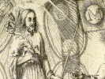

  
[Intangible Textual Heritage](../../index)  [Esoteric](../index) 
[Index](index)  [Previous](ldjb13)  [Next](ldjb15) 

------------------------------------------------------------------------

  
*The Life and Doctrines of Jacob Boehme*, by Franz Hartmann, \[1891\],
at Intangible Textual Heritage

------------------------------------------------------------------------

p. 224

### CHAPTER XI.

### INCARNATION—THE CELESTIAL VIRGIN.

The doctrine of the incarnation of Christ, or, to
express it in other words, of the awakening of the germ of divine
self-knowledge in man, is so grand, that it is impossible to form a
conception of it as long as we occupy a narrow-minded, personal, or
sectarian point of view. If we desire to feel the power of the universal
Redeemer within our heart, we must allow our mind to expand and embrace
in our love all that is divine, noble, and ideal in humanity.

In considering the contents of the
following chapter it will be especially recommendable to keep in mind
the great occult maxim, that it is below as it is above, and that
everything above has its corresponding part below; so that the great
processes taking place in the macrocosm produce corresponding processes
on the microcosmic plane, and that which exists eternally in heaven (the
spiritual plane) seeks to be embodied and represented in terrestrial
forms upon the earth. It is also well to remember that completion is
attained only by the reappearance of the third principle in the seventh;
that is to say, by the spiritualisation of matter and the acquisition of
form. A being or power belonging to an entirely ideal plane cannot
produce any direct reaction in the grossly material state of existence,
no more than a tree can grow out of the idea of a tree existing within
the mind, but it needs a material seed or kernel to serve as a material
focus for the attraction and distribution of material principles. For
similar reasons it was necessary that the *Logos* [1](#fn_168) should actually become flesh and enter
the human

p. 225

state so as to produce a fundamental and radical change in the will of
humanity by starting a new activity of light and love in its very centre
or heart.

This process is beautifully and allegorically described in the New
Testament.

 

In the configuration of the person of our Redeemer there are to be
distinguished three factors: the eternal generation of the Son of God,
His birth as a celestial Man, and, finally, His being incarnated as a
terrestrial person. [1](#fn_169)

"Christ is greater than any angel in heaven, because He has a celestial
human body; He also has the eternal celestial bride, the virgin of
divine wisdom, and, finally, the Holy Trinity in His possession. We can
truly say of Him that He is an individuality in the Holy Trinity in
heaven, a true man in heaven, and an eternal king in this world, a lord
of heaven and of the earth." (*Three Principles*, xxii. 8 6.)

"The Word, or the second person in the Godhead, has been from eternity
in the Father, and by becoming

p. 226

incarnated in humanity it did not change its nature and become something
else, but remained in. the Father, in its centre and seat, as it had
been from eternity. The other (second) formation took place in a natural
manner at the time of the annunciation by the angel Gabriel, [1](#fn_170) when the virgin said to the angel, 'Let
it be done as you say.' The fulfilling of this Word was effected in the
celestial element, as was the creation of the first Adam before the
fall. The third formation took place simultaneously with the second, and
at once, as when a terrestrial seed is sown whereof a child grows."
(*Three Principles*, xviii. 45.)

"The holy Spirit of God formed the celestial, angelic substantiality
within the one element by means of the virgin; but the planets and
elements of this world formed the external man, providing him with a
natural body and soul exactly like that of other human beings, and both
in one person. Thereby each form had its own particular state of
perception and sensation, and the divine state did not mingle in such a
manner (with the terrestrial form) as to cause the former to be
diminished, but remained what it was (before the incarnation took
place), and that which it was not it became (by means of the
incarnation), but without any separation, differentiation, or division
of the divine being. Thus the Word remains in the Father, the created
being of the holy element remained before the Father, and the natural
human state was attained in this world in the womb of the virgin
Mary." [2](#fn_171) (*Three Principles*, xx.
86).

p. 227

Those who regard Christ as being not a person, and who claim that Mary
was an eternal virgin and not born from terrestrial parents, are in
error. [1](#fn_172)

"Those err who say that Christ is not a created being. As far as His
divinity is concerned, He is certainly not a created being; but
relatively to His celestial state, regarding which He says that He had
come from heaven and was still in heaven, He is there both a creature in
human nature, and without humanity an untreated being." (*Letters*, ii.
54.)

"There are some who have said that the virgin Mary was not a terrestrial
being, and not the daughter of Joachim and Anna, because Christ is
called the seed of the woman, and would therefore have to be born from
an entirely celestial virgin. If this were so, it would serve very
little to us poor children of Eve, as we have become earthly and are
carrying our souls in earthly tabernacles." [2](#fn_173) (*Menschwerdung*, i. 8. 1.)

"It has been said that Mary was an eternal virgin of the Holy Trinity,
and that from her Christ had been born; because, according to His own
testimony, He did not come front human flesh and blood, but from heaven.
It is true that our Lord said that He had come from God and was to
return to God, and that no one would go to heaven except the Son of Man,
coming from heaven and being in heaven; but in thus saying He spoke
evidently of

p. 228

\[paragraph continues\] His human aspect,
and not merely of His divinity; for the eternal God could not have been
the Son of Man, neither could a son of man come out of the Trinity; but
if it had been possible to redeem man by means of a foreign soul brought
down from heaven, where would then have been the necessity for God to
enter into our (human) shape and to be crucified therein." [1](#fn_174) (*Three Principles*, xxii. 61.)

 

If Christ had brought a foreign soul with Him from heaven, and not taken
a human soul from His mother Mary, He would have been foreign to us, and
could not have become our Redeemer.

"It is not true, as some say, that Christ has taken a soul unto Himself
from the Word in the eternal virgin Mary, so that Christ was coming from
God and the soul in His human nature had a beginning." (*Mysterium*,
lvi. 19).

"Christ is not only a seed that came from heaven, so as to have no other
quality received from man except a human covering (body). If He had not
a human nature He would not be the Son of Man, neither would He be my
brother." (*Tilk*. i. 245.)

"The soul of Christ is a creature like our own soul, and He has received
it from humanity and in the body of Mary. Therefore we rejoice eternally
that the soul of Christ is our brother and the body of Christ is our
body in regenerated man." (*Three Principles*, xxiii. 30.)

"What would it benefit me if Christ had brought with Him a strange soul?
Nothing! But I rejoice that He has introduced my soul into the holy
*Ternary*. Now can I truly say, 'The soul of Christ is my brother, and
the body of Christ is the nutriment of my soul.'" (*Three Principles*,
xxii. 78.)

p. 229

But if Christ had come only from a terrestrial virgin He would not have
come from above, and would not have been pure.

"Christ said to the Jews, 'I am from above, but you are from below; I am
not of this world, but you are of this world.' If He had become human in
an earthly tabernacle, and not in a pure, celestial, and chaste virgin,
such as Mary had become in consequence of her having been blessed, He
would have been of this world." (*Menschwerdung*, i. 9, 20.)

"All that is born from the flesh and blood of this world is impure, and
a pure virgin cannot be born in this corrupted flesh and blood; but
Christ has been received and born without sin from a pure virgin." [1](#fn_175) (*Three Principles*, xxii. 36.)

 

According to the external flesh, Mary descended from Joachim and Anna;
but she was also the daughter of the covenant, and as such she was
blessed (penetrated) by the virgin of wisdom. [2](#fn_176)

"Mary was generated from the seed of Joachim and Anna in the same manner
as other human beings are

p. 230

generated; but she was blessed among women, so that in her the eternal
virgin became revealed." (*Threefold Life*, vi. 72.)

"Mary, in whom Christ became man, was truly the daughter of Joachim and
Anna, according to the external flesh, and generated out of their seed;
but in regard to the will she was the daughter of the covenant of
promise, the object of the covenant, wherein the same became
accomplished." (*Menschwerdung*, i. 8. 2.)

"The pure and immaculate virgin in whom God was born is before God, and
an eternal virgin. She was pure and without blemish even before heaven
and earth were created; and this pure virgin became incorporated in
Mary, so that it rendered her a new being within the holy element of
God. Therefore she was blessed among women, and the Lord was with her,
as was said by the angel." (*Three Principles*, xxii. 38.)

 

The celestial virgin did not become terrestrial in Mary (or enter into
her mechanically from the outside); but the omnipresent celestial virgin
became revealed (unfolded) within Mary's innermost being. [1](#fn_177)

"We cannot say that the celestial virgin, when she entered into Mary,
became terrestrial by the order of God, but we say that the soul of Mary
took hold of the celestial virgin, and the latter adorned the soul of
Mary with the pure garment of the holy element, a pure, regenerated
human being, and therein has Mary received the Saviour of the world, and
given birth to Him in this world." (*Three Principles*, xxii. 44.)

"No other woman, ever since the time of Adam, became clothed with the
celestial virgin except Mary; but

p. 231

this took place in the soul-principle, and not in the terrestrial
flesh." (*Forty Questions*, xxxvi. 12.)

"Mary received the celestial token which was unknown to nature, .and
which was also unknown to her in her external womanhood, namely, the
celestial virgin, and in that virgin she received the Word of the
Eternal Father." (*Three Principles*, xxii. 43.)

 

By means of this unfolding or state of bliss the Word was enabled to
take up the human state in Mary, and thus the celestial virgin that had
become weakened in Adam became again strong and substantial in her.

"The Word of promise, which was before the Jews as an antitype, or as an
image in a mirror, wherein the wrathful Father imagined and wherewith He
extinguished His wrath, began to move essentially, as it had not moved
from eternity; for when the angel Gabriel brought to Mary the message
saying that she should become pregnant, and when she expressed her
willingness, saying, "Let it be done to me as you said," then the centre
of the Holy Trinity moved itself; that is to say, the eternal virginity
which was lost by Adam, became opened in her in the Word of life. The
fire of divine love in Mary's being, in the virginal essence that had
been corrupted in Adam, was again restored." (*Menschwerdung*, i. 8, 3.
4.)

"The Word, that stood in the virgin of wisdom and surrounded by eternal
wonders, entered again, out of great love to our image, which had been
destroyed in Adam, and it became human in Mary in consequence of the
benediction." (*Forty Questions*, xxxvi. 10.)

"The eternal virgin, being without substance, entered also into the
incarnation, and thus the tine soul was received out of the essences of
Mary. In this way the eternal virgin came into substantiality, for she
received the human soul within herself." (*Threefold Life*, vi. 75.)

p. 232

Mary could not by her own power put herself in possession of that
celestial blessing, but it came to her by divine grace and in the power
of the Holy Spirit.

"The true being of humanity, that had died and disappeared (become
latent) in Adam, awoke again to life in Mary, and thus she became highly
exalted and like man before the fall. This, however, did not take place
by her own power, but by the power of God. If the centre of God had not
moved within her, she would not have been different from all other
daughters of Eve." (*Menschwerdung*, i. 8. 5.)

"Mary is called a holy and pure virgin merely with reference to the
celestial virgin that had taken possession of her, and clothed her with
the pure element of Paradise. Mary did not obtain possession of this
state by her own power, as is shown by the angel saying to her, 'The
Spirit of God will come over you, and you will be overshadowed by the
power of the Supreme; therefore the Holy One that shall be born of thee
shall be called the Son of God.'" (*Three Principles*, xx. 41.)

"The words of the angel, 'The Spirit of God will come over you, and you
will be overshadowed by the power of the Supreme,' means: The Holy
Spirit shall open the closed centre within, in the moribund seed, and
the Word of God will enter with living and celestial substantiality
within that which had been closed in death, and become one flesh with
it." [1](#fn_178) (*Three Principles*, xxii.
4l.)

It is certain that the soul of the Redeemer could issue from Mary only
on account of her being of a character full of humility and in
accordance with the will of God; and it is furthermore certain that she
spiritually

p. 233

enjoys a high state of glorification for having had the qualifications
necessary for becoming the mother of the Redeemer.

"The first thing that a child (in the womb) receives is the *tincture*
of its mother. Thus it was in the case of Christ. When the angel
announced to Mary the coming incarnation of Christ, it was the mother's
will, and the *tincture* which received the *Limbus* of God and
impregnated her, belonged to her. If, then, the soul of the child is in
the Holy Trinity, do you then not think that its glorious light
beautifully illuminates the mother, and does not that mother rightfully
put her feet upon the Moon, [1](#fn_179) as
being exalted above all that is of an earthly nature? She gave birth to
the Redeemer of the world without any carnal commingling, and from her
issued the body which attracts all members, namely, the children of God
in Christ, *i.e.*, the children of Light." (*Three Principles*, xviii.
93–98.)

 

Mary, however, was not deified. In spite of all her greatness she could
only through her Son become perfect and inherit heaven. [2](#fn_180)

"The Word which was promised by God in the garden of Eden came to bloom
in the life-light of the virgin; and when the angel Gabriel, by order of
the Father, came to give to it an impulse by means of the message, it
then entered into the one element of the chaste virgin, but

p. 234

not so entirely within her soul and body so as to deify her person."
(*Three Principles*, xviii. 89.)

"The virgin Mary entered into great perfection, like the star of the
morning, which is more glorious than the rest of the stars. She attained
perfection and beatitude through her Son, Jesus Christ." (*Three
Principles*, xviii. 88.)

"The virgin Mary did not become deified. Christ Himself says, 'No one
goes to heaven except the Son of Man, who came from heaven and is in
heaven.' All others have to attain heaven through Him. Christ is their
heaven, and the Father is the heaven of Christ." (*Three Principles*,
xviii. 89.)

 

The external kingdom of this world did not become separated from the
virgin; but it lost its power over her. The quality of her inner life
communicated itself to her physical body.

"When God moved in Mary as His object, then was she highly blessed, and
in that benediction of the Redeemer she became impregnated. Now, it is
known that the seed of man communicates its qualities to the body. When
the divine life entered into the essence of the seed (power) of Mary,
her whole body, which was then surrounding the body of the (divine)
image, became highly blessed, and quickened by this wonderful moving of
God. The external kingdom of this world was then not separated from
Mary, she was still imprisoned therein; but the tincture of her blood
became kindled with the divine tincture; *i.e.*, with the tincture of
the *seed;* communicating its qualities to the corporeal form." (*Tilk*.
i. 331.)

"The soul of Mary became surrounded by the divine living substantiality,
not relatively to her terrestrial but to her celestial nature, so that
the terrestrial state was merely supplementing her being. Her soul, with
the Word of life that became human in her, was to pass with it through

p. 235

the death and wrath of the Father into the celestial consciousness, and
thus her external human nature had to (he in regard to earthly life, so
that she could live in God. But because she has been blessed, and has
carried in her womb the object of the covenant, that which was celestial
in her consumed her terrestrial part." (*Menschwerdung*, i. 9,
18.) [1](#fn_181)

The Saviour had to receive earthly essences from Mary, and He became in
her, in the normal way, a terrestrial man. [2](#fn_182)

"The virgin comprised Christ as a mother her child. She gave to him
natural essences, such as she had inherited from her parents, and these
essences from her flesh and blood he received to the element, and became
therein a living soul." (*Three Principles*, xviii. 90.)

"The living Word that dwelt within the eternal virgin attracted to
itself the flesh of Mary—that is to say, the essences from the corporeal
body of Mary—and thus there grew in nine months a complete human being
with soul, spirit, and flesh." (*Threefold Life*, vi. 79.)

"The life of Christ did not begin to stir immediately at the time of
conception, or in any supernatural manner, but this took place at the
proper natural time, as is the case with all the children of Adam. Thus
in nine months he grew to be a complete human being, and was born like
all other children of Adam. He might have caused himself to be born
magically, but if this had been done he would not have been in this
world in a natural manner." (*Menschwerdung*, i. 10.)

In Christ, as the son of Mary, there were united all the three
principles, but without commingling with each

p. 236

other, so that, in spite of His terrestrial body, He remained
nevertheless free from sin.

"Christ in Mary accepted all the three principles, but in divine order,
and not intermingled, such as they became in Adam, who, by means of his
imagination, introduced the external realm into the internal realm, into
the soul-fire, in consequence of which the light became extinguished. He
(Christ) had on Himself the soul-essence, or the first principle, the
substance of the image of the second principle, and finally the external
form, *i.e.*, the third principle." (*Tilk*. i. 336.)

"Christ took from Mary the interior seed that had been weakened in Adam,
and to this was attached the external seed of the flesh, but so that
they did not mix with each other, neither were they separated; but they
were relatively to each other like God, who dwells in the world, while
the world nevertheless is not God." (*Stiefel*, ii. 204.)

"Christ did not by means of His external body produce sin and dishonour.
No, this cannot be; but He has taken upon Himself as a burden the sin
which we have inherited from Adam, and which He was to carry as if He
were Adam, while He still was not Adam." (*Stiefel*, ii. 499.)

"Christ did not take upon Himself the awakened and conceived vanity
(selfishness) which the devil introduced into the flesh by means of his
imagination, and which caused the flesh to sin; but He took the awakened
forms of life (principles) which from a state of harmony had issued,
each one in its own desire. Therein He took upon Himself our sin and
disease, and death and hell; but only for the purpose of tincturing them
by His love, by means of. His celestial blood which He had poured into
our external human nature, and this was to change hell into heaven, and
to introduce the human qualities again into divine harmony."
(*Regeneration*, iii. 11.)

p. 237

Still less has the innermost essence of the Lord, the eternal Word, ever
mingled with His terrestrial body; it did not even mingle with His human
soul. [1](#fn_183)

"God has become revealed within the external seed (principle) of Mary,
for Christ did not differ while upon the earth from other human beings
in form, substance, or external appearance. In that external seed He did
not take up divinity; His external form was mortal, and He annihilated
death therein." (*Stiefel*, ii. 203.)

"Christ truly attracted to Himself our human essences while in the body
of the virgin Mary, and He has become our brother (thereby). But the
human essences cannot apprehend His eternal divinity; only the new man,
born in God, conceives of it as the body apprehends of the soul."
(*Three Principles*, xxii. 48.)

"The soul and the Word are not one or one being. The soul is born from
the centre of nature, from the essences, and belongs to the body, for
she issues from the essences of the body, and attracts to herself the
body; but the Word is from the centre of the majesty, and draws the
majesty unto itself." (*Threefold Life*, vi. 83.)

 

The Word and the soul are not standing separately side by side, but the
latter is penetrated and illumined by the former. [2](#fn_184)

p. 238

"The soul and the Word are not standing side by side like two persons,
but the Word penetrates the soul, and out of the Word shines the
life-light; whereby, however, the soul remains free to herself. A
red-hot iron is in itself dark and black, but the fire penetrates it, so
that it becomes luminous. There has no change happened to the iron
itself; it remains iron and the heat remains heat; one is as free as the
other, and neither one is the other. Thus has the soul been put into the
fire of divinity, so that divinity may penetrate and illuminate the
soul, and dwell therein and conceive of her, although the soul cannot
conceive of divinity; nevertheless she does not become transformed.
Divinity conceives the soul and endows her with the power of majesty."
(*Threefold Life*, vi. 83.)

 

Christ did not become human merely within the virgin Mary, but also in
an unlimited celestial manner.

"While Christ lived upon the earth His external form was limited like
our own bodies, but the internal man was immeasurable." (*Three
Principles*, xxiv. 88.)

"The Word has become humanity everywhere; that is to say, everywhere
became unfolded the divine substantiality wherein our eternal humanity
exists. We ought to exist in the same corporeal substantiality in
eternity, wherein exists the virgin of God, and we must clothe ourselves
with the virgin, for Christ has clothed Himself with her."
(*Menschwerdung*, i. 8, 12.)

"The whole angelic world is the substantiality of Christ according to
His celestial essentiality, 'created' in regard to the personality of
humanity, but outside of it is untreated and eternal." (*Letters*, xii.
56.)

The celestial and unlimited corporeity of our Redeemer is
incomprehensible to the reasoning intellect;

p. 239

but it is nevertheless logical to accept it, because in Christ the
infinite God became man. [1](#fn_185)

"Reason says: 'The body of Christ is in one place; how then can it be
everywhere? It is a creature, and one creature cannot be in every place
at once.' But listen, dear Reason. 'When the Word of God became a human
being in the body of Mary, was it then not also (at the same time) high
above the stars? While it was at Nazareth was it then not also at
Jerusalem and everywhere? Or do you think that God, while He became a
man, had been confined to His human form?' This is an impossibility, and
thus, while God became man, His humanity was everywhere where His
divinity existed." [2](#fn_186) (*Three
Principles*, xxiii. 8.)

"Christ has not become man solely in the body of the (terrestrial)
virgin Mary (in that sense), as if His divinity or divine essentiality
had been captured, imprisoned, or seated therein. As little as God, who
is the fulness of all things, resides in one place alone, so little has
God moved in only one small portion (of the Word); for He is not
differentiated, but everywhere one and a whole, and wherever He becomes
manifest there He is manifest as a whole. Neither is God measurable, and
there has no place of residence been discovered in Him, unless He should
establish for Himself such a dwelling in one of His creatures; but even
then He remains a whole apart from and beyond such a created being."
(*Menschwerdung*, i. 8.)

 

In this respect Christ may be likened to the sun, who is also
immeasurable in his aspect as a power, but which is nevertheless
existing as a separate body in space.

"We may compare the sun to Christ in His aspect as

p. 240

a created being, and the whole depth of space may be compared to the
Father. If we then see that the sun shines within the whole depth of
space, and sends his heat and power everywhere, we cannot then say that
within the depth the power and light of the sun is nowhere outside of
the body of the sun; for if the light and substance of the sun were not
everywhere, space could not receive the power and light of the sun. It
requires two powers or principles of a similar nature to be receptive of
each other. The depth (of space) contains its light, but hidden
(latent). If it were the will of God, the whole depth would all be sun."
(*Menschwerdung*, i. 8.)

"As the sun shines through all the external world, causing everything to
become more powerful and fertile, and as nevertheless the world and the
sun are (in their corporeal centres) to be distinguished from each
other, so Christ, as a manifested Sun, shines out of (the depth of)
Jehovah or Jesus, in the created humanity of Christ. Jehovah is the
eternal divine Sun, and within that Sun has been hidden to all creatures
the great Love-Sun of Christ, as a heart in the centre of the Holy
Trinity; but by the moving of the Godhead He has become revealed as a
holy Sun of divine love." (*Stiefel*, ii. 422.)

"The sun illumines the world; but this would not be possible if there
were not within the depth a similar state of being as that which
constitutes the sun. Likewise the corporeity of Christ is all the
fulness of the heavens, as a created being in the person and without the
person; but (both) exist in one spirit and one power as one, and not in
a state of duality or as two things separated from each other." (*Tilk*.
ii. 251,) [1](#fn_187)

 

This unlimited, celestial (state of) being of the Redeemer is
nevertheless lower than the Godhead.

"When the Word enters into the one pure element,

p. 241

the virginal matrix, it does not become separated from the Father, but
remains eternally, and is everywhere present in the heaven of the
element wherein it entered, and wherein it has become a new creature,
called a 'god.' This very new creature is naturally not born from the
flesh and blood of the (physical) virgin, but of God, out of His element
(the celestial virgin), and in the power of the Holy Trinity, which
remains therein eternally in its fulness. But the corporeity of the
element of that created being is lower than the Godhead, for the Godhead
is spirit, and the holy element is born out of the Word from eternity.
Thus the Lord has entered into the servant, whereof all the angels in
heaven are filled with surprise. It is the greatest miracle that has
occurred from all eternity, because it is against (human) nature, and
could only have been accomplished by divine love." (*Three Principles*,
xviii. 42.) [1](#fn_188)

------------------------------------------------------------------------

### Footnotes

[224:1](ldjb14.htm#fr_168) The *Logos* is
everywhere, and did not enter from any external locality. Likewise the
body of the sun is everywhere, although it manifests its light only in
one locality in the sky.

[225:1](ldjb14.htm#fr_169) All disputes about
the nature of Christ only prove that the disputants are not Christians,
because if they were true followers of the Christ they would have the
living Christ within themselves, and know His true nature. The
misunderstandings of the "Christians" regarding the Christ arise from
the fact that they regard Him as something external and incompatible
with human nature; neither will any merely theoretical research
regarding this mystery lead to any satisfactory result. The only way in
which this matter can be settled for once and for ever is that those who
have doubts about the divinity of Christ succeed in raising Him from His
tomb within their own souls, when He will become revealed to them.

"Each one desires to be a child of God in his knowledge, and
nevertheless disobedience and unfaithfulness are as great in one people
as they are in another. A belief that Christ has once been born and died
for me and arisen from death does not make me a child of God. The devil
knows that also; but it is of no use to him. I must clothe myself in
Christ by means of the desire of faith; I must enter myself into His
obedience, His incarnation, His suffering and death; I must myself arise
in Him and adopt the obedience of Christ. Only in this way can I be a
Christian, and not in any other way." (*Mysterium*, li. 43).

[226:1](ldjb14.htm#fr_170) "'Gabriel,' an angel
or god of sound, an internal, sourcive spirit." (*Aurora*, xii. 86.)

[226:2](ldjb14.htm#fr_171) There is no doubt
that, as some will have it, the legend of the descent of the Redeemer is
the description of an astrological process; but this theory, far from
disproving the incarnation of divine wisdom into a human form, confirms
it; because that which takes place in the macrocosm produces
corresponding effects in the microcosm. In man is the sun, the moon, the
stars, and the whole of the zodiac. In the microcosm is represented
every part of the macrocosm in its material and spiritual aspect. p. 227 When man sees the external sun rise in the
outer world, the sun in him arises and gives joy to his heart. Any
individual person, or also humanity as a whole, may become either a god
or a devil incarnate.

[227:1](ldjb14.htm#fr_172) Christ, or the
Universal *Logos*, is not a personality in the usual acceptation of that
term, but becomes personal if personified in man. Likewise the celestial
virgin is personified in woman, in the same sense as the light of the
sun becomes individualised in a flower, a diamond, or precious stone.

[227:2](ldjb14.htm#fr_173) " Outside of a body
the spirit cannot remain in its perfection, for as soon as it is
separated from the form it loses its rule. The body is the mother of the
spirit. In the body the spirit is born, and receives therein its power
and strength. If it is separated from the body it still remains a
spirit, but loses its ruling power." (*Aurora*, xxvi. 50.)

[228:1](ldjb14.htm#fr_174) And the divinity in
man continues to be crucified in him until the self-will is dead and the
Christ arisen in His own light.

[229:1](ldjb14.htm#fr_175) The Christ can never
be born or revealed in any impure soul. A soul wherein regeneration is
to take place must be an immaculate virgin, having no intercourse with
any external god; but executing the will of God dwelling within herself.

[229:2](ldjb14.htm#fr_176) "Ana" is the
Chaldean name for the astral light (see *Secret Doctrine*). "In the
language of nature the name 'Mary' means 'salvation from this valley of
sorrow.'" (*Principles*, xviii. 37.)

No man can be saved without the grace of Mary, *i.e.*, without the
presence of that which is noble, exalted, saving, and sanctifying in
him.

"Human reason can understand nothing about the kingdom of Christ, nor
about His person or office, because the testament of Christ is
celestial, and human reasoning is terrestrial; the latter seeks Christ
in time, while He can only be found in eternity."

"All misunderstanding is caused by the circumstance that the heaven
wherein Christ is seated to the right of God is not understood, and
because it is not known that this heaven is in this world, and this
world rooted in heaven. They are both one in the other, like day and
night." (*Baptism*, i.)

[230:1](ldjb14.htm#fr_177) The spiritual soul
does not become an animal soul in man; neither is the former a separate
entity to be put into the latter; but as the vibrations of light awaken
corresponding vibrations within the ether that is in darkness, so the
divine harmony existing in the spiritual soul of the universe awakens
corresponding harmonies in the soul of man.

[232:1](ldjb14.htm#fr_178) Perhaps the same
idea might be approached by saying: The divine harmony underlying the
original order of nature, which was thrown into confusion by the action
of an evil will within the seven qualities of eternal nature, created a
centre of harmony within the soul of Mary, which, expanding from within
outwardly, rendered her whole nature harmonious and spiritual.

[233:1](ldjb14.htm#fr_179) The sunlight of
wisdom (self- knowledge and self-perception) is superior to all that is
merely imaginary, fanciful, and illusive. Wisdom sees the illusion, but
is not captivated by it.

[233:2](ldjb14.htm#fr_180) No soul can become
divine or deified by merely contemplating God as if He were something
foreign to herself. God must become substantial and corporified in her.
The mere idealist is satisfied with enjoying in his imagination the
beauty of the ideal, but does not embody it within himself. The
so-called "realist" is satisfied with what he believes to be real, and
acquires nothing better than what he already has. The true Christian,
*i.e.*, the "ideo-realist," seeks to realise the ideal, so that it
becomes a part of himself.

[235:1](ldjb14.htm#fr_181) The *Manas* became
absorbed in the *Buddhi*.

[235:2](ldjb14.htm#fr_182) "God lives also in
man." (*Threefold Life*, xi. 106.) Each human being (if he is not
godless) carries God and the Christ, the Holy Spirit, the virgin Mary,
together with the angel Gabriel and all the rest of the angels and
spirits within himself. It is, therefore, of little use to seek for all
that in history. We can find it nowhere except within ourselves.

[237:1](ldjb14.htm#fr_183) The divine spirit,
*i.e.*, the spiritual consciousness of each or any individual person
upon this earth, never was, is, or will be imprisoned, incarnated or
reincarnated, or absorbed in any material mind or person. It for ever
remains in heaven, *i.e.*, in its own celestial state. The mind and the
body are merely reflections of the light of the spirit as it shines into
"matter." The true Man is in heaven; his shadow walks upon the earth.

[237:2](ldjb14.htm#fr_184) Whenever I speak of
the man Christ, and of what a triune God and man He is, I make a
distinction between the human creature, that came from us human beings,
and the triune Divinity, the revealed word of the power and omnipotence.
Not that they are separated from each other, but the Spirit of God is
higher than the being to which that Spirit gives birth in its
outbreathed word. I do not say that the sweet and beloved Christ is the
man, but it is the holy sunshine in the flame of love in the p. 238 man; for whenever I see a holy Christian man
stand or walk I do not say, "Here stands or walks Christ;" but I say,
"Here stands and walks a Christian man in whom shines the sun of
Christ." (*Stief*. 421.)

[239:1](ldjb14.htm#fr_185) It is universal and
nevertheless individual, like that of a god.

[239:2](ldjb14.htm#fr_186) This would be like
imagining that the trunk of a tree was dwelling within the leaves.

[240:1](ldjb14.htm#fr_187) The universal life
and the individual life are only one principle.

[241:1](ldjb14.htm#fr_188) "You must not seek
for any historical knowledge in our writings. It is not possible to see
God with earthly eyes, and therefore it is impossible for an unillumined
mind to comprehend heavenly thoughts and perceptions in its terrestrial
vehicle. Like can be grasped only by like." (*Princ. Appendix*, 30.)

------------------------------------------------------------------------

[Next: Chapter XII. Redemption](ldjb15)

