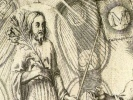

  
[Intangible Textual Heritage](../../index)  [Esoteric](../index) 
[Index](index)  [Previous](ldjb19) 

------------------------------------------------------------------------

  
*The Life and Doctrines of Jacob Boehme*, by Franz Hartmann, \[1891\],
at Intangible Textual Heritage

------------------------------------------------------------------------

p. 335

### INDEX.

Abel, [207](ldjb13.htm#page_207),
[314](ldjb18.htm#page_314).

Absolute, [61](ldjb05.htm#page_61).

Absolution, [302](ldjb17.htm#page_302).

Abyss, [115](ldjb08.htm#page_115), [278](ldjb16.htm#page_278),
[297](ldjb17.htm#page_297).

Adam, [135](ldjb09.htm#page_135), [190](ldjb12.htm#page_190).

Alchemy, [175](ldjb11.htm#page_175). All, [89](ldjb07.htm#page_89).

Angels, [89](ldjb07.htm#page_89), [96](ldjb07.htm#page_96),
[101](ldjb08.htm#page_101).

Anguish, [77](ldjb06.htm#page_77), [294](ldjb17.htm#page_294).

Animals, [178](ldjb11.htm#page_178).

Antichrist, [293](ldjb17.htm#page_293).

Antithesis, [67](ldjb05.htm#page_67).

Astral body, [290](ldjb17.htm#page_290), [293](ldjb17.htm#page_293),
[306](ldjb17.htm#page_306), [308](ldjb17.htm#page_308).

Astral spirit, [134](ldjb09.htm#page_134), [151](ldjb10.htm#page_151),
[171](ldjb11.htm#page_171), [243](ldjb15.htm#page_243),
[290](ldjb17.htm#page_290).

Astringency, [75](ldjb06.htm#page_75), [98](ldjb07.htm#page_98).

Atheism, [180](ldjb12.htm#page_180).

Atonement, [278](ldjb16.htm#page_278).

Attraction, [109](ldjb08.htm#page_109), [172](ldjb11.htm#page_172).

 

Babel, [312](ldjb18.htm#page_312),
[316](ldjb18.htm#page_316).

Balance, [292](ldjb17.htm#page_292).

Baptism, [269](ldjb16.htm#page_269).

Battle, [266](ldjb16.htm#page_266), [275](ldjb16.htm#page_275),
[277](ldjb16.htm#page_277).

Being, [65](ldjb05.htm#page_65).

Beginning, [97](ldjb07.htm#page_97), [122](ldjb09.htm#page_122).

Belief, [8](ldjb03.htm#page_8), [37](ldjb04.htm#page_37),
[263](ldjb16.htm#page_263), [312](ldjb18.htm#page_312),
[315](ldjb18.htm#page_315).

Bible, [65](ldjb05.htm#page_65).

Body, [84](ldjb06.htm#page_84), [269](ldjb16.htm#page_269),
[277](ldjb16.htm#page_277), [280](ldjb16.htm#page_280),
[288](ldjb16.htm#page_288), [293](ldjb17.htm#page_293).

Books, [12](ldjb03.htm#page_12), [311](ldjb18.htm#page_311).

 

Cain, [207](ldjb13.htm#page_207),
[314](ldjb18.htm#page_314).

Celestial body, [142](ldjb10.htm#page_142).

Celestial marriage, [273](ldjb16.htm#page_273),

Celestial world, [85](ldjb06.htm#page_85), [105](ldjb08.htm#page_105).

Chaos, [97](ldjb07.htm#page_97).

Children, [285](ldjb16.htm#page_285).

Christ, [27](ldjb03.htm#page_27), [88](ldjb06.htm#page_88),
[170](ldjb11.htm#page_170), [198](ldjb13.htm#page_198),
[225](ldjb14.htm#page_225), [262](ldjb15.htm#page_262),
[281](ldjb16.htm#page_281), [312](ldjb18.htm#page_312).

Christian, [9](ldjb03.htm#page_9), [264](ldjb16.htm#page_264),
[281](ldjb16.htm#page_281), [285](ldjb16.htm#page_285).

Christianity, [5](ldjb03.htm#page_5), [217](ldjb13.htm#page_217),
[317](ldjb18.htm#page_317).

Church, [9](ldjb03.htm#page_9), [313](ldjb18.htm#page_313),
[317](ldjb18.htm#page_317).

Clericalism, [284](ldjb16.htm#page_284).

Colours, [178](ldjb11.htm#page_178).

Communion, [267](ldjb16.htm#page_267), [269](ldjb16.htm#page_269).

Confession, [8](ldjb03.htm#page_8).

Conscience, [111](ldjb08.htm#page_111), [296](ldjb17.htm#page_296).

Consciousness, [77](ldjb06.htm#page_77), [112](ldjb08.htm#page_112),
[173](ldjb11.htm#page_173).

Contentment, [286](ldjb16.htm#page_286).

Corporeity, [99](ldjb07.htm#page_99).

Creation, [66](ldjb05.htm#page_66), [89](ldjb07.htm#page_89).

Creatures, [96](ldjb07.htm#page_96), [294](ldjb17.htm#page_294).

Cross, [253](ldjb15.htm#page_253).

Crown, [253](ldjb15.htm#page_253).

Cure, [269](ldjb16.htm#page_269).

 

Darkness, [68](ldjb05.htm#page_68),
[75](ldjb06.htm#page_75), [79](ldjb06.htm#page_79),
[125](ldjb09.htm#page_125), [166](ldjb11.htm#page_166),
[266](ldjb16.htm#page_266).

Dangers, [271](ldjb16.htm#page_271), [274](ldjb16.htm#page_274).

Days, [126](ldjb09.htm#page_126).

Death, iii, [160](ldjb10.htm#page_160), [186](ldjb12.htm#page_186),
[255](ldjb15.htm#page_255), [284](ldjb16.htm#page_284),
[289](ldjb17.htm#page_289), [307](ldjb17.htm#page_307).

Desire, [69](ldjb05.htm#page_69), [75](ldjb06.htm#page_75),
[271](ldjb16.htm#page_271), [278](ldjb16.htm#page_278).

Devachan, [303](ldjb17.htm#page_303).

Devil, [109](ldjb08.htm#page_109), [115](ldjb08.htm#page_115),
[152](ldjb10.htm#page_152), [167](ldjb11.htm#page_167),
[183](ldjb12.htm#page_183), [247](ldjb15.htm#page_247),
[270](ldjb16.htm#page_270), [294](ldjb17.htm#page_294),
[298](ldjb17.htm#page_298).

Divinity, [58](ldjb05.htm#page_58).

Division, [111](ldjb08.htm#page_111).

Dreams, [299](ldjb17.htm#page_299).

Duality, [67](ldjb05.htm#page_67), [69](ldjb05.htm#page_69),
[76](ldjb06.htm#page_76).

 

Earth, [129](ldjb09.htm#page_129),
[170](ldjb11.htm#page_170), [172](ldjb11.htm#page_172).

Eden, [146](ldjb10.htm#page_146).

Ego, [181](ldjb12.htm#page_181).

Element, [172](ldjb11.htm#page_172).

Elementals, [134](ldjb09.htm#page_134), [186](ldjb12.htm#page_186),
[189](ldjb12.htm#page_189), [278](ldjb16.htm#page_278),
[293](ldjb17.htm#page_293).

Elementary body, [138](ldjb09.htm#page_138), [185](ldjb12.htm#page_185),
[280](ldjb16.htm#page_280), [290](ldjb17.htm#page_290).

p. 336

Elements, [108](ldjb08.htm#page_108), [173](ldjb11.htm#page_173).

Elixir of life, [270](ldjb16.htm#page_270).

Elohims, [99](ldjb07.htm#page_99).

Ens, [139](ldjb09.htm#page_139).

Eternity, [65](ldjb05.htm#page_65), [76](ldjb06.htm#page_76),
[165](ldjb11.htm#page_165), [186](ldjb12.htm#page_186),
[297](ldjb17.htm#page_297).

Eve, [157](ldjb10.htm#page_157), [202](ldjb13.htm#page_202).

Evil, [166](ldjb11.htm#page_166), [186](ldjb12.htm#page_186).

Evil spirits, [119](ldjb08.htm#page_119), [294](ldjb17.htm#page_294).

Evil spirituality, [293](ldjb17.htm#page_293),
[299](ldjb17.htm#page_299).

Evolution, [91](ldjb07.htm#page_91).

Existence, [77](ldjb06.htm#page_77).

Faith, [35](ldjb04.htm#page_35),
[40](ldjb04.htm#page_40), [47](ldjb04.htm#page_47),
[51](ldjb04.htm#page_51), [207](ldjb13.htm#page_207),
[219](ldjb13.htm#page_219), [267](ldjb16.htm#page_267),
[304](ldjb17.htm#page_304).

Fall of Lucifer, [116](ldjb08.htm#page_116).

Fall of man, [155](ldjb10.htm#page_155), [187](ldjb12.htm#page_187).

Father, [61](ldjb05.htm#page_61), [87](ldjb06.htm#page_87),
[91](ldjb07.htm#page_91).

Fiat, [98](ldjb07.htm#page_98), [150](ldjb10.htm#page_150).

Fire, [68](ldjb05.htm#page_68), [79](ldjb06.htm#page_79),
[81](ldjb06.htm#page_81), [104](ldjb08.htm#page_104),
[221](ldjb13.htm#page_221), [295](ldjb17.htm#page_295).

Firmament, [127](ldjb09.htm#page_127).

Flood, [124](ldjb09.htm#page_124).

Forgiveness, [302](ldjb17.htm#page_302).

Form, [97](ldjb07.htm#page_97), [228](ldjb14.htm#page_228),
[293](ldjb17.htm#page_293).

Freedom, [60](ldjb05.htm#page_60), [78](ldjb06.htm#page_78),
[81](ldjb06.htm#page_81).

Free will, [98](ldjb07.htm#page_98), [110](ldjb08.htm#page_110),
[149](ldjb10.htm#page_149).

 

Generation, [73](ldjb06.htm#page_73),
[122](ldjb09.htm#page_122), [180](ldjb12.htm#page_180).

Gichtel, [22](ldjb03.htm#page_22).

God, [4](ldjb03.htm#page_4), [40](ldjb04.htm#page_40),
[58](ldjb05.htm#page_58), [69](ldjb05.htm#page_69),
[89](ldjb07.htm#page_89), [198](ldjb13.htm#page_198),
[265](ldjb16.htm#page_265), [298](ldjb17.htm#page_298).

Good and evil, [165](ldjb11.htm#page_165), [171](ldjb11.htm#page_171),
[176](ldjb11.htm#page_176).

Goodness, [285](ldjb16.htm#page_285).

Gold, [175](ldjb11.htm#page_175), [277](ldjb16.htm#page_277).

Grace, [52](ldjb04.htm#page_52), [283](ldjb16.htm#page_283).

Groundlessness, [61](ldjb05.htm#page_61).

Guardian angels, [108](ldjb08.htm#page_108).

Guide, [313](ldjb18.htm#page_313).

 

Heaven, [108](ldjb08.htm#page_108),
[117](ldjb08.htm#page_117), [202](ldjb13.htm#page_202).

Hell, [112](ldjb08.htm#page_112), [114](ldjb08.htm#page_114),
[160](ldjb10.htm#page_160), [257](ldjb15.htm#page_257),
[292](ldjb17.htm#page_292).

Hell-fire, [295](ldjb17.htm#page_295).

Historical belief, [241](ldjb14.htm#page_241).

Holiness, [285](ldjb16.htm#page_285).

Holy Spirit, [88](ldjb06.htm#page_88), [273](ldjb16.htm#page_273),
[315](ldjb18.htm#page_315).

Humility, [46](ldjb04.htm#page_46), [49](ldjb04.htm#page_49),
[113](ldjb08.htm#page_113), [205](ldjb13.htm#page_205).

 

Illumination, [2](ldjb03.htm#page_2),
[48](ldjb04.htm#page_48), [51](ldjb04.htm#page_51),
[273](ldjb16.htm#page_273).

Image, [136](ldjb09.htm#page_136), [141](ldjb10.htm#page_141),
[182](ldjb12.htm#page_182), [275](ldjb16.htm#page_275),
[301](ldjb17.htm#page_301), [318](ldjb18.htm#page_318).

Imagination, [62](ldjb05.htm#page_62), [96](ldjb07.htm#page_96),
[183](ldjb12.htm#page_183).

Immaculate conception, [230](ldjb14.htm#page_230).

Immortality, [70](ldjb05.htm#page_70), [139](ldjb09.htm#page_139),
[186](ldjb12.htm#page_186), [255](ldjb15.htm#page_255).

Impregnation, [197](ldjb12.htm#page_197).

Incarnation, [204](ldjb13.htm#page_204), [224](ldjb14.htm#page_224).

Indifference, [286](ldjb16.htm#page_286).

Inner man, [144](ldjb10.htm#page_144), [177](ldjb11.htm#page_177),
[263](ldjb16.htm#page_263), [281](ldjb16.htm#page_281).

Inspiration, [54](ldjb04.htm#page_54).

Intuition, [53](ldjb04.htm#page_53).

 

Jehovah, [200](ldjb13.htm#page_200),
[240](ldjb14.htm#page_240).

Jesus, [200](ldjb13.htm#page_200), [204](ldjb13.htm#page_204),
[240](ldjb14.htm#page_240).

Judgment, [1](ldjb03.htm#page_1),[8](ldjb03.htm#page_8),
[131](ldjb09.htm#page_131), [290](ldjb17.htm#page_290),
[299](ldjb17.htm#page_299).

Jupiter, [133](ldjb09.htm#page_133).

 

Knowledge, [35](ldjb04.htm#page_35),
[49](ldjb04.htm#page_49).

 

Language of nature,
[179](ldjb11.htm#page_179).

Law, [91](ldjb07.htm#page_91), [98](ldjb07.htm#page_98).

Life, [63](ldjb05.htm#page_63), [76](ldjb06.htm#page_76),
[172](ldjb11.htm#page_172), [298](ldjb17.htm#page_298).

Life eternal, [269](ldjb16.htm#page_269), [289](ldjb17.htm#page_289).

Light, [68](ldjb05.htm#page_68), [74](ldjb06.htm#page_74),
[79](ldjb06.htm#page_79), [81](ldjb06.htm#page_81),
[104](ldjb08.htm#page_104), [125](ldjb09.htm#page_125),
[180](ldjb12.htm#page_180), [199](ldjb13.htm#page_199),
[301](ldjb17.htm#page_301), [313](ldjb18.htm#page_313).

Lightning flash, [79](ldjb06.htm#page_79), [113](ldjb08.htm#page_113).

Lily, [276](ldjb16.htm#page_276).

Logic, [101](ldjb08.htm#page_101).

Lord, [319](ldjb18.htm#page_319).

Love, [69](ldjb05.htm#page_69), [83](ldjb06.htm#page_83),
[93](ldjb07.htm#page_93), [168](ldjb11.htm#page_168),
[191](ldjb12.htm#page_191), [244](ldjb15.htm#page_244),
[310](ldjb17.htm#page_310), [319](ldjb18.htm#page_319).

Lucifer, [102](ldjb08.htm#page_102).

Luna, [133](ldjb09.htm#page_133).

 

Magic, [66](ldjb05.htm#page_66),
[99](ldjb07.htm#page_99), [215](ldjb13.htm#page_215),
[313](ldjb18.htm#page_313).

Man, [39](ldjb04.htm#page_39), [90](ldjb07.htm#page_90),
[135](ldjb09.htm#page_135), [140](ldjb10.htm#page_140),
[265](ldjb16.htm#page_265), [289](ldjb17.htm#page_289).

Mars, [133](ldjb09.htm#page_133).

Mary, [204](ldjb13.htm#page_204), [227](ldjb14.htm#page_227).

Matter, [63](ldjb05.htm#page_63), [73](ldjb06.htm#page_73).

Mediumship, [54](ldjb04.htm#page_54), [90](ldjb07.htm#page_90).

Memory, [295](ldjb17.htm#page_295).

Mercury, [79](ldjb06.htm#page_79), [128](ldjb09.htm#page_128),
[133](ldjb09.htm#page_133).

Mind, [96](ldjb07.htm#page_96), [98](ldjb07.htm#page_98).

Miracles, [304](ldjb17.htm#page_304).

Misfortune, [286](ldjb16.htm#page_286).

Monsters, [293](ldjb17.htm#page_293).

Moon, [168](ldjb11.htm#page_168), [170](ldjb11.htm#page_170),
[275](ldjb16.htm#page_275).

Mother, [63](ldjb05.htm#page_63).

Motion, [76](ldjb06.htm#page_76).

Mysterium magnum, [97](ldjb07.htm#page_97).

Mystic death, [264](ldjb16.htm#page_264), [270](ldjb16.htm#page_270),
[280](ldjb16.htm#page_280), [284](ldjb16.htm#page_284),

p. 337

 

Nature, [65](ldjb05.htm#page_65),
[84](ldjb06.htm#page_84), [122](ldjb09.htm#page_122),
[164](ldjb11.htm#page_164).

Nothing, [60](ldjb05.htm#page_60), [92](ldjb07.htm#page_92).

 

Object of life,
[284](ldjb16.htm#page_284).

Occultism, [317](ldjb18.htm#page_317).

Oil of life, [178](ldjb11.htm#page_178).

One, [67](ldjb05.htm#page_67), [92](ldjb07.htm#page_92).

 

Pantheism, [90](ldjb07.htm#page_90).

Paradise, [142](ldjb10.htm#page_142), [176](ldjb11.htm#page_176).

Pearl, [270](ldjb16.htm#page_270).

Perception, [53](ldjb04.htm#page_53), [81](ldjb06.htm#page_81),
[137](ldjb09.htm#page_137), [188](ldjb12.htm#page_188).

Perfection, [91](ldjb07.htm#page_91), [118](ldjb08.htm#page_118).

Personality, [52](ldjb04.htm#page_52), [88](ldjb06.htm#page_88),
[172](ldjb11.htm#page_172), [286](ldjb16.htm#page_286).

Philosophy, [31](ldjb03.htm#page_31).

Planets, [131](ldjb09.htm#page_131), [170](ldjb11.htm#page_170).

Pleasure, [279](ldjb16.htm#page_279).

Power, [287](ldjb16.htm#page_287).

Prayer, [266](ldjb16.htm#page_266), [268](ldjb16.htm#page_268),
[308](ldjb17.htm#page_308).

Precious stones, [175](ldjb11.htm#page_175).

Pride, [274](ldjb16.htm#page_274).

Principle, [81](ldjb06.htm#page_81), [109](ldjb08.htm#page_109).

Procreation, [190](ldjb12.htm#page_190).

Prophets, [90](ldjb07.htm#page_90).

Purgatory, [305](ldjb17.htm#page_305).

 

Qualities, [71](ldjb06.htm#page_71)

Quinta essentia, [172](ldjb11.htm#page_172).

 

Reasoning, [38](ldjb04.htm#page_38),
[93](ldjb07.htm#page_93), [101](ldjb08.htm#page_101),
[274](ldjb16.htm#page_274).

Redemption, [112](ldjb08.htm#page_112), [198](ldjb13.htm#page_198),
[228](ldjb14.htm#page_228), [242](ldjb15.htm#page_242),
[316](ldjb18.htm#page_316).

Regeneration, [46](ldjb04.htm#page_46), [263](ldjb16.htm#page_263),
[288](ldjb16.htm#page_288).

Reincarnation, [177](ldjb11.htm#page_177), [197](ldjb12.htm#page_197).

Religion, [18](ldjb03.htm#page_18).

Renunciation, [288](ldjb16.htm#page_288).

Repentance, [282](ldjb16.htm#page_282).

Resignation, [40](ldjb04.htm#page_40).

Responsibility, [111](ldjb08.htm#page_111).

Restoration of nature, [122](ldjb09.htm#page_122).

Resurrection, [84](ldjb06.htm#page_84), [104](ldjb08.htm#page_104),
[258](ldjb15.htm#page_258), [269](ldjb16.htm#page_269).

Revelation, [66](ldjb05.htm#page_66), [81](ldjb06.htm#page_81),
[86](ldjb06.htm#page_86), [92](ldjb07.htm#page_92).

Richter, [23](ldjb03.htm#page_23).

 

Sacrifice, [42](ldjb04.htm#page_42),
[217](ldjb13.htm#page_217), [255](ldjb15.htm#page_255).

Sal-niter, [123](ldjb09.htm#page_123), [157](ldjb10.htm#page_157).

Salt, [79](ldjb06.htm#page_79).

Salvation, [300](ldjb17.htm#page_300).

Saturn, [133](ldjb09.htm#page_133).

Science, [36](ldjb04.htm#page_36), [90](ldjb07.htm#page_90),
[119](ldjb08.htm#page_119), [312](ldjb18.htm#page_312).

Sectarians, [9](ldjb03.htm#page_9), [311](ldjb18.htm#page_311),
[317](ldjb18.htm#page_317),

Self, [39](ldjb04.htm#page_39), [90](ldjb07.htm#page_90),
[99](ldjb07.htm#page_99), [284](ldjb16.htm#page_284).

Self-consciousness, [61](ldjb05.htm#page_61), [95](ldjb07.htm#page_95),
[265](ldjb16.htm#page_265)

Self-control, [291](ldjb17.htm#page_291).

Self-esteem, [283](ldjb16.htm#page_283).

Self-knowledge, [36](ldjb04.htm#page_36), [81](ldjb06.htm#page_81),
[263](ldjb16.htm#page_263), [312](ldjb18.htm#page_312),
[318](ldjb18.htm#page_318).

Self-will, [43](ldjb04.htm#page_43), [110](ldjb08.htm#page_110),
[264](ldjb16.htm#page_264).

Sensation, [77](ldjb06.htm#page_77), [168](ldjb11.htm#page_168).

Senses, [188](ldjb12.htm#page_188).

Separator, [168](ldjb11.htm#page_168).

Serpent, [160](ldjb10.htm#page_160), [291](ldjb17.htm#page_291).

Service, [284](ldjb16.htm#page_284).

Seth, [207](ldjb13.htm#page_207).

Seven, [71](ldjb06.htm#page_71), [102](ldjb08.htm#page_102).

Seven qualities, [71](ldjb06.htm#page_71).

Seven spirits, [99](ldjb07.htm#page_99).

Seventh day, [125](ldjb09.htm#page_125).

Sex, [134](ldjb09.htm#page_134), [190](ldjb12.htm#page_190).

Sexual intercourse, [192](ldjb12.htm#page_192).

Signature, [179](ldjb11.htm#page_179).

Sin, [278](ldjb16.htm#page_278), [295](ldjb17.htm#page_295),
[302](ldjb17.htm#page_302).

Sleep, [156](ldjb10.htm#page_156).

Sol, [134](ldjb09.htm#page_134), [291](ldjb17.htm#page_291).

Son, [199](ldjb13.htm#page_199), [225](ldjb14.htm#page_225),
[228](ldjb14.htm#page_228).

Sophia, [271](ldjb16.htm#page_271).

Soul, [148](ldjb10.htm#page_148), [180](ldjb12.htm#page_180),
[183](ldjb12.htm#page_183), [193](ldjb12.htm#page_193),
[262](ldjb15.htm#page_262), [269](ldjb16.htm#page_269),
[292](ldjb17.htm#page_292).

Sound, [83](ldjb06.htm#page_83).

Sourcive spirit, [71](ldjb06.htm#page_71).

Spirit, [64](ldjb05.htm#page_64), [73](ldjb06.htm#page_73),
[85](ldjb06.htm#page_85), [99](ldjb07.htm#page_99),
[194](ldjb12.htm#page_194), [277](ldjb16.htm#page_277),
[289](ldjb17.htm#page_289).

Spiritual body, [185](ldjb12.htm#page_185), [260](ldjb15.htm#page_260),
[269](ldjb16.htm#page_269), [288](ldjb16.htm#page_288).

Spiritual consciousness, [237](ldjb14.htm#page_237),
[263](ldjb16.htm#page_263), [273](ldjb16.htm#page_273).

Spiritual intercourse, [303](ldjb17.htm#page_303),
[307](ldjb17.htm#page_307).

Spiritual knowledge, [45](ldjb04.htm#page_45), [57](ldjb04.htm#page_57),
[81](ldjb06.htm#page_81), [303](ldjb17.htm#page_303),
[312](ldjb18.htm#page_312).

Spiritual world, [45](ldjb04.htm#page_45).

Saint Martin, [32](ldjb03.htm#page_32), [108](ldjb08.htm#page_108).

Stars, [171](ldjb11.htm#page_171).

Submission, [287](ldjb16.htm#page_287).

Substantiality, [82](ldjb06.htm#page_82), [85](ldjb06.htm#page_85),
[269](ldjb16.htm#page_269), [279](ldjb16.htm#page_279),
[295](ldjb17.htm#page_295).

Suffering, [285](ldjb16.htm#page_285).

Sulphur, [79](ldjb06.htm#page_79).

Sun, [126](ldjb09.htm#page_126), [131](ldjb09.htm#page_131),
[168](ldjb11.htm#page_168), [240](ldjb14.htm#page_240).

 

Teachers, [8](ldjb03.htm#page_8).

p. 338

Temperament, [188](ldjb12.htm#page_188).

Temperance, [279](ldjb16.htm#page_279).

Temptation, [153](ldjb10.htm#page_153), [247](ldjb15.htm#page_247).

Theism, [90](ldjb07.htm#page_90).

Theory, [36](ldjb04.htm#page_36), [311](ldjb18.htm#page_311).

Theosophy, [38](ldjb04.htm#page_38), [51](ldjb04.htm#page_51),
[55](ldjb04.htm#page_55), [312](ldjb18.htm#page_312).

Thread souls, [307](ldjb17.htm#page_307).

Three, [102](ldjb08.htm#page_102), [128](ldjb09.htm#page_128).

Three dangers, [271](ldjb16.htm#page_271).

Three principles, [136](ldjb09.htm#page_136),
[197](ldjb12.htm#page_197), [291](ldjb17.htm#page_291).

Three substances, [79](ldjb06.htm#page_79).

Three temptations, [248](ldjb15.htm#page_248).

Three worlds, [19](ldjb03.htm#page_19), [152](ldjb10.htm#page_152),
[266](ldjb16.htm#page_266), [289](ldjb17.htm#page_289),
[291](ldjb17.htm#page_291).

Third principle, [82](ldjb06.htm#page_82), [84](ldjb06.htm#page_84),
[104](ldjb08.htm#page_104), [150](ldjb10.htm#page_150),
[164](ldjb11.htm#page_164).

Time, [186](ldjb12.htm#page_186).

Tincture, [131](ldjb09.htm#page_131), [178](ldjb11.htm#page_178),
[194](ldjb12.htm#page_194), [203](ldjb13.htm#page_203),
[288](ldjb16.htm#page_288), [295](ldjb17.htm#page_295).

Torment, [294](ldjb17.htm#page_294).

Touchstone, [313](ldjb18.htm#page_313).

Transformation, [73](ldjb06.htm#page_73), [168](ldjb11.htm#page_168).

Tree of life, [177](ldjb11.htm#page_177), [197](ldjb12.htm#page_197),
[315](ldjb18.htm#page_315).

Tree of knowledge, [154](ldjb10.htm#page_154).

Tree of temptation, [154](ldjb10.htm#page_154).

Trinity, [64](ldjb05.htm#page_64), [71](ldjb06.htm#page_71),
[88](ldjb06.htm#page_88), [101](ldjb08.htm#page_101),
[225](ldjb14.htm#page_225).

Turba, [295](ldjb17.htm#page_295).

Two eyes, [286](ldjb16.htm#page_286).

 

Unfolding, [98](ldjb07.htm#page_98),
[272](ldjb16.htm#page_272).

Unity, [58](ldjb05.htm#page_58), [72](ldjb06.htm#page_72).

 

Venus, [133](ldjb09.htm#page_133).

Veil of Moses, [260](ldjb15.htm#page_260).

Victory, [278](ldjb16.htm#page_278), [305](ldjb17.htm#page_305).

Virgin, [85](ldjb06.htm#page_85), [204](ldjb13.htm#page_204),
[227](ldjb14.htm#page_227), [229](ldjb14.htm#page_229).

Virtue, [282](ldjb16.htm#page_282).

 

Water, [123](ldjb09.htm#page_123),
[126](ldjb09.htm#page_126), [169](ldjb11.htm#page_169).

Water-spirit, [83](ldjb06.htm#page_83).

Wheel of evolution, [77](ldjb06.htm#page_77).

Whoredom, [311](ldjb18.htm#page_311).

Will, [60](ldjb05.htm#page_60), [90](ldjb07.htm#page_90),
[95](ldjb07.htm#page_95), [276](ldjb16.htm#page_276),
[280](ldjb16.htm#page_280), [287](ldjb16.htm#page_287),
[293](ldjb17.htm#page_293).

Will of God, [149](ldjb10.htm#page_149), [287](ldjb16.htm#page_287).

Wisdom, [61](ldjb05.htm#page_61), [66](ldjb05.htm#page_66).
[84](ldjb06.htm#page_84), [304](ldjb17.htm#page_304).

Woman, [63](ldjb05.htm#page_63), [157](ldjb10.htm#page_157),
[162](ldjb10.htm#page_162), [202](ldjb13.htm#page_202).

Word, [65](ldjb05.htm#page_65), [87](ldjb06.htm#page_87),
[95](ldjb07.htm#page_95), [165](ldjb11.htm#page_165),
[204](ldjb13.htm#page_204), [225](ldjb14.htm#page_225),
[238](ldjb14.htm#page_238).

World, [85](ldjb06.htm#page_85), [90](ldjb07.htm#page_90),
[94](ldjb07.htm#page_94), [107](ldjb08.htm#page_107),
[164](ldjb11.htm#page_164).

Worship, [148](ldjb10.htm#page_148).

Wrath, [69](ldjb05.htm#page_69), [94](ldjb07.htm#page_94),
[96](ldjb07.htm#page_96), [125](ldjb09.htm#page_125),
[176](ldjb11.htm#page_176), [181](ldjb12.htm#page_181),
[298](ldjb17.htm#page_298).

Writings of Boehme, [12](ldjb03.htm#page_12), [63](ldjb05.htm#page_63).

 

 

 

 
