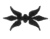

  
[Intangible Textual Heritage](../../index)  [Esoteric](../index) 
[Index](index)  [Previous](mht00)  [Next](mht02) 

------------------------------------------------------------------------

[Buy this Book at
Amazon.com](https://www.amazon.com/exec/obidos/ASIN/0893144177/internetsacredte)

------------------------------------------------------------------------

*Most Holy Trinosophia*, by Count St.Germain \[1933\], at Intangible
Textual Heritage

------------------------------------------------------------------------

p. 7

TABLE OF CONTENTS

 

PART ONE

THE MAN WHO DOES NOT DIE

 

PART TWO

THE RAREST OF OCCULT MANUSCRIPTS

 

PART THREE

PARALLEL FRENCH AND ENGLISH TEXT OF  
THE MOST HOLY TRINOSOPHIA

 

PART FOUR

NOTES AND COMMENTARIES

------------------------------------------------------------------------

[Next: Part One: The Man Who Does Not Die](mht02)
