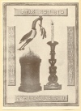
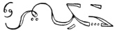
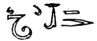
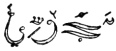

  
[Intangible Textual Heritage](../../index)  [Esoteric](../index) 
[Index](index)  [Previous](mht07)  [Next](mht09) 

------------------------------------------------------------------------

[Buy this Book at
Amazon.com](https://www.amazon.com/exec/obidos/ASIN/0893144177/internetsacredte)

------------------------------------------------------------------------

*Most Holy Trinosophia*, by Count St.Germain \[1933\], at Intangible
Textual Heritage

------------------------------------------------------------------------

p. 50

[  
Click to enlarge](img/05000.jpg)

p. 51

### SECTION FIVE

<table data-border="0" width="100%">
<colgroup>
<col style="width: 50%" />
<col style="width: 50%" />
</colgroup>
<tbody>
<tr class="odd">
<td data-valign="top" width="327">
A PEINE étais-je parvenu à la surface de la terre, que mon conducteur invisible m’entraina plus rapidement encore, la vélocité avec laqu’, elle nous parcourions les espaces aeriens ne peut être comparée à rien qu’a elle même; en un instant j’eus perdu de vue les plaines sur les qu’elles je dominais . . . j’avais observé avec étonnement, que j’étais sorti du sein de la terre loin des campagnes de Naples une plaine déserte quelques masses triangulaires étaient les seuls objets que j’eusse apperçu. Bientot malgré les épreuves que j’avois subies, une nouvelle terreur vint m’assaillir, la terre ne me semblait plus qu’un nuage confus, j’étois élevé à une hauteur immense mon guide invisible m’abandonna je redescendis pendant un assez long tems je roulai dans l’espace; déja la terre se deployait a mes regards troublés . . . je pouvois calculer combien de minutes se passeraient avant que j’aille me briser contre un rocher. Bientot prompt comme la pensée mon conducteur se précipe après moi il me reprend m’enleve encore une fois, il me laisse retomber, enfin il m’eleve avec lui à une distance incommensurable, je voyois des globes rouler autour de moi, des terres

 
</td>
<td data-valign="top" width="50%">
SCARCELY had I risen to the surface of the earth, when my unseen guide led me still more swiftly. The velocity with which we sped through space can be compared with naught but itself. In an instant I had lost sight of the plains below. I noticed with astonishment that I had emerged from the bowels of the earth far from the country about Naples. A desert and some triangular masses were the only objects I could see. Soon, in spite of the trials which I had undergone, a new terror assailed me. The earth seemed to me only a vague cloud. I had been lifted to a tremendous height. My invisible guide left me and I descended again. For quite a long time I rolled through space; already the earth spread out before my confused vision . . . I could estimate how many minutes would pass until I would be crushed on the rocks. But quick as thought my guide darts down beside me, takes hold of me, lifts me up again, and again lets me fall. Finally he raises me with him to an immeasurable distance. I saw globes revolve around me and earths gravitate at my feet. Suddenly the genius who bore me touched my eyes and I swooned. I know not

 
</td>
</tr>
</tbody>
</table>

p. 52

<table data-border="0" width="100%">
<colgroup>
<col style="width: 50%" />
<col style="width: 50%" />
</colgroup>
<tbody>
<tr class="odd">
<td data-valign="top" width="327">
graviter à mes peids tout à coup le genie qui me portois me touche les yeux, je perdis le sentiment. J’ignore combien de temps je passai en cet etat, à mon reveil je me trouvai couché sur un riche coussin, des fleurs des aromates, embaumaient l’air que je respirais . . . Une robe bleu semée d’étoiles d’or avoit remplacé le vetement de lin. vis-à-vis de moi était un autel Jaune. un feu pûr s’en exallait sans qu’aucune autre substance que l’autel même l’alimentat. Des caracteres noirs etaient gravés sur sa baze. Auprès etoit un flambeau allumé qui brilloit comme le soleil, au dessus etoit un oiseau dont les pieds etaient noirs, le corps d’argent; la tête rouge les ailes noires et Le Col d’or. Il s’agitait sans cesse mais sans faire usage de ses ailes. Il ne pouvoit voler que lorsqu’il se trouvoit au milieu des flammes. dans son bec etoit une branche verte son nom est

 

celui de l’autel est

 

l’autel, l’oiseau et le flambeau sont le simbole de tout, rien ne peut être fait sans eux, eux même sont tout ce qui est bon et grand. le flambeau se nomme

 

Quatre inscriptions entouraient ces différents emblêmes.

 
</td>
<td data-valign="top" width="50%">
how long I remained in this condition. When I awoke I was lying on a luxurious cushion; the air I breathed was saturated with the fragrance of flowers . . . A blue robe spangled with golden stars had replaced my linen garment. A yellow altar stood opposite me from which a pure flame ascended having no other substance for its alimentation than the altar itself. Letters in black were engraved at the base of the altar. A lighted torch stood beside it, shining like the sun; hovering above it was a bird with black feet, silvery body, a red head, black wings and a golden neck. It was in constant motion without however using its wings. It could only fly when in the midst of the flames. In its beak was a green branch; its name is

 

the name of the altar is

 

Altar, bird and torch are the symbol of all things. Nothing can be done without them. They themselves are all that is good and great. The name of the torch is

 

Four inscriptions surrounded these different emblems.

 
</td>
</tr>
</tbody>
</table>

------------------------------------------------------------------------

[Next: Section Six](mht09)
