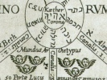

  
[Intangible Textual Heritage](../../index)  [Esoteric](../index) 
[Index](index)  [Previous](moq01)  [Next](moq03) 

------------------------------------------------------------------------

[Buy this Book at
Amazon.com](https://www.amazon.com/exec/obidos/ASIN/0911662324/internetsacredte)

------------------------------------------------------------------------

  
*Mysteries of the Qabalah*, by Elias Gewurz, \[1922\], at Intangible
Textual Heritage

------------------------------------------------------------------------

p. 4

Dedicated to

ELIAS GEWÜRZ

My Teacher,

WHO GAVE ME ALL THE MATERIALS FOR THE BUILDING, POINTING OUT THE PATH TO
ME WHICH HE HIMSELF WITH BLEEDING FEET HAS TRODDEN.

ONE OF THE SEVEN.

------------------------------------------------------------------------

[Next: The Hieroglyphical Interpretation of the Hebrew Alphabet](moq03)
