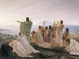

  
[Intangible Textual Heritage](../../index)  [Esoteric](../index) 
[Index](index)  [Previous](nop17)  [Next](nop19) 

------------------------------------------------------------------------

  
*Numbers, Their Occult Power and Mystic Virtues*, by W. Wynn Westcott,
\[1911\], at Intangible Textual Heritage

------------------------------------------------------------------------

p. 100

### ELEVEN. 11.

This seems to have been the type of a
number with an evil reputation among all peoples. The Kabalists
contrasted it with the perfection of the Decad, and just as the
Sephirotic number is the form of all good things, so eleven is the
essence of all that is sinful, harmful and imperfect; with the Ten
Sephiroth they contrasted the Eleven Averse Sephiroth, symbols of
destruction, violence, defeat and death. On the oldest Tarot cards, the
trump called the Tower struck by Lightning, number XVI, shows the Ten
Divine Sephiroth on one side and the Eleven Averse Sephiroth on the
other side; modern Tarot designs are very much debased.

John Heydon says that by it we know the bodies of Devils and their
nature; the Jews understand by it Lilith, Adam's first wife, a
she-devil, dangerous to women in confinements; hence they wrote on the
walls:—ADM ChVH ChVO LILIT, that is, Adam, Eve, out of doors Lilith."

Jesus, in Matt. xii. 43, plainly allows the doctrine that evil spirits
may haunt fields, which Grotius says the Jews think; and their word
Demon and Field are similar, being ShDIM (fields), and ShDIM (evil
deities); the Siddim are mentioned in Psalm cvi. 37.

It is called the "Number of Sins" and the "Penitent," because it exceeds
the number of the Commandments, and is less than twelve, which is the
number of Grace and Perfection. But sometimes even eleven receives a
favour from God, as in the case of the man who was called in the

p. 101

eleventh hour to the vineyard, who yet received the same pay as the
others.

Rabbi Jochanan says that eleven sorts of spices were mentioned by God to
Moses on Mount Sinai as suitable for holy incense.

Eleven was the number of the Disciples of Jesus, after the fall of Judas
Iscariot.

In the Hebrew Language the word eleven was expressed as Achad Osher,
Ai, or One and Ten.

------------------------------------------------------------------------

[Next: Twelve. 12.](nop19)

