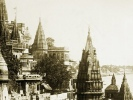

  
[Intangible Textual Heritage](../../index)  [Esoteric](../index) 
[Index](index)  [Previous](osi10)  [Next](osi12) 

------------------------------------------------------------------------

[Buy this Book at
Amazon.com](https://www.amazon.com/exec/obidos/ASIN/B002FU5O7C/internetsacredte)

------------------------------------------------------------------------

  
*Occult Science in India*, by Louis Jacoilliot, \[1919\], at Intangible
Textual Heritage

------------------------------------------------------------------------

p. 78

### CHAPTER X.

### THE ELECTION OF THE BRAHMATMA.

I have not much to add to what I have already said about the Brahmatma.

The requisite qualifications for the position were that the candidate
should have been initiated, that he should have taken the vow of
chastity, and that he should be a member of the Supreme Council.

That this vow was a serious matter will be readily understood when it is
known that any Brahmin taking it in the commencement of his career must
necessarily persevere until he arrives at the dignity of Yoguy, unless
he wishes to repeat upon earth a series of transformations. Not having
paid the *debt of his ancestors*, by the birth of a son, who can
continue his genealogical line and officiate at his funeral, he would be
obliged to come back after death, under a new human envelope, to
accomplish that final duty.

The Yoguys, or members of the Council of Seventy, by reason of their
high degree of sanctity, had no new transmigrations to undergo: it was a
matter of indifference whether they had been heads of families or
whether they had always maintained their chastity. But in view of the
small number admitted into this sanhedrim, if we may so call it, the
Brahmin who should pronounce this terrible vow, as it is termed in the
book of the Pitris, at the close of his novitiate, was in danger of
having to go through a succession of new lives, from the first monad, by
which

p. 79

the smallest particle of moss is animated, to man, who is, so far, the
most perfect expression of the vital form.

While the Brahmatma could only be chosen from among those Yoguys who had
taken the vow of chastity, his election was not due to any supposed
degree of sanctity on his part resulting therefrom, for he had hardly
been elected, when, notwithstanding his advanced age of eighty years, in
order that his election might be held valid, he had to furnish evidence
of his virile power in connection with one of the virgins of the Pagoda,
who was given him as a bride.

If a male child sprang from this union he was placed in a wicker basket,
and turned adrift upon the river to float with the current. If perchance
he was washed ashore he was carried to the temple, where he was at once,
and by virtue of that very fact, regarded as having been initiated into
the third degree. From his earliest childhood, all the secret mentrams,
or formulas of evocation, were made known to him.

If, however, the child floated down the stream with the current, he was
rejected as a Pariah, and handed over to the people of that caste to be
reared by them.

We never could discover the origin of this singular custom. Upon
comparing other ancient usages with the manners and customs of the
sacerdotal castes in Egypt, which are so similar in many respects to
those of the Indian temples, we have often asked ourselves the following
questions, which we now propound for the reader's consideration:

Might not Moses, the leader of the Hebraic revolution, have been a son
of the Egyptian high priest, who stood at the head of the order of the
initiated, and might he not have been brought to the temple, because he
had been cast ashore by the Nile?

Might not his brother Aaron, on the contrary, have been cast aside as
one of the servile class, because when he was

p. 80

set adrift likewise upon the river he floated along with the current
without being cast ashore?

May we not regard the friendship of the two brothers for each other,
when informed subsequently of their common origin, as one of the causes
that impelled Moses to abandon the sacerdotal caste, of which he was a
member, in order to place himself at the head of the Egyptian slaves,
and lead them into the desert in search of that promised land which the
pariahs, helots, and outcasts of every degree have always looked forward
to in their dreams as the sunny land of peace and liberty?

We suggest the question, however, we repeat, merely as a supposition.
Perhaps ethnographic science, by which the second half of the present
century has been so brilliantly illustrated, will show, some day, that
it is something more.

------------------------------------------------------------------------

[Next: Chapter XI. The Yoguys](osi12)
