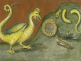

  
[Intangible Textual Heritage](../../index)  [Esoteric](../index) 
[Index](index)  [Previous](pnm19)  [Next](pnm21) 

------------------------------------------------------------------------

[Buy this Book at
Amazon.com](https://www.amazon.com/exec/obidos/ASIN/B002A9JP00/internetsacredte)

------------------------------------------------------------------------

  
*The Philosophy of Natural Magic*, by Henry Cornelius Agrippa, L. W. de
Laurence ed. \[1913\], at Intangible Textual Heritage

------------------------------------------------------------------------

p. 65

### CHAPTER XI.

#### How Occult Virtues are Infused into the Several Kinds of Things by Ideas Through the Help of the Soul of the World, And Rays of the Stars; and what Things Abound Most with this Virtue.

Platonists say that all inferior bodies
are exemplified by the superior *Ideas*. Now they define an *Idea* to be
a form, above bodies, souls, minds, and to be one, simple, pure,
immutable, indivisible, incorporeal and eternal; and that the nature of
all *Ideas* in the first place is in very Goodness itself (*i. e.*),
God, by way of cause; and that they are distinguished amongst themselves
by some relative considerations only, lest whatsoever is in the world
should be but one thing without any variety, and that they agree in
essence, lest God should be a compound substance. In the second place,
they place them in the very Intelligible Itself (*i. e.*), in the *Soul
of the World*, differing the one from the other by absolute forms, so
that all the *Ideas* in God indeed are but one form, but in the Soul of
the World they are many. They are placed in the minds of all other
things, whether they be joined to the body or separated from the body,
by a certain participation, and now by degrees are distinguished more
and more. They place them in Nature, as certain small Seed of Forms
infused by the *Ideas*, and lastly they place them in matter, as
Shadows. Hereunto may be added, that in the Soul of the World there be
as many Seminal Forms of things as *Ideas* in the mind of God, by which
forms she did in the Heavens above the Stars frame to herself shapes
also, and stamped upon all these some properties. On these Stars
therefore, shapes and properties, all virtues of inferior species, as
also their properties do depend; so that every species hath its
Celestial Shape, or figure that is suitable to

p. 66

it, from which also proceeds a wonderful power of *operating*, which
proper gift it receives from its own *Idea*, through the Seminal Forms
of the Soul of the World. For *Ideas* are not only essential causes of
every species, but are also the causes of every virtue, which is in the
species; and this is that which many philosophers say, that the
properties which are in the nature of things (which virtues, indeed, are
the operations of the *Ideas*) are *moved* by certain virtues, viz.,
such as have a certain and sure foundation; not fortuitous, nor casual,
but efficacious, powerful and sufficient—doing nothing in vain. Now
these Virtues do not err in their actings, but by accident, viz., by
reason of the impurity or inequality of the matter: For upon this
account there are found things of the same species more or less
powerful, according to the purity or indisposition of the matter; for
all Celestial Influences may be hindered by the indisposition and
insufficiency of the matter. Whence it was a proverb amongst the
Platonists, that Celestial Virtues were infused according to the desert
or merit of the matter: Which also Virgil makes mention of when he
sings:

Their natures fiery are, and from above,  
And from gross bodies freed, divinely move.

Wherefore those things in which there is less of the *Idea* of the
matter (*i. e.*), such things which have a greater resemblance of things
separated, have more powerful virtues in operation, being like to the
operation of a separated *Idea*. We see then that the situation and
figure of Celestials is the cause of all those excellent Virtues that
are in inferior species. [\*](#fn_14)

------------------------------------------------------------------------

### Footnotes

[66:\*](pnm20.htm#fr_14) An Idea of a pure
Element, whether the element be of time, space or matter, is an idea
that pertains exclusively to such element, correlating with it as
perfectly as the idea is perfect. As such idea must be evolved in an
intelligent use of such element, so ideas are essential to occult
experiment.

------------------------------------------------------------------------

[Next: Chapter XII. How It Is That Particular Virtues Are Infused into
Particular Individuals, even of the Same Species](pnm21)
