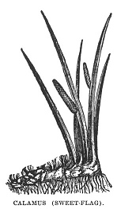

  
[Intangible Textual Heritage](../../index)  [Esoteric](../index) 
[Index](index)  [Previous](pnm31)  [Next](pnm33) 

------------------------------------------------------------------------

[Buy this Book at
Amazon.com](https://www.amazon.com/exec/obidos/ASIN/B002A9JP00/internetsacredte)

------------------------------------------------------------------------

  
*The Philosophy of Natural Magic*, by Henry Cornelius Agrippa, L. W. de
Laurence ed. \[1913\], at Intangible Textual Heritage

------------------------------------------------------------------------

### CHAPTER XXIII.

#### How We Shall Know What Stars Natural Things Are Under, and What Things Are Under the Sun, Which Are Called Solary.

Now it is very hard to know what Star or
Sign every thing is under; yet it is known through the imitation of
their rays, or motion, or figure of the superiors. Also some of them are
known by their colors and odors; also some by the effects of their
operations, answering to some Stars. So, then, Solary things, or things
under the power of the Sun, are amongst Elements, the lucid flame; in
the humors, the purer blood and spirit of life; amongst tastes, that
which is quick, mixed with sweetness; amongst metals, gold, by reason of
its splendor, and its receiving that from the Sun which makes it
cordial; and amongst stones, they which resemble the rays of the Sun by
their golden sparklings, as doth the glittering stone aetites, which
hath power against the falling sickness and poisons. So also the stone
which is called the Eye of the Sun, being of a figure like to the apple
of the eye, from the middle whereof shines forth a ray; it comforts the
brain and strengthens the sight. So the carbuncle, which shines by
night, hath a virtue against all airy and vaporous poison. So the
chrysolite stone, which is of a light green color, in which, when it is
held against the Sun, there shines forth a golden star; and this
comforts those parts that serve for breathing, and helps those that be
asthmatical; and if it be bored through,

p. 96

and the hole filled with the mane of an ass, and bound to the left arm,
it drives away idle imaginations and melancholy fears, and puts away
foolishness. So the stone called iris, which is like crystal in color,
being often found with six corners; when, under some roof, part of it is
held against the rays of the Sun and the other part is held in the
shadow, it gathers the rays of the Sun into itself, which, whilst it
sends them forth, by way of reflection, makes a rainbow appear on the
opposite wall. Also the stone heliotrope, green like the jasper or
emerald, beset with red specks, makes a man constant, renowned and
famous; also it conduceth to long life; and the virtue of it, indeed, is
most wonderful upon the beams of the Sun, which it is said to turn into
blood (*i. e.*), to appear of the color of blood, as if the Sun were
eclipsed, viz., when it is joined to the juice of a herb of the same
name, and be put into a vessel of water. There is also another virtue of
it more wonderful, and that is upon the eyes of men, whose sight it doth
so dim and dazzle that it doth not suffer him that carries it to see it,
and this it doth not do without the help of the herb of the same name,
which also is called heliotrope (*i. e.*), following the Sun. These
virtues doth Albertus Magnus and William of Paris confirm in their
writings. The stone hyacinth also hath a virtue from the Sun against
poisons and pestiferous vapors; it makes him that carries it to be safe
and acceptable; it conduceth also to riches and wit; it strengthens the
heart; being held in the mouth it doth wonderfully cheer up the mind.
Also there is the stone pyrophylus, of a red mixture, which Albertus
Magnus saith Æsculapius makes mention of in one of his Epistles unto
Octavius Augustus, saying that there is a certain poison so wonderfully
cold, which preserves the heart of man (being taken out) from burning,
so that if for any time it be put into the fire it is turned into a
stone, and this is that

p. 97

stone which is called pyrophylus, from the fire. It hath a wonderful
virtue against poison, and it makes him that carries it to be renowned
and dreadful to his enemies. But, above all, that stone is most Solary
which Apollonius is reported to have found, and which is called
pantaura, which draws other stones to it, as the loadstone doth iron,
and is most powerful against all poisons. It is called by some
pantherus, because it is spotted like the beast called the panther. It
is therefore also called pantochras, because it contains all colors, and
Aaron calls it evanthum. There are also other Solary stones, as the
topazius, chrysopassus, the rubine, and balagius. So also is
auripigmentum, and things of a golden color and very lucid.

Amongst plants, also, and trees, those are Solary which turn towards the
Sun, as the marigold, and those which fold in their leaves when the Sun
is near upon setting, but when it riseth unfold their leaves by little
and little. The lote-tree also is Solary, as is manifest by the figure
of the fruit and leaves. So is peony, sallendine, balm, ginger, gentian,
and dittany; and vervain, which is of use in prophesying and expiations,
as also driving away evil-spirits. The bay-tree also is consecrated to
Phœbus, so is the cedar, the palm-tree, the ash, the ivy and vine, and
whatsoever repel poisons and lightnings, and those things which never
fear for the extremities of the winter. Solary also are mint, mastic,
zedoary, saffron, balsam, amber, musk, yellow honey, lignum aloes,
cloves, cinnamon, calamus, aromaticus, pepper, frankincense,
sweet-marjoram, also libanotis, which Orpheus calls the sweet perfume of
the Sun.

Also amongst animals those are called Solary which are magnanimous,
courageous, ambitious of victory and renown—as the lion, king of beasts;
the crocodile, the spotted wolf, the ram, the boar; the bull, king of
the herd, which was by the Egyptians

p. 98

at Heliopolis dedicated to the Sun, which they called Verites; and an ox
was consecrated to Apis in Memphis,

|                                         |
|-----------------------------------------|
|  |

and in Herminthus a bull by the name of Pathis. The wolf, also, was
consecrated to Apollo and Latona. Also the beast called baboon is
Solary, which twelve times in a day (viz., every hour) barks and in time
of Æquinoctium micturateth twelve times every hour; the same also it
doth in the night, whence the Egyptians did engrave him upon their
fountains. [\*](#fn_20)

Also, amongst birds, these are Solary: The phœnix, being but one of that
kind; and the eagle, the queen of birds; also the vulture, the swan, and
those which sing at the rising Sun and, as it were, call upon it to
rise, as the cock and crow; also the hawk, which because it, in the
divinity of the Egyptians, is an emblem of the spirit and light, is by
Porphyrius reckoned amongst the Solary birds. Moreover, all such things
as have some resemblance of the works of the Sun, as worms shining in
the night, and the beetle. Also, according to Appious’ interpretation,
such things whose eyes are changed according to the course

p. 99

of the Sun are accounted Solary; and things which come of them.

And amongst fish, the sea-calf is chiefly Solary, who doth resist
lightning; also shell-fish and the fish called Pulmo, both of which
shine in the night; and the fish called stella, [\*](#fn_21) for his parching heat; and the fish
called strombi [†](#fn_22) that follow their
king; and margari, [‡](#fn_23) which also have a
king, and, being dried, are hardened into a stone of a golden color.

------------------------------------------------------------------------

### Footnotes

[98:\*](pnm32.htm#fr_20) Mr. Morley notes here
in reference to the baboon that "Hermes Trismegistus, or a writer in his
name, taught that the common division of time was suggested to man by
the habits of this sacred animal." Life of Henry Cornelius Agrippa,
Volume I, page 132.

[99:\*](pnm32.htm#fr_21) Stella—a
star—star-fish; the Asterias or sea-star. One peculiarity of this
radiate animal is that so long as it has any one of its usual five
points remaining, it will restore any others that may have been
destroyed.

[99:†](pnm32.htm#fr_22) Strombi—Strombite. A
[mollusk](errata.htm#1), of the genus Strombus, possessing a spiral
shell with a broad, wing-like lip. Ordinarily known as sea-snail.

[99:‡](pnm32.htm#fr_23)
Margari—Margarite—Margaritaceæ. Pearl-fish; the pearl oyster.

------------------------------------------------------------------------

[Next: What Things Are Lunary, or Under the Power of the Moon](pnm33)
