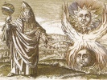

  
[Intangible Textual Heritage](../../index)  [Esoteric](../index) 
[Index](index)  [Previous](pym13)  [Next](pym15) 

------------------------------------------------------------------------

[Buy this Book at
Amazon.com](https://www.amazon.com/exec/obidos/ASIN/B002ECE6GQ/internetsacredte)

------------------------------------------------------------------------

  
*The Divine Pymander*, by Hermes Mercurius Trismegistus, tr. by John
Everard, \[1650\], at Intangible Textual Heritage

------------------------------------------------------------------------

**THE THIRTEENTH BOOK,** **OF SENSE AND UNDERSTANDING**

YESTERDAY, *Asclepius,* I delivered a perfect Discourse, but now I think
it necessary, in suite of that, to dispute also of Sense.

2\. For Sense and Understanding seem to differ, because the one is
material and the other essential.

3\. But unto me, they appear to be both one, or united, and not divided
in men, I mean.

4\. For in other living Creatures, Sense is united into Nature, but in
men to Understanding.

5\. But the Mind differs from Understanding, as much a God from
Divinity.

6\. For Divinity is… from under God, and Understanding from the Mind,
being the Sister of the Word or Speech, and they the Instruments one of
another.

7\. For neither is the Word pronounced without Understanding, neither is
Understanding manifested without the Word.

8\. Therefore, Sense and Understanding do both flow together into a man,
as if they were infolded one within another.

9\. For neither is it possible without Sense to Understand, nor can we
have Sense without Understanding.

10\. And yet it is possible (*for the time being*), that the
Understanding may understand without Sense, as they that fancy visions
in their Dreams.

11\. But it seems unto me, that both the operations are in the Visions
of Dreams, and that the Sense is stirred up out of sleep, into
awakening.

12\. For Man is divided into a Body and a Soul, when both parts of the
Sense accord one with another, then is the Understanding childed, or
brought forth by the Mind pronounced.

13\. For the Mind brings forth all Intellections or Understandings, Good
ones when it receiveth good seed from God, and the contrary, when it
receives them from Devils.

14\. For there is not part of the World void of the Devil, which
entering in privately, sowed the seed of his own *proper* operation, and
the mind did make pregnant, or did bring forth that which was sown.
*Adulteries, Murders, Striking of Parents, Sacrileges, Impieties,
Stranglings,* throwing down headlong, and all other things, which are
the works of Evil *Demons*.

15\. And the seeds of God are few, but great and Fair, and Good, Virtue,
and Temperance, and Piety.

16\. And the Piety is the knowledge of God, whom whosoever knoweth,
being full of all good things, hath Divine Understanding, and not like
the many.

17\. And therefore they that have that knowledge, neither please the
multitude, nor the multitude them, but they seem to be mad, and to move
laughter, hated and despised, and many times also murdered.

18\. For we have already said, That wickedness must dwell here, being in
her own region.

19\. For her region is the Earth, and not the World, as some will
sometimes say, Blaspheming.

20\. But the Godly or God-worshipping Man, laying hold on knowledge,
will despise or tread under all these things, for though they be evil to
other men, yet to him all things are good.

21\. And upon mature consideration, he refers all things to knowledge,
and that which is most to be wondered at, he alone makes Evil things
good.

22\. But I return again to my Discourse of Sense.

23\. It is, therefore, a thing proper to man, to communicate and conjoin
Sense and Understanding.

24\. But every man, as I said before, doth not enjoy Understanding, for
one man is material, another Essential.

25\. And he that is material with wickedness, as I said, received from
the Devils the seed of Understanding, but they that are with the Good
essentially, are eared with God.

26\. For God is the workman of all things, and when he worketh, he useth
Nature.

27\. He maketh all things good like himself.

28\. But these things that are made good, are in the use of operation,
unlawful.

29\. For the Motion of the World, stirring up Generations, makes
Qualities; infesting some with evilness, and purifying some with good.

30\. And the World, *Asclepius,* hath a peculiar Sense and
Understanding, not like to Man's, nor so various or manifold, but a
better and more simple.

31\. For the Sense and Understanding of the World is *One*, in that it
makes all things, and unmakes them again into itself, for it is the
Organ of Instrument of the Will of God.

32\. And it is so organized or framed, and made for an Instrument by
God, that receiving all Seeds into itself from God, and keeping them in
itself, it maketh all things effectually, and dissolving them, reneweth
all things.

33\. And therefore like a good Husbandman of Life, when things are
dissolved or loosened, he affords, by the casting of Seed, renovation to
all things that grow.

34\. There is nothing that it (the World) doth not beget or bring forth
alive, and by its Motion, it makes all things alive.

35\. And it is at once, both the Place and the Workman of Life.

36\. But the Bodies are from the Matter, in a different manner, for some
are of Earth, some of Water, some of Air, some of Fire, and all are
compounded, but some are more compounded, and some are more simple.

37\. They that are compounded, are the heavier, and they that are less,
are the higher.

38\. And the swiftness of the Motion of the World, makes the varieties
of the qualities of Generation, for the Spiration of Influence being
most frequent, extendeth unto the Bodies' qualities, with infulness,
which is of Life.

39\. Therefore, God is the Father of the World, but the World is Father
of the things in the World.

40\. And the World is the Son of God, but things in the World, are the
Sons of the World.

41\. And, therefore, it is well called … the World, that is, an
Ornament, because it adorneth and beautifieth all things with the
Variety of Generation, and indeficiency of Life, which the unweariedness
of Operation, and the swiftness of Necessity, with the mingling of
Elements, and the order of things done.

42\. Therefore, it is necessarily and proper called … the World.

43\. For all living things, both the sense and the Understanding, cometh
into them from without, inspired by that which compasseth them about,
and continueth them.

44\. And the World receiving it once from God as soon as it was made,
has it still, *whatever it once had.*

45\. But God is not as it seems to some who Blaspheme through
superstition, without Sense, and without Mind, or Understanding.

46\. For all things that are, O *Asclepius,* are in God, and made by
him, and depend of him, some working by bodies, some moving by a Soul,
like Essence, some quickening by a Spirit, and some receiving the things
that are weary, and all very fitly.

47\. Or rather, I say, that he hath them not, but I declare the Truth,
*he is all things,* not receiving them from without, but exhibiting them
outwardly.

48\. And this is the Sense and Understanding of God, to move all things
always.

49\. And there shall never be any time, when any of these things that
are, shall fail, or be wanting.

50\. When I say the things that are, I mean God, for the things that
are, God hath, and neither is there anything without him, nor he without
anything.

51\. These things, O *Asclepius,* will appear to be true, if thou
understand them, but if thou understand them not, incredible.

52\. For to understand, is to believe, but not to believe, is not to
understand; For my speech or words reach not unto the Truth, but the
Mind is great, and being led or conducted for a while by Speech, is able
to attain to the Truth.

53\. And understanding all things round about, and finding them
consonant, and agreeable to those things that were delivered, and
interrupted by Speech, believeth, and in that good belief resteth.

54\. To them, therefore, that understand the things that have been said
of God, they are credible, but to them that understand them not,
incredible.

55\. And let these, and thus many things, be spoken concerning
*Understanding* and *Sense*.

The End of the Thirteenth Book,  
OF SENSE AND UNDERSTANDING.

------------------------------------------------------------------------

[Next: The Fourteenth Book, of Operation and Sense](pym15)
