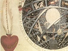
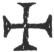

  
[Intangible Textual Heritage](../../index)  [Esoteric](../index) 
[Index](index)  [Previous](sat20)  [Next](sat22) 

------------------------------------------------------------------------

[Buy Kindle Download of this
Book](https://www.amazon.com/exec/obidos/ASIN/B001BDI55M/internetsacredte)

------------------------------------------------------------------------

[Buy Printed Copy of this Book at
lulu.com](https://www.lulu.com/content/2742583)

------------------------------------------------------------------------

  
*The Signature of All Things*, by Jacob Boehem, \[1912\], at Intangible
Textual Heritage

------------------------------------------------------------------------

p. 221

### POSTSCRIPT BY THE TRANSLATOR

THE preceding book is a brief signature, or character of natural and
divine knowledge. But it will seem strange and simple to the proud
self-conceited sophisters, the wiselings of pedantic reason, who will
carp and cavil at anything but what dances to their pipe, or agrees with
their conceits. But their censures are not to be valued; and their
letter-learned mock productions of science are to be pitied, being only
the courted shadows of their own amused fancy. Such as these being
captivated in the mystery of Babel, wonder only after their beast
Mammon, upon which they ride in pride, and scorn anything but what
pleases and flatters them in their admired works of covetous iniquity,
gilded over with seeming holiness. But the Babylonish structure of their
turba-magna-performances will fall, when it has attained the highest
limit of its constellation, and no wit of man shall be able to prop it
up. In the meantime the Antichrist in Babel will rage and tyrannise, and
execute the sentence of wrath, or his own dismal doom, upon himself.

But not to transgress by too large a digression from the intent of this
postscript; the principal design of it is to explain some words which
are used in the translation, as

FLAGRAT, LUBET, SOURCE, SUDE

#### FLAGRAT

The word in the German is *Schra’ck*, which signifies properly a fright,
sudden astonishment, or dismay. In the other books it is translated
terror, or crack, but I have put it *flagrat*, from the Latin word
*flagro*, though I mean not by it only a burning, but even the powerful
opening of the life or death of the enkindling of the fire in nature.
For the fire is the dividing bound-mark, in which the life of both
principles is opened and separated; the life of the first is the dying
death in the darkness, and the life of the second is the living life in
the light. You may perceive a resemblance of this flagrat in thunder and
lightening, as also in gunpowder, and the like. Take for instance divers
sulphureous salnitral minerals exactly mixed, now their powers

p. 222

are as I may say contracted, or shut up in the astringent dark desire or
death; but touch them rightly with the true fire, and you will see how
they will soon open, disclose, and flash forth, and will even display
and stream themselves forth into divers properties, colours, and
virtues. It is even the bursting forth of the ardent desire in nature.
It is, as I may term it, the magical fire-breath, whereby the powers
either of light or darkness are dismayed. In short, it is the pregnant
echo of the sound of eternity everywhere speaking, working, and opening
itself in love or anger, in each thing according to its will and desire:
In some it is the horrible flagrat to death; and in others it is the
pleasant triumphant flagrat to life.

#### LUBET

The word in the Dutch is *lust*, which signifies a longing desire or
will to a thing; also a delight, or contented joy; sometimes imagination
and lust. But because our word lust is commonly used in the worst sense
(a longing after evil and vanity) and would not properly agree to, or
fully express the German word lust in all places, I have generally
translated it *lubet*, from the Latin word *lubitum*, whereby is meant
the divine *beneplacitum*, or good pleasure. By it is understood the
origin to a desire in the eternal nothing, or pregnant magic, God's free
well-liking to the desire of the manifestation of nature and creature,
without which all had been an eternal stillness in the nothing. This
lubet in man is the moving will to good or evil, light or darkness, love
or anger.

#### SOURCE

By this are meant the first original qualities or properties of both the
inward principles, as they break forth in the sude of the fire in the
flagrat of love or anger in nature or creature. For in the darkness the
love-*ens*, or paradisical light, is shut up in death, and causes an
austere dark source, pain, horror, torment, or disquietude; and so it is
the radical property of the contentious elements and stars in the curse
of God: And in the light the life of love breaks forth, and swallows up
this wrathful source of darkness and death, and turns it into joy or a
divine source. So that by *source* is understood the original quality,
property, or qualification of evil, darkness, anger, sorrow, cursing,
damnation, death, hell; or the contrary to these in

p. 223

their divine source, or essential working property; both according to
time and eternity.

#### SUDE

The word *sude* is German, and signifies a boiling or seething. It is
the stirring of the seven properties in nature, arising from the
assimulation or essential co-influence of the outward and inward Sol in
Sulphur, from whence the blooming vegetation of the earth proceeds; also
the generation of metals and minerals lies therein.

 

These are some uncommon words which are used in rendering this book into
English. Words are *vehicula rerum*, they are formed to express things,
not bare sounds, or empty airs. Now he who rightly understands the
ground of the *cabala* and *magia*, and knows how the language of nature
speaks in every tongue, might well translate this author. But the bare
letter of his writings, though ever so exactly translated, will not give
the understanding of them, but the spirit of regeneration in Christ, in
whom the fulness of the Deity dwells corporeally.

N.B.—There is One Character by which God
has characterised both himself, and all the creatures, and shewn that
his presence is in all things; yet so that each creature has its wonder,
either of the heavenly or of the earthly mystery. This peculiar mark,
shape, and figure, that it may appear as a peculiar is the   in the sphere and mercurial
wheel of nature, which goes through all the three principles, and in the
third through all the kingdoms of minerals, vegetables, and animals,
through heaven and earth; the wonderful depth of which is shewn in this
book to the enquirer after the divine mysteries.

------------------------------------------------------------------------

[Next: Dialog I](sat22)
