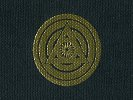

  
[Intangible Textual Heritage](../../index)  [Esoteric](../index) 
[Yoga](../../hin/yoga/index)  [Index](index)  [Previous](sob11) 
[Next](sob13) 

------------------------------------------------------------------------

[Buy this Book at
Amazon.com](https://www.amazon.com/exec/obidos/ASIN/0911662006/internetsacredte)

------------------------------------------------------------------------

  
*Science of Breath*, by Yogi Ramacharaka, pseud. William Atkinson,
\[1904\], at Intangible Textual Heritage

------------------------------------------------------------------------

p. 52

### Chapter XI

### THE SEVEN YOGI DEVELOPING EXERCISES

The following are the seven favorite exercises of the Yogis for
developing the lungs, muscles, ligaments, air cells, etc. They are quite
simple, but marvelously effective. Do not let the simplicity of these
exercises make you lose interest, for they are the result of careful
experiments and practice on the part of the Yogis, and are the essence
of numerous intricate and complicated exercises, the non-essential
portions being eliminated and the essential features retained.

\(1\) THE RETAINED BREATH

This is a very important exercise which tends to strengthen and develop
the respiratory muscles as well as the lungs, and its frequent practice
will also tend to expand the chest. The Yogis have found that an
occasional holding of the breath, after the lungs have been filled with
the Complete Breath, is very beneficial, not only to the respiratory
organs but to the organs of nutrition, the nervous system and the blood
itself. They have found that an occasional holding of the breath tends
to purify the air which has remained in the lungs from former
inhalations, and to more fully oxygenate the blood. They also know that
the breath so retained gathers up all the waste matter, and when the
breath is expelled it carries with it the effete matter of the system,
and cleanses the lungs just as a purgative does the bowels. The Yogis
recommend this exercise for various disorders of the stomach, liver and
blood, and also find that it frequently relieves bad breath, which often

p. 53

arises from poorly ventilated lungs. We recommend students to pay
considerable attention to this exercise, as it has great merits. The
following directions will give you a clear idea of the exercise:

\(1\) Stand erect.

\(2\) Inhale a Complete Breath.

\(3\) Retain the air as long as you can comfortably.

\(4\) Exhale vigorously through the open mouth.

\(5\) Practice the Cleansing Breath.

At first you will be able to retain the breath only a short time, but a
little practice will also show a great improvement. Time yourself with a
watch if you want to note your progress.

\(2\) LUNG CELL STIMULATION

This exercise is designed to stimulate the air cells in the lungs, but
beginners must not overdo it, and in no case should it be indulged in
too vigorously. Some may find a slight dizziness resulting from the
first few trials, in which case let them walk around a little and
discontinue the exercise for a while.

\(1\) Stand erect, with hands at sides.

\(2\) Breathe in very slowly and gradually.

\(3\) While inhaling, gently tap the chest with the finger tips,
constantly changing position.

\(4\) When the lungs are filled, retain the breath and pat the chest
with the palms of the hands.

\(5\) Practice the Cleansing Breath.

This exercise is very bracing and stimulating to the whole body, and is
a well-known Yogi practice. Many of the air cells of the lungs become
inactive by reason of incomplete breathing, and often become almost
atrophied. One who has practiced imperfect breathing for years will find
it not so easy to stimulate all these ill-used air cells into activity
all at once

p. 54

by the Complete Breath, but this exercise will do much toward bringing
about the desired results, and is worth study and practice.

\(3\) RIB STRETCHING

We have explained that the ribs are fastened by cartilages, which admit
of considerable expansion. In proper breathing, the ribs play an
important part, and it is well to occasionally give them a little
special exercise in order to preserve their elasticity. Standing or
sitting in unnatural positions, to which many of the Western people are
addicted, is apt to render the ribs more or less stiff and inelastic,
and this exercise will do much to overcome same.

\(1\) Stand erect.

\(2\) Place the hands one on each side of the body, as high up under the
armpits as convenient, the thumbs reaching toward the back, the palms on
the side of the chest and the fingers to the front over the breast.

\(3\) Inhale a Complete Breath.

\(4\) Retain the air for a short time.

\(5\) Then gently squeeze the sides, at the same time slowly exhaling.

\(6\) Practice the Cleansing Breath.

Use moderation in this exercise and do not overdo it.

\(4\) CHEST EXPANSION

The chest is quite apt to be contracted from bending over one's work,
etc. This exercise is very good for the purpose of restoring natural
conditions and gaining chest expansion.

\(1\) Stand erect.

\(2\) Inhale a Complete Breath

p. 55

 

\(3\) Retain the air.

\(4\) Extend both arms forward and bring the two, clenched fists
together on a level with the shoulder.

\(5\) Then swing back the fists vigorously until the arms stand out
straight sideways from the shoulders.

\(6\) Then bring back to Position 4, and swing to Position 5. Repeat
several times.

\(7\) Exhale vigorously through the opened mouth.

\(8\) Practice the Cleansing Breath.

Use moderation and do not overdo this exercise.

\(5\) WALKING EXERCISE

\(1\) Walk with head up, chin drawn slightly in, shoulders back, and
with measured tread.

\(2\) Inhale a Complete Breath, counting (mentally) 1, 2, 3, 4, 5, 6, 7,
8, one count to each step, making the inhalation extend over the eight
counts.

\(3\) Exhale slowly through the nostrils, counting as before-1, 2, 3, 4,
5, 6, 7, 8—one count to a step.

\(4\) Rest between breaths, continuing walking and counting, 1, 2, 3, 4,
5, 6, 7, 8, one count to a step.

\(5\) Repeat until you begin to feel tired. Then rest for a while, and
resume at pleasure. Repeat several times a day.

Some Yogis vary this exercise by retaining the breath during a 1, 2, 3,
4, count, and then exhale in an eight-step count. Practice whichever
plan seems most agreeable to you.

\(6\) MORNING EXERCISE

\(1\) Stand erect in a military attitude, head up, eyes front, shoulders
back, knees stiff, hands at sides.

p. 56

\(2\) Raise body slowly on toes, inhaling a Complete Breath, steadily
and slowly.

\(3\) Retain the breath for a few seconds, maintaining the same
position.

\(4\) Slowly sink to first position, at the same time slowly exhaling
the air through the nostrils.

\(5\) Practice Cleansing Breath.

\(6\) Repeat several times, varying by using right leg alone, then left
leg alone.

\(7\) STIMULATING CIRCULATION

\(1\) Stand erect.

\(2\) Inhale a Complete Breath and retain.

\(3\) Bend forward slightly and grasp a stick or cane steadily and
firmly, and gradually exerting your entire strength upon the grasp.

\(4\) Relax the grasp, return to first position, and slowly exhale.

\(5\) Repeat several times.

\(6\) Finish with the Cleansing Breath.

This exercise may be performed without the use of a stick or cane, by
grasping an imaginary cane, using the will to exert the pressure. The
exercise is a favorite Yogi plan of stimulating the circulation by
driving the arterial blood to the extremities, and drawing back the
venous blood to the heart and lungs that it may take up the oxygen which
has been inhaled with the air. In cases of poor circulation there is not
enough blood in the lungs to absorb the increased amount of oxygen
inhaled, and the system does not get the full benefit of the improved
breathing. In such cases, particularly, it is well to practice the
exercise, occasionally with the regular Complete Breathing exercise.

------------------------------------------------------------------------

[Next: Chapter XII. Seven Minor Yogi Exercises](sob13)
