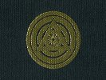

  
[Intangible Textual Heritage](../../index)  [Esoteric](../index) 
[Yoga](../../hin/yoga/index)  [Index](index)  [Previous](sob13) 
[Next](sob15) 

------------------------------------------------------------------------

[Buy this Book at
Amazon.com](https://www.amazon.com/exec/obidos/ASIN/0911662006/internetsacredte)

------------------------------------------------------------------------

  
*Science of Breath*, by Yogi Ramacharaka, pseud. William Atkinson,
\[1904\], at Intangible Textual Heritage

------------------------------------------------------------------------

p. 60

### Chapter XIII

### VIBRATION AND YOGI RHYTHMIC

### BREATHING

All is in vibration. From the tiniest atom to the greatest sun,
everything is in a state of vibration. There is nothing in absolute rest
in nature. A single atom deprived of vibration would wreck the universe.
In incessant vibration the universal work is performed. Matter is being
constantly played upon by energy and countless forms and numberless
varieties result, and yet even the forms and varieties are not
permanent. They begin to change the moment they are created, and from
them are born innumerable forms, which in turn change and give rise to
newer forms, and so on and on, in infinite succession. Nothing is
permanent in the world of forms, and yet the great Reality is
unchangeable. Forms are but appearances—they come, they go, but the
Reality is eternal and unchangeable.

The atoms of the human body are in constant vibration. Unceasing changes
are [occurring](errata.htm#18). In a few months there is almost a
complete change in the matter composing the body, and scarcely a single
atom now composing your body will be found in it a few months hence.
Vibration, constant vibration. Change, constant change.

In all vibration is to be found a certain rhythm. Rhythm pervades the
universe. The swing of the planets around the sun; the rise and fall of
the sea; the beating of the heart; the ebb and flow of the tide; all
follow rhythmic laws. The rays of the sun reach us; the rain descends
upon us, in obedience to the

p. 61

same law. All growth is but an exhibition of this law. All motion is a
manifestation of the law of rhythm.

Our bodies are as much subject to rhythmic laws as is the planet in its
revolution around the sun. Much of the esoteric side of the Yogi Science
of Breath is based upon this known principle of nature. By falling in
with the rhythm of the body, the Yogi manages to absorb a great amount
of Prana, which he disposes of to bring about results desired by him. We
will speak of this at greater length later on.

The body which you occupy is like a small inlet running in to the land
from the sea. Although apparently subject only to its own laws, it is
really subject to the ebb and flow of the tides of the ocean. The great
sea of life is swelling and receding, rising and falling, and we are
responding to its vibrations and rhythm. In a normal condition we
receive the vibration and rhythm of the great ocean of life, and respond
to it, but at times the mouth of the inlet seems choked up
[with](errata.htm#19) debris, and we fail to receive the impulse from
Mother Ocean, and [disharmony](errata.htm#20) manifests within us.

You have heard how a note on a violin, if sounded repeatedly and in
rhythm, will start into motion vibrations which will in time destroy a
bridge. The same result is true when a regiment of soldiers crosses a
bridge, the order being always given to "break step" on such an
occasion, lest the vibration bring down both bridge and regiment. These
manifestations of the effect of rhythmic motion will give you an idea of
the effect on the body of rhythmic breathing. The whole system catches
the vibration and becomes in harmony with the will, which causes the
rhythmic

p. 62

motion of the lungs, and while in such complete harmony will respond
readily to orders from the will. With the body thus attuned, the Yogi
finds no difficulty in increasing the circulation in any part of the
body by an order from the will, and in the same way he can direct an
increased current of nerve force to any part or organ, strengthening and
stimulating it.

In the same way the Yogi by rhythmic breathing "catches the swing," as
it were, and is able to absorb and control a greatly increased amount of
prana, which is then at the disposal of his will. He can and does use it
as a vehicle for sending forth thoughts to others and for attracting to
him all those whose thoughts are keyed in the same vibration. The
phenomena of telepathy, thought transference, mental healing, mesmerism,
etc., which subjects are creating such an interest in the Western world
at the present time, but which have been known to the Yogis for
centuries, can be greatly increased and augmented if the person sending
forth the thoughts will do so after rhythmic breathing. Rhythmic
breathing will increase the value of mental healing, magnetic healing,
etc., several hundred per cent.

In rhythmic breathing the main thing to be acquired is the mental idea
of rhythm. To those who know anything of music, the idea of measured
counting is familiar. To others, the rhythmic step of the soldier:
"Left, right; left, right; left, right; one, two, three, four; one, two,
three, four," will convey the idea.

The Yogi bases his rhythmic time upon a unit corresponding with the beat
of his heart. The heart beat varies in different persons, but the heart
beat unit of each person is the proper rhythmic standard for that

 

p. 63

particular individual in his rhythmic breathing. Ascertain your normal
heart beat by placing your fingers over your pulse, and then count: "1,
2, 3, 4, 5, 6; 1, 2, 3, 4, 5, 6," etc., until the rhythm becomes firmly
fixed in your mind. A little practice will fix the rhythm, so that you
will be able to easily reproduce it. The beginner usually inhales in
about six pulse units, but he will be able to greatly increase this by
practice.

The Yogi rule for rhythmic breathing is that the units of inhalation and
exhalation should be the same, while the units for retention and between
breaths should be one-half the number of those of inhalation and
exhalation.

The following exercise in Rhythmic Breathing should be thoroughly
mastered, as it forms the basis of numerous other exercises, to which
reference will be made later.

\(1\) Sit erect, in an easy posture, being sure to hold the chest, neck
and head as nearly in a straight line as possible, with shoulders
slightly thrown back and hands resting easily on the lap. In this
position the weight of the body is largely supported by the ribs and the
position may be easily maintained. The Yogi has found that one cannot
get the best effect of rhythmic breathing with the chest drawn in and
the abdomen protruding.

\(2\) Inhale slowly a Complete Breath, counting six pulse units.

\(3\) Retain, counting three pulse units.

\(4\) Exhale slowly through the nostrils, counting six pulse units.

\(5\) Count three pulse beats between breaths.

\(6\) Repeat a number of times, but avoid fatiguing yourself at the
start.

p. 64

\(7\) When you are ready to close the exercise, practice cleansing
breath, which will rest you and cleanse the lungs.

After a little practice you will be able to increase the duration of the
inhalations and exhalations, until about fifteen pulse units are
consumed. In this increase, remember that the units for retention and
between breaths is one-half the units for inhalation and exhalation.

Do not overdo yourself in your effort to increase the duration of the
breath, but pay as much attention as possible to acquiring the "rhythm,"
as that is more important than the length of the breath. Practice and
try until you get the measured "swing" of the movement, and until you
can almost "feel" the rhythm of the vibratory motion throughout your
whole body. It will require a little practice and perseverance, but your
pleasure at your improvement will make the task an easy one. The Yogi is
a most patient and persevering man, and his great attainments are due
largely to the possession of those qualities.

------------------------------------------------------------------------

[Next: Chapter XIV. Phenomena of Yogi Psychic Breathing](sob15)
