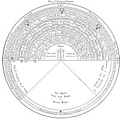
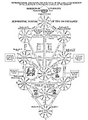
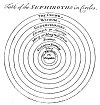

  
[Intangible Textual Heritage](../../index)  [Esoteric](../index) 
[Index](index)  [Previous](sta28)  [Next](sta30) 

------------------------------------------------------------------------

p. 121

# The Tree of the Sephiroth

THE Tree of the Sephiroth may be considered an invaluable compendium of
the secret philosophy which originally was the spirit and soul of
Chasidism. The Qabbalah is the priceless heritage of Israel, but each
year those who comprehend its true principles become fewer in number.
The Jew of today, if he lacks a realization of the profundity of his
people's doctrines, is usually permeated with that most dangerous form
of ignorance, modernism, and is prone to regard the Qabbalah either as
an evil to be shunned like the plague or as a ridiculous superstition
which has survived the black magic of the Dark Ages. Yet without the key
which the Qabbalah supplies, the spiritual mysteries of both the Old and
the New Testament must remain unsolved by Jew and Gentile alike.

The Sephirothic Tree consists of ten globes of luminous splendor
arranged in three vertical columns and connected by 22 channels or
paths. The ten globes are called the *Sephiroth* and to them are
assigned the numbers i to 10. The three columns are called *Mercy* (on
the right), *Severity* (on the left), and, between them, *Mildness*, as
the reconciling power. The columns may also be said to represent
*Wisdom*, *Strength*, and *Beauty*, which form the triune support of the
universe, for it is written that the foundation of all things is the
*Three*. The 22 channels are the letters of the Hebrew alphabet and to
them are assigned the major trumps of the Tarot deck of symbolic cards.

Eliphas Levi declared that by arranging the Tarot cards according to a
definite order man could discover all that is knowable concerning his
God, his universe, and himself. When the ten numbers which pertain to
the globes (Sephiroth) are combined with the 22 letters relating to the
channels, the resultant sum is 32--the number peculiar to the
Qabbalistic Paths of Wisdom. These Paths, occasionally referred to as
the 32 teeth in the mouth of the *Vast Countenance* or as the 32 nerves
that branch out from the Divine Brain, are analogous to the first 32
degrees of Freemasonry, which elevate the candidate to the dignity of a
Prince of the Royal Secret. Qabbalists also consider it extremely
significant that in the original Hebrew Scriptures the name of God
should occur 32 times in the first chapter of Genesis. (In the English
translations of the Bible the name appears 33 times.) In the mystic
analysis of the human body, according to the Rabbins, 32 spinal segments
lead upward to the Temple of Wisdom--the skull.

The four Qabbalistic Trees described in the preceding chapter were
combined by later Jewish scholars into one all-inclusive diagram and
termed by them not only the Sephirothic but also the *Archetypal*, or
*Heavenly*, *Adam*. According to some authorities, it is this Heavenly
Adam, and not a terrestrial man, whose creation is described in the
opening chapters of Genesis. Out of the substances of this divine man
the universe was formed; in him it remains and will continue even after
dissolution shall resolve the spheres back into their own primitive
substance. The Deity is never conceived of as actually contained in the
Sephiroth, which are purely hypothetical vessels employed to define the
limits of the Creative Essence. Adolph Franck rather likens the
Sephiroth to varicolored transparent glass bowls filled with pure light,
which apparently assumes the color of its containers but whose essential
nature remains ever unchanged and unchangeable.

The ten Sephiroth composing the body of the prototypic Adam, the numbers
related to them, and the parts of the universe to which they correspond
are as follows:

|     |                       |               |                   |
|-----|-----------------------|---------------|-------------------|
| No. | THE SEPHIROTH         | THE UNIVERSE  | ALTERNATIVE       |
| 1   | Kether--the Crown     | Primum Mobile | The Fiery Heavens |
| 2   | Chochmah--Wisdom      | The Zodiac    | The First Motion  |
| 3   | Binah--Understanding  | Saturn        | The Zodiac        |
| 4   | Chesed--Mercy         | Jupiter       | Saturn            |
| 5   | Geburah--Severity     | Mars          | Jupiter           |
| 6   | Tiphereth--Beauty     | Sun           | Mars              |
| 7   | Netsah--Victory       | Venus         | Sun               |
| 8   | Hod--Glory            | Mercury       | Venus             |
| 9   | Jesod--the Foundation | Moon          | Mercury           |
| 10  | Malchuth--the Kingdom | Elements      | Moon              |

It must continually be emphasized that the Sephiroth and the properties
assigned to them, like the tetractys of the Pythagoreans, are merely
symbols of the cosmic system with its multitude of parts. The truer and
fuller meaning of these emblems may not be revealed by writing or by
word of mouth, but must be divined as the result of study and
meditation. In the *Sepher ha Zohar* it is written that there is a
*garment*--the written doctrine-which every man may see. Those with
understanding do not look upon the *garment* but at the body beneath
it--the intellectual and philosophical code. The wisest of all, however,
the servants of the Heavenly King, look at nothing save the soul--the
spiritual doctrine--which is the eternal and ever-springing root of the
law. Of this great truth Eliphas Levi also writes declaring that none
can gain entrance to the secret House of Wisdom unless he wear the
voluminous *cape* of Apollonius of Tyana and carry in his hand the
*lamp* of Hermes. The cape signifies the qualities of self-possession
and self-reliance which must envelope the seeker as a cloak of strength,
while the ever-burning lamp of the sage represents the illumined mind
and perfectly balanced intellect without which the mystery of the ages
can never be solved.

The Sephirothic Tree is sometimes depicted as a human body, thus more
definitely establishing the true identity of the first, or Heavenly,
Man--*Adam Kadmon*--the *Idea* of the Universe. The ten divine globes
(Sephiroth) are then considered as analogous to the ten sacred members
and organs of the *Protogonos*, according to the following arrangement.
Kether is the crown of the Prototypic Head and perhaps refers to the
pineal gland; Chochmah and Binah are the right and left hemispheres
respectively of the Great Brain; Chesed and Geburah (Pechad) are the
right and left arms respectively, signifying the active creative members
of the Grand Man; Tiphereth is the heart, or, according to some, the
entire viscera; Netsah and Hod are the right and left legs respectively,
or the supports of the world; Jesod is the generative system, or the
foundation of form; and Malchuth represents the two feet, or the base of
being. Occasionally Jesod is considered as the male and Malchuth as the
female generative power. The Grand Man thus conceived is the gigantic
image of Nebuchadnezzar's dream, with head of gold, arms and chest of
silver, body of brass, legs of iron, and feet of clay. The mediæval
Qabbalists also assigned one of the Ten Commandments and a tenth part of
the Lord's Prayer in sequential order to each of the ten Sephiroth.

Concerning the emanations from Kether which establish themselves as
three triads of Creative Powers--termed in the *Sepher ha Zohar* three
heads each with three faces--H. P. Blavatsky writes: "This \[Kether\]
was the first Sephiroth, containing in herself the other nine ספּירות
Sephiroth, or intelligences. In their totality and unity they represent
the archetypal man, *Adam Kadmon*, the πρωτόγονος, who in his
individuality or unity is yet dual, or bisexual, the Greek *Didumos*,
for he is the prototype of all humanity. Thus we obtain three trinities,
each contained in a 'head.' In the first head, or face (the three-faced
Hindu Trimurti),

[  
Click to enlarge](img/12100.jpg)  
THE FOUR SEPHIROTHIC TREES.  

The forty concentric circles shown in the large circular cut in the
preceding chapter are here arranged as four trees, each consisting of
ten circles. These trees disclose the organization of the hierarchies
controlling the destinies of all creation. The trees are the same in
each of the four world but the powers vested in the globes express
themselves differently through the substances of each world, resulting
in endless differentiation.

p. 123

we find *Sephira* \[Kether\], the first androgyne, at the apex of the
upper triangle, emitting *Hachama* \[Chochmah\], or Wisdom, a masculine
and active potency--also called Jah, יה--and *Binah*, בינה, or
Intelligence, a female and passive potency, also represented by the name
Jehovah יהוה. These three form the first trinity or 'face' of the
Sephiroth. This triad emanated *Hesed*, הסד, or Mercy, a masculine
active potency, also called *El*, from which emanated *Geburah* גבורה,
or justice, also called Eloha, a feminine passive potency; from the
union of these two was produced *Tiphereth* טפּארת, Beauty, Clemency,
the Spiritual Sun, known by the divine name *Elohim*; and the second
triad, 'face,' or 'head,' was formed. These emanating, in their turn,
the masculine potency *Netzah*, נצה, Firmness, or Jehovah Sabaoth, who
issued the feminine passive potency Hod,הוד, Splendor, or Elohim
Sabaoth; the two produced *Jesod*, יסוד, Foundation, who is the mighty
living one *El-Chai*, thus yielding the third trinity or 'head.' The
tenth Sephiroth is rather a duad, and is represented on the diagrams as
the lowest circle. It is *Malchuth* or Kingdom, מלכות, and *Shekinah*,
שכינה, also called Adonai, and *Cherubim* among the angelic hosts. The
first 'Head' is called the Intellectual world; the second 'Head' is the
Sensuous, or the world of Perception, and the third is the material or
Physical world." (See *Isis* *Unveiled*.)

Among the later Qabbalists there is also a division of the Sephirothic
Tree into five parts, in which the distribution of the globes is
according to the following order:

\(1\) *Macroprosophus*, or the *Great Face*, is the term applied to
Kether as the first and most exalted of the Sephiroth and includes the
nine potencies or Sephiroth issuing from Kether.

\(2\) *Abba*, the *Great Father*, is the term generally applied to
Chochmah--Universal Wisdom--the first emanation of Kether, but,
according to Ibn Gebirol, Chochmah represents the Son, the Logos or the
Word born from the union of Kether and Binah.

\(3\) *Aima*, the *Great Mother*, is the name by which Binah, or the
third Sephira, is generally known. This is the Holy Ghost, from whose
body the generations issue forth. Being the third person of the Creative
Triad, it corresponds to Jehovah, the Demiurgus.

\(4\) *Microprosophus*, or the *Lesser Face*, is composed of the six
Sephiroth--Chesed, Geburah, Tiphereth, Netsah, Hod, and Jesod. The
Microprosophus is commonly called the *Lesser Adam*, or *Zauir Anpin*,
whereas the *Macroprosophus*, or *Superior Adam*, is *Arikh Anpin*. The
Lesser Face is properly symbolized by the six-pointed star or interlaced
triangles of Zion and also by the six faces of the cube. It represents
the directions north, east, south, west, up, and down, and also the
first six days of Creation. In his list of the parts of the
Microprosophus, MacGregor-Mathers includes Binah as the first and
superior part of the *Lesser Adam*, thus making his constitution
septenary. If Microprosophus be considered as sexpartite, then his
globes (Sephiroth) are analogous to the six days of Creation, and the
tenth globe, Malchuth, to the Sabbath of rest.

\(5\) The Bride of *Microprosophus* is Malchuth--the epitome of the
Sephiroth, its quaternary constitution being composed of blendings of
the four elements. This is the divine Eve that is taken out

[  
Click to enlarge](img/12200.jpg)  
A TABLE OF SEPHIROTHIC CORRESPONDENCES.  

From Fludd's *Collectio Operum*.

The above diagram has been specially translated from the Latin as being
of unique value to students of Qabbalism and also as an example of
Robert Fludd's unusual ability in assembling tables of correspondences.
Robert Fludd ranks among the most eminent Rosicrucians and Freemasons;
in fact, he has often been called "the first English Rosicrucian." He
has written several valuable documents directly bearing upon the
Rosicrucian enigma. It is significant that the most important of his
works should be published at the same time as those of Bacon,
Shakespeare, and the first Rosicrucian authors.

p. 123

[  
Click to enlarge](img/12300.jpg)  
THE SEPHIROTHIC TREE OF THE LATER QABBALISTS.  

Translated from Kircher's *Œdipus Ægyptiacus*.

Having demonstrated that the Qabbalists divided the universe into four
worlds, each consisting of ten spheres, it is necessary to consider next
how the ten spheres of each world were arranged into what is called the
''Sephirothic Tree." This Tree is composed of ten circles, representing
the numbers 1 to 20 and connected together by twenty-two canals--the
twenty-two letters of the Hebrew alphabet. The ten numbers plus the
twenty-two letters result in the occult number 32, which, according to
the *Mishna*, signifies the Thirty-two Paths of Wisdom. Letters and
numbers, according to the Qabbalists, are the keys to all knowledge, for
by a secret system of arranging them the mysteries of creation are
revealed. For this reason they are called "the Paths of Wisdom." This
occult fact is carefully concealed in the 32nd degree of Freemasonry.

There are four trees, one in each of the four worlds established in the
preceding chapter. The first is in the Atziluthic World, the ten circles
being the ten globes of light established in the midst of AIN SOPH. The
powers and attributes of this Tree are reflected into each of the three
lower worlds, the form of the Tree remaining the same but its power
diminishing as it descends. To further complicate their doctrine, the
Qabbalists created another tree, which was a composite of all four of
the world trees but consisted of only ten globes. In this single tree
were condensed all the arcana previously scattered through the
voluminous archives of Qabbalistic literature.

p. 124

of the side of *Microprosophus* and combines the potencies of the entire
Qabbalistic Tree in one sphere, which may be termed man.

According to the mysteries of the Sephiroth, the order of the Creation,
or the Divine Lightning Flash which zigzags through the four worlds
according to the order of the divine emanations, is thus described: From
AIN SOPH, the Nothing and All, the Eternal and Unconditioned Potency,
issues *Macroprosophus*, the *Long Face*, of whom it is written, "Within
His skull exist daily thirteen thousand myriads of worlds which draw
their existence from Him and by Him are upheld." (See The Greater Holy
Assembly.) *Macroprosophus*, the directionalized will of AIN SOPH,
corresponding to Kether, the Crown of the Sephiroth, gives birth out of
Himself to the nine lesser spheres of which He is the sum and the
overbrooding cause. The 22 letters of the Hebrew alphabet, by the
various combinations of which the laws of the universe are established,
constitute the scepter of *Macroprosophus* which He wields from His
flaming throne in the Atziluthic World.

From this eternal and ancient androgyne--Kether--come forth Chochmah,
the great Father, and Binah, the great Mother. These two are usually
referred to as Abba and Aima respectively--the first male and the first
female, the prototypes of sex. These correspond to the first two letters
of the sacred name, Jehovah, יהוה, *IHVH*. The Father is the י, or *I*,
and the Mother is the ה, or *H*. *Abba* and *Aima* symbolize the
creative activities of the universe, and are established in the creative
world of Briah. In the *Sepher ha Zohar* it is written, "And therefore
are all things established in the equality of male and female; for were
it not so, how could they subsist? This beginning is the Father of all
things; the Father of all Fathers; and both are mutually bound together,
and the one path shineth into the other--Chochmah, Wisdom, as the
Father; Binah, Understanding, as the Mother."

There is a difference of opinion concerning certain of the relationships
of the parts of the first triad. Some Qabbalists, including Ibn Gebirol,
consider Kether as the Father, Binah as the Mother, and Chochmah as the
Son. In this later arrangement, Wisdom, which is the attribute of the
Son, becomes the creator of the lower spheres. The symbol of Binah is
the dove, a proper emblem for the brooding maternal instinct of the
Universal Mother.

Because of the close similarity of their creative triad to the Christian
Trinity, the later Qabbalists rearranged the first three Sephiroth and
added a mysterious point called *Daath*--a hypothetical eleventh
Sephira. This is located where the horizontal line connecting Chochmah
and Binah crosses the vertical line joining Kether and Tiphereth. While
*Daath* is not mentioned by the first Qabbalists, it is a highly
important element and its addition to the Sephirothic Tree was not made
without full realization of the significance of such action. If Chochmah
be considered the active, intelligent energy of Kether, and Binah the
receptive capacity of Kether, then *Daath* becomes the *thought* which,
created by Chochmah, flows into Binah. The postulation of *Daath*
clarifies the problem of the Creative Trinity, for here it is
diagrammatically represented as consisting of Chochmah (the Father),
Binah (the Mother, or Holy Ghost), and *Daath*, the Word by which the
worlds were established. Isaac Myer discounts the importance of *Daath*,
declaring it a subterfuge to conceal the fact that Kether, and not
Chochmah; is the true Father of the Creative Triad. He makes no attempt
to give a satisfactory explanation for the symbolism of this
hypothetical Sephira.

According to the original conception, from the union of the Divine
Father and the Divine Mother is produced *Microprosophus*--the *Short
Face* or the *Lesser Countenance*, which is established in the
Yetziratic World of formation and corresponds to the letter ו, or *V*,
in the Great Name. The six powers of *Microprosophus* flow from and are
contained in their own source, which is Binah, the Mother of the *Lesser
Adam*. These constitute the spheres of the sacred planets; their name is
Elohim, and they move upon the face of the deep. The tenth
Sephira--Malchuth, the Kingdom--is described as the Bride of the *Lesser
Adam*, created back to back with her lord, and to it is assigned the
final, ה, or *H*, the last letter of the Sacred Name. The dwelling place
of Malchuth is in the fourth world--Assiah--and it is composed of all
the superior powers reflected into the elements of the terrestrial
sphere. Thus it will be seen that the Qabbalistic Tree extends through
four worlds, with its branches in matter and its roots in the Ancient of
Ancients--*Macroprosophus*.

Three vertical columns support the universal system as typified by the
Sephirothic Tree. The central pillar has its foundation in Kether, the
Eternal One. It passes downward through the hypothetical Sephira,
*Daath*, and then through Tiphereth and Jesod, with its lower end
resting upon the firm foundation of Malchuth, the last of the globes.
The true import of the central pillar is equilibrium. It demonstrates
how the Deity always manifests by emanating poles of expression from the
midst of Itself but remaining free from the illusion of polarity. If the
numbers of the four Sephiroth connected by this column be added together
(1 +6 +9 + 10), the sum is 26, the number of Jehovah. (See chapter on
*Pythagorean Mathematics*.)

The column on the right, which is called *Jachin*, has its foundation on
Chochmah, the outpouring Wisdom of God; the three globes suspended from
it are all masculine potencies. The column at the left is called *Boaz*.
The three globes upon it are feminine and receptive potencies, for it is
founded in *Understanding*, a receptive and maternal potency. *Wisdom*,
it will be noted, is considered as radiant or outpouring, and
*Understanding* as receptive, or something which is filled by the
flowing of *Wisdom*. The three pillars are ultimately united in
Malchuth, in which all the powers of the superior worlds are manifested.

The four globes upon the central column reveal the function of the
creative power in the various worlds. In the first world the creative
power is *Will*--the one Divine Cause; in the second world, the
hypothetical *Daath*--the Word coming forth from the Divine Thought; in
the third world, Tiphereth--the Sun, or focal point between God and
Nature; in the fourth world it is twofold, being the positive and
negative poles of the reproductive system, of which Jesod is the male
and Malchuth the female.

In Kircher's Sephirothic Tree it should be especially noted that the
ornaments of the Tabernacle appear in the various parts of the diagram.
These indicate a direct relationship between the sacred House of God and
the universe--a relationship which must always be considered as existing
between the Deity through whose activity the world is produced and the
world itself, which must be the house or vehicle of that Deity. Could
the modern scientific world but sense the true profundity of these
philosophical deductions of the ancients, it would realize that those
who fabricated the structure of the Qabbalah possessed a knowledge of
the celestial plan comparable in every respect with that of the modern
savant.

The *Tetragrammaton*, or the four-lettered Name of God, written thus
יהוה, is pronounce Jehovah. The first letter is י, *Yod*, the Germ, the
Life, the Flame, the Cause, the One, and the most fundamental of the
Jewish phallic emblems. Its numerical value is 10, and it is to be
considered as the 1 containing the 10. In the Qabbalah it is declared
that the a *Yod* is in reality three *Yods*, of which the first is the
*beginning*, the second is the *center*, and the third is the *end*. Its
throne is the Sephira Chochmah (according to Ibn Gebirol, Kether), from
which it goes forth to impregnate Binah, which is the first ה, *He*. The
result of this union is Tiphereth, which is the ו *Vau*, whose power is
6 and which symbolizes the six members of the *Lesser Adam*. The final
ה, *He*, is Malchuth, the *Inferior Mother*, partaking in part of the
potencies of the *Divine Mother*, the first *He*. By placing the four
letters of the *Tetragrammaton* in a vertical column, a figure closely
resembling the human body is produced, with *Yod* for the head, the
first *He* for the arms and shoulders, *Vau* for the trunk of the body,
and the final *He* for the hips and legs. If the Hebrew letters be
exchanged for their English equivalents, the form is not materially
changed or the analogy altered. It is also extremely significant that by
inserting the letter ש, *Shin*, in the middle of the name *Jehovah*, the
word *Jehoshua*, or *Jesus*, is formed thus:

יהשוה

In the Qabbalistic Mysteries, according to Eliphas Levi, the name
*Jehovah* is occasionally written by connecting together 24 dots--the 24
powers before the throne--and it is believed that the name of the Power
of Evil is the sign of Jehovah reversed or inverted. (See
*Transcendental Magic*.) Of the Great Word, Albert Pike writes: "The
True Word of a Mason is to be found in the concealed and profound
meaning of the Ineffable Name of Deity, communicated by God to Moses;
and which meaning was long lost by the very precautions taken to conceal
it. The true pronunciation of that name was in truth a secret, in which,
however, was involved the far more profound secret of its meaning. In
that meaning is included all the truth that can be known by us, in
regard to the nature of God." (See *Morals and Dogma*.)

[  
Click to enlarge](img/12400.jpg)  
THE SEPHIROTH IN THE FORM OF THE SOLAR SYSTEM.  

From Maurice's *Indian Antiquities*.

Thomas Maurice reproduces the above engraving, which is modification of
the elaborate tree on the preceding page. The Sephiroth are here
superimposed, decreasing in size as they decrease in power and dignity.
Thus, the Crown is the greatest and the all-inclusive, and the
Kingdom--which represents the physical universe--is the smallest and of
least importance.

------------------------------------------------------------------------

[Next: Qabbalistic Keys to the Creation of Man](sta30)
