  
[Intangible Textual Heritage](../../index)  [Esoteric](../index) 
[Index](index)  [Previous](sta34)  [Next](sta36) 

------------------------------------------------------------------------

p. 145

# Fifteen Rosicrucian and Qabbalistic Diagrams

IN his well-known work, *The Rosicrucians, Their Rites and Mysteries*,
Hargrave Jennings reproduces five Qabbalistic charts which he declares
to be genuine Rosicrucian drawings. He gives no information concerning
their origin nor does he attempt an elucidation of their symbolism. A
recent writer who reproduced one of these charts correlated it to the
emblematic tomb of Father C.R.C., thus exposing the true nature of
Christian Rosencreutz.

The five plates reproduced in Hargrave Jennings' book are part of a
series of fifteen diagrams which appear in *The Magical, Qabbalistical,
and Theosophical Writings of Georgius von Welling, on the Subject of
Salt, Sulphur, and Mercury*. This extremely rare volume was published at
Frankfort and Leipzig in 1735 and 1760. The numbers and figures on the
charts refer to the chapters and sections of the Writings. These fifteen
charts constitute a remarkable and invaluable addition to the few other
known admittedly authentic Qabbalistic and Rosicrucian diagrams.

Lucifer is the greatest mystery of symbolism. The secret knowledge of
the Rosicrucians concerning Lucifer is nowhere so plainly set forth as
in these plates, which virtually reveal his true identity, a carefully
guarded secret about which little has been written. Lucifer is
represented by the number 741.

Von Welling does not give a complete exposition of the fifteen charts;
to have done so would have been contrary to the principles of
Qabbalistic philosophy. The deeper significance of the symbols is
revealed only by profound study and contemplation.

*TABLE I, Figures 1-11*. Figure 1 is a Ptolemaic chart showing the true
relationship existing between the primordial elements. Its secret
significance is as follows: The outer ring enclosed by the lines *A* and
*B* is the region of *Schamayim*, a Qabbalistic name for the Supreme
Deity, signifying the expanse of the heavens, or a spiritual fiery
water. Schamayim is "The Ocean of Spirit, " within which all created and
uncreated things exist and by the life of which they are animated. In
the lower worlds Schamayim becomes the astral light.

The space between *B* and *C* marks the orbits or planes of the seven
Spiritual Intelligences called the Divine Planets (not the visible
planets). According to the Mysteries, the souls of men enter the lower
worlds through ring *B*, the fixed stars. All creation reflects the
glory of Schamayim, the energy that filters into the spheres of the
elements through the windows of the stars and planets. Between *C* and
*D* lies the region of the subtle, spiritual air, a subdivision of
ether. *D* to *E* marks the surface of the earth and sea, by which are
also meant grades of ether. *E* to *F* marks the lower region, called
"The Gathering of the Waters and the Production of the Virgin Earth, "
or "Ares. " The alchemists called this "quicksand," the true mystic
foundation of the solid earth. *F* to *G* marks the circle of the
subterranean air, which is more dense and coarse than that in the outer
space, *C* to *D*. In this denser atmosphere the stellar influences and
celestial impulses are crystallized into corporeal spirits, thus forming
the multitude of forms which exist without knowledge of their own fiery
source. *G* is the region of the central fire of the element earth, a
coarse fire in contradistinction to the divine fiery Schamayim. The
sphere of the starry heavens likewise has its opposite in the sphere of
the subterranean air; and the sphere of the upper air (or subtle
vaporous water) has its opposite in the sphere *E* to *F*. The focal
point, *D* to *E*, between the three higher and the three lower spheres,
is called "The Reservoir." It receives impressions from both the
superior and the inferior regions and is common to both.

Figure 2 is the Qabbalistic symbol of elemental water; Figure 9
represents the spiritual invisible water. Figure 3 is the Qabbalistic
symbol of elemental air; Figure 7 represents the spiritual and invisible
air. Figure 4 is the Qabbalistic sign of the elemental earth; Figure 8
represents the spiritual and invisible earth. Figure 5 is the
Qabbalistic sign of the elemental fire; Figure 6 represents the
spiritual and invisible fire. Figures 6, 7, 8, and 9 symbolize the four
elements before the descent of Lucifer. They are the four rivers spoken
of in Genesis, having their source in the one river, Figure W, which
represents the elements superimposed on one another. The golden ball in
the center is Schamayim, the fiery source of all elements. Figure 11 is
the emblem of the beginning and the end of all creatures. From it all
things proceed and to it all must return again, to become one with the
fiery water of divine understanding.

*TABLE II, Figures 12-51*. Figures 12, 13, 14 demonstrate the sphere as
a symbol of motion to be emblematic of fire, water, and air; and the
cube as a symbol of weight to be emblematic of earth. The sphere rests
upon a point, the cube upon a surface; the sphere is therefore used to
symbolize spirit, and the cube, matter. Figure 14 demonstrates that
atmosphere rushing in behind a falling object increases its velocity and
apparently adds to its weight. The essential nature of each element is
occultly signified by the peculiar symbol and character assigned to it.

Of Figure 15, the symbol of salt, von Welling writes, in substance: The
cube has six sides, corresponding to the six days of creation, with the
point of rest (the seventh day) in the center of the cube. On each
surface of the cube appear the signs of the four elements \[triangles\].
The alchemists declared that salt was the first created substance
produced by the fire (Schamayim) which flowed out of God. In salt all
creation is concentrated; in salt are the beginning and end of all
things. The cube, furthermore, is composed of twelve bodies, each of
which has six sides. These bodies are the twelve fundamental pillars of
the true invisible church, and when these twelve bodies are multiplied
by their six sides the magical number 72 results. The wise have said
that nothing is perfect until it has been dissolved, separated, and
again united so that it becomes a body composed of twelve bodies, like
the cube. The cube also consists of six pyramids with the six surfaces
of the cube as their bases. The points of these six pyramids meet at the
center of the cube. These six pyramids, each consisting of four
triangles, signify the elements, and produce the magical number 24,
which refers to the Elders before the Throne. The six surfaces and the
point constitute the magical number 7. If 7 be multiplied by 7 again,
and so on 7 times, the answer will reveal the method used by the
ancients for measuring the periods of eternity; thus: (1) 7 X 7 = 49;
(2) 49 X 7 = 343; (3) 343 X 7 = 2,401; (4) 2,401 X 7 = 16,807;
(5):16,807 X 7 = 117,649; (6) 117,649 X 7 = 823,543; (7) 823,543 X 7 =
5,764,801. (This is not to be taken as earth years or times.) The 5,000,
000 represents the great hall year; the 700,000 the great Sabbath year,
wherein all human beings gradually gain true understanding and become
heirs to their original and eternal inheritance, which was lost when
they were enmeshed in the lower elements. The 64,800 is the number of
the fallen angels, and the last one year signifies the liberation of
Lucifer and return to his original estate.

Figure 16 is another symbol of salt, while Figure 17 (the dot) is the
sign of spirit, gold, the sun, or the germ of life. If the dot be moved
before itself it becomes a line, Figure 18. This motion of the dot is
the first motion. The beginning and end of every line is a dot. Figure
19 is the circle. It is the second motion and the most perfect of all
lines. Out of it are formed all figures and bodies

 

[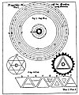  
Click to enlarge](img/14500.jpg)  
TABLE I, Figures 1-11.  

[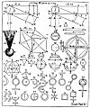  
Click to enlarge](img/14501.jpg)  
TABLE II, Figures 12-51.  

 

p. 146

imaginable. Figure 20 represents the outpouring of the upper and
spiritual life into manifestation. Figure 21 represents darkness, for it
is the loosening of the subterrene destructive principle. Figure 20 is
also the symbol of day, and Figure 21 of night.

Figure 22 is a symbol of water; Figure 23 is the complete universal
character of light and darkness. The upright triangle represents
Schamayim; the inverted triangle the dark earth which imprisons the
infernal subterranean fire. It is "The First Day of Creation," or the
time of the separation of Schamayim and Ares. Figure 24 represents the
six days of creation and proves that the elements are an outflow of the
Divine Fire which, breaking up, becomes the substances of the tangible
universe, as signified in Figure 25.

Figure 26 is the character of the air, showing that air is born out of
the Eternal Light and the ethereal water. Figure 27 is the character of
water. It is the inversion of Figure 26, indicating that its origin is
from the lower fire and not the higher. Its upper part signifies that
water does not lack the Divine element, but as a universal mirror
reflects the heavenly influences. Figures 28 and 29 are symbols of salt,
showing that it is both fire and water in one. Figure 30 is the
character of fire in all its attributes, and Figure M (the same
inverted), water in all its powers. Figure 32 is the character of salt
in all its attributes. Figure 33 represents both gold and the sun. Their
essential natures are identical, being formed from the first fire out of
Schamayim. They are perfect, as can be seen from their symbol, for no
more perfect form can be produced out of the dot than the circle.

Figure 34 is the character of the greater and lesser worlds; as the dot
is surrounded by its circumference, this world is surrounded by
Schamayim. Man (the Little World) is included in this symbol because his
inner nature is potential gold (Aphar Min Haadamah), which gold is his
eternal indestructible spiritual body. Gold is the masculine principle
of the universe.

Figure 35 is the character of silver and the moon. It signifies that
silver (like gold) is a perfect metal, except that the red part of its
nature is turned inward. Silver is the feminine principle of the
universe.

Figure 36 is the character of copper and Venus; Figure 37, of iron and
Mars; Figure 38, of tin and Jupiter; Figure 39, of lead and Saturn;
Figure 40, of Mercury (both the planet and the element); Figure 41, of
antimony, the key metal of the earth itself; Figure 42, of arsenic;
Figure 43, of sulphur; Figure 44, of cinnabar; Figure 45, of quicklime;
Figure 46, of nitre; and Figure 47, of vitriol. Figure 48 is the
character of sal ammoniac, which element derives its name from the
Temple of Jupiter Ammon in an Egyptian desert, where it was found.
Figure 49 is the character of alum; Figure 50, of alkali, a name of
Arabian origin; and Figure 51, of sal tartar, a substance possessing
great occult virtue.

*TABLE Ill, Figure 52*. The eight globes and the central square
represent the seven days of creation. The three worlds wherein creation
occurs are symbolized by three concentric rings. The German words in the
outer ring are extracts from the first chapter of Genesis. The words
around the outside of the outer ring are *The First Day*. The four small
globes inside the outer ring deal with the abstract phases of creation.
The upper globe containing the triangle encloses the words Heaven and
Earth. The globe to the right contains the word Light, and the one to
the left, Jehovah Elohim in the upper part and Darkness in the lower
part. The globe at the bottom contains the word Day in the upper half
and Night in the lower.

The four globes within the second ring depict the second, third, fourth,
and fifth days of creation. The white globe above divided by a dotted
line is designated *The Second Day*; the globe to the left with the
mountains, *The Third Day*; the globe to the right with the planetary
rings, *The Fourth Day*; and the globe below bisected by a dotted line,
*The Fifth Day*. The square in the central ring containing the human
form is marked *The Sixth Day*. This chart is a diagrammatic exposition
of the three layers of the macrocosmic and microcosmic auric eggs,
showing the forces active within them.

*TABLE IV, Figure. 53*. Figure 53 has been designated the symbolic tomb
of Christian Rosencreutz. The upper circle is the first world--the
Divine Sphere of God. The triangle in the center is the throne of God.
The small circles at the points of the star symbolize the seven great
Spirits before the throne, mentioned in the Book of Revelation, in the
midst of which walks the Alpha and Omega--the Son of God. The central
triangle contains three flames--the Divine Trinity. From the lowest of
these flames proceeds the first divine outflow, shown by two parallel
lines descending through the throne of Saturn (the Spirit *Orifelis*,
through whom God manifested Himself). Passing through the boundary of
the celestial universe and the 22 spheres of the lower system, the lines
end at point *B*, the throne of Lucifer, in whom the divine outpouring
is concentrated and reflected. From him the divine light irradiates in
succession to *d* (Capricorn), *e* (Gemini), *f* (Libra), *g* (Taurus),
*h* (Pisces), *i* (Aquarius), *k* (Cancer), *l* (Virgo), *m* (Aries),
*n* (Leo), *o* (Scorpio), *p* (Sagittarius), thence back to *d*. The
zodiacal circles represent twelve orders of great and beneficent
Spirits, and the smaller circles within the ring of fixed stars mark the
orbits of the sacred planets.

*TABLE V, Figure 54*. Figure 54 is similar to Figure 53, but represents
the universe at the time God manifested Himself through the character of
Jupiter, the Spirit *Sachasiel*. Von Welling gives no reason for the
change in the order of influx into the twelve orders of spirits, for the
third world, for the adding of another circle and the interlaced
triangles in the upper world, or for the letters Y and Z. In the upper
triangle,

 

[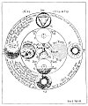  
Click to enlarge](img/14600.jpg)  
Table III, Figure 52  

[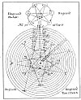  
Click to enlarge](img/14601.jpg)  
Table IV, Figure 53  

[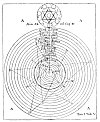  
Click to enlarge](img/14602.jpg)  
Table V, Figure 54  

[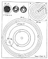  
Click to enlarge](img/14603.jpg)  
Table VII, Figures 1-5, 7 and 8  

 

p. 147

\[paragraph continues\] *A* represents the Father Principle, *F* the
divine outflow, *G* the point of influx into the twelve orders of
spirits (probably Sagittarius). The letters *H*, *I*, *J*, *K*, *L*,
*M*, *N*, *O*, *P*, *Q*, *S*, and *T* denote the sequential points of
irradiations to each other; *W* and *X*, the World of the Sons of God;
and *B*, *C*, *D*, and *E*, the World of Lucifer. This plate shows the
universe after the descent of Lucifer into matter. According to von
Welling, when Lucifer wanted to control power, the influx of the divine
light instantly ceased. Lucifer's world (which later became the solar
system), with all its legions of spirits (who in their essence were
Schamayim) reflecting his ideas and inverting the divine light, was
turned into darkness. Lucifer's Schamayim thereupon became a contracted
disc, a tangible substance; and Chaos came into existence.

*TABLE VI, Figures 55-59*. Figure 55 symbolizes the Chaos of Lucifer;
Figure 56, the separation of light from darkness; Figure 57, the light
in the midst of the darkness; and Figure 58, the regions of the elements
and their inhabitants. The four *A*'s signify the Abyss surrounding all
things. The *A* *B* is the fiery throne of Lucifer. The plane of *g* is
the subterranean air; *f*, the subterranean water; *c*, the earth
region; *d*, the outer water; *e*, the outer air, *W* and *X* the region
of Schamayim. The elemental inhabitants of the planes differ in goodness
according to their proximity to the center of wickedness (*A* *B*). The
earth's surface (*c*) divides the subterranean elementals from those of
the outer water, air, and fire (*d*, *c*, and *X*). The elementals of
the upper strata (the upper half of *c*, and all of *d*, *e*, and *X*)
represent an ascending scale of virtue, while those of the lower strata
(the lower half of *c*, and all of *f*, *g*, and *A* *B*) represent a
descending scale of depravity.

The region of air (*e*) is a partial exception to this order. While air
is close to the light and filled with beautiful spirits, it is also the
habitation of Beelzebub, the Evil Spirit of the air, with his legion of
elemental demons. Upon the subtle element of air are impressed the
influences of the stars; the thoughts, words, and deeds of man; and a
myriad of mysterious influences from the various planes of Nature. Man
inhales these impressions, and they produce diverse effects upon his
mind. In air are suspended also the seed germs by which water is
impregnated and made capable of bringing forth forms of organic and
inorganic life. The grotesque figures seen in crystal caves and frost
pictures upon windows are caused by these aerial impressions. While the
air elementals are great and wise, they are treacherous and confused
because amenable to both good and evil impressions. The mighty elemental
beings who inhabit the watery light fire of the region *X* cannot be
deceived by the spirits of darkness. They love the creatures of the
waters, for the watery element (*d*) proceeded from the fiery water
(*X*). Mortal man cannot endure the society of these fiery spirits, but
gains wisdom from them through the creatures of the waters in which they
continually mirror themselves. Figure 59 represents this solar system,
with *W* and *X* as the locality of the Garden of Eden.

*TABLE VII, Figures 1-5, 7, 8*. (Table VIII has Figure 6.) Figure 1 is
the triune divine sulphur, the All-Perfect out of the All-Perfect, the
Soul of creatures. The threefold Divine One is symbolized by three
interlaced circles designated alchemically *salt*, *sulphur*, and
*mercury*. In the central triangle is the divine name *Ehieh*. *Geist*
means spirit. The other words require no translation. Figure 2 is common
destructive sulphur. A bar placed in the triangle makes it the character
of earth. Figure 3 is true oil of vitriol, composed of a circle with two
diameters and two reversed half-circles hanging below. In this are
hidden the characters of all metals. Tin is symbolized by Figure 4 and
iron by Figure 5. Figure 7 is the solar system according to Copernicus.
Figure 8 is the last judgment. The sun is removed from the center of the
solar system and replaced by the earth. This changes the respective
positions of all the other planets except Mars, Jupiter, and Saturn,
which retain their respective circles. The letter *a* signifies the
circle of the sun; *b*, that of Mercury; *c*, that of Venus; *d*, (sic)
that of the moon; and *E*, that of the earth. Inward from the sphere h
are the great circles of damnation.

*TABLE VII., Figure 6*. In Figure 6 the letter *a* marks the center of
eternity. The motion of the rays toward *b*, *d*, and *c* was the first
divine manifestation and is symbolized by the equilateral triangle, *b*,
*d*, *c*. The eternal world within the inner circle became manifest in
the water (salt), the light (mercury), and the fire (sulphur) of the
archetypal world, represented by the three circles (*f*, *e*, *g*)
within the triangle of complete equality (*h*, *i*, *k*), which is in
turn surrounded by the circle of the high throne. The circle *f* is
named *understanding*; *e*, *wisdom*; *g*, *reason*. In circle *i* is
the word *Father*; in circle *h*, *Son*; in circle *k*, *Spirit*. The
seven outer circles are the seven spirits before the throne. The lower
part of the figure is similar to Figures 53 and 54. The outer circles
are the angelic world ending in the cognizable world of the Sons of God.
Then comes the circle of the visible constellations and fixed stars;
within this is the solar system with the sun as the center (*l*).
*Ungrund* means the Abyss.

*TABLE IX, Figure 9*. Figure 9 is a synthesis of the Old and New
Testaments and represents the interblending planes of being. In the
right margin the seven outer circles contain the names of the planetary
angels. The words in the graduated circles from the top triangle
downward read: (1) *Abyss of Compassion*; (2) *Zion*; (3) *The New
Heaven and the New Earth*; (4) *The New Jerusalem*; (5) *Paradise*; (6)
*The Bosom of Abraham*; (7) *The Outer Courts of the Lord*. From below
the circles of darkness reach upward, each divine principle being
opposed by an infernal opposite. The small circle on the left containing
a triangle and cross is named *The Tree of Life*, and that on the right
*The Tree of the Knowledge of Good and Evil*. In the center of the
diagram is the Trinity, joined with the superior and inferior planes by
lines of activity.

*TABLE X, Figures 10-15*. Figure 10 shows the New Jerusalem in form of a
cube, with the names of the twelve tribes of Israel written on the
twelve lines of the cube. In the center is the eye of God. The words
round the outer circle are from the Book of Revelation. Figures 11, 12,
13, 14, and 15 possibly are cipher symbols of the angels of the plagues,
the name of the Antichrist, the signature of the beast of Babylon, and
the name of the woman riding on the beast of blasphemy.

 

[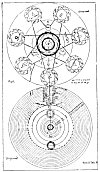  
Click to enlarge](img/14700.jpg)  
Table VIII, Figure 6.  

[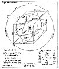  
Click to enlarge](img/14701.jpg)  
Table X, Figures 10-15.  

[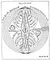  
Click to enlarge](img/14702.jpg)  
Table IX, Figure 9.  

[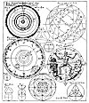  
Click to enlarge](img/14703.jpg)  
Table XI, Figures 1-11  

 

p. 148

*TABLE XI, Figures 1.-11*. Figure 1 is the solar system according to
Genesis. The *o* on top of the radius of the circle is the dot of
Eternity--the Beginning of Beginnings. The whole diameter is the outflow
of God, manifesting first in the heaven of heavens--the Schamayim, in
which region human understanding cannot function. The space from *k* to
*i* contains the heavens of Saturn, Jupiter, and Mars; *l* to *m*, the
heavens of Venus and Mercury; *m* to *h*, the heavens of the sun. The
letter *e* is the moon, the circle of the earth.

Figure 2 is the globe of the earth, showing the houses and signs of the
zodiac. Figure 3 is the character of the Universal Mercury (Divine Life)
in its triune aspect of *mercury*, *sulphur*, and *salt*. Figure 4 is
true saltpetre purified with quicklime and alkali. Figure 5 shows the
exact degree or angle of the planets' places as well as the individual
fixed stars in the zodiac. The letter *a* is the sun and *b* is the
earth. From *k* to *i* are the circles of Mercury and Venus; *g* to *h*,
the circles of earth and moon; *f* to *e* and *e* to *c*, of Jupiter and
Saturn; *c* to *d*, the starry belt or zodiac. Figure 6 is the
Microcosm, with the planets and signs of the zodiac corresponding to the
different parts of its form. The words upon the figure read: *Know
thyself*. In words, herbs, and stones lies a great power. Figure 7 is
the universal character from which all characters have been taken.
Figures 8, 9, and 10 are left to the solution of the reader. Figure 11
is the radiating Universal Mercury.

*TABLE XII, Figures 12-19*. Figure 12 is called *A Mirror of
Astrological Aspects*. Below it is an astrologer's wheel. Figure 13 is
similar to Figure 12. Figure 14 is a secret alchemical formula. The
words around the circle read: Out of one in all is all. Figure 15 is an
unsatisfactory attempt to show the comparative sizes of the suns and
planets and their distances from each other. Figure 16 is the solar
system with its internal and spiritual heavens. *A* *B* is the solar
system; *C* is the sphere of fixed stars; *D*, *E*, *F*, *G* are the
systems of the spiritual worlds; *H* is the throne of the living God;
*J*, *K*, *L*, *M*, and *N* are the Great Beyond, unmeasurable.

Figure 17 shows the creation of the solar system out of the ring of the
Divine Eternity. The four *A*'s are the Abyss, *B* is the first
revelation of God out of the Abyss, and from this revelation *C*, *D*,
*E*, *F*, and *G* were created. *C* and *D* represent the spiritual
hierarchies; *D* and *E*, the upper worlds, or constellations; *E* and
*F*, the distance from Jupiter to the upper worlds; *F* and *G*, the
solar system with its planets and their heavens; *B* and *C* the throne
of Christ.

Figure 18 describes the division according to Genesis of the waters
above the heavens (*D*) from the waters below (*A*, *B*, and *C*).
Figure 19 is the mercury of the philosophers, essential to material
existence.

*TABLE XIII, Figures 1-4*. Figure 1 is *Ain Soph*, the Incomprehensible
Abyss of Divine Majesty, an endless welling up, limitless in time and
space. Figure 2 symbolizes the three Divine Principles--Father, Son, and
Holy Ghost. Around the triangle is written: *I Shall Be That I Shall
Be*. At the apex of the triangle is the word *Crown*; in the left point,
*Wisdom*; in the right point, *Understanding*. Figure 3 represents the
Trinity with its outflow. The words above the upper sphere are
*Revelation of the Divine Majesty in Jehovah Elohim*. The lower circles
contain the names of the Hierarchies controlling the lower worlds. The
words within the circle of stars read: *Lucifer the Son of the Aurora of
the morning*. The letter *C* represents the Universal Mercury. The words
within the circle read: *The first beginning of all creatures*. Figure 4
represents the abode of Lucifer and his angels, the Chaos spoken of in
Genesis.

*TABLE XIV, Figures 5, 7, 8*. Figure 5 shows the triangle of triune
Divinity in the midst of a cross. At the left is a small triangle
containing the words *The Secrets of Elohim*, and at the right is
another inscribed *The Secrets of Nature*. On the horizontal arms of the
cross are the words *The Tree of Life* and *The Tree of the Knowledge of
Good and Evil*. The plate explains the interblending of the spiritual
and infernal powers in the creation of the universe. Figure 7 is called
*The Road to Paradise*. It probably indicates the positions of the sun,
moon, and planets at the moment of their genesis. Figure 8 is the earth
before the flood, when it was watered by a mist or vapor. The words at
the left are *The Tree of Life*; those at the right, The Tree of the
Knowledge of good and Evil. The diagram with the symbol of Mars is
devoted to a consideration of the rainbow.

*TABLE XV, Figures 6, 9, 10*. Figure 6 is similar to Figure 5 and is
called *The Secret of Nature*. An interesting diagram is shown on either
side of the central figure, each consisting of a triangle with circles
radiating from its points. The diagram on the left is called *The
Secrets of the Upper World*, and the one on right *The Secrets of the
Underworld*.

Figure 9 is the solar system. Around the central part are the words *The
Place of the Damned*. Figure 10 shows the dot, or point of rest,
surrounded by a triangle enclosing a circle containing the names of the
twelve tribes of Israel. It represents completion of the process of
regeneration and the consummation of the Great Work.

 

[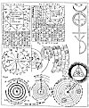  
Click to enlarge](img/14800.jpg)  
Table XII, Figures 12-19  

[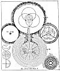  
Click to enlarge](img/14801.jpg)  
Table XIII, Figures 1-4  

[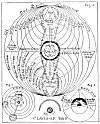  
Click to enlarge](img/14802.jpg)  
Table XIV, Figures 5, 7, and 8  

[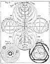  
Click to enlarge](img/14803.jpg)  
Table XV, Figures 6, 9, and 10  

 

------------------------------------------------------------------------

[Next: Alchemy and Its Exponents](sta36)
