  
[Intangible Textual Heritage](../../index)  [Esoteric](../index) 
[Index](index)  [Previous](sta38)  [Next](sta40) 

------------------------------------------------------------------------

p. A1

# THE HERMETIC AND ALCHEMICAL FIGURES OF CLAUDIUS DE DOMINICO CELENTANO VALLIS NOVI FROM A MANUSCRIPT WRITTEN AND ILLUMINATED AT NAPLES A.D. 1606

No better way can be found of introducing to the "Royal Art" a seeker
after the mysteries of symbolical philosophy than to place at his
disposal an actual example of alchemical writing. The text of this
manuscript is as enigmatic as are its diagrams; but to him who will
meditate upon the profound significance of both, the deeper issues of
mysticism in due time will be made clear. An unknown person through
whose hands this manuscript passed wrote thus of it:

"Because of its drawings and illustrated expositions, the manuscript is
of preeminent importance to the Rosicrucians and the contemporary order
of Freemasons. The first, and larger, part of the illustrations deals
with the Hermetic philosophy, explaining its teachings and doctrines.
Interspersed among these are portraits of great teachers and satirical
representations of bunglers and their mistaken views. The systematically
arranged part shows with wonderful clearness the color development of
the alchemical processes from blue-gold over black to white and rose.
*Throughout it treats of the change in human beings and not of the
making of gold*. Ever upon the Grade of Black (the return into Chaos
from which new creations are possible) follows the Grade of the
Neophytes, the New Birth, which is often repeated with impressive
lucidity. The black stage occurs as usual through fire. This unopened
and unpublished manuscript belongs to the order of the most important
Precepts and Documents of the Rosicrucians, and Freemasons. A search
through the museums and library collections of Germany has failed to
reveal any item of even a similar character."

In addition to the 26 leaves here reproduced there are ten bottles or
retorts, each half filled with varicolored substances. These bottles can
be so easily described that it is unnecessary to reproduce them. The
first bottle (from the mouth of which issues a golden shrub with three
blossoms) contains a bluish-gray liquid, the entire figure being called
"Our Quicksilver." Under the vessel is a verse containing the
significant words: "He will have white garments for black and then red."
The second bottle (from the neck of which rise four golden flowers) also
contains the bluish-gray substance termed quicksilver. Below the bottle
is the admonition to "make spirit of the body and grace of the gross,
that the corporeal may become incorporeal."

The third bottle is entirely black save for a golden tree trunk having
six lopped-off branches and terminating in five branches which end in
knobs and protrude from the neck of the bottle. The state of the
substance is termed "Blackness showing through the Head of the Raven."
Under the bottle occurs the statement that "the tincture of the
Philosophers is hidden in the air like the soul in the human body." The
fourth bottle is of the deepest blackness and is called "The Head of the
Raven." Nothing rises from the neck of the vessel, for the earth (its
contents) is described as "submerged in Chaos." The bottom of the fifth
bottle contains a bluish-gray, spotted liquid, the upper part being
filled with a brick-colored substance. Above are the words: "Sixth
Raven's Head"; below is added: "At the bottom of the vessel worms are
born."

The lower half of the sixth bottle is of a bluish-gray, the u per half
black, the entire figure being termed "Seventh Raven's Head." A child is
seated beside the bottle, concerning whom it is written: "This
newly-born, black son is called Elixir and will be made perfectly
white." The seventh bottle is black below and black spotted with red
above. The process is thus described: "Black blacker than black, for
many divers colors will appear. Those black clouds will \[descend\] to
the body whence they came, and the junction of body, soul, and spirit
has been completed and turned to ashes."

The eighth bottle is divided horizontally by a golden band, from which
rises a golden stem ending in five leaves protruding from the neck of
the bottle. The contents of the vessel are transparent, and it is
written that "the black clouds are past and the great whiteness has been
completed." The ninth bottle (from the neck of which rises a golden
white rose) is also partly filled with a transparent liquid. The rose is
made to say: "He who blanches me makes me red." The tenth and last
bottle represents the consummation of the Great Work. The lower half of
the vessel is filled with the blood-red Elixir and from the neck rises a
red rose with many petals and of extreme beauty. After declaring all the
planets to have been present at the consummation of the Great Work, the
author of the document concludes: "I gave to the Master \[spirit\] so
much silver and gold that be can never be poor."

In his dedication the author and illustrator of the manuscript declares
that he has set forth all the operations of the Great Work. He prays to
the Holy Spirit that he may be included in the number of those who have
pursued this most noble of the sciences and that he may be set always in
the path of righteousness. Exclusive of his own researches, the main
sources of his information are said to be the writings of St. Thomas
Aquinas, Raymond Lully, and Arnold of Villa Nova.

To protect themselves from the persecution of despotic theology the
mediæval alchemists couched their philosophy in Christian terminology,
although the great secrets of the Art were derived largely from Egyptian
or Arabian adepts. The Mohammedans were masters of the Hermetic secrets
and even the great Paracelsus secured from them the major part of his
knowledge. In their manifestoes the Rosicrucians also disclose the
Arabian source of their secret doctrine. Hence it should be borne in
mind that the relating of the alchemical teachings to Biblical symbolism
was a gesture of expediency. In their search of the Scriptures for the
arcana of Israel, the Qabbalists substantiated in great measure the
alchemical interpretations of the Bible, for the soul of alchemy is one
with that of Qabbalism. Both schools have a common end, being who
concerned with the mystery of human regeneration, despite apparent
discrepancies in their symbolism.

The publication of this manuscript places at the student's disposal the
most profound secrets of the Hermetic Art. At first the task of
decipherment may seem hopeless and the superficially-minded will be
tempted to scoff at the possibility of real knowledge being perpetuated
in such unconventional fashion. The scoffer will not realize that one of
the purposes of the document is to awaken ridicule and thus preserve
more effectually its arcana from the profane. A few sheets (such as
those here reproduced) represent the life work of one who has
consecrated himself to the task of tearing aside the veil of the World
Virgin. Years of research and experimentation, days of incessant labor,
nights of prayer and meditation, and at last comes the realization of
accomplishment! This is the real story told by the grotesque figures
drawn so painstakingly upon the faded, worm-eaten pages. Those who have
glimpsed the greater realities of being realize that the fundamental
verities of life find at best only imperfect expression through physical
symbols. Only those who have passed through the travail of spiritual
birth can adequately comprehend and properly reverence the pathetic
efforts to portray for others that knowledge necessarily locked within
the heart of the one who knows.

[  
Click to enlarge](img/leaf01.jpg)

*Leaf 1*. The top line reads: "Our earliest medicine was made of natural
objects." About the king and queen appears the statement that to them a
son shall be born "in two trees of the vine," resembling his father and
without equal in all the world. About the vase is written: "Green and
white." "The vase flame color, the flowers green." "Our water, our
silver." The lines below read: "The material of the Philosopher's Stone
is that thick, viscous water, which either heat or cold congeals. It is
Mercury boiled down and thickened, cooked in neutral earth with
sulphurous heat and is called the Prime Material of the metals. In
caverns yet dark, and forbidding mountains, if a Stone be found which a
thousand years ago Nature made out of her fruits, it will bring him that
has it out of trouble. \* \* \* Listen carefully to all my verses; I
speak them without veil and without deception.

[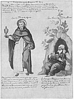  
Click to enlarge](img/leaf02.jpg)

*Leaf 2*. At the top is a quotation from St. Thomas Aquinas concerning
the composition of the Philosopher's Stone, which is described as of the
purest transparency; in it all the forms of the elements and their
contrarieties were visible. Beneath the figure of St. Thomas Aquinas is
a short paragraph praising the excellence of the Philosophic Stone,
declaring that from the one substance can be derived three and from the
three, two. To the right of St. Thomas Aquinas is a likeness of Raymond
Lully seated in the door of his hermitage. Under his feet appears a
quotation from this celebrated alchemist, beginning with the question,
"What is the Philosopher's Stone?" After declaring it to be a reddish,
fixed mercury, Lully swears to the Almighty that he has told the truth
and that it is not permissible to say more. (The original manuscript is
mutilated at this point.)

p. A2

[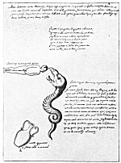  
Click to enlarge](img/leaf03.jpg)

*Leaf 3*. The writing at the top of the page reads: "Death of Saturn;
life of Mercury." After describing the use of the saturnine substances,
the key to the process is declared to be depicted below. The verse reads
"This \[the stone\] is made of four elements. This is the truth in all
Nature. Take it in hand, bright and shining, with all diligence and
great care and then try to bind all securely together side by side, so
the fire may cause alarm." Above the human figure is written: "Saturn is
almost dead." To the right if the devouring serpent is a statement of
Albertus Magnus that Saturn and Mercury are the first principles of the
Stone. It also declares that Nature wisely provided a mixture of
elements so that earth can communicate its dryness to fire, fire its
heat to air, air its moisture to water, and water its coldness to earth.
(Text about the vase is illegible in original.)

[  
Click to enlarge](img/leaf04.jpg)

*Leaf 4*. At the top: "Let them believe that . everything is possible.
The art is fleeting, bright and rare, and not believed by the foolish."
The words between the sun and crescent read "It is hidden," and on the
panel across the body "The Book of life and true Treasury of the World."
The panel to the left of the figure says "Moving almost all, and the
soul of its body returns to the place from which it had fled, and ripens
seven months or nine, and the King crowned with his diadem appears." The
right panel states: "There are three Mercuries: animal, vegetable, and
mineral." The text below is of such a cryptic nature that to translate
it is well nigh impossible. It declares that by putting fire beneath the
feet of the symbolic figure it is possible to extract therefrom the sun
and the moon which the human body is shown elevating to a position of
dignity above its head.

[  
Click to enlarge](img/leaf05.jpg)

*Leaf 5*. In the upper panel it is declared that the sun-bird battles
with the earth-serpent, who, tearing out his own entrails, gives them to
the bird. The spirit is vivified and Lazarus with joy is raised from the
dead. Above the bird is written: "This is the sun in the form of a
bird," and above the dragon "This is the dragon devouring the bird. The
first operation." The panel of text at the lower left reads in
substance: "When our sperm (quicksilver) is mixed with the mother of
elements (earth), the action is called *coitus*. The detention by the
earth of a bit of quicksilver is called *conception*. The earth grows
and multiplies and the operation is called *impregnation*. When earth is
whitened with water and made of uniform color and appearance, it is
called *birth* and the King is born out of fire." The text at lower
right was deliberately mutilated to conceal a too evident secret.

[  
Click to enlarge](img/leaf06.jpg)

*Leaf 6*. This plate shows all the secrets of the great Stone. In the
center stands the Paschal Virgin, in her hair the prime virtue which is
described as an herb flourishing in wells. The hands hold the symbols of
the spiritual and material elements. The statement at the upper left is
to the effect that there are four spirits with two faces, which are
called the elements. At the upper right it is written that fire lives on
air, air on water, water on earth, and thus the Stone lives Peacefully
on all the pure elements. Under the sun appears the word *Summer*; under
the moon, *Autumn*. About the tree on the left with its attendant eyes
are the words: "Turn away your eyes to \[from?\] the fire. There is
space \[?\]." About the tree to the right. "Open your eyes to the fire.
There is time." The lower panel opens with this sentence "I am exalted
above the circles of world."

p. A3

[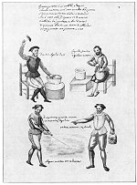  
Click to enlarge](img/leaf07.jpg)

*Leaf 7*. The verse at the top reads:," This Stone is so noble and
worthy that Nature has hidden it in her recesses. Its soul is all fair,
and pure, for it is the true sun. I inform you of this. Keep it removed,
apart and separated. Whatever boon you crave, it will come to you
bounteously. without sin, with pleasure and delight." The seated figure
on the left holding aloft the hammer is described as breaking hard
stone, while the words beside the man with the retort read: "Breaking of
stone our replenishment." Between the standing figures below is the
exclamation; "O Sages, seek and ye shall find my Stone!" Under the
outstretched hand of the man with a basket appear the words: "Draw out
*sorerem* \[?\] in the bottom." Below the pool which the man on the left
is stirring appears the simple statement: "Our healing water." The faces
of the four men are extremely well drawn.

[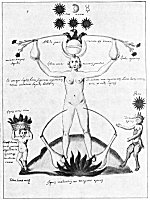  
Click to enlarge](img/leaf08.jpg)

*Leaf 8*. Under the sun, moon, and Mercury are the words *Three and
One*, an inference that the three are one. The words under the flower
stems read: "Whiteness forty days after ashes." Under the blossoms is
written: (left) "Minor time of the Stone"; (right) "The selected red."
Between the arms of the central figure appears: "Let one pound of
Mercury be placed." To the left is written: "If you who read shall have
known this figure, you will possess the whole science of the Stone"; to
the right: "And if you do not acknowledge it, you will be stiff-necked
and dull." Above the sun is the word *Father*; above the satyr, "Ferment
of the work." Beside the child is the sentence: "The son of the moon
would threw the Stone into the fire--his mother." Above the flaming
basket is written: "I am the true Stone." Under the central figure are
the words: "A moderate fire is the master of the work."

[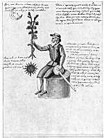  
Click to enlarge](img/leaf09.jpg)

*Leaf 9*. In the upper left it is written that without the light of the
Moon the Sun does not heat the earth and that into the Moon the Sun
emits its fruits. In the upper right the true herb of the philosophers
is described, and it is declared that whoever believes in and it shall
be \[spiritually\] rich. The panel concludes thus: "Understand
thoroughly what it is that the man has in either hand if you wish to be
enlightened." The text to the left above the sun reads: "Entirely
without the Sun and Moon, make dye; dissolve, congeal, and like produces
for itself like." The words to the right of the man holding the
Philosopher's herb declare sublimation to be the beginning, the middle
and the end of the Great Work. The last sentence reads: "Out of the Sun
and Moon make a thing of equal parts, and by their union, God willing,
let the Philosopher's Stone be made."

[  
Click to enlarge](img/leaf10.jpg)

*Leaf 10*. The two short lines of text at upper left read: "Some take a
recent stone." The lines to the right of the symbol of Mars (iron)
admonish the student to control his appetites and apply his mind to the
accumulation of knowledge. No satisfactory translation can be found for
the words under the outstretched arm of the man holding the upper part
of the tree. The lower panel reads thus: "After the Stone has been well
refined it will appear to penetrate thoroughly. It should be put into
its vessel with its water. Close it well with a little fire, and await
the wonders of Nature." The large red oval filling the lower half of the
leaf is evidently the egg or vessel of the Sages. The tree is a symbol
of the growth of the sacred metals, for the alchemists affirmed that the
metals are like plants and grow in the rocks, spreading their branches
(veins) through the interstices.

p. A4

[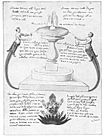  
Click to enlarge](img/leaf11.jpg)

*Leaf 11*. The fount is described as that from which the two Mercuries
of the Philosophers are extracted. At the upper left is described the
white Mercury and at the right the red Mercury. The text about the
fountain declares that Saturn collects the white Mercury, which is
called the Water of Earth; and the Earth collects the red Mercury, which
is called the Water of Heaven. The text to the left of the frog reads:
"Through Him who created the Heavens and the Earth I am the
Philosopher's Stone, and in my body I carry something the wise seek. If
such a charm be extracted from me, it will be a sweet refreshment for
you. I am an animal having father and mother, and father and mother were
created; and in my body are contained the four elements, and I am before
father and mother and I am a poisonous animal." The lines at the right
describe distilling and calcining processes.

[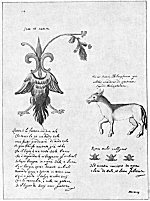  
Click to enlarge](img/leaf12.jpg)

*Leaf 12*. The three words at the top read: "This is Nature." The lines
above the donkey read: "This is the Philosophers' donkey who wished to
rise to the practice of the Philosopher's Some." The three lines below
the animal are translated: "Frogs gather in multitudes but science
consists of clear water made from the Sun and Moon." The text under the
symbolic bird is as follows: "This is fortune with two wings. Whosoever
has it knows that fruit will in such away be produced. A great
philosopher has shown that the stone is a certain white sun, to see
which needs a telescope. To dissolve it in water requires the Sun and
Moon, and here one must open 200 telescopes, putting body and soul in
one mass. And here is lost the mass; other sages cook the frogs and add
nothing, if the juice of the Wise you wish to enjoy." To the Greeks the
frog symbolized both metempsychosis and earthly humidity.

[  
Click to enlarge](img/leaf13.jpg)

*Leaf 13*. This Page contains but two figures. At the left stands
Morienus, the philosopher, pointing towards the salamander who "lives
and grows in fire." Morienus, who was born in the twelfth century,
became the disciple of the great Arabian alchemist Adfar, from whom he
learned the Hermetic arts. Morienus prepared the Philosophical Elixir
for the Sultan of Egypt, inscribing upon the vase in which he placed the
precious substance the words: "He who possesses all has no need of
others." He spent many years as a hermit near Jerusalem. The lines below
the salamander are: "Let the fire be of a perfect red color; the earth
white, the water clear. Then compound them by philosophical means and
calcine them as many times with the water which the body had as to turn
it white by its kindness. Having done this, you will have the greatest
treasure in the world."

[  
Click to enlarge](img/leaf14.jpg)

*Leaf 14*. The three words at the top of the left page are translated:
"The man that digs." Above the birds it is declared that none but the
cocks of Hermes, the two Mercuries, shall put hand to the plow, and only
after irrigation will the earth bring forth her fruits. The seated man
is Count Bernard of Treviso, who says: "Work the earth with Mercury."
(See chapter on *Alchemy and Its Exponents*.) The three sentences to the
Count's left read: "Go to the fire and with Mercury, thy brother, await
me for a month. Crumble the stone I gave thee and I shall go to the
fire. Thy death, my life. I shall net die but, living, tell of the works
of this, my master." Bernard of Treviso in his alchemical speculation
emphasized the necessity of meditation upon the philosophical writings
of the great adepts rather than chemical experimentation. He ultimately
discovered the "Stone."

p. A5

[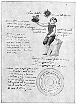  
Click to enlarge](img/leaf15.jpg)

*Leaf 15*. The first sentence reads: "The fruit of plants by virtue of
the Sun, our Stone." The boy holding the dish is made to say: "Drink
here all ye that are athirst. Come unto me, run to the waters. Here
drink, without price, and drink your fill. Open your eyes and see the
wonders of the earth. They learn, my thirsty twenty and four." Beneath
the boy are the words: "In the beginning God created the Heavens and the
Earth, and divided the waters from the waters. Bless the waters which
are above the Heavens." The circle contains this statement: "The earth
without form and void. Out of the stars come the rains." The lower left
panel continues the alchemical process, ending with admonition to
renounce the misery of worldly existence. Above is a prayer to the
Virgin Mary which opens thus: "Hail Mary, full of grace, the Lord be
with thee. Blessed thou among women."

[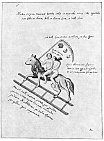  
Click to enlarge](img/leaf16.jpg)

*Leaf 16*. The first sentence reads: "The dead bodies remain; the
spirits are freed by the death in the bodies. You will ride with that
death with a scythe, and the light of the Sun, the Moon, and the fixed
stars." Over the scythe is written: "Subject to the Sun, the Moon and
Azoth, complete the Work." The four words in the curve of the scythe
blade say: "Man's head, head of raven." The three lines to the right are
interpreted thus: "This figure is called Laton, for it looks black in a
vessel, and is the beginning of corruption." The text below the ladder
states: "This is the ladder of primitive matter which when placed in a
vessel turns black, the gradually changes to white by the scale
\[ladder\] of digestion, according to the degree of heat." Here a ladder
is used to signify the natural steps up which matter must ascend before
it can attain to a truly spiritual state.

[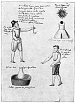  
Click to enlarge](img/leaf17.jpg)

*Leaf 17*. The verse at the top of the page reads: "Not only must this
material be fixed, but it must be allowed to enter into everything so
that this material may be well completed and have infinite virtue. Then
by making it thick, it becomes at once all white, sublimation from white
it becomes shining." Above the sun are the words: "God and Nature do
nothing in vain." The man on the left is a mediæval conception of
Hermes, the great Egyptian philosopher; the one on the right is
Christopher, the philosopher of Paris. Above the latter is written: "If
the Stone is black, it is not useless." The words over the retort are:
"There is air, fire, water, and earth." Below is added: "A dissolution
of the body is the first step. " The curious chemical apparatus must be
considered purely symbolic in this work and, as its author himself says,
is intended to give only a hint of the "Art."

[  
Click to enlarge](img/leaf18.jpg)

*Leaf 18*. At the left holding a book stands Aristotle, who is described
as the most learned of all the Greeks. The tree surmounted by the Sun
and Mon. is accompanied by the wards: "When the Stone is dead, that is
changed to water, in this it will produce flowers." Beneath Aristotle
and the prostrate human figure from which rises the flowering tree are
these statements: "He who makes everything descend from heaven to earth,
and then ascend from earth to heaven, has information about the Stone.
For in Mercury there is something the wise seek, not invoked except by
white or red ferment." The first part of this quotation is based upon
the Emerald Tablet of Hermes (which see). In ordinary man, the spirit is
figuratively absorbed by the body; but in the true philosopher, the
spirit is so greatly increased in power that it absorbs into itself and
is nourished by man's corporeal body.

p. A6

[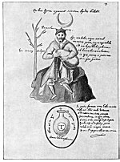  
Click to enlarge](img/leaf19.jpg)

*Leaf 19*. At the top it reads: "He that comes to know this figure will
have knowledge of the Stone." The seated man probably represents
Paracelsus. To his right are the words: "I am neither tree nor animal,
nor stone nor vegetable, but the Philosopher's Stone, trampled on by
men, cast into the fire by my father, and in fire I rejoice." The four
words to the left say "In dryness is the Stone." Below the man is the
Philosophic Egg containing the words: "It is the end in which the
beginning rests." The capital T stands for "Tincture." The text to the
right states: "In Stone it is formed, as Gerber writes in his book very
learnedly, and possessing so much of its nature that it changes into
clear, living water; and it has the power to make folks rich, satisfied,
and free from all cares, so they will be always happy if they attain by
their wit to the secret."

[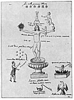  
Click to enlarge](img/leaf20.jpg)

*Leaf 20*. At the top is written: "Rains are made by six stars." Under
the inverted man it reads: "Receive new spirit. Arise, for you are
asleep." The two sentences about the large figure read: "Remember
Mercury, for ashes thou art and unto ashes thou shalt return. I thirst
and am dead." Above the seven globes at the left is the admonition: "If
he thirst, give him a drink and he shall live." Over the small man is
written: "Hermes, the father of philosophers." The curved line of
writing to which Hermes points says: "The measure of the drink." Under
the central pedestal appears: "The light of my eyes is a lantern to my
feet." Below is added: "If the beginning is unknown, the rest is
unknown." Above the figure rising from the flames on the right is the
statement: "He was resurrected after new Moon," and under the eagle:
"Thou shalt not fly further with me."

[  
Click to enlarge](img/leaf21.jpg)

*Leaf 21*. The upper line reads: "Two things and double, but finally one
is dissolved into the first and they make sperm." The four capitals. *I
A A T*, are the initial letters of the names of the elements: *Ignis*,
*Aer*, *Aqua*, and *Terra*. The writing under them reads: "Our fire is
water; if you can give fire to fire, fire and Mercury will suffice."
Along the arm appear the words: "The Art of the Stone is," and on the
ribbon: "Swift, brief, bright, and rare." The two lines under the ribbon
read: "Every hand is a key, because it was called the herb celandine";
under the Sun: "I am the gift of God " The verse reads: "So that you
remain contented in all matters, I must listen attentively. My body
\[is\] naked, clean, and shining, and I run like oil ready to drop,
resplendent like bright gold, and then succumb to the plague in its
bright and cheerful little chamber \[retort\]."

[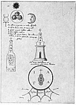  
Click to enlarge](img/leaf22.jpg)

*Leaf 22*. The verse in the upper left is as follows: "This group is
composed of three stones: lunar, solar, and mercurial. In the lunar is
white sulphur; in the solar, red sulphur, in the mercurial, both; i.e.
white and red, and this is the strength of all instruction." In the
bottle at the left are the words: "Dissolving, calcination, sublimation
complete the instruction"; and at the base: "Wash, congeal, and
coagulate. " Under the central tower is written: "Metallic salts,
however, are hidden by one letter"; around the bottom of the red circle:
"Dryness, coldness, humidity, heat, and dryness." On the points below
are the names of the four elements. The initial, *I A A T* appear four
times with the same meaning as that already given. The three powers of
the Philosopher's Stone are symbolized by the heads of the cherubs in
the circle in the upper left corner.

p. A7

[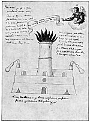  
Click to enlarge](img/leaf23.jpg)

*Leaf 23*. The writing at the upper left is, in substance, the Lord's
Prayer, with the addition of the words *Jesus and Mary* at the end. The
inverted words in the banner read: "Ye can do nothing without me, for
God has so promised, saying 'So be it.'" The text under the angel reads:
"By this plague he will be damned who knows he is dead, all cold in a
black body. And let this be thy first comfort: then he will burn unto
calcination. When I have reduced him within this door, know for certain
that I shall be blessed if I shall know how to cultivate the garden."
The main part of the leaf is devoted to an elaborate symbolic drawing of
alchemical equipment, under which are the words: "The furnace of
distillation, congealing, rectification, perfection, fixation:
quintessence of the Philosophers." By "quintessence" should be
understood the "fifth essence" of the most wise.

[  
Click to enlarge](img/leaf24.jpg)

*Leaf 24*. The words at the top read: "I, the bird \[*the adept*\],
speak into thine ears from the Sun, Moon and Azoth. The work is
perfected with little labor." The panel to the left describes the nature
of primordial matter and the drink of the Philosophers. The text to the
right reads: "This is my beloved Son whom I saw and loved. If he be
resurrected, He will remain at home, and in that house the spirit will
be the soul and the body; for Mercury may be called the son of the Sun
and the Moon." Under the child's figure is added: "If he were not dead,
I should not have been his mother. I bore him after death before he was
born in the world; under my feet I have what was his, and out of me and
my Son and the foundation of my feet the Philosopher's Stone is made."
At the lower left the three constituents of the Stone are shown elevated
upon a pedestal to signify their dignity.

[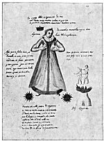  
Click to enlarge](img/leaf25.jpg)

*Leaf 25*. Above the figure of the Queen are three lines stating, in
substance, that in the beginning of the book it was written of her that
from her maternal breasts she nourished the Sun, and that he who was
capable of converting her into Primal matter possessed rare skill.
Opposite the Queen's head are the words: "In the highest mountains this
water" and "I am the light of the Philosophers." To the left of the
Queen is an admonition to strike the sons whom she bears. She calls
herself "The mother of the Sun, the sister of the Moon, and the servant
and spouse of Mercury." On the right she is made to exclaim: "I cannot
be crowned unless these sons of mine become ashes. " The sons are shown
directly below. The verse under the Queen continues the alchemical
processes, describing the method in which the exudations from the
substance should be preserved.

[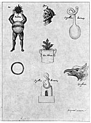  
Click to enlarge](img/leaf26.jpg)

*Leaf 26*. This page, which concludes that part of the Hermetic
manuscript bearing the symbols of the Secret Work, contains a number of
emblems not directly correlated. At the top is the head of the King--the
most common of alchemical figures. To the right of the King is an
alchemical vessel designated the *Hermetic Seal*. Below is the head of a
ferocious bird, here designated a griffon. To the left of the King is a
headless figure elevating a Sun, or spiritual face. This figure is the
world, which must be headless, since its spiritual and rational part is
not material and consequently, is invisible. Below is a circle
unaccompanied by descriptive matter. Directly under the King's head is a
vase of flowers, in which rises the golden plant of the Philosophers. At
the bottom of the page is additional alchemical equipment, this also
being termed a *Hermetic Seal*.

------------------------------------------------------------------------

[Next: The Chemical Marriage](sta40)
