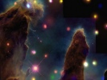

  
[Intangible Textual Heritage](../../index)  [Esoteric](../index) 
[Index](index)  [Previous](to12)  [Next](to14) 

------------------------------------------------------------------------

[Buy this Book at
Amazon.com](https://www.amazon.com/exec/obidos/ASIN/B00272NIFS/internetsacredte)

------------------------------------------------------------------------

  
*Tertium Organum*, by P.D. Ouspensky, \[1922\], at Intangible Textual
Heritage

------------------------------------------------------------------------

p. 112

# CHAPTER X

|                                                                                                                                                                                                                                                                                                                                                                                                                                                                                                                                                                                                                                                                                                 |
|-------------------------------------------------------------------------------------------------------------------------------------------------------------------------------------------------------------------------------------------------------------------------------------------------------------------------------------------------------------------------------------------------------------------------------------------------------------------------------------------------------------------------------------------------------------------------------------------------------------------------------------------------------------------------------------------------|
| The spatial understanding of time. The angles and curves of the fourth dimension in our life. Does motion exist in the world or not? Mechanical motion and "life." Biological phenomena as the manifestation of motions going on in the higher dimension. Evolution of the space-sense. The growth of the space-sense and the diminution of the time-sense. The transformation of the time-sense into the space-sense. The difficulties of our language and of our concepts. The necessity for seeking a method of spatial expression for temporal concepts. Science in relation to the fourth dimension. The solid of four dimensions. The four-dimensional sphere. |

NOW from the basis of those conclusions already made, let us seek to
define how we may discover the real four-dimensional world obscured from
us by the illusory three-dimensional world. "See" it we may by two
methods: either by sensing it directly, by developing the "space-sense"
and other higher faculties, which will be discussed later; or by
understanding it mentally by a perception of its possible properties
through the exercise of the reason.

By abstract reasoning, we have already come to the conclusion that the
fourth dimension of space *must* lie in time, i.e., that time is the
fourth dimension of space. We have already discovered psychological
proofs of this thesis. Comparing the receptivity of the world by living
beings of different grades of consciousness—snail, dog and man—we have
seen how different for them are the properties of one *and the same
world*; namely, those properties which are expressed for us in the
concepts of time and space. We have seen that time and space are sensed
by each in a different manner: that what for the lower being (the snail)
is *time*, for the being standing one degree higher (the dog) becomes
*space*, and that the time of this being becomes space to a being
standing still higher—man.

This is a confirmation of the supposition previously expressed, that our
idea of time is complex in its nature, and that in it are properly
included *two ideas*—that of a certain space and that of motion

p. 113

upon this space. Or to put the matter more exactly, the contact with a
certain space of which we are not clearly conscious calls forth in us
the sensation of motion upon that space; and all this taken together,
i.e., the unclear consciousness of a certain space and the sensation of
motion upon that space, we call time.

This last confirms the conception that the idea of time has not arisen
from the observation of motion existing in nature, but that the very
sensation and idea of motion has arisen from a "time-sense" existing in
ourselves, which is *an imperfect sense of space*: the fringe, or limit
of our space-sense.

The snail feels the line as space, i.e., as something constant. It feels
the rest of the world as time, i.e., as something eternally moving. The
horse feels the plane as space. It feels the rest of the world as time.

We feel *an infinite sphere* as space; the rest of the world, that which
*was* yesterday and that which will be tomorrow, we feel as time.

In other words, every being feels as space that which is grasped by his
space-sense: the rest he refers to time; i.e., *the imperfectly felt is
referred to time*. Or it is possible to formulate the matter thus: every
being feels as space that which, by the aid of his space-sense he is
able to *represent to himself* in form, outside of himself; and that
which he is not able thus to represent he feels as time, i.e., eternally
moving, impermanent, so unstable that it is impossible to imagine it in
terms of form.

THE SENSE OF SPACE (SPACE-SENSE) IS THE POWER OF REPRESENTATION BY MEANS
OF FORM.

\_\_\_\_\_\_

The "infinite sphere" by which we represent the universe to ourselves is
constantly and continuously changing: in every consecutive moment *it is
not that* which it was before. A constant change of pictures, images,
relations, is going on therein. It is for us as it were the screen of a
cinematograph upon which the swiftly running images of pictures appear
and disappear.

But where are the pictures themselves? Where is the light throwing the
image upon the screen? Whence do the pictures come, and whither do they
go?

p. 114

If the "infinite sphere" is the screen of the cinematograph so our
consciousness is *the light*, penetrating through our psyche: i.e.,
through the stores of our impressions (pictures) it (the light) throws
upon the screen their images which we call *life*.

But where do the impressions come from to us?

*From the same screen*.

And herein dwells the most incomprehensible mystery of life as we see
it. We are creating it and we are receiving everything from it.

Imagine a man sitting in the ordinary moving-picture theatre. Imagine
that he knows nothing of the construction of the cinematograph, nothing
of the existence of the lantern *behind his back*, nor of the small
transparent picture on the moving film. Let us imagine that he wants to
*study* the cinematograph, and begins to study that which proceeds on
the screen, to make notes, to take pictures, to observe the order, to
calculate, to construct hypotheses, and so forth.

At what will he arrive?

Evidently at nothing at all, unless he will turn his back to the screen,
and will begin to study *the cause of the appearance of the pictures
upon the screen*. The cause is confined in the lantern (i.e., in
consciousness), and in the moving films of pictures (in the psyche).
These it is necessary to study, desiring to understand the
"cinematograph."

Positive philosophy studies only the screen and the pictures passing
upon it. For this reason the eternal enigma remains for it: wherefrom
are the pictures coming and where are they going, and why are they
coming and going instead of remaining eternally the same?

But it is necessary to study the cinematograph beginning with *the
source of light*, i.e., with *consciousness*, then to pass on to *the
pictures* on the moving film, and only after that to study *the
projected image*.

\_\_\_\_\_\_

We have established that the animal (the horse, the cat, the dog) must
perceive the immobile angles and curves of the third dimension as
motion, i.e., as temporal phenomena.

The question arises: do not we perceive as motion, i.e., as temporal

p. 115

phenomena, the immobile angles and curves of the fourth dimension? We
ordinarily say that our sensations are the moments of the apprehension
of certain changes proceeding outside of us; such are sound, light,
etc., all "vibrations of the ether." But what are these "changes?"
Perhaps in reality there are no changes at all. Perhaps the immobile
sides and angles of certain things which exist outside of us—of certain
*things* which we know nothing about—only appear to us as motions, i.e.,
as changes.

It may be that our consciousness, not being able to embrace these things
*with the aid of the organs of sense*, and *to represent them to itself
in their entirety, just as they are*, and grasping only the separate
moments of its contact with them, is constructing the illusion of
motion, and conceives that something is moving outside of it (of
consciousness), i.e., that the "things" are themselves moving.

If such is the case, then "motion" must be in reality something only
"derived," arising in our intellect during its contact with things which
it does not grasp in their totality. Let us imagine that we are
approaching an unknown city, and that it is slowly "growing up" before
us as we approach. It appears to us as if it is really growing up, i.e.,
as though it did not exist before. There *disappeared* the river, which
was visible for so long a time; there *appeared* the bell-tower, which
was invisible before.

Such, exactly, is our relation to time, which is a continual
coming—arising, as it were, from *nothing* and going into naught.

Every thing lies for us in time, and only the *section of the thing*
lies in space. Transferring our consciousness from the section of the
thing to those parts of it which lie in time, we receive the illusion of
motion *on the part of the thing itself*.

It is possible to formulate the matter thus: the sensation of motion is
the consciousness of the transition from space to time, i.e., from a
clear space-sense to one that is unclear. With this in mind it is not
difficult to realize that we are receiving as sensations, and projecting
into the outside world as phenomena, *the immobile angles and curves of
the fourth dimension*.

On this account is it not necessary and possible to recognize that the
world is immobile and constant, and that it seems to us to be moving and
evolving simply because we are looking at it through the narrow slit of
our sensuous receptivity?

We are returning again to the question: what is the world and what

p. 116

is consciousness? But now the question concerning the relation of our
consciousness to the world is beginning to be formulated for us.

If the world is a *Great Something*, possessing the consciousness of
itself, so we are rays of that consciousness which are conscious of
themselves, but unconscious of the whole.

\_\_\_\_\_\_

If there be no motion, if it be an illusion, then we must search
further—whence could this illusion have arisen?

The phenomena of life—biological phenomena—much resemble the transition
through our space of certain four-dimensional *circles*, the circles
being extremely complicated, every one consisting of a great number of
interlaced lines.

The life of a man or of any other living being suggests a complicated
circle. It begins always at one point (birth) and ends always at one
point (death). We have complete justification for supposing that it is
*one and the same point*. The circles are large and small, but they
begin and end similarly, and they end at the same point where they
began, i.e., at the point of non-existence, from the physico-biological
standpoint, or of some existence other than the
[psychological](errata.htm#18) one.

What is the biological phenomenon, the phenomenon of life? Our science
does not answer this question. This is the enigma. In the living
organism, in the living cell, in the living protoplasm there is
*something* indefinable, differentiating, living matter from dead
matter. We recognize this *something* only by its functions. The chief
of these functions is *the power of self-reproduction*—absent in the
dead organism, the dead cell, dead matter.

The living organism multiplies infinitely, incorporating and
assimilating dead matter into itself. This ability to reproduce itself
and to absorb dead matters with its mechanical laws is the inexplicable
function of "life," showing that life is not simply a complex of
mechanical forces, as the positivist philosophy attempts to prove.

This thesis, that life is not a complex of mechanical forces, is
corroborated also by the *incommensurability* of the phenomena of
mechanical motion with the phenomena of life. Life phenomena cannot be
expressed in terms of mechanical energy, calories of

p. 117

heat or units of horse power; nor can the phenomena of life be
artificially created by the physico-chemical method.

If we shall regard every separate life as a circle of the fourth
dimension, this will make clear to us why every circle is inevitably
escaping from our space. This happens because the circle inevitably ends
in the same point at which it began, and the "life" of the separate
being, beginning with birth, must end in death, which is the return to
the point of departure. But during its transit through our space, the
circle puts forth from itself certain lines, which, uniting with others,
yield new circles.

In reality of course all this proceeds quite otherwise: nothing is born
and nothing dies; it only so represents itself to us, because we see but
the sections of things. In reality, the *circle of life* is only the
section of *something*, and that *something* undoubtedly exists before
birth, i.e., before the appearance of the circle in our space, and
continues to exist after death, i.e., after the disappearance of the
circle from the field of our vision.

To our observation the *phenomena of life* are similar to *the phenomena
of motion* as these appear to the two-dimensional being; and therefore
it may be that this is "the motion in the fourth dimension."

We have seen that the two-dimensional being is bound to regard the
properties of the three-dimensionality of solids as motions, and the
real motions of solids, going on in the higher space as *the phenomena
of life.*

In other words, that motion which *remains* a motion in the higher space
appears to the lower being as a phenomenon of life, and that which
*disappears* in the higher space, transforming itself into *the
property* of an immobile solid, appears to the lower being as mechanical
motion.

The phenomena of "life" and the phenomena of "motion" are just as
incommensurable for us as are the two kinds of motion in its world for
the two-dimensional being; one of these motions being real and the other
illusory.

Hinton says of this incommensurability: "There is something in life not
included in our conception of mechanical movement. Is this something a
four-dimensional movement?

"If we look at it from the broadest point of view there is something
striking in the fact that where life comes in there arises an entirely

p. 118

different set of phenomena from those of the inorganic world." [1](#fn_11)

Upon this basis it is justifiable to assume that those phenomena which
we call *the phenomena of life* are movements in higher space. Those
phenomena which we call mechanical motion become in turn *the phenomena
of life* in a space lower relatively to ours, and in one higher, simply
the properties of immobile solids. This means that if we consider three
kinds of existence—the two-dimensional, ours, and the higher
dimensional—then it will appear that the "motion" which is observed by
the two-dimensional being in two-dimensional space, is *for us* a
property of immobile solids; "life" as it is apprehended in
two-dimensional space, is "motion" as we observe it in our space.
Moreover, motions in three-dimensional space, i.e., all our mechanical
motions and the manifestations of physico-chemical forces—light, sound,
heat, etc.,—are only our sensations of some to us incomprehensible
properties of four-dimensional solids; and our "phenomena of life" are
the motions of solids of higher space which appear to us as the birth,
growth, and life of living beings. But if we presuppose a space not of
four, but of five dimensions, then in it the "phenomena of life" would
probably appear as the properties of *immobile solids*—genus, species,
families, peoples, races, and so forth—and motions would seem, perhaps,
only *the phenomena of thought*.

\_\_\_\_\_

We know that the phenomena of motion or the manifestations of energy are
involved with the expenditure of time, and we see how, with the gradual
transcendence of the lower space by the higher, motion disappears, being
converted into the properties of immobile solids; i.e., the expenditure
of time disappears—and the necessity for time. To the two-dimensional
being *time* is necessary for the understanding of the most simple
phenomena—an angle, a hill, a ditch. For us time is not necessary for
the understanding of such phenomena, but is necessary for the
explanation of the phenomena of motion and physical phenomena. In a
space still higher, our phenomena of motion and physical phenomena would
probably be regarded independently of time, as properties of immobile
solids; and biological phenomena—

p. 119

birth, growth, reproduction, death—would be regarded as phenomena of
motion.

Thus we see how the idea of time recedes with the expansion of
consciousness.

We see its complete conditionality.

We see that by time are designated the characteristics of a space
relatively higher than a given space—i.e., the characteristics of the
perceptions of a consciousness relatively higher than a given
consciousness.

For the one-dimensional being all the indices of two-, three-,
four-dimensional space and beyond, lie in time—all this is time. For the
two-dimensional being time embraces within itself the indices of
three-dimensional space, four-dimensional space, and all spaces beyond.
For man, i.e., the three-dimensional being, time contains the indices of
four-dimensional space and all spaces beyond.

Therefore, according to the degree of expansion and elevation of the
consciousness and the forms of its receptivity the indices of space are
augmented and the indices of time are diminished.

In other words, the growth of the space-sense is proceeding at the
expense of the time-sense. Or one may say that the time-sense is an
imperfect space-sense (i.e., an imperfect power of representation which,
being perfected, translates itself into the space-sense, i.e., into the
power of representation in forms.

If, taking as a foundation the principles elucidated here, we attempt to
represent to ourselves the universe very abstractedly, it is clear that
this will be quite other than the universe which we are accustomed to
imagine to ourselves. *Everything* will exist in it *always*.

This will be the universe of the *Eternal Now* of Hindu philosophy—a
universe in which will be neither *before* nor *after*, in which will be
just one present, *known* or *unknown*.

Hinton feels that with the expansion of the space-sense our vision of
the world will change completely, and he tells about this in his book,
*A New Era of Thought*. (p. 66.)

The conception which we shall form of the universe
will undoubtedly be as different from our present one, as the Copernican
view differs from the more pleasant view of a wide, immovable earth
beneath a vast vault. Indeed, any conception of our place in the
universe will be more agreeable

p. 120

than the thought of being on a spinning ball, kicked
into space without any means of communication with any other inhabitants
of the universe.

\_\_\_\_\_\_

But what does the world of many dimensions represent in itself—what are
these solids of many dimensions the lines and boundaries of which we
perceive as motion?

A great power of imagination is necessary to transcend the limits of
*our* perceptions and to visualize mentally the world in other
categories even for a moment.

Let us imagine some object, say *a book*, outside of time and space.
What will this last mean? Were we to take the book out of time and space
it would mean that *all books* which have existed, exist now, and will
exist, *exist together*, i.e., occupy one and the same place and exist
simultaneously, forming as it were *one book* which includes within
itself the properties, characteristics and peculiarities of all books
possible in the world. When we say simply, *a book*, we have in mind
*something* possessing the common characteristic of all books—this is *a
concept*. But that book about which we are talking now, possesses not
only these common characteristics but the individual characteristics of
all separate books.

Let us take other things—a table, a house, a tree, a man. Let us imagine
them out of time and space. The mind will have to open its doors to
*objects* each possessing such an enormous, such an infinite number of
signs and characteristics that to comprehend them by means of the reason
is absolutely impossible. And if one wants to comprehend them by his
reason he will certainly be forced to dismember these objects somehow,
to take them at first in some one sense, from one side, in one section
of their being. What is "man" out of space and time? He is all humanity,
man as the "species"—*Homo Sapiens*, but at the same time possessing the
characteristics, peculiarities and individual ear-marks of *all*
separate men. This is you, and I, and Julius Caesar and the conspirators
who killed him, and the newsboy I pass every day—all kings, all slaves,
all saints, all sinners—all taken together, *fused* into one indivisible
being of *a man*, like a great living tree in which are bark, wood, and
dry twigs; green leaves

p. 121

flowers and fruit. Is it possible to conceive of and understand such a
being by our reason?

The idea of such a "great being" inspired the artist or artists who
created *the Sphinx*.

\_\_\_\_\_\_

But what is motion? Why do we feel it if it does not exist? About this
last, Mabel Collins, a theosophical writer of the first period of modern
theosophy, writes very beautifully in her poetical *Story of the Year*.

. . . The entire true meaning of the earthly life
consists only in the mutual contact between personalities and in the
efforts of growth. Those things which are called events and
circumstances and which are regarded as the real contents of life—are in
reality only the conditions which make these contacts and this growth
possible.

In these words there sounds already quite a new understanding of *the
real*. And truly the illusion of motion cannot arise out of nothing.
When we are travelling by train, and the trees are running, overtaking
one another, we know that this motion is an illusory one, that the trees
are immobile, and that the illusion of their motion is created by our
own.

As in these particular cases, so also in general as regards all *motion*
in the material world, the foundation of which the "positivists"
consider to be motion in the finest particles of matter, we, recognizing
this motion as an illusory one, will ask: Is not an illusion of this
motion created by some motion inside our consciousness?

So it will be.

And having established this, we shall endeavor to define what kind of
motion is going on inside our consciousness, i.e., what is moving
relatively to what?

H. P. Blavatsky, in her first book, *Isis Unveiled*, touched upon the
same question concerning the relation of *life* to *time* and *motion*.
She writes:

As our planet revolves every year around the sun and
at the same time turns once in every twenty-four hours upon its own
axis, thus traversing

p. 122

minor cycles within a larger one, so is the work of the smaller cyclic
periods accomplished and recommenced.

The revolution of the physical world, according to the ancient doctrine,
is attended by a like revolution in the world of intellect—the spiritual
evolution of the world proceeding in cycles, like the physical one.

Thus we see in history a regular alternation of ebb and flow in the tide
of human progress. The great kingdoms and empires of the world, after
reaching the culmination of their greatness, descend again in accordance
with the same law by which they ascended; till, having reached the
lowest point, humanity reasserts itself and mounts up once more, the
height of its attainment being, by this law of ascending progression by
cycles, somewhat higher than the point from which it had before
descended.

The division of the history of mankind into Golden, Silver, Copper and
Iron Ages, is not a fiction. We see the same thing in the literature of
peoples. An age of great inspiration and unconscious productiveness is
invariably followed by an age of criticism and consciousness. The one
affords material for the analyzing and critical intellect of the other.

Thus all those great characters who tower like giants in the history of
mankind, like Buddha-Siddârtha, and Jesus, in the realm of spiritual,
and Alexander the Macedonian and Napoleon the Great, in the realm of
physical conquests, were but reflexed images of human types which had
existed ten thousand years before, in the [preceding](errata.htm#19)
decimillennium, reproduced by the mysterious powers controlling the
destinies of our world. There is no prominent character in all the
annals of sacred or profane history whose prototype we cannot find in
the half-fictitious and half-real traditions of bygone religions and
mythologies. As the star, glimmering at an immeasurable distance above
our heads, in the boundless immensity of the sky, reflects itself in the
smooth waters of a lake, so does the imagery of men of the antediluvian
ages reflect itself in the periods we can embrace in an historical
retrospect.

*As above, so below. That which has been will return again. As in
heaven, so on earth*.

Anything that can be said about the understanding of temporal relations
is inevitably extremely vague. This is because our language is
absolutely inadequate to the *spatial expression of temporal relations*.
We lack the necessary words for it, we have no verbal forms, strictly
speaking, for the expression of these relations [which](errata.htm#20)
are new to us, and some other quite new forms—*not verbal*—are
indispensable. The language for the transmission of the new temporal
relations must be a language without verbs. *New parts of speech* are
necessary, an infinite number of new words. At present, in our human
language we can speak about "time" by hints only. Its true essence is
*inexpressible* for us.

p. 123

We should never forget about this inexpressibility. *This is the sign of
the truth*, the sign of reality. That which can be expressed, cannot be
true.

All systems dealing with the relation of the human soul to time—all
ideas of *post-mortem existence, the theory of re-incarnation, that of
the transmigration of souls, of karma*—are symbols, trying to transmit
relations which cannot be expressed directly because of the poverty and
the weakness of our language. They should not be understood literally
any more than it is possible to understand the symbols and allegories of
art literally. It is necessary to search for their *hidden meanings*,
that which cannot be expressed in words.

The literal understanding of these symbolical forms in certain lines of
contemporary literature, and the union with them of ideas of "evolution"
and "morals" taken in the most narrow, dualistic meaning, completely
disfigures the inner content of these forms, and deprives them of their
value and meaning.

------------------------------------------------------------------------

### Footnotes

[118:1](to13.htm#fr_11) "The Fourth Dimension,"
p. 77.

------------------------------------------------------------------------

[Next: Chapter XI](to14)

