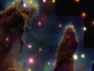

  
[Intangible Textual Heritage](../../index)  [Esoteric](../index) 
[Index](index)  [Previous](to18)  [Next](to20) 

------------------------------------------------------------------------

[Buy this Book at
Amazon.com](https://www.amazon.com/exec/obidos/ASIN/B00272NIFS/internetsacredte)

------------------------------------------------------------------------

  
*Tertium Organum*, by P.D. Ouspensky, \[1922\], at Intangible Textual
Heritage

------------------------------------------------------------------------

p. 176

# CHAPTER XVI

|                                                                                                                                                                                                                                                                                                                                                                                                                                                                                                                                                                                                                                                                                                                                                                                                                                                                                              |
|----------------------------------------------------------------------------------------------------------------------------------------------------------------------------------------------------------------------------------------------------------------------------------------------------------------------------------------------------------------------------------------------------------------------------------------------------------------------------------------------------------------------------------------------------------------------------------------------------------------------------------------------------------------------------------------------------------------------------------------------------------------------------------------------------------------------------------------------------------------------------------------------|
| The phenomenal and the noumenal side of man. "Man-in-himself." How do we know the inner side of man? Can we know of the existence of consciousness in conditions of space not analogous to ours? Brain and consciousness. Unity of the world. Logical impossibility of the simultaneous existence of spirit and matter. Either all spirit or all matter. Rational and irrational actions in nature and in the life of man. Can rational actions exist alongside irrational? The world as an accidentally self-created mechanical toy. The impossibility of reason in a mechanical universe. The irreconcilability of mechanicalness with the existence of reason. Kant concerning "hosts." Spinoza on the knowledge of the invisible world. Necessity for the intellectual definition of that which can be, and that which cannot be, in the world of the hidden. |

WE know what man is only imperfectly; our conceptions regarding him are
extremely fallacious and easily create new illusions. First of all, we
are inclined to regard man as a certain unity, and to regard the
different parts and functions of man as being bound together, and
dependent upon one another. Moreover, in the physical apparatus, in man
visible, we see the cause of all his properties and actions. In reality,
man is a very complicated something, and complicated in various meanings
of the word. Many sides of the life of a man are not bound together
among themselves at all, or are bound only by the fact that they belong
to one man; but the life of man goes on simultaneously on different
planes, as it were, while the phenomena of one plane only at times and
partially touch those of another, and may not themselves touch at all.
And the relations of the same man to the various sides of himself and to
other men are entirely dissimilar.

Man includes within himself all three of the above-mentioned orders of
phenomena, i.e., he represents in himself the combination of physical
phenomena with those of life and psychic phenomena. And the mutual
relations between these three orders of phenomena are infinitely more
complex than we are accustomed to think. Psychic phenomena we feel,
sense and are conscious of *in ourselves*;

p. 177

physical phenomena and the phenomena of life we observe and make
conclusions about on the basis of experience. We do not sense the
psychic phenomena of *others*, i.e., the thoughts, feelings and desires
of another man; but the fact that they exist in him we conclude from
what he says, and by analogy with ourselves. We know that in ourselves
certain actions, certain thoughts, and feelings proceed, and when we
observe the same actions in another man, we conclude that he has thought
and felt like us. Analogy with ourselves—this is our sole criterion and
method of reasoning and drawing conclusions about the psychic life in
other men if we cannot communicate with them, or do not wish to believe
in what they tell us about themselves.

Suppose that I should live among men without the possibility of
communicating with them and having no way to make conclusions based upon
analogy; in that case I should be surrounded by moving and acting
automatons, the cause, purpose and meaning of whose actions would be
perfectly incomprehensible to me. Perhaps I would explain their actions
by "molecular motion," perhaps by the "influence of the planets,"
perhaps by "spiritism," i.e., by the influence of "spirits," possibly by
"chance" or by a haphazard combination of causes—but in any case I
should not and could not see *the psychic life* in the depth of these
men's actions.

Concerning the existence of thought and feeling I can usually only
conclude by analogy with myself. I know that certain phenomena are
connected in me with my possession of thought and feeling. When I see
the same phenomena in another man I conclude that he also possesses
thought and feeling. But I cannot convince myself *directly* of the
existence of psychic life in another man. Studying man from one side
only I should stand in the same position in relation to him as,
according to Kant, we stand with relation to the world surrounding us.
We know merely the form of our knowledge of it. The *world-in-itself* we
do not know.

Thus the psyche, with all its functions and with all its contents—I have
two methods—analogy with myself, and intercourse with him by the
*exchange of thoughts*. Without this, man is for me a phenomenon merely,
a moving automaton.

The noumenon of a man is his psyche together with everything this psyche
includes within itself and that with which it unites him.

In "man" are opened to us both worlds, though the noumenal

p. 178

world is open only slightly, because it is cognized by us through the
phenomenal.

*Noumenal means apprehended by the mind*; and the characteristic
property of *the things of the noumenal world* is that *they cannot be
comprehended by the same method by which the things of the phenomenal
world are comprehended*. We may speculate about the things of the
noumenal world; we may discover them by a process of reasoning, and by
means of analogy; we may feel them, and enter into some sort of
communion with them; but we can neither see, hear, touch, weigh, measure
them; nor can we photograph them or decompose them into chemical
elements or number their vibrations.

Thus, the psyche, with all its functions and with all its
contents—thoughts, feelings, desires, will—does not relate itself to the
world of phenomena. We cannot know even a single element of the psyche
*objectively*. Emotion as such is a thing which it is impossible to see,
just as it is impossible to see *the value of a coin*. You can see the
stamp upon a coin, but you will never see *its value*. It is just as
impossible to photograph thought as it is to imagine "Egyptian darkness"
in a vial. To think otherwise, to experiment with the photographing of
thought, simply means to be unable to think logically. On a phonographic
record are the tracings of the needle, elevations and depressions, but
*there is no sound*. He who holds a phonographic record to his ear,
hoping *to hear* something, will be sure to listen in vain.

\_\_\_\_\_\_

Including within himself *two worlds*, the phenomenal and the noumenal,
man gives us the opportunity to understand in what relation these worlds
stand to one another everywhere throughout nature. It is necessary
however to remember, that defining a noumenon in terms of the psyche, we
take but one of its infinity of aspects.

We have already arrived at the conclusion that the *noumenon* of a thing
consists in *its function* in another sphere—in its meaning which is
incomprehensible in a given section of the world. [1](#fn_23) Next

p. 179

we came to the conclusion that the number of meanings of one and the
same thing in different sections of the world must be infinitely great
and infinitely various, that it must become its own opposite, return
again to the beginning (from our standpoint), etc., etc., infinitely
expanding, contracting again, and so forth.

It is necessary to remember that the noumenon and the phenomenon are not
different things, but merely different aspects of *one
[and](errata.htm#27) the same thing*. Thus, each phenomenon is *the
finite expression*, in the sphere of our knowledge through the organs of
sense, *of something infinite*.

A phenomenon is the three-dimensional expression of a given noumenon.

This three-dimensionality depends upon the three-dimensional forms of
our knowledge, i.e., speaking simply, upon our brains, nerves, eyes, and
finger-tips.

\_\_\_\_\_\_

In "man" we have found that one side of his noumenon is his psychic
life, and that therefore in the psyche lies the beginning of the
solution of the riddle of the functions and meanings of man which are
incomprehensible from an outside point of view. What is the psyche of
man if it is not his function—incomprehensible in the three-dimensional
section of the world? Truly, if we shall study and observe man by all
accessible means, objectively, from without, we shall never discover his
psyche and shall never define the function of his consciousness. We must
first of all *become aware* of the existence of our own psyche, and then
either begin a conversation (by signs, gestures, words) with another
man, begin to exchange thoughts with him, and from his answers deduce
the conclusion that he possesses the same thing that we do—or come to
the conclusion about it from external indications (actions similar to
ours in similar circumstances). By the *direct method* of objective
investigation, without the help of *speech*, or without the help of
conclusions based upon *analogy*, we shall not discover the psyche in
another man.

p. 180

\[paragraph continues\] That which is
inaccessible to the direct method of investigation, *but exists*, is
NOUMENAL. Consequently we shall not be in a position to define the
functions and meanings of man in another section of the world than that
world of Euclidian geometry, solely accessible to the "direct methods of
investigation." Therefore we have a perfect right to regard "the psyche
of man" as his function in some section of the world different from that
*three-dimensional* section wherein "the body of man" functions.

Having established this much we may ask ourselves the question: Have we
not the right to make a reverse conclusion, and regard as *a psyche of
its own kind* the to us unknown function of the "world" and of "things"
outside of their three-dimensional section?

\_\_\_\_\_\_

Our usual positivistic view regards psychic life as *a function of the
brain*. Without a brain we cannot imagine rationality.

Max Nordau, when he wanted to imagine the world's consciousness (in
*Paradoxes*), was obliged to say that we cannot be certain that
somewhere in the infinite space of the universe *is not repeated on a
grandiose scale the same combination of physical and chemical elements
as constitutes our brains*. This is very characteristic and typical of
"positive science." Desiring to imagine the "world's consciousness"
positivism is first of all forced to imagine *a gigantic brain*. Does
not this at once savor of the two-dimensional or plane world? Surely the
idea of a gigantic brain somewhere beyond the stars reveals the
appalling poverty and impotence of positivistic thought. This thought
cannot leave its usual grooves; it has no wings for a soaring flight.

Let us imagine that some curious inhabitant of Europe in the seventeenth
century should try to foresee the means of transportation in the
twentieth century, and should picture to himself an enormous
stage-coach, large as an hotel, harnessed to one thousand horses; he
would be pretty near to the truth, but also at the same time infinitely
far from it. And yet even in his time some minds which foresaw along
correct lines already existed: already the idea of the steam engine had
been broached and models were appearing.

The thought expressed by Nordau reminds one of a favorite concept of
popular philosophy relating to an accidentally caught

p. 181

idea, that the planets and satellites of the solar system are merely
molecules of some tremendous organism, an insignificant part of which
that system represents.

"Perhaps the entire universe is located on the tip of the little finger
of some great being," says such a philosophizer, "and perhaps our
molecules are also worlds." The deuce! Perhaps on my little finger there
are several universes too! And such a philosophizer gets frightened. But
all such reasonings are merely the gigantic stage-coach over
again. [1](#fn_24) This is the way a little girl
thought, about whom I was reading, if I mistake not, in *The
Theosophical Review*. The girl was sitting near the fireplace, and
beside her slept a cat. "Well, the eat is sleeping," the girl reflected,
"perhaps she sees in a dream that she is not a cat, but a little girl.
And maybe *I am not a little girl at all, but a cat, and only see in a
dream that I am a little girl*. . . ." The next moment the house
resounds with a violent cry, and the parents of the little girl have a
hard time to convince her that she is not a cat but really a little
girl.

All this shows that it is necessary to philosophize with a certain
amount of skill. Our thought is encompassed by many blind alleys, and
positivism, always attempting to apply the rule of proportion, is in
itself such a blind alley.

\_\_\_\_\_\_

Our analysis of phenomena, the relation which we have shown to exist
between physical phenomena and those of life and of the psyche, permits
us to assert *quite definitely* that psychic phenomena cannot be a
function of physical phenomena—or phenomena of a lower order. We
established that the higher cannot be a function of the lower. And this
division into higher and lower is also based upon the clear fact of the
different potentialities of various orders of phenomena—of the different
amount of *latent force* contained in them (or liberated by them). And
of course we have the right to call those phenomena *the higher* which
possess immeasurably greater potentiality, immeasurably more latent
force; and to call those *the lower* which possess less potentiality,
less latent force.

p. 182

The phenomena of life are *the higher* in comparison with physical
phenomena.

Psychic phenomena are *the higher*, in comparison with the phenomena of
life and physical phenomena.

Which must be the function *of which* is clear.

Without making a palpable logical mistake we cannot declare life and the
psyche to be dependent functionally upon physical phenomena, i.e., to be
a *result* of physical phenomena. The truth is quite the opposite of
this: everything forces us to recognize physical phenomena as the result
of life, and life (in a biological sense) as the result of some form of
psychic life, which is perhaps unknown to us.

But of *which* life, and of *which* psyche? Here lies the question. Of
course it would be absurd to regard our planetary sphere as a function
of the vegetable and animal life *proceeding upon it*—and the visible
stellar universe as a function of the *human* psyche. But nothing of
this sort is meant. In the occult understanding of things we speak
always of *another* life and *another* psyche, the particular
manifestation of which is our life and our psyche. It is important to
establish *the general principle* that physical phenomena, being *the
lower*, depend upon the phenomena of life and of the psyche, which are
*higher*.

If we admit this principle as established, then it is possible to
proceed further.

The first question which arises is this: In what relation does the
psychic life of man stand to his body and his brain?

This question has been answered differently in different times. Psychic
life has been regarded as a direct function of the brain ("*Thought is
the motion of brain substance*"), thus of course denying any possibility
of thought without the existence of a brain. Then followed an attempt to
establish *a parallelism* between psychic activity and the activity of
the brain. But the nature of this parallelism has always remained
obscure. Yes, evidently, the brain works parallel to thinking and
feeling: an arrestment or a disorder of the activity of the brain brings
as a consequence a visible arrestment or disorder of psychic activity.
But after all the activity of the brain is *merely motion*, i.e., an
objective phenomenon, whereas the activity of the psyche is a phenomenon
objectively undefinable,

p. 183

and at the same time *more powerful* than anything objective. How shall
we reconcile all this?

Let us endeavor to consider the activity of the brain and the activity
of the psyche from the standpoint of the existence of those two data,
the "world" and "consciousness," accepted by us at the very beginning.

If we consider the brain from the standpoint of consciousness, then the
brain will be part of the "world," i.e., part of the outer world lying
outside of consciousness. Therefore the psyche and the brain are
different things. But the psyche, as experience and observation shows,
can act only through the brain. The brain is that necessary prism,
passing through which, part of the psyche manifests itself to us as
*intellect*. Or to put it a little differently, *the brain is a mirror,
reflecting psychic life in our three-dimensional section of the world*.
This last means that in our three-dimensional section of the world not
all of the psyche (the true dimensions of which we do not know) is
acting, but only so much of it as can be reflected in a brain. It is
clear that if the mirror be broken, then the image will be broken too,
or if the mirror be injured or imperfect, then the reflection will be
blurred or distorted. But there is absolutely no reason to believe that
when the mirror is broken the object which it reflects is thereby
destroyed, i.e., *psychic life* in the given case.

*The psyche* cannot suffer from any disorder of the brain, but *the
manifestations* of it may suffer very much or may even disappear from
the field of our observation altogether. Therefore it is clear that a
disorder in the activity of the brain causes an enfeeblement or a
distortion, or even a complete disappearance of the psychic faculties
manifesting in our sphere.

The idea of the comparison between a three-dimensional body and a
four-dimensional one enables us to affirm that not all the psychic
activity goes through the brain, but a part of it only. [1](#fn_25)

Each of us is in reality an abiding physical entity
far more extensive than he knows—an individuality which can never
express itself completely through any corporeal manifestation. The self
manifests through the organism; but there is always some part of the
self unmanifested. [2](#fn_26)

p. 184

The "positivist" will remain unconvinced. He will say: prove to me that
thought can act without a brain, then I will believe it.

I shall answer him by the question: WHAT, in the given case, will
constitute a proof?

There are no proofs and there can not be any. The existence of the
psyche *without a brain* (without a body), if that be possible, is for
us a fact which cannot *be proven* like a physical fact.

And if my opponent will reason sincerely, then he will be convinced
there can be no proof, because *he himself has no means of being
convinced of the existence of a psyche acting independently of a brain*.
Let us assume that the thought of a *dead* man (i.e., of a man whose
brain has ceased to act) continues to function. How can we convince
ourselves of this? *By no possible means whatever*. We have means of
communication (speech, writing) with beings which are in conditions
similar to our own—i.e., acting through brains; concerning the existence
of the psyche of *those same* beings we can conclude by analogy with
ourselves; but concerning the existence of the psychic life of other
beings, *whether they do or they do not exist is immaterial*, we can not
by ordinary means convince ourselves *that they exist*.

It is exactly this that gives us a key to the understanding of the true
relation of psychic life to the brain. Our psyche being a reflection
from the brain, we can observe only those reflections which are similar
to itself. We have before established that we can make conclusions
concerning the psychic life of other beings from *the exchange of
thoughts with them* and from analogies with ourselves. Now we may add to
this, that *for this very reason we can know only* about the existence
of psychic lives *similar to our own*, and we cannot know any other at
all, whether they exist or not, *unless we ourselves enter their plane*.

Should we ever realize our psychic life, not only as it is reflected
from a brain, but in a condition more universal, simultaneously with
this the possibility would open up of discovering beings with a psychic
life independent of the brain analogical to ourselves, if such exist in
nature.

p. 185

But do such beings exist or not? How can we gain information on this
point with our thought *such as it is now*?

Observing the world from our standpoint, we perceive in it actions
proceeding from rational conscious causes, such as the work of a man
seems to us; and other actions proceeding from the unconscious blind
forces of nature, such as the movement of waves, the ebbing and flowing
of the tide, the descent of great rivers, etc., etc.

In such a division of observed actions into rational and mechanical
there is something naive, even from the positivistic standpoint. For if
we have learned anything from the study of nature, if the positivistic
method has given us anything at all, then it is the assurance of the
necessity for the *uniformity* of phenomena. We know, and with great
certainty, that things basically similar cannot proceed from dissimilar
causes. Our scientific philosophy knows this too. Therefore it also
regards the foregoing division as naive, and conscious of the
impossibility of such dualism—that one part of observed phenomena
proceeds from rational and conscious causes and another part from
unreasoned and unconscious ones—positivistic philosophy finds it
possible to explain *everything* as proceeding from mechanical causes.

Scientific observation holds that the seeming rationality of human
actions is an illusion and a self-deception. Man is a toy in the hands
of elemental forces. He is merely a transforming station of forces. All
that which as it seems to him, *he is doing*, is in reality done instead
by external forces which enter him through air, food, sunlight. Man does
not perform a single action by himself. He is merely a prism in which a
line of action is refracted in a certain manner. But just as the beam of
light does not proceed from the prism, so action does not proceed from
the reason of man.

The "theoretical experiment" of certain German psycho-physiologists is
usually advanced in confirmation of this. They affirmed that if it were
possible, from the time of his birth, to deprive a man of ALL EXTERNAL
IMPRESSIONS: light, sound, touch, heat, cold, etc., and at the same time
preserve him alive, then such a man would not be able to perform EVEN
THE MOST INSIGNIFICANT ACTION.

From this it follows that man is an automaton, like that *automaton*
projected by the American inventor Tesla, which, obeying electric
currents and vibrations coming from a great distance without

p. 186

wires, was calculated to execute a whole series of complicated
movements.

It follows from this that *all the actions of a man* depend upon outer
impulses. For the smallest reflex, outer irritation is necessary. For
more complex action a whole series of preceding complex irritations is
necessary. Sometimes between the irritation and the action a
considerable time elapses, and a man does not feel any connection
between the two. Therefore he regards his actions as voluntary, though
in reality there are no voluntary actions at all—man cannot do anything
by himself, just as a stone cannot jump voluntarily: it is necessary
that something should throw it up. Man needs something to give him an
impulse, and then he will develop exactly as much force as such an
impulse (and all pre-ceding impulses) put into him and no trifle more.
Such is the teaching of positivism.

From the STANDPOINT OF LOGIC such a theory is more correct than the
theory of two classes of actions—REASONED AND UN-REASONED. It at least
establishes the principle of NECESSARY UNIFORMITY. It is really
impossible to suppose that in an immense machine certain parts move
according to their own desire and reasoning; there must be something
uniform—either all parts of the machine possess a consciousness of their
function and act according to this consciousness, or all are worked from
one motor and are driven by one transmission. The enormous service
per-formed by positivism is that it established this principle of
uniformity. It is left to us to define in what this uniformity consists.

The positivistic hypothesis of the world considers that the basis of
*everything* is unconscious *energy*, which arose from unknown causes at
a time that is not known. This energy, after it has passed through a
whole series of invisible electro-magnetic and physico-chemical
processes, is expressed for us in visible and sensed motion, then in
growth, i.e., in the phenomena of life, and at last in psychic
phenomena.

This view has been already investigated and the conclusion reached that
it is impossible to regard physical phenomena as the cause of PSYCHIC
PHENOMENA, while on the other hand, psychic phenomena serve as an
undoubted cause for a great number of the physical phenomena observed by
us. The observed process of

p. 187

origination of psychic phenomena under the influence of outside
mechanical impulses does not at all mean that physical phenomena create
psychic phenomena. Such do not constitute the cause, but are merely a
shock, disturbing the balance. In order that outer shocks may evoke
psychic phenomena an organism is necessary, i.e., a complex and animated
life. The cause of psychic life lies in the organism, its animatedness,
which can be defined as a potential of psychic life.

Then, from the very essence of the idea of motion—which is the
foundation of the physico-mechanical world—was deduced the conclusion
that motion is not an entirely obvious truth, that the idea of motion
arose in us because of the limitation and in-completeness of our sense
of space (a slit through which we observe the world). And it was
established, not that the idea of time is deduced from the observation
of motion, but that the idea of motion results from our "time-sense"—and
that the idea of motion is quite definitely *the function of the*
"*time-sense*," which in itself is a limit or boundary of the
space-sense belonging to a being of a given psyche. It was also
established that the idea of motion could arise out of a comparison
between two different fields of consciousness. And in general, all
analysis of the fundamental categories of our knowledge of the
world—space and time—showed that we have absolutely no data whatever for
accepting motion as the fundamental principle of the world.

And if this is so—if it is impossible to assume behind the scenes of the
creation of the world the presence of an unconscious mechanical
motor—then it is necessary to consider the world as living and rational.
Because one or the other of two things must be true: either it is
mechanical and dead—"accidental"—or it is living and animated. There can
be nothing dead in living nature and there can be nothing living in dead
nature.

Nature exhibits a continual progress, starting from
the mechanical and chemical activity of the inorganic world, proceeding
to the vegetable, with its dull enjoyment of self, from that to the
animal world, where intelligence and consciousness began at first very
weak, and only after many intermediate stages attaining its last great
development in man, whose intellect is nature's crowning point, the goal
of all her efforts, the most perfect and difficult of all her
works.

p. 188

So writes Schopenhauer in his *Counsels and Maxims*, and indeed it is
very effectively expressed, but we have no foundation whatsoever for
regarding man as *the summit* of that which nature has created. This is
only THE HIGHEST THAT WE KNOW.

Positivism would be absolutely correct in its picture of the world,
there would not be even one deficiency, *if there were no reason in the
world, anywhere or at any time*. Then it would be necessary, *nolens
volens*, to regard the universe as *an accidentally self-created
mechanical toy in space*. But the fact of the existence of psychic life
"spoils all the statistics." It is impossible to exclude it.

We are either forced to admit the existence of two principles—"spirit"
and "matter"—or to select one of them.

Then dualism annihilates itself, because if we admit the separate
existence of spirit and matter, and reason further on this basis, it
will be inevitably necessary to conclude, either that spirit is unreal
and matter real; or that matter is unreal and spirit real—i.e., either
that spirit is material or that matter is spiritual. Consequently it is
necessary to select some one thing—spirit or matter.

But to think really MONISTICALLY is considerably more difficult than it
seems. I have met many men who have called themselves "monists," and
sincerely considered themselves as such, but in reality they never
departed from the most naive dualism, and no spark of
[understanding](errata.htm#28) of the world's unity ever flashed upon
them.

Positivism, regarding "motion" or "energy" as the basis of everything,
can never be "monistic." It is impossible to annihilate the fact of
psychic life. If it were possible not to take this fact into
consideration at all, then everything would be splendid, and the
universe could be something like an accidentally self-created mechanical
toy. But to its sorrow, positivism cannot deny the existence of the
psyche. It can only try to degrade it as low as possible, calling it the
*reflection* of reality, the substance of which consists of motion.

But how deal with the fact that the "reflection" possesses in this case
an infinitely greater potentiality than the "reality"? How can this be?
From what does this reality reflect, or what is it refracted in, that in
its reflected state it possesses infinitely greater potentiality than in
its original state?

p. 189

The consistent "materialist-monist" will be forced to say that "reality"
reflects from itself, i.e., "one motion" reflects from another motion.
But this is merely dialectics, and fails to make clear the nature of
psychic life, for it is *something other* than motion.

\_\_\_\_\_\_

No matter how hard we may try to define thought in terms of *motion*, we
nevertheless know that they are *two different things*, different as
regards our receptivity of them, belonging to different worlds,
incommensurable, capable of existing simultaneously. Moreover, thought
can exist without *motion*, but motion cannot exist without thought,
because out of the psyche comes the necessary condition of motion—time:
no psychic life—no time, as it exists for us; no time—no motion.

We cannot escape this fact, and *thinking logically*, we must inevitably
recognize *two principles*. But if we begin to consider the very
recognition of two principles as *illogical*, then we must recognize
THOUGHT *as a single principle*, and *motion* as AN ILLUSION OF THOUGHT.

But what does this mean? It means that there can be no "monistic
materialism." Materialism can be *only* dualistic, i.e., it must
recognize *two principles*: motion and thought.

Here a new difficulty arises.

Our concepts are limited by language. Our language is *deeply*
dualistic. This is indeed a terrible obstacle. I showed previously how
language retards our thought, making it impossible to express the
relations of a *being* universe. In our language only *an eternally
becoming* universe exists. The "Eternal Now" cannot be expressed in
language.

Thus our language pictures to us beforehand a false universe—*dual*,
when in reality it is *one*; and *eternally becoming* when it is in
reality *eternally being*.

And if we come to realize the degree to which our language falsifies the
real view of the world, then the understanding of this fact will enable
us to see that it is not only difficult, but even *absolutely
impossible* to express in language the correct relation of the things of
the real world.

p. 190

This difficulty can be conquered only by the formation of new concepts
and by extended analogies.

Later on the principles and methods of this expansion of what we already
have, and what we can extract from our stores of knowledge will be made
clear. For the present it is only import-ant to establish one thing—THE
NECESSITY FOR UNIFORMITY: the monism of the universe.

As a matter of *principle* it is not important which one we regard as
*first cause*, spirit or matter. It is essential to recognize their
unity.

\_\_\_\_\_\_

—*But what then is matter*?

From one point of view, it is a *logical concept*, i.e., a form of
*thinking*. Nobody ever saw *matter*, nor will he ever—it is possible
only to *think* matter. From another point of view it is an illusion
accepted for reality. Even more truly, it is the incorrectly perceived
form of that which exists in reality. Matter is a section of something;
a non-existent, imaginary section. But that of which matter is a
section, exists. This is the real, *four-dimensional* world.

Wood, the substance from which this table (for example) is made, exists;
but the true nature of its existence we do not know. All that we know
about it is just the form of our receptivity of it. And if we should
cease to exist, it would continue to exist, but only for a receptivity
acting similarly to ours. But in itself this substance exists in some
other way—HOW, *we do not know*. Certainly not in space and time, for we
ourselves impose these forms upon it. Probably *all similar wood*, of
different centuries, and different parts of the world, constitutes one
mass—one body—perhaps *one being*. Certainly that substance (or that
part of it) of which this table is made, has no *separate existence
apart from our receptivity*. We fail to understand that a particular
*thing* is merely an artificial *definition* by our senses, of some
indefinable cause infinitely surpassing that *thing*.

But a thing may acquire its own individual and unique soul; and in that
case the thing exists quite independently of our receptivity.

p. 191

\[paragraph continues\] Many things
possess such souls, *especially old things*—old houses, old books, works
of art, etc.

\_\_\_\_\_\_

But what ground have we for thinking that there is psychic life in the
world other than our human one, that of animals and of plants?

First of all, of course, the thought that everything in the world is
alive and animated and that manifestations of life and animatedness
would naturally exist on all planes and in all forms. But we can discern
the psychic life only in forms analogous to ours.

The question stands in this way: how could we know about the existence
of the psychic life of other sections of the world if they exist?

By two methods: through COMMUNICATION, EXCHANGE OF THOUGHTS, and through
CONCLUSIONS BY ANALOGY.

For the first, it is necessary that our psyche should become similar to
theirs, should transcend the limits of the three-dimensional world,
i.e., it is necessary to change the form of receptivity and perception.

The second may result as a consequence of the *gradual* expansion of the
faculty of drawing inferences by analogy. By trying to think out of the
usual categories, by trying to look at things and at ourselves from a
new angle and simultaneously from many sides, by trying to liberate our
thinking from its accustomed categories of perception in space and time,
little by little we begin to notice analogies between things which we
did not notice before. Our mind grows, and with it grows the power to
discover analogies. This ability, with each new step attained, expands
and enriches the mind. Each minute we advance more rapidly, each new
step makes the next more easy. Our psyche becomes *different*. Then,
applying to ourselves this expanded ability to construct analogies, and
looking about we suddenly perceive all around ourselves a psychic life
the existence of which we were previously unaware. And we understand the
reason for this unawareness: this psychic life belongs to another plane,
and not to that to which our psychic life is native. Thus in this case
*the ability to discover new analogies* 

p. 192

is the beginning of changes, which translate us into another plane of
existence.

The thought of a man begins to penetrate into the world of *noumena*,
which is in affinity with it. Then his point of view changes likewise
with regard to the things and events of the *phenomenal world*.
Phenomena may suddenly assume, to his eyes, quite a different grouping.
As already said, *similar* things may be *different* from one another in
reality, different things may be similar; quite separate, disconnected
things may be part of one great whole, *of some entirely new category*;
and things which appear inextricably united in one, constituting one
whole, may in reality be manifestations of *different* beings having
nothing in common among themselves, even knowing nothing whatever about
the existence of one another. *Such* indeed may be any *whole* of our
world—man, animal, planet, planetary system—i.e., consisting of
different psychic lives, a battle-field as it were of warring entities.

In each *whole* of our world we perceive a multitude of *opposing*
tendencies, aspirations, efforts. Each aggregate is as it were an arena
of struggle for multitudes of *opposing* forces, each of which acts *by
itself*, is directed to *its own goal*, usually to the disruption of the
whole. But the *interaction* of these forces represents the life of the
whole; and in everything *something* is always acting which limits the
activity of separate tendencies. This *something* is the psychic life of
the whole. We cannot establish the existence of *such a life* by analogy
with ourselves, or by intercourse with it, or by exchange of thoughts,
but *a new path* opens before us. We perceive a certain separate and
quite definite function (the preservation of the whole) . Behind this
function we infer a certain separate something. A separate something
having a definite function is impossible without a separate psychic
life. If *the whole* possesses its own psychic life then the separate
tendencies or forces must also possess a psychic life of their own. A
body or organism is the point of intersection of such lines of forces, a
place of meeting, perhaps *a battle-field*. Our "I" is also that
*battle-field* on which this or that emotion, this or that habit or
inclination gains an advantage, subjecting to itself all of the rest at
every given moment, and [identifying](errata.htm#29) itself with the I.
Our I is *a being*, having *its own* life, imperfectly conscious of that
of which it itself consists, and identifying

p. 193

itself with this or another portion of itself. Have we any warrant for
supposing that the organs and members of a body, *thoughts* and
*emotions*, are BEINGS also? We have, because we know that there exists
*nothing* purely mechanical; and any something, having *a separate
function*, MUST BE *animated* and can be called *a being*.

All the beings assumed by us to exist *in the world of many dimensions*,
cannot know one another, i.e., cannot know that we are binding them
together in different wholes in our phenomenal world, just as in general
they cannot know our phenomenal world and its relations. But they must
know *themselves*, although it is impossible for us to define the degree
of clearness of this consciousness. It may be clearer than ours, and it
may be more vague—dreamlike, as it were. Between these beings there may
be a continuous but imperfectly perceived *exchange of thoughts*,
analogous to the exchange of substance in a living organism. They may
experience certain feelings in common, certain *thoughts* may arise in
them spontaneously as it were, under the influence of general causes.
Upon the lines of this inner communion they must divide themselves into
different *wholes* of some categories to us entirely incomprehensible,
or only guessed at. The essence of each such separate being must consist
in its *knowledge* of itself and its nearest functions and relations; it
must feel things analogous to itself, and must have the faculty of
telling about itself and them, i.e., this consciousness must always
behold *a picture of itself* and its conditioning relations. It is
eternally studying this picture and instantly communicating it to
another being coming into communion with it.

Whether these consciousnesses in sections of the world other than ours
exist or not, we, under *the existing conditions of our receptivity*,
cannot say. They can be sensed only by the changed psyche. Our usual
receptivity and thinking are too absorbed by the sensations of the
phenomenal world, and by themselves, and therefore do not reflect
impressions coming to them from other beings, or reflect them so weakly
that they are not fixed there in any intelligible form. Moreover we do
not recognize the fact that we are in constant communion with the
*noumena* of all surrounding things, near and remote, with beings like
ourselves and others entirely different, with the life of everything in
the world and of all the world. But if the impressions coming from other
beings are so forceful

p. 194

that the consciousness feels them, then our mind immediately projects
them into the outer world of phenomena and seeks for their cause in the
phenomenal world, exactly in the same manner that a two-dimensional
being, inhabiting a plane, seeks in its plane for the cause of the
impressions which come from a higher world.

\_\_\_\_\_\_

Our psyche is limited by its phenomenal receptivity, i.e., it is
surrounded by itself. The world of phenomena, i.e., the form of its own
perception, surrounds it as a ring, or as a wall, and it sees nothing
save this wall.

But if the psyche succeeds in escaping out of this limiting circle, it
will invariably see much that is new in the world.

If we will separate self-elements in our perception, writes Hinton \[*A
New Era of Thought*, pp. 36, 37\], then it will be found that the
deadness which we ascribe to the external world is not really there, but
is put in by us because of our own limitations. It is really the
self-elements in our knowledge which make us talk of mechanical
necessity, dead matter. When our limitations fall, we behold the spirit
of the world as we behold the spirit of a friend—something which is
discerned in and through the material presentation of a body to us.

Our thought means are sufficient at present to show us human souls; but
all except human beings is, as far as science is concerned, inanimate.
Our self-element must be got rid of from our perception, and this will
be changed.

But is the unknowableness of the noumenal world as absolute for us as it
sometimes seems?

In *The Critique of Pure Reason* and in other writings, Kant denied the
possibility of "spiritual sight." But in *Dreams of a Ghost-seer* he not
only admitted this possibility, but gave to it one of the best
definitions which we have ever had up to now. He clearly affirms:

I confess that I am very much inclined to assert the
existence of immaterial natures in the world, and to put my soul itself
into that class of beings. These immaterial beings . . . are immediately
united with each other, they might form, perhaps, a great whole which
might be called the immaterial world. Every man is a being of two
worlds: of the incorporeal world and of the material world . . . and *it
will be proved* I don't know where or when, that the human soul also in
this life forms an indissoluble communion with all immaterial natures of
the spirit-world, that, alternately, it acts upon and receives
impressions from that world of which

p. 195

nevertheless it is not conscious while it is still man and as long as
everything is in proper condition . . .

We should, therefore, have to regard the human soul as being conjoined
in its present life with two worlds at the same time, of which it
clearly perceives only the material world, in so far as it is conjoined
with a body, and thus forms a personal unit. . . .

It is therefore, indeed, one subject, which is thus at the same time a
member of the visible and of the invisible world, but not one and the
same person; for on account of their different quality, the conceptions
of the one world are not ideas associated with those of the other world;
thus, what I think as a spirit, is not remembered by me as a man, and,
conversely, my state as a man does not at all enter into the conception
of myself as a spirit.

Birth, life, death are the states of soul only . . . Consequently, our
body only is perishable, the essence of us is not perishable, and must
have been existent during that time when our body had no existence. The
life of the man is dual. It consists of two lives—one animal and one
spiritual. The first life is the life of man, and man needs a body to
live this life. The second life is *the life of spirit*; his soul lives
in that life separately from the body, and must live on in it after the
separation from the body.

In an essay on Kant in *The Northern Messenger* (1888, Russian), A. L.
Volinsky says that both in *Vorlesungen*, and also in *Dreams of a
Ghost-seer*, Kant denied the possibility of one thing only—the
possibility of the physical receptivity of spiritual phenomena.

Thus Kant admitted not only the possibility of the existence of a
spiritual *conscious* world, but also the possibility of communion with
it.

Hegel built all his philosophy upon the possibility of a direct
knowledge of truth, upon spiritual vision.

Approaching the question of two worlds from the psychological
standpoint, from the standpoint of the theory of knowledge, let us
firmly establish the principle that before we can hope to comprehend
anything in the region of *noumena*, we must define *everything that it
is possible to define* of the world of many dimensions by a purely
intellectual method, by a process of reasoning. It is highly probable
that by this method we cannot define very much. Perhaps our definitions
will be too crude, will not quite correspond to the fine differentiation
of relations in the noumenal world: all this is possible and must be
taken into consideration. Nevertheless we shall define what we can, and
at the outset make as clear as possible *what the noumenal world cannot
be*; then what it *can* be—

p. 196

show what relations are impossible in it, and what are possible.

This is necessary in order that we, coming in contact with the real
world, may discriminate between it and the phenomenal world, and what is
more important, that we may not mistake simple reflections of the
phenomenal world for the noumenal. We do not know the world of causes;
we are confined in the jail of the phenomenal world simply because we do
not know how to discern where one ends and where the other begins.

We are in constant touch with the world of causes, we live in it,
because our psyche and our incomprehensible function in the world are
part of it or a reflection of it. But we do not see or know it because
we either deny it—consider that *everything existing* is phenomenal, and
that nothing exists except the phenomenal—or we recognize it, but try to
comprehend it in the forms of the three-dimensional phenomenal world; or
lastly, we search for it and find it not, because we lose our way amid
the deceits and illusions of the *reflected* phenomenal world which we
mistakenly accept for the noumenal world.

In this dwells the tragedy of our spiritual questings: *we do not know
what we are searching for*. And the only method by which we can escape
this tragedy consists in a preliminary *intellectual* definition of the
properties of that *of which we are in search*. Without such
definitions, going merely by indefinite feelings, we shall not approach
the world of causes or else *we shall get lost on its borderland*.

Spinoza understood this, saying that he could not speak of God, *not
knowing his attributes*.

When I studied Euclid, I learned first of all that
the sum of three angles of a triangle was equal to two right angles, and
this property of a triangle was entirely comprehensible to me, although
I did not know its many other properties. But so far as spirits and
ghosts are concerned, I do not know even one of their attributes, but
constantly hear different fantastic tales about them in which it is
impossible to discover any truth.

\_\_\_\_\_\_

We have established certain criteria which permit us to deal with the
world of noumena or the "world of spirits." These we shall make use of
now.

p. 197

First of all we may say that the *world of noumena* cannot be
three-dimensional and that there cannot be anything three-dimensional in
it, i.e., commensurable with physical objects, similar to them in
outside appearance, *having form*—there cannot be anything having
extension in space and changing in time. And most important, there
cannot be anything dead or inanimate. In the world of causes everything
must be alive, because it is life itself: the soul of the world.

Let us remember also that *the world of causes* is the world of the
marvelous; that what appears simple to us can never be real. The real
appears to us as the marvelous. We do not believe in it, we do not
recognize it; and therefore we do not feel the mysteries of which life
is so full.

The simple is only that which is unreal. The real must seem marvelous.

*The mystery of time* penetrates all. It is felt in every stone, which
perhaps might have witnessed the glacial period, seen the ichthyosaurus
and the mammoth. It is felt in the approaching day, which we do not see,
but which possibly sees us, which per-chance is our last day; or on the
other hand is the day of some transformation the nature of which we do
not ourselves now know.

*The mystery of thought* creates all. As soon as we shall understand
that thought is not a "function of motion," but that motion itself is
only a function of thought—and shall begin to feel the depth of THIS
MYSTERY—We shall perceive that the entire phenomenal world is some
gigantic hallucination, which fails to frighten us, and does not drive
us to think that we are mad simply because we have become accustomed to
it.

*The mystery of infinity*—the greatest of all mysteries—it tells us that
all the visible universe and its galaxies of stars *have no dimension*:
that in relation to infinity *they are equal to a point*, a mathematical
point which has no extension whatever, and that points which are not
measurable for us may have a different extension and different
dimensions.

In "positive" thinking we make the effort TO FORGET ABOUT ALL THIS: NOT
TO THINK ABOUT IT.

At some future time positivism will be defined as a system by the aid of
which it was possible not to think of real things and to limit oneself
to the region of the unreal and illusory.

------------------------------------------------------------------------

### Footnotes

[178:1](to19.htm#fr_23) The expression "section
of the world" is taken as an indicator of the unreality of the forms of
each section. The world is infinite, and all forms are infinite, but to
grasp them with the finite brain-consciousness, i.e., by consciousness
reflected in the brain, we must imagine the infinite forms as being
finite, and these are "sections of the world." The p. 179 world is one, but the number of possible
sections is infinite. Let us imagine an apple: it is one, but we may
imagine an infinite number of sections in all directions and these
sections will differ from one another. If instead of an apple we take a
more complicated body, for instance the body of some animal: then the
sections taken in different directions will be even more unlike one
another.

[181:1](to19.htm#fr_24) The incorrectness here
is not in the idea itself, but in a literal analogy. The thought itself,
that molecules are worlds and worlds are but molecules, deserves
attention and study.

[183:1](to19.htm#fr_25) Frederick Myers, "Essay
on the Subliminal Consciousness," as quoted in William James' "The
Varieties of Religious Experience," Longmans, Green & Co., New York, p.
512.

[183:2](to19.htm#fr_26) In all the above it
would be more correct to substitute for the word *brain* the word
*body*—organism. The present trend of scientific psychology leads to an
understanding of the psychic importance of diverse physiological
functions, previously unknown and even p. 184
now but little investigated. The psychic life is connected not with the
brain only, but with the entire body, all its organs, all its tissues.
The study of the activity of glands, and of many other things with which
science is now concerning itself, shows that the brain is by no means
the only conductor of the psychic activity of man.

------------------------------------------------------------------------

[Next: Chapter XVII](to20)

