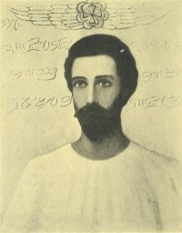

  
[Intangible Textual Heritage](../../index)  [Esoteric](../index) 

------------------------------------------------------------------------

[Buy this Book at
Amazon.com](https://www.amazon.com/exec/obidos/ASIN/1878891014/internetsacredte)

------------------------------------------------------------------------

<table width="75%">
<colgroup>
<col style="width: 50%" />
<col style="width: 50%" />
</colgroup>
<tbody>
<tr class="odd">
<td width="50%" data-valign="TOP"></td>
<td width="50%" data-valign="CENTER"><h1 id="unveiled-mysteries" data-align="CENTER">Unveiled Mysteries</h1>
<h2 id="by-godfré-ray-king" data-align="CENTER">by Godfré Ray King</h2>
<h5 id="pseudonym-of-guy-warren-ballard" data-align="CENTER">(pseudonym of Guy Warren Ballard)</h5>
<h4 id="section" data-align="CENTER">[1934]</h4></td>
</tr>
</tbody>
</table>

------------------------------------------------------------------------

[Contents](#contents)    [Start Reading](um00)

------------------------------------------------------------------------

|                                                                                                                           |
|---------------------------------------------------------------------------------------------------------------------------|
|  |

This is the first book written by Guy Ballard, founder of the "I AM"
Activity, onetime mining engineer, student of
[Theosophy](../../the/index), and alleged stock swindler. Although most
of his later work was properly renewed at the US copyright office, and
is hence still under copyright, someone [neglected to file the renewal
paperwork](img/renew.jpg) for this book, so it has entered the public
domain.

Unveiled Mysteries describes an encounter with St. Germain (see also
[The Comte de Saint Germain](../../sro/csg/index)), here described as an
Ascended Master, virtually a God, and able to manipulate the fabric of
reality. Ballard describes a series of astral trips in time and space
with St. Germain, to lost civilizations in South America and the Sahara,
as well as well-stocked bunkers of the ancients in the Grand Tetons,
Yellowstone, and Mount Shasta. Ballard and St. Germain revisit past
lives as citizens of [Atlantis](../../atl/index) and
[Mu](../../atl/ssm/index), and they turn out to be relatives. A final
chapter mentions encounters with entities from Venus, a theme of later
[UFO cargo-cults](../../ufo/index) of the 1950s. Connoisseurs of this
genre will appreciate Unveiled Mysteries. The book is written in a
breathless style with a more than liberal amount of em-dashes,
Inappropriate Capitalization, and melodramatic plot-points which
resemble golden-age pulp sci-fi. There are incoherent, surreal rants
which would not be out of place at a [Church of the
Subgenius](../bob/subman) rally.

The book has obvious similarities with [A Dweller on Two
Planets](../../atl/dtp/index), including passages which were probably
lifted directly. And much of Ballard's metaphysics, history of lost
continents, 'Great White Brotherhood' spiel, and so on, is derivative
from Theosophy. However, according to some of Ballard's ex-disciples,
plagiarism was probably the least of his spiritual shenanigans.

One notable successor of the "I AM" Activity is the Church Universal and
Triumphant of Elizabeth Clare Prophet, which also reveres St. Germain,
and also attempted to hole up in the Rocky Mountain area in the 1980s
against the threat of nuclear war.

Production notes: because of the huge number of em-dashes in this book,
I have used the Unicode character entity `&#8212;` to encode them,
rather than two successive dashes as usual. This is to reduce spurious
line breaks between the normal dashes. Unless your browser is set to
display basic Unicode, these may show up as question marks or boxes. To
remedy this, refer to the [Unicode Page](../../unicode).

------------------------------------------------------------------------

 [Title Page and Front Matter](um00)  
[Tribute](um01)  
[Foreword](um02)  
[The Ascension](um03)  
[Contents](um04)  
[Chapter I. Meeting the Master](um05)  
[Chapter II. The Sahara Desert](um06)  
[Chapter III. The Royal Teton](um07)  
[Chapter IV. Mysteries of the Yellowstone](um08)  
[Chapter V. Inca Memories](um09)  
[Chapter VI. Buried Cities of the Amazon](um10)  
[Chapter VII. The Secret Valley](um11)  
[Chapter VIII. God's Omnipresent Power](um12)  
[Chapter IX. Venus Visits the Royal Teton](um13)  
