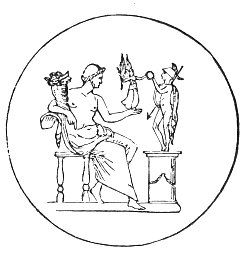
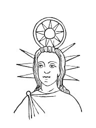

  
[Intangible Textual Heritage](../../index)  [Esoteric](../index) 
[Gnostic and Hermetic](../../gno/index)  [Index](index) 
[Previous](vow06)  [Next](vow08) 

------------------------------------------------------------------------

[Buy this Book at
Amazon.com](https://www.amazon.com/exec/obidos/ASIN/B002FGTM4C/internetsacredte)

------------------------------------------------------------------------

  
*The Virgin of the World*, by Anna Kingsford and Edward Maitland,
\[1884\], at Intangible Textual Heritage

------------------------------------------------------------------------

p. 23

 

### PART II.

\*           \*           \*           \*

O MY illustrious son, if thou wilt know any-thing further, ask it of me.
And Horos said, Revered Mother, I would fain know how royal souls are
born. And Isis answered:--Herein, my son Horos, lies the distinctive
character of royal souls. There are in the universe, four regions,
governed by a fixed and immutable law: heaven, the ether, the air, and
the most holy earth. Above, in heaven, dwell the Gods, ruled as are all
the rest, by the Maker of the universe; in the ether are the stars,
governed by the great fire, the sun; in the air are the souls of the
genii, governed by the moon; upon earth are men and other animals
governed by the soul who, for the time, is their king. For the Gods
themselves engender those who shall be kings befitting the terrestrial
race. Princes are the issue of kings, and he who is most kingly, is a
greater

\[king

p. 24

king than the rest. [1](#fn_24) The sun, nearer
to God than is the moon, is greater and stronger than she, and to him
she is subject as much by rank as by power. The king is the last of the
Gods and the first of men. So long as he sojourns upon earth, his
divinity is concealed, but he possesses something which distinguishes
him from other men and approximates him to God. The soul in him comes
from a loftier region than that from which descend the souls of common
men. Souls destined to reign upon the earth descend thither for two
causes. There are those who in former lives have lived blameless, and
who merit apotheosis; for such as these royalty is a preparation for the
divine state. Again, there are holy souls who, for some slight
infringement of the interior and divine law, receive in royalty a
penance whereby the suffering and shame of incarnation are mitigated.
The condition of these in taking a body resembles not that of others;
they are as blessed as when they were free. [2](#fn_25)

As to the various characters of these kings, the variety is not in the
souls, for all are royal, but it is due to the nature of the angels and
genii who assist them. For souls destined to such offices are not
without ministers and escort. Heavenly justice, even while exiling them
from the abodes of the Blessed, treats them as their nature befits.
When, then, O my son Horos, the ministering angels and genii appointed
are warlike, the soul in their charge takes that character,

\[forgetting

p. 25

forgetting its own, or rather laying it aside until some future change
of condition. If the guardian angels are of a gentle order, then the
soul follows its path in peace; if they are friends of judgment, the
soul loves to judge; if they are musicians, then the soul sings; if they
love truth, the soul is that of a philosopher. Thus the souls
necessarily follow the teaching of their guardians; falling into human
bodies they forego their proper estate, and while exiled from it they
approximate to those intelligences by whom they have been embodied.

Thine explanation is complete, my mother, said Horos, but thou hast not
yet informed me in what manner noble souls are born.

There are upon earth, O my son, different offices. So also is it among
souls; they occupy different stations, and that soul which issues from a
more exalted sphere is nobler than the rest; even as he who is free
among men, is nobler than the slave. Exalted and royal souls are
necessarily the masters of men.

How are souls born male or female?

Souls, my son Horos, are all equal in nature, since they come from one
region wherein the Creator has formed them. There are not among them
either males or females; this distinction exists only between bodies,
and not between incorporeal beings. But some are more energetic, some
are gentler; and this belongs to the air in which all things are formed.
For an airy body envelopes the soul; in it are the elements of earth,
water, air, and fire. Among females this combination contains more of
cold and of moisture than of dryness and heat, and the soul which is
enfolded therein is watery and disposed to softness. The contrary
happens among males; their envelope contains

\[more

p. 26

more of dryness and of heat, less of cold and of moisture; hence in
bodies so formed the souls manifest greater vivacity and energy.

And how, O my mother, are born the souls of the wise?

And Isis answered:--The organ of vision is enveloped in tunics. When
these tunics are thick and dense, the sight is dull; when they are fine
and subtle, the sight is penetrating. Even so is it with the soul; she
likewise has her coverings, incorporeal as herself. These coverings are
the interior airs; when they are subtle, clear, and transparent, then
the soul is perspicuous; when, on the contrary, they are dense, thick,
and turgid, then she cannot see far; and discerns only, as though in
cloudy weather, that which lies immediately before her steps.

And Horos said:--For what reason, my mother, are the minds of men who
are not of our holy country less open than the minds of those who belong
to it? And Isis replied [1](#fn_26):--The earth
is set in the midst of the universe like a man lying on his back and
gazing into heaven, and the various regions of earth correspond to the
different members of the man. The earth turns her gaze towards heaven as
towards her father, following in her changes the changes of the skies.
Her head lies to the south, her right shoulder to the east, her left is
turned towards the Lybian wind, her feet are under the constellation of
the Bear, the right beneath the tail, and the left beneath the head

\[of the

p. 27

of the Bear; her loins are under the regions of heaven nearest to the
Bear; the midst of her body is beneath the centre of heaven. Behold as a
proof of these things, how they who dwell in the South have a beautiful
countenance and plentiful hair, while the orientals have hands hardy in
conflict and ready with the bow, for they are right-handed; the westerns
are strong and fight with the left hand, attributing to the left side
the functions which belong in others to the right; those who dwell
beneath the Bear are distinguished by the attributes of their feet, and
by the beauty of their legs; those who inhabit beyond the Bear in the
climate of Italy and of Greece are remarkable for the beauty of their
loins, and hence their tendency to prefer males. This part of the body
also, being whiter than the rest, produces men of a whiter hue. The
hallowed region of our ancestors is in the midst of the earth, and since
the midst of the human body is the seat of the heart, and the heart of
the soul, this is why, my son, the men of this land, beside the
qualities which all men possess in common, have also a loftier
intelligence and wisdom, because the heart of the earth brings them
forth and nourishes them.

Moreover, my son, the south is the storehouse of the clouds; it is there
they assemble, and thence, it is said, flows our river (Nile), when the
cold becomes abundant. Now, where the clouds descend, the air grows
thick and is filled with vapours which spread themselves as a veil not
only over the sight, but over the intelligence. The east, my son Horos,
is continually disturbed and glowing under the sunrise, as is the west
under the sunset; there-fore, they who dwell in these regions can hardly
preserve a clear perception. The north, by means of its icy temperature,
thickens the mind even as it does the body.

\[The

p. 28

\[paragraph continues\] The central land
alone, clear and serene, is favoured as are those who inhabit her. She
brings forth in a perpetual tranquillity, she adorns and completes her
offspring, she contends alone against all others, she triumphs, and like
a worthy ruler partakes with the vanquished the fruits of victory.

Explain to me further, my august Mother, what it is that causes in
living men during long maladies, an alteration of discernment, of
reason, even of the soul itself.

And Isis answered:--Among animals there are those who have affinity with
fire, others with water, others with earth, others with air, others
again with two or three elements, or with all the four. Or, inversely,
some have an antipathy for fire, some for water, some for earth, some
for air, or again for two, three or four elements. Thus, the locust and
all kinds of insects flee from the fire; the eagle, the hawk, and other
birds of flight fear the water; the fish dread the air and earth; the
serpent abhors the open air, and like all crawling creatures loves the
ground; all fishes delight in the deep, the birds in the air where they
pass their lives; those who fly highest delight in the fire (of the sun)
and sojourn in its vicinity. There are even certain creatures who
disport themselves in the fire, such are the salamanders who have their
abode in it. The elements enfold the body, and every soul inhabiting a
body is weighed down and enchained by the four elements; wherefore, it
is natural that the soul should have affinity with certain elements and
aversion for others, for which reason she cannot enjoy perfect
happiness. Nevertheless, as the soul is of divine origin, she struggles
and meditates even beneath this bodily covering; but her thoughts are
not what they would be if she were free from the body. And

\[if the

p. 29

if the body be disturbed and troubled by sickness or by terror, the soul
herself is tossed about like a man in the midst of tempestuous waves.

\*           \*           \*           \*

 

 

------------------------------------------------------------------------

### Footnotes

[24:1](vow07.htm#fr_24) This must not be
understood in a vulgar sense of mere earthly monarchy, but of souls
whose destiny it is to be chiefs and leaders among men, whether
spiritually, intellectually, or politically.

A.K.

[24:2](vow07.htm#fr_25) This passage perhaps
refers, though obscurely, to Avatars of souls who have already attained
beatitude, though not apotheosis.

A.K.

[26:1](vow07.htm#fr_26) I believe the whole of
the ensuing passage to be highly metaphorical, and to relate to the
occult distinctions and divisions of the seven great races of mankind.
It is not difficult to interpret the allusions.

A.K.

------------------------------------------------------------------------

[Next: Part III](vow08)
