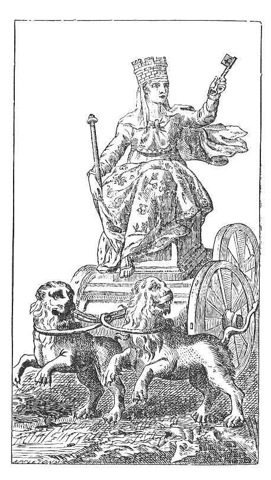

  
[Intangible Textual Heritage](../../index)  [Esoteric](../index) 
[Gnostic and Hermetic](../../gno/index)  [Index](index) 
[Previous](vow08)  [Next](vow10) 

------------------------------------------------------------------------

[Buy this Book at
Amazon.com](https://www.amazon.com/exec/obidos/ASIN/B002FGTM4C/internetsacredte)

------------------------------------------------------------------------

  
*The Virgin of the World*, by Anna Kingsford and Edward Maitland,
\[1884\], at Intangible Textual Heritage

------------------------------------------------------------------------

p. 41 p. 42

# *A Treatise on Initiations;*

# *or,*

# *Asclepios*.

p. 43

 

p. 44 p. 45

 

###### A

# *TREATISE ON INITIATIONS*;

###### OR,

# *ASCLEPIOS*.

 

### PART I.

*Hermes*:

IT is a God who hath brought thee to us, Asclepios, that thou mayst
assist at a divine discourse, and one which will be the most truly
religious of all we have as yet held, or with which we have been
inspired from on high. In understanding it thou wilt be in possession of
all blessings,--if so be indeed there are several, and if it be not more
correct to say there is but one blessing which comprises all. For each
one of them is bound to another; all

\[are

p. 46

are derived from one and make but one, so that their mutual bonds make
separation impossible. This is what thou wilt understand by paying
attention to that which we are about to say. But first, Asclepios, go
away for a little while and look for another hearer for our discourse.

\[Asclepios proposes to call Ammon.\]

There is no objection to Ammon's presence among us, says Trismegistos. I
have not forgotten that I have addressed to him, as to a dear son,
several writings on Nature and other subjects relating to exoteric
teaching. But it is thy name, Asclepios, which I shall inscribe at the
head of the present treatise. And call no other person than Ammon. For a
discourse upon the holiest matters of religion would be profaned by a
too numerous audience. It is an impiety to deliver to the knowledge of a
great number, a treatise full of divine majesty. [1](#fn_29)

\[Ammon enters the sanctuary, and completes the holy quartet, [2](#fn_30) filled with the presence of God. The
invitation to devotional silence comes from the lips of Hermes, and in
the presence of the attentive souls who

\[hang

p. 47

hang upon his words, the divine Love thus begins:--\] [1](#fn_31)

Every human soul, Asclepios, is immortal; but this immortality is not
uniform. It differs both in mode and in duration.

*Asclepios*:

It is because souls, Trismegistos, are not all of the same quality.

*Hermes*:

How quickly thou understandest the reason of things, Asclepios! I have
not yet said that all is one and that one is all, since all things were
in the Creator before the creation and we can call Him all since all
things are His members. Wherefore, throughout all this discourse, bear
in mind Him who is One and All, the Creator of all things.

Everything descends from heaven upon the earth, into the water, into the
air: only fire is vivifying, because it tends upwards; that which tends
downwards is subordinate to it. That which descends from above is
generative; that which emanates and rises is nutritive. The earth, alone
self-supported, is the receptacle of all things, and reconstructs the
types which she receives. That Universal Being which contains all and
which is all, puts into motion the soul and the world, all that nature
comprises. In the manifold unity of universal life, the innumerable
individualities distinguished by their variations, are, nevertheless,
united in such a manner

\[that

p. 48

that the whole is one, and that everything proceeds from unity.

Now this unity, which constitutes the world, is formed of four elements:
fire, water, earth, and air:--one single world, one single soul, and one
single God. Lend me now all the powers and all the penetration of thy
thought; for the idea of Divinity, which cannot be conceived save by
divine assistance, resembles a rapid stream precipitating itself onwards
with impetuosity, and often, therefore, outstrips the attention of the
listeners, and even of him who teaches.

 

------------------------------------------------------------------------

### Footnotes

[46:1](vow09.htm#fr_29) It is the indiscriminate
disclosure of spiritual mysteries to those who, by reason of their
exclusively fleshly condition, are incapable of appreciating and
reverencing then, that is called by Jesus a casting of pearls before
swine.

A.K.

[46:2](vow09.htm#fr_30) The fourth being Tatios,
the son of Trismegistos. All such discourses required--for occult
reasons--the presence of a minimum number of four. The four above
represented the four great divisions of existence, and constituted an
epitome of the Universe. "The form of the fourth is like the Son of
God," Nabuchodonosor is made to exclaim in the Hermetic allegory in
Daniel, representing the transmutation--instead of the expected
destruction--of the earthly elements of Man under the fiery alchemic
ordeal of suffering.

A.K.

[47:1](vow09.htm#fr_31) This identification of
Hermes with Eros--the only instance Dr. Menard says he has found in
literature--accords with the Hermetic axiom--" Love and Wisdom are One."

A.K.

------------------------------------------------------------------------

[Next: Part II](vow10)
