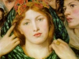
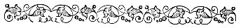

  
[Intangible Textual Heritage](../../index)  [Esoteric](../index) 
[Gnostic and Hermetic](../../gno/index)  [Index](index) 
[Previous](vow17)  [Next](vow19) 

------------------------------------------------------------------------

[Buy this Book at
Amazon.com](https://www.amazon.com/exec/obidos/ASIN/B002FGTM4C/internetsacredte)

------------------------------------------------------------------------

  
*The Virgin of the World*, by Anna Kingsford and Edward Maitland,
\[1884\], at Intangible Textual Heritage

------------------------------------------------------------------------

p. 76

### PART X.

*Hermes*:

LET us speak now of that which is immortal and of that which is mortal.
The multitude, ignorant of the reason of things, is troubled by the
approach and the fear of death. Death occurs by the dissolution of the
body, wearied with its toil. When the number which maintains unity is
complete –for the binding-power of the body is a number--the body dies.
And this happens when it can no longer support the burdens of life.
Such, then, is death; the dissolution of the body, and the end of
corporeal sensations. It is superfluous to trouble oneself about such a
matter. But there remains another necessary law which human ignorance
and unbelief despise.

*Asclepios*:

What law is this which is thus ignored or unregarded?

*Hermes*:

Hearken, O Asclepios. When the soul is separated from the body, she
passes under the supreme power of Deity, to be judged according to her
merits. If found pious and just she is allowed to dwell in the divine
abodes, but if she appears defiled with vice she is precipitated from
height to depth, and delivered over to the tempests and adverse
hurricanes of the air, the fire, and the water. Ceaselessly tossed about
between heaven and

\[earth

p. 77

earth by the billows of the universe, she is driven from side to side in
eternal penance, her immortal nature gives endless duration to the
judgment pronounced against her. [1](#fn_38) How
greatly must we fear so dreadful a fate! They who now refuse to believe
in such things will then be convinced against their will, not by words,
but by beholding; not by menaces, but by the pains they will endure.

*Asclepios*:

The faults of men, O Trismegistos, are not then punished only by human
laws?

*Hermes*:

O Asclepios, all that is terrestrial is mortal. Those who live according
to the corporeal state, and who fall short during their life of the laws
imposed on this condition, are subjected after death to chastisement so
much the more severe as the faults committed by them have remained
hidden; for the universal prescience of God will render the punishment
proportional to the transgression. [2](#fn_39)

\[*Asclepios*:

p. 78

*Asclepios*:

Who are they who deserve the greatest penalties, O Trismegistos?

*Hermes*:

Those who, condemned by human laws, die a violent death, in such wise
that they appear not to have paid the debt they owe to Nature, but to
have received only the reward of their actions. [1](#fn_40) The just man, on the contrary, finds in
religion and in piety a great help, and God protects him against all
evils. The Father and Lord of all things, Who alone is all, manifests
Himself willingly to all; not that He shows any man His abode, nor His
splendour, nor His greatness, but He enlightens man by intelligence
alone, whereby the darkness of error is dissipated, and the glories of
the truth revealed. By such means man is united to the Divine
Intelligence; aspiring thither he is delivered from the mortal part of

\[his

p. 79

his nature, and conceives the hope of everlasting life. Herein is the
difference between the good and the wicked. He who is illumined by
piety, religion, wisdom, the service and veneration of God, sees, as
with open eyes, the true reason of things; and, through the confidence
of this faith, surpasses other men even as the sun the other fires of
heaven. For if the sun enlightens the rest of the stars, it is not so
much by his greatness and power as by his divinity and sanctity. Thou
must see in him, O Asclepios, a secondary God, who rules the rest of the
world, and illumines all its inhabitants, animate and inanimate.

If the world is an animated being which is, which has been, and which
will be always living, nothing in it is mortal. Each of its parts is
alive, for in a single creature always living there is no room for
death. Thus is God the plenitude of life and of eternity, for He
necessarily lives eternally; the sun is lasting as the universe, and
governs perpetually all living creatures, being the fount and
distributor of all vitality. God is, then, the ever-lasting Ruler of all
things which receive life, and of all that give it, the eternal
dispenser of the being of the universe. Now, He has once for all
bestowed life on all living creatures by an immutable law which I will
expound to thee. The movement of the universe is the life of eternity;
the sphere of this motion is the eternity of life. The universe will
never cease from movement, nor will it ever become corrupt; the
permanence of eternal life surrounds it and protects it as a rampart. It
dispenses life to all that is in its bosom; it is the bond of all things
ordained under the sun. The effect of its motion is double; it is
vivified by the eternity which encompasses it, and, in its turn, it
vivifies all that it

\[contains,

p. 80

contains, diversifying everything according to certain fixed and
determined numbers and seasons. All things are ordained in time by the
action of the sun and the stars, according to a Divine law. Terrestrial
periods are distinguished by the condition of the atmosphere, by the
alternatives of heat and cold; celestial periods by the revolutions of
the constellations, which return at fixed intervals of time to the same
places in the heavens. The universe is the stage of time, the course and
movement of which maintain Life. Order and time produce the renewal of
all things in the world by recurring seasons.

 

 

------------------------------------------------------------------------

### Footnotes

[77:1](vow18.htm#fr_38) This passage resembles a
fragment of Empedocles, cited by Plutarch:--"The etherial force pursues
them towards the sea, the sea vomits them forth upon its shores, the
earth in turn flings them upward to the untiring sun, and the sun again
drives them back into the whirl-wind of space. Thus all the elements
toss them from one to another, and all hold them in horror." \[It is
needless to add that the whole of this passage is allegorical, and that
the penance referred to is that of Purgatory, or *Kama Loka*--the
intermediate state of purification.\]

A.K.

[77:2](vow18.htm#fr_39) This passage qualifies
the previous statement in Sect. IX., concerning the duration of the
purgatorial state, and shows that it is not p.
78 to be regarded as eternal, but as proportional to the faults
committed. Moreover, it supplies a reason for the Catholic custom of
shriving the dying, seeing that unconfessed sin entails heavier penalty
than sin confessed, and therefore no longer "hidden."

A.K.

[78:1](vow18.htm#fr_40) An obscure passage.
Probably its meaning is that great sinners, cut off by violent means in
the midst of their iniquity, have no time to work out their penance in
life, and, being thus deprived of the opportunity of restitution and
amendment, suffer the more acutely in purgatory. For since they cannot
discharge their debt on earth, they are delivered to torment after death
until the "uttermost farthing" is paid.

A.K.

\[The opinions expressed in the above, or other scholarly annotations
herein, must be disclaimed being in any way necessarily accepted as
expressive of, or identical with my own.

Robt. H. Fryar, Bath.\]

------------------------------------------------------------------------

[Next: Part XI](vow19)
