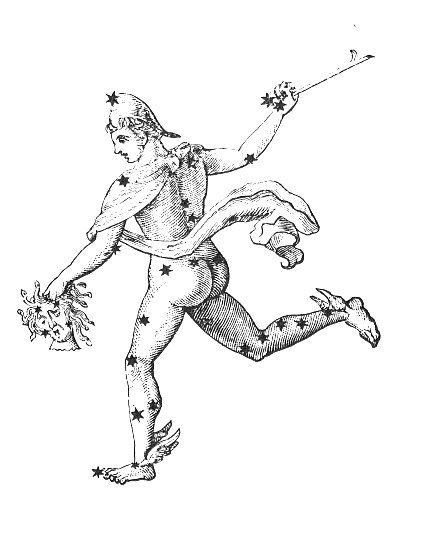
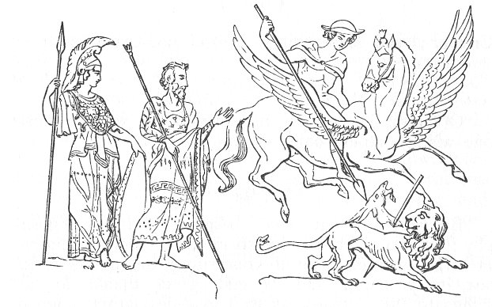

  
[Intangible Textual Heritage](../../index)  [Esoteric](../index) 
[Gnostic and Hermetic](../../gno/index)  [Index](index) 
[Previous](vow27)  [Next](vow29) 

------------------------------------------------------------------------

[Buy this Book at
Amazon.com](https://www.amazon.com/exec/obidos/ASIN/B002FGTM4C/internetsacredte)

------------------------------------------------------------------------

  
*The Virgin of the World*, by Anna Kingsford and Edward Maitland,
\[1884\], at Intangible Textual Heritage

------------------------------------------------------------------------

p. 115 p. 116

# *Fragments*.

p. 117 p. 118

 

p. 119

 

# FRAGMENTS OF THE BOOK OF HERMES TO HIS SON TATIOS.

 

### PART I.

*Trismegistos*.

IT is for the love of men and for the veneration of God, O my son, that
I begin to write this. For there is no other true religion than to
meditate on the universe and give thanks to the

\[Creator;

p. 120

\[paragraph continues\] Creator; and these
things I shall not cease to do.

*Tatios*.

O father, if nothing here below be real, how can one wisely employ one's
life?

*Trismegistos*.

Be religious, my son; religion is lofty philosophy; without philosophy
there is no lofty religion. He who instructs himself concerning the
universe, its law, its principle, and its end, gives thanks for all
things to the Creator as to a gracious father, a good protector, a
faithful teacher. This is religion, and by means of it we know where
truth is and what it is. Knowledge increases religion. For when once the
soul, imprisoned within the body, has lifted herself to the perception
of the real Good and of Truth, she cannot again fall back. The might of
Love, and the oblivion of all evil things, forbid the soul who knows her
Maker to separate herself from the Good. Herein, my son, is the aim of
religion; if thou canst attain thereunto, thy life will be pure, thy
death happy; thy soul will know whither she ought to direct her flight.
Herein is the only way which leads to Truth, which, indeed, our
ancestors trod, and by which they arrived at the attainment of the Good.
This way is beautiful and even; nevertheless, it is difficult for the
soul to walk therein so long as she is immured within the prison of the
body. For, first, she must contend against herself, and having
accomplished a division of herself,

\[she

p. 121

she must submit to that part of herself which is first in dignity. For
the *one* struggles against the *two*, that would fain rise, but these
would drag it downwards. [1](#fn_47) Nor is
victory the same to both sides; for the *one* tends towards the Good,
and the *two* towards Evil; the *one* would be free, the *two* cling to
servitude. If the *two* be overcome, there remains a bulwark of defence
for them and for their master; but if the *one* be the weaker, it is
drawn away by the *two*, and punished in this life here below. It is
this *one*, my son, which ought to be thy guide. See that thou anoint
thyself with oil for the struggle, maintain the fight for life, and
remain victorious.

And now, my son, I am about to sum up our principles; thou wilt
understand my words by remembering that which thou hast learnt.

All beings are endowed with motion; non-being alone is motionless. All
bodies transform themselves some only decompose. All creatures are not
mortal nor are all immortal. That which is dissoluble is corruptible;
that which is permanent is immutable; that which is immutable is
eternal; that which is continually generated is continually corrupted,
but that which is born but once is not corrupted and is not changed into
any other thing. First God, then the Universe, and thirdly Man; the
Universe for Man, and Man for God. The emotional part of the Soul is
mortal; her rational part is immortal; all substance is immortal, all
substance is subjected to change. All being is dual; no being is

\[permanent.

p. 122

permanent. All things are not animated by soul, but all that is being is
animated by soul. All that is passive is sentient; all that is sentient
is transient. Everything that suffers and enjoys is a mortal creature;
all that enjoys and suffers not is a being immortal. Not every body is
subject to disease, but every body so subject is destructible. In God is
Intelligence; in Man is Reason. Reason is in Intelligence, Intelligence
is intransient. There is nothing real in the corporeal; nothing false in
the incorporeal. Everything that is born changes, but not everything
born corrupts. There is nothing perfect upon earth, nor anything evil in
heaven. God is perfect; man is evil. The good comes by will; evil
against will. The Gods chose the good as good. Time is divine; law is
human. Evil is the pabulum of the world; Time is the destruction of man.
All things in heaven are immutable; nothing is immutable on earth. In
heaven, then, is no servitude; on earth there is no freedom. Nothing in
heaven is unknown; on earth nothing is known. There is nothing in common
between celestial things and things terrestrial. All is irreproachable
in heaven; on earth nothing is without reproach. The immortal knows no
mortality; nor does the mortal know immortality. That which is sown does
not always come up; but that which comes up has always been sown.
Corruptible bodies have two periods of existence: from conception to
birth, and from birth to death; but the eternal entity has one period
only from the moment of being. Dissoluble bodies increase and diminish.
Dissoluble matter divides itself according to two contrary
terms--destruction and birth; immortal substance divides itself either
into itself or into its similars. The birth of man is a destruction; the
destruction of man is an

\[element

p. 123

element of birth. That which ends begins; that which begins ends. Among
beings, some are in bodies, some in forms, some in energies. The body is
in forms; form and energy are in bodies. The immortal receives nothing
from the mortal; but the mortal receives from the immortal. The mortal
enters not into an immortal form; but the immortal enters into a mortal
body. Energies tend not upward, but downward. That which is on earth
profits not that which is in heaven; but all that is in heaven profits
that which is on earth. Heaven contains immortal entities; earth
contains perishable bodies. Earth is irrational; heaven is reasonable.
Celestial things are under the power of heaven; terrestrial things are
upon earth. Heaven is the primordial element. Divine providence is
order; necessity is the instrument with which providence works. Fortuity
is the vehicle of disorder, the false image of energy, a delusive
seeming. What is God but immutable Good, or man but continual evil?

In remembering these principles, thou wilt easily recollect the things I
have explained to thee more at length, and which are therein resumed.
But avoid speaking of them to the multitude; not that I desire to
prohibit the multitude from knowing these things, but that I would not
have thee exposed to the mockeries of the vulgar. Like attracts like;
but between dissimilars there is no fellowship. These discourses ought
to have but a small number of auditors, else before long they will have
none at all. There is, moreover, a special peril attaching to them, for
by means of them the wicked may be instigated to do worse. Keep thyself,
therefore, from the crowd, which cannot understand the virtue of these
discourses.

\[*Tatios*.

p. 124

*Tatios*.

What meanest thou, my father?

*Trismegistos*.

Hearken, my son. The human race is drawn to-wards evil. Evil is its
nature, and pleases it. If men should learn that the world is created,
that all is done according to providence and necessity, and that by
necessity and destiny all things are governed, they would readily begin
to despise all things because they are created; to attribute vice to
destiny, and to give the rein to all manner of iniquity. Therefore,
abstain from the crowd, so that by means of ignorance the vulgar may be
kept within bounds, even through fear of the unknown.

 

 

------------------------------------------------------------------------

### Footnotes

[121:1](vow28.htm#fr_47) With Plato, says Dr.
Menard, Trismegistos here opposes Intelligence, the first part of the
Soul, to the two other parts, Passion and Desire.

A.K.

------------------------------------------------------------------------

[Next: Part II](vow29)
