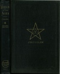

  
[Intangible Textual Heritage](../../index)  [Esoteric](../index) 
[Index](index)  [Next](wota01) 

------------------------------------------------------------------------

[Buy this Book at
Amazon.com](https://www.amazon.com/exec/obidos/ASIN/B0008BCE64/internetsacredte)

------------------------------------------------------------------------

  
*Wisdom of the Ages*, by George A. Fuller, \[1916\], at Intangible
Textual Heritage

------------------------------------------------------------------------

# WISDOM OF THE AGES

## REVELATIONS FROM ZERTOULEM THE PROPHET OF TLASKANATA

##### AUTOMATICALLY TRANSCRIBED BY

### By Rev. George A. Fuller, M. D.

##### INTRODUCTION BY

##### SUSIE C. CLARK

#### SECOND EDITION

#### CHRISTOPHER PUBLISHING HOUSE

#### BOSTON

#### \[1916\]

 
[  
Click to enlarge](img/cover.jpg)  
Cover  

  [  
Click to enlarge](img/inscrip.jpg)  
Inscription from author  

  [  
Click to enlarge](img/title.jpg)  
Title Page  

 
[  
Click to enlarge](img/verso.jpg)  
Verso  

Scanned, proofed and formatted by John Bruno Hare at Intangible Textual
Heritage, May 2008. This text is in the public domain in the US because
it was originally published prior to 1923.

------------------------------------------------------------------------

[Next: Introduction](wota01)
