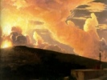

  
[Intangible Textual Heritage](../../index)  [Esoteric](../index) 
[Index](index)  [Previous](wota51) 

------------------------------------------------------------------------

[Buy this Book at
Amazon.com](https://www.amazon.com/exec/obidos/ASIN/B0008BCE64/internetsacredte)

------------------------------------------------------------------------

  
*Wisdom of the Ages*, by George A. Fuller, \[1916\], at Intangible
Textual Heritage

------------------------------------------------------------------------

p. 211

### TLASKAN WORDS.

Akasa. The great ocean of ether sweeping
in and through all things.

Lomkatos. Omn taken; those who have
passed through the change called death.

Neontu. One of the disciples of Zertoulem
most deeply loved by the Master.

Omn. The Eternal; God.

Otmar. Under clouds; not yet awakened to
the light of the spirit.

Sebas-thā-ontu. Sebas, mountains; thā,
the sun; ontu, setting. "The Mountains of the Setting Sun."

Thā. The sun.

Tlaskan. The sacred race that peopled a
portion of Central America many thousands of years ago.

Tlaskanata. The Land of the Sacred
Record; so called because the people were led to this land by a prophecy
in their sacred writings.

 

 
