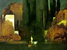

  
[Intangible Textual Heritage](../../index)  [Esoteric](../index) 
[Index](index)  [Previous](wsl00)  [Next](wsl02) 

------------------------------------------------------------------------

[Buy this Book at
Amazon.com](https://www.amazon.com/exec/obidos/ASIN/B002F9NJRA/internetsacredte)

------------------------------------------------------------------------

  
*A Wanderer in the Sprit Lands*, by Franchezzo (A. Farnese), \[1896\],
at Intangible Textual Heritage

------------------------------------------------------------------------

### Preface by the Transcriber.

The following narrative was written more than a year ago, and in giving
it to the public I do not claim to be its author, since I have only
acted the part of an amanuensis and endeavored to write down as
truthfully and as carefully as I could, the words given to me by the
Spirit Author himself, who is one of several spirits who have desired me
to write down for them their experiences in the spirit world.

I have had to write the words as fast as my pen could travel over the
paper, and many of the experiences described and opinions advanced are
quite contrary to what I myself believed to be in accordance with the
conditions of life in the world of spirits.

The Spirit Author Franchezzo I have frequently seen materialized, and he
has been recognized on these occasions by friends who knew him in earth
life.

Having given the narrative to the public as I received it from the
Spirit Author, I must leave with him all responsibility for the opinions
expressed and the scenes described.

A. FARNESE.  

London, 1896

------------------------------------------------------------------------

[Next: Dedication by Author.](wsl02)
