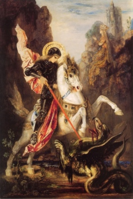

  
[Intangible Textual Heritage](../../index)  [Miscellaneous](../index) 
[Legendary Creatures](../../lcr/index) 

------------------------------------------------------------------------

[Buy this Book at
Amazon.com](https://www.amazon.com/exec/obidos/ASIN/B002ACPL5U/internetsacredte)

------------------------------------------------------------------------

<table width="75%">
<colgroup>
<col style="width: 50%" />
<col style="width: 50%" />
</colgroup>
<tbody>
<tr class="odd">
<td width="50%" data-valign="TOP"> 
St. George and the Dragon, Gustave Moreau, late 19th Century</td>
<td width="50%" data-valign="CENTER"><h1 id="dragons-and-dragon-lore" data-align="CENTER">Dragons and Dragon Lore</h1>
<h2 id="by-ernest-ingersoll" data-align="CENTER">By Ernest Ingersoll</h2>
<h4 id="section" data-align="CENTER">[1928]</h4></td>
</tr>
</tbody>
</table>

------------------------------------------------------------------------

[Contents](#contents)    [Start Reading](ddl00)    [Text
\[Zipped\]](ddl.txt.gz)

------------------------------------------------------------------------

|                                                                                                                           |
|---------------------------------------------------------------------------------------------------------------------------|
|  |

This is a comprehensive study of the mythology of the dragon on a
world-wide scale. Ingersoll deals with this archetypal beast in the lore
of India, Korea, Japan, China, Wales, as well as the English legend of
St. George. Anyone wishing to study dragons will find this a
treasure-trove of information on the subject.

------------------------------------------------------------------------

 [Title Page](ddl00)  
[Introduction](ddl01)  
[Contents](ddl02)  
[Chapter One: Birth Of The Dragon](ddl03)  
[Chapter Two: Wanderings of the Young Dragon](ddl04)  
[Chapter Three: Indian Nagas and Draconic Prototypes](ddl05)  
[Chapter Four: The Divine Spirit of the Waters](ddl06)  
[Chapter Five: Draconic Grandparents](ddl07)  
[Chapter Six: The Dragon as a Rain-God](ddl08)  
[Chapter Seven: Korean Water And Mountain Spirits](ddl09)  
[Chapter Eight: ''The Men of the Dragon Bones''](ddl10)  
[Chapter Nine: The Dragon in Japanese Art](ddl11)  
[Chapter Ten: The Dragon's Precious Pearl](ddl12)  
[Chapter Eleven: The Dragon Invades the West](ddl13)  
[Chapter Twelve: The 'Old Serpent' and his Progeny](ddl14)  
[Chapter Thirteen: Welsh Romances and English Legends](ddl15)  
[Chapter Fourteen: The Dragon and the Holy Cross](ddl16)  
[Chapter Fifteen: To the Glory of Saint George](ddl17)  
