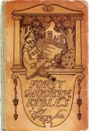

  
[Intangible Textual Heritage](../../index)  [Miscellaneous](../index) 
[Index](index)  [Next](fmf01) 

------------------------------------------------------------------------

*Forty Modern Fables*, by George Ade, \[1901\], at Intangible Textual
Heritage

------------------------------------------------------------------------

# FORTY MODERN FABLES

## BY GEORGE ADE

### NEW YORK

### R.H. RUSSELL

### \[1901\]

Scanned by Eliza Yetter, 2006. Additional proofing and formatting at
Intangible Textual Heritage. This text is in the public domain in the
United States because it was published prior to January 1st, 1923. These
files may be used for any non-commercial purpose provided this notice of
attribution is left intact in all copies.

[  
Click to enlarge](img/cover.jpg)  
Front Cover  

------------------------------------------------------------------------

[Next: A Table of Contents](fmf01)
