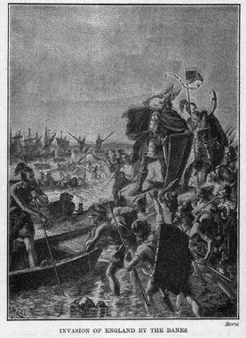
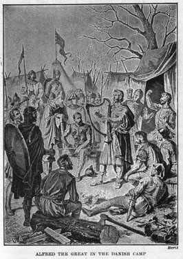

  
[Intangible Textual Heritage](../../index)  [Miscellaneous](../index) 
[Index](index)  [Previous](fmma16)  [Next](fmma18) 

------------------------------------------------------------------------

*Famous Men of the Middle Ages*, by John Henry Haaren, \[1904\], at
Intangible Textual Heritage

------------------------------------------------------------------------

ALFRED THE GREAT

KING FROM 871-901 A.D.

 

I

 

THE Danes were neighbors of the Norwegian Vikings, and like them were
fond of the sea and piracy. They plundered the English coasts for more
than a century; and most of northern and eastern England became for a
time a Danish country with Danish kings.

 

What saved the rest of the country to the Saxons was the courage of the
great Saxon king, Alfred.

 

Alfred was the son of Ethelwulf, king of the West Saxons. He had a
loving mother who brought him up with great care. Up to the age of
twelve, it is said, he was not able to read well, in spite of the
efforts of his mother and others to teach him.

 

When Alfred was a boy there were no printed books. The wonderful art of
printing was not invented until about the year 1440--nearly six hundred
years later than Alfred's time. Moreover, the art of making paper had
not yet been invented. Consequently the few books in use in Alfred's
time were written by skillful penmen, who wrote generally on leaves of
parchment, which was sheepskin carefully prepared so that it might
retain ink.

 

One day Alfred's mother showed him and his elder brothers a beautiful
volume which contained a number of the best Saxon ballads. Some of the
words in this book were written in brightly colored letters, and upon
many of the leaves were painted pictures of gaily-dressed knights and
ladies.

 

"Oh, what a lovely book!" exclaimed the boys.

 

"Yes, it is lovely," replied the mother. "I will give it to whichever of
you children can read it the best in a week."

 

Alfred began at once to take lessons in reading, and studied hard day
after day. His brothers passed their time in amusements and made fun of
Alfred's efforts. They thought he could not learn to read as well as
they could, no matter how hard he should try.

 

At the end of the week the boys read the book to their mother, one after
the other. Much to the surprise of his brothers, Alfred proved to be the
best reader and his mother gave him the book.

 

While still very young Alfred was sent by his father to Rome to be
anointed by His Holiness, the Pope. It was a long and tiresome journey,
made mostly on horseback.

 

With imposing, solemn ceremony he was anointed by the Holy Father.
Afterwards he spent a year in Rome receiving religious instruction.

 

II

 

IN the year 871, when Alfred was twenty-two years old, the Danes invaded
various parts of England. Some great battles were fought, and Alfred's
elder brother Ethelred, king of the West Saxons, was killed. Thus Alfred
became king.

 

The Danes still continued to fight the Saxons, and defeated Alfred in a
long and severe struggle. They took for themselves the northern and
eastern parts of England.

 

Moreover, Danes from Denmark continued to cross the sea and ravage the
coast of Saxon England. They kept the people in constant alarm. Alfred
therefore determined to meet the pirates on their own element, the sea.
So he built and equipped the first English navy, and in 875 gained the
first naval victory ever won by the English.

 

A few years after this, however, great numbers of Danes from the
northern part of England came pouring into the Saxon lands. Alfred
himself was obliged to flee for his life.

 

 

 

For many months he wandered through forests and over hills to avoid
being taken by the Danes. He sometimes made his home in caves and in the
huts of shepherds and cowherds. Often he tended the cattle and sheep and
was glad to get a part of the farmer's dinner in pay for his services.

 

Once, when very hungry, he went into the house of a cowherd and asked
for something to eat. The cowherd's wife was baking cakes and she said
she would give him some when they were done.

 

"Watch the cakes and do not let them burn, while I go across the field
to look after the cows," said the woman, as she hurried away. Alfred
took his seat on the chimney-corner to do as he was told. But soon his
thoughts turned to his troubles and he forgot about the cakes.

 

When the woman came back she cried out with vexation, for the cakes were
burned and spoiled. "You lazy, good-for-nothing man!" she said, "I
warrant you can eat cakes fast enough; but you are too lazy to help me
bake them."

 

With that she drove the poor hungry Alfred out of her house.  In his
ragged dress he certainly did not look like a king, and she had no idea
that he was anything but a poor beggar.

 

III

 

SOME of Alfred's friends discovered where he was hiding and joined him.
In a little time a body of soldiers came to him and a strong fort was
built by them. From this fort Alfred and his men went out now and then
and gave battle to small parties of the Danes. Alfred was successful and
his army grew larger and larger.

 

One day he disguised himself as a wandering minstrel and went into the
camp of the Danes. He strolled here and there, playing on a harp and
singing Saxon ballads. At last, Guthrum, the commander of the Danes,
ordered the minstrel to be brought to his tent.

 

Alfred went. "Sing to me some of your charming songs," said Guthrum. "I
never heard more beautiful music." So the kingly harper played and sang
for the Dane, and went away with handsome presents. But better than
that, he had gained information that was of the greatest value.

 

In a week he attacked the Danish forces and defeated them with great
slaughter in a battle which lasted all day and far into the night.
Guthrum was taken prisoner and brought before Alfred.

 

Taking his harp in his hands, Alfred played and sang one of the ballads
with which he had entertained Guthrum in the camp. The Dane started in
amazement and exclaimed:

 

"You, then, King Alfred, were the wandering minstrel?"

 

 

 

"Yes," replied Alfred, "I was the musician whom you received so kindly.
Your life is now in my hands; but I will give you your liberty if you
will become a Christian and never again make war on my people."

 

"King Alfred," said Guthrum, "I will become a Christian, and so will all
my men if you will grant liberty to them as to me; and henceforth, we
will be your friends."

 

Alfred then released the Danes, and they were baptized as Christians.

 

An old road running across England from London to Chester was then
agreed upon as the boundary between the Danish and Saxon kingdoms; and
the Danes settled in East Anglia, as the eastern part of England was
called.

 

Years of peace and prosperity followed for Alfred's kingdom. During
these years the king rebuilt the towns that had been destroyed by the
Danes, erected new forts, and greatly strengthened his army and navy.

 

He also encouraged trade; and he founded a school like that established
by Charlemagne. He himself translated a number of Latin books into
Saxon, and probably did more for the cause of education than any other
king that ever wore the English crown.

 

 

------------------------------------------------------------------------

[Next: Henry The Fowler. King From 919-936 A.D.](fmma18)
