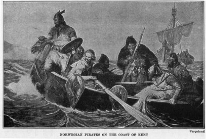

  
[Intangible Textual Heritage](../../index)  [Miscellaneous](../index) 
[Index](index)  [Previous](fmma20)  [Next](fmma22) 

------------------------------------------------------------------------

*Famous Men of the Middle Ages*, by John Henry Haaren, \[1904\], at
Intangible Textual Heritage

------------------------------------------------------------------------

EDWARD THE CONFESSOR

KING FROM 1042-1066

 

I

 

THE Danish kings who followed Canute were not like him. They were cruel,
unjust rulers and all the people of England hated them. So when in the
year 1042 the last of them died, Edward, the son of the Saxon Ethelred,
was elected king.

 

He is known in history as Edward the Confessor. He was a man of holy
life and after his death was made a saint by the Church, with the title
of "the Confessor." Though born in England, he passed the greater part
of his life in Normandy as an exile from his native land. He was
thirty-eight years old when he returned from Normandy to become king.

 

As he had lived so long in Normandy he always seemed more like a Norman
than one of English birth. He generally spoke the French language and he
chose Normans to fill many of the highest offices in his kingdom.

 

For the first eight years of his reign there was perfect peace in his
kingdom, except in the counties of Kent and Essex, where pirates from
the North Sea made occasional attacks.

 

 

 

These pirates were mostly Norwegians, whose leader was a barbarian named
Kerdric. They would come sweeping down upon the Kentish coast in many
ships, make a landing where there were no soldiers, and fall upon the
towns and plunder them. Then, as swiftly and suddenly as they had come,
they would sail away homeward, before they could be captured.

 

One day Kerdic's fleet arrived off the coast, and as no opposing force
was visible, the pirates landed and started toward the nearest town to
plunder it.

 

By a quick march a body of English soldiers reached the town before the
pirates, and when the latter arrived they found a strong force drawn up
to give them battle. A short struggle took place. More than half of the
pirates were slain and the remainder were taken prisoners.

 

After the prisoners had been secured the English ships that were
stationed on the coast attacked the pirate fleet and destroyed it.

 

II

 

EDWARD took part in the events upon which Shakespeare, five hundred
years later, founded his famous tragedy of "Macbeth."

 

There lived in Scotland during his reign an ambitious nobleman named
Macbeth, who invited Duncan, the King of Scotland, to his castle and
murdered him. He tried to make it appear that the murder had been
committed by Duncan's attendants and he caused the king's son and heir,
Prince Malcolm, to flee from the land. He then made himself king of
Scotland.

 

Malcolm hastened to England and appealed to King Edward for help.

 

When the king was told the number of soldiers Malcolm would probably
need he gave orders for double that number to march into Scotland.
Malcolm with this support attacked Macbeth, and after several
well-fought battles drove the usurper from Scotland and took possession
of the throne.

 

Edward did a great deal during his reign to aid the cause of
Christianity.  He rebuilt the ancient Westminster Abbey in London and
erected churches and monasteries in different parts of England.

 

Edward was long supposed to have made many just laws, and years after
his death the English people, when suffering from bad government, would
exclaim, "Oh, for the good laws and customs of Edward the Confessor!"
What he really did was to have the old laws faithfully carried out.

 

He died in 1066 and was buried in Westminster Abbey.

 

 

------------------------------------------------------------------------

[Next: William The Conqueror. King From 1066-1087](fmma22)
