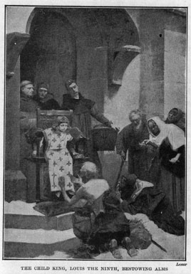
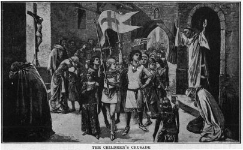
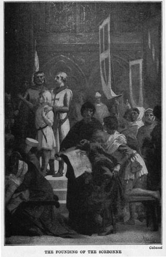

  
[Intangible Textual Heritage](../../index)  [Miscellaneous](../index) 
[Index](index)  [Previous](fmma25)  [Next](fmma27) 

------------------------------------------------------------------------

*Famous Men of the Middle Ages*, by John Henry Haaren, \[1904\], at
Intangible Textual Heritage

------------------------------------------------------------------------

LOUIS THE NINTH

KING FROM 1226-1270

 

I

 

AFTER the time of Barbarossa and Richard Coeur de Lion lived another
great Crusading king. This was a grandson of Philip II, named Louis IX,
who became sovereign of France in 1226. He was then only eleven years
old, so for some years his mother ruled the kingdom.

 

A few years after he had begun to reign Louis decided to make his
brother Alphonse the governor of a certain part of France. The nobles of
the region refused to have Alphonse as governor and invited Henry III of
England to help them in a revolt.

 

Henry crossed to France with an army to support the rebellious nobles.
He was duke of Aquitaine and Gascony; so that although he was the king
in England he had to do homage to the king of France for his possessions
in that country, and fight for him if called upon to do so.

 

 

 

Louis gathered an army and hastened to meet the English troops. He drove
Henry from place to place, until at last he forced him to make terms of
peace. The rebellious nobles who had invited the English king to France
soon after swore allegiance to Louis and afterwards he had little
trouble in his kingdom.

 

Once Louis was dangerously ill and his life was despaired of. Finally he
was believed to be dying and his wife and chief officials gathered round
his bed to await the end. Suddenly he roused himself and said in a
feeble voice, "The cross! The cross!"

 

They laid the cross upon his heart and he clasped it fervently. For a
while he slumbered. When he awoke he appeared much better. In a day or
two he was entirely well. He then made a solemn vow that in thankfulness
for his restoration he would go on a Crusade to the Holy Land.

 

Louis lived at a time when everybody was full of the Crusading spirit. A
few years before he was born even the children in France and Germany
started out upon a Crusade of their own. It is called in history the
"Children's Crusade." Several thousand left their homes and marched
toward the Mediterranean. They thought that God would open a pathway to
the Holy Land for them through its waters. A number of them died of cold
and hunger when trying to cross the Alps. Some reached Rome, and when
the Pope saw them he told them to return home and not think of going on
a Crusade until they were grown up.

 

 

 

It is easy to understand how in such an age people flocked to Louis'
banner when he asked for volunteers to go with him on another Crusade.

 

In a few months forty thousand Crusaders assembled at a French port on
the Mediterranean Sea. On a bright day in August, 1248, they went on
board the fleet which was ready to sail. The king called to the
Crusaders, "Sing in the name of God. Shout forth his praises as we sail
away." Then quickly, on ship after ship, shouts of praise burst from the
lips of thousands and amid the grand chorus the fleet began its voyage.

 

The Crusaders went to Damietta, in Egypt. Louis was so eager to land
that he jumped into water up to his waist and waded ashore. He captured
the city without striking a blow.

 

He had resolved to make war on the Moslems in Egypt rather than in the
Holy Land, so when he left Damietta he marched southward.

 

He supposed there would be no strong force to stop his progress.
However, he was mistaken, for he had not marched forty miles toward
Cairo when he was attacked by a Moslem army led by the sultan of Egypt.

 

A great battle was fought. The Crusaders were commanded by King Louis
and throughout the battle showed the utmost bravery, but they were
outnumbered. Thousands were slain and the survivors retreated toward
Damietta.

 

The Moslems pursued them and the Crusaders were obliged to surrender.
Out of the forty thousand men who had left France only about six
thousand now remained. Many had died of disease as well as in battle.

 

King Louis was among the prisoners, and the sultan of Egypt agreed to
release him only upon the payment of a large ransom.

 

When the ransom had been paid a truce was made for ten years between
Louis and the sultan, and the good king left Egypt. He then went to the
Holy Land, and for four years worked to deliver Crusaders who were in
Moslem prisons.

 

II

 

DURING the time that Louis was in the Holy Land his mother ruled France
as regent. When she died he returned immediately to his kingdom and
devoted himself to governing it.

 

In 1252 he took part in the founding of the Sorbonne, the most famous
theological college of Europe from the days of St. Louis down to the
time of the French Revolution.

 

 

 

He ruled his people so wisely and justly that it is hard to find any
better king or even one equally as good in the whole line of French
kings. He never wronged any man himself, or knowingly allowed any man to
be wronged by others.

 

Near his palace there was a grand oak with wide-spreading branches,
under which he used to sit on pleasant days in summer. There he received
all persons who had complaints to make, rich and poor alike. Every one
who came was allowed to tell his story without hindrance.

 

For hours Louis would listen patiently to all the tales of wrong-doing,
of hardships and misery that were told him, and he would do what he
could to right the wrongs of those who suffered.

 

When news came of some more dreadful persecutions of Christians by the
Moslems in Palestine, Louis again raised an army of Crusaders and
started with them for Tunis, although he was sick and feeble--so sick,
indeed, that he had to be carried on a litter. Upon his arrival at Tunis
he was attacked by fever and died in a few days.

 

He is better known to the world as Saint Louis than as Louis IX, because
some years after his death Pope Boniface VIII canonized him on account
of his pious life and his efforts to rescue the Holy Land from the
Turks.

 

 

------------------------------------------------------------------------

[Next: Robert Bruce. King From 1306-1329](fmma27)
