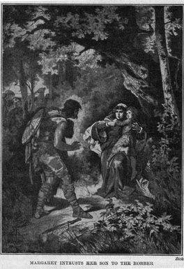
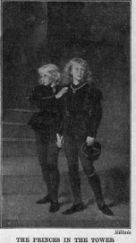

  
[Intangible Textual Heritage](../../index)  [Miscellaneous](../index) 
[Index](index)  [Previous](fmma34) 

------------------------------------------------------------------------

*Famous Men of the Middle Ages*, by John Henry Haaren, \[1904\], at
Intangible Textual Heritage

------------------------------------------------------------------------

WARWICK THE KINGMAKER

LIVED FROM 1428-1471

 

I

 

THE earl of Warwick, known as the "kingmaker," was the most famous man
in England for many years after the death of Henry V. He lived in a
great castle with two towers higher than most church spires. It is one
of the handsomest dwellings in the world and is visited every year by
thousands of people. The kingmaker had a guard of six hundred men. At
his house in London meals were served to so many people that six fat
oxen were eaten at breakfast alone. He had a hundred and ten estates in
different parts of England and no less than 30,000 persons were fed
daily at his board.  He owned the whole city of Worcester, and besides
this and three islands, Jersey, Guernsey and Alderney, so famed in our
time for their cattle, belonged to him.

 

He had a cousin of whom he was as fond as if he were a brother. This was
Richard, duke of York, who was also own cousin to King Henry VI, the son
of Henry V.

 

One evening as the sun was setting, and the warders were going to close
the gates of the city of York for the night, a loud blast of a horn was
heard. It was made by the sentry on the wall near the southern gate. An
armed troop was approaching. When they drew near the gate their scarlet
coats embroidered with the figure of a boar proved them to be the men of
the earl of Warwick. The earl himself was behind them. The gate was
opened.

 

Passing through it and on to the castle, the earl and his company were
soon within its strong stone walls.

 

"Cousin," said the earl of Warwick to the duke of York as they sat
talking before a huge log fire in the great room of the castle, "England
will not long endure the misrule of a king who is half the time out of
his mind."

 

The earl spoke the truth. Every now and then Henry VI lost his reason,
and the duke of York, or some other nobleman, had to govern the kingdom
for him.

 

The earl of Warwick added: "You are the rightful heir to the throne. The
claim of Henry VI comes through Lancaster, the fourth son of Edward
III--yours through Lionel, the second. His claim comes through his
father only--yours through both your father and mother.  It is a better
claim and it is a double claim."

 

"That is true, my cousin of Warwick," replied the duke of York, "but we
must not plunge England into war."

 

"Surely not if we can help it," replied the earl. "Let us first ask for
reform. If the king heeds our petition, well and good. If not I am
determined, cousin of York, that you shall sit on the throne of England
instead of our insane sovereign."

 

A petition was soon drawn up and signed and presented to Henry. It asked
that Henry would do something which would make the people contented.

 

The king paid no attention to it. Then a war began.  It was the longest
and most terrible that ever took place in England. It lasted for thirty
years.

 

Those who fought on the king's side were called Lancastrians, because
Henry's ancestor, John of Gaunt, was the duke of Lancaster. The friends
of Richard were called Yorkists, because he was duke of York. The
Lancastrians took a red rose for their badge; the Yorkists a white one.
For this reason the long struggle has always been called the "War of the
Roses."

 

In the first great battle the Red Rose party was defeated and the king
himself was taken prisoner.

 

The victors now thought that the duke of York ought to be made king at
once. However, a parliament was called to decide the question, and it
was agreed that Henry should be king as long as he lived, but that at
his death the crown should pass to the duke of York.

 

II

 

MOST people though this was a wise arrangement; but Queen Margaret,
Henry's wife, did not like it at all, because it took from her son the
right to reign after his father's death. So she went to Scotland and the
North of England, where she had many friends, and raised an army.

 

She was a brave woman and led her men in a battle in which she gained
the victory. The duke of York was killed, and the queen ordered some of
her men to cut off his head, put upon it a paper crown in mockery, and
fix it over one of the gates of the city of York.

 

Warwick attacked the queen again as soon as he could; but again she was
victorious and captured from Warwick her husband, the king, whom the
earl had held prisoner for some time past.

 

This was a great triumph for Margaret, for Henry became king once more.

 

 

 

But the people were still discontented. The York party was determined
that Edward, the son of the old duke of York, should be made king. So
thousands flocked to the White Rose standard and Warwick marched to
London at their head.

 

The queen saw that her only safety was in flight. She left London and
the kingmaker entered the city in triumph.

 

The citizens had been very fond of the old duke of York, and when his
party proclaimed his handsome young son King Edward IV, the city
resounded with the cry "God save King Edward."

 

Brave Queen Margaret was completey defeated in another battle. The story
is told that after this she fled into a forest with her young son. A
robber met them, but Margaret, with wonderful courage, said to him, "I
am your queen and this is your prince. I entrust him to your care."

 

The man was pleased with the confidence that she showed. He took her and
the young prince to a safe hiding place, and helped them to escape from
England in a sailing vessel.

 

III

 

EDWARD IV now seemed to be seated securely upon the throne. But trouble
was near. Warwick wished him to follow his advice. Edward thought he
could manage without any advice. Then the king and the kingmaker
quarreled, and at last became open enemies and fought one another on the
field of battle. The end of it was that Warwick was defeated, and driven
out of the country. He sailed across the channel and sought refuge in
France.

 

There whom should he meet but his old enemy, Queen Margaret. She had
beaten him in battle, and had beheaded his cousin Richard, duke of York;
he had beaten her and driven her from her kingdom; and twice he had made
her husband prisoner and taken from him his crown. In spite of all this
the two now became fast friends, and the kingmaker agreed to make war
upon Edward and restore Henry to the throne.

 

He asked assistance from Louis XI, king of France, who supplied him with
men and money. So with an army of Frenchmen the kingmaker landed on the
shores of England. Thousands of Englishmen who were tired of Edward
flocked to Warwick's standard, and when he reached London he had an army
of sixty thousand men.

 

Edward fled without waiting for a battle and escaped to the Netherlands
in a sailing-vessel. The kingmaker had now no one to resist him. The
gates of London were opened to him, and the citizens heartily welcomed
him. Marching to the Tower, he brought out the old king and placed him
once more upon the throne.

 

But though Edward had fled, he was not discouraged. He followed the
example of the kingmaker and asked aid from foreign friends. The duke of
Burgundy supplied him with money and soldiers, and he was soon back in
England.

 

His army grew larger and larger every day. People had been very much
dissatisfied with Edward and had rejoiced to get rid of him and have
Henry for king, because if Henry was not clever he was good. But in a
short time they had found out that England needed a king who was not
only good but capable.

 

So when Edward and his French soldiers landed most people in England
welcomed them. The kingmaker was now on the wrong side.

 

Edward met him in battle at a place called Barnet, and completely
defeated him. Warwick was killed and Henry once more became prisoner.

 

In another battle both Margaret and her son were made prisoners. The son
was brutally murdered in the presence of King Edward. Margaret was
placed in the Tower, and King Henry, who died soon after the battle of
Tewksbury, was probably poisoned by order of Edward.

 

In 1438, after a reign of twenty-two years, Edward died, leaving two
sons. Both were boys, so Edward's brother, Richard, duke of Gloucester,
was made regent until young Edward V, the older of the two, should come
of age.

 

But Richard was determined to make himself king. So he put both the
young princes in the Tower. He than hired ruffians to murder them. One
night, when the little princes were asleep, the murderers smothered them
with pillows and buried their bodies at the foot of a stairway in the
Tower, and there, after many years, their bones were found.

 

 

 

After Richard had murdered his two nephews, he was crowned king, as
Richard III, much pleased that his plans had succeeded so well. He
thought that now nobody could lay claim to the throne. But he was
mistaken. One person did claim it. This was Henry Tudor, earl of
Richmond.

 

Henry's father, Edmund Tudor, was only a Welsh gentleman, but was the
half-brother of Henry VI through their mother Queen Katherine. Henry's
mother was descended from John of Gaunt, fourth son of Edward III, and
thus through his mother he was of royal blood and a Lancastrian.

 

When Richard III by his wickedness and cruelty had made all England hate
him, the Red Rose party gathered about Henry Tudor, raised an army, and
fought against the king in the battle of Bosworth.

 

Richard was a bad man, but he was brave, and he fought like a lion.
However, it was all in vain. He was defeated and killed. His body was
thrown on the back of a horse, carried to a church near the field of
battle and buried.

 

The battered crown which Richard had worn was picked up and placed on
Henry's head and the whole Lancastrian army shouted, "Long live King
Henry!"

 

Parliament now voted that Henry Tudor and his heirs should be kings of
England. Not long afterwards Henry married the heiress of the house of
York, and thus both the Red Roses and the White were satisfied, as the
king was a Lancastrian and the queen a Yorkist. So the long and terrible
Wars of the Roses came to an end.

 

THE END

 

 

 

 
