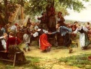

  
[Intangible Textual Heritage](../../index)  [Miscellaneous](../index) 
[Index](index)  [Next](fwe01) 

------------------------------------------------------------------------

  
*Festivals of Western Europe*, by Dorothy Gladys Spicer, \[1958\], at
Intangible Textual Heritage

------------------------------------------------------------------------

# FESTIVALS OF WESTERN EUROPE

## BY DOROTHY GLADYS SPICER

### THE H. W. WILSON COMPANY, NEW YORK

### \[1958\]

###### NOTICE OF ATTRIBUTION. Scanned and proofed by Eliza Yetter, November, 2004. HTML formatting by John Bruno Hare at Intangible Textual Heritage. This text is in the public domain in the United States because it was not renewed at the US Copyright Office in a timely fashion, as required by law. These files may be used for any non-commercial purpose, provided this notice of attribution is left intact.

------------------------------------------------------------------------

[Next: Preface](fwe01)
