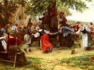

  
[Intangible Textual Heritage](../../index)  [Miscellaneous](../index) 
[Index](index)  [Previous](fwe01)  [Next](fwe03) 

------------------------------------------------------------------------

  
*Festivals of Western Europe*, by Dorothy Gladys Spicer, \[1958\], at
Intangible Textual Heritage

------------------------------------------------------------------------

# CONTENTS

|       |                              |
|-------|------------------------------|
|       | PREFACE                      |
|       | FESTIVALS                    |
|   1.  | FESTIVALS OF BELGIUM         |
|   2.  | FESTIVALS OF DENMARK         |
|   3.  | FESTIVALS OF FRANCE          |
|   4.  | FESTIVALS OF GERMANY         |
|   5.  | FESTIVALS OF ITALY           |
|   6.  | FESTIVALS OF LUXEMBOURG      |
|   7.  | FESTIVALS OF THE NETHERLANDS |
|   8.  | FESTIVALS OF NORWAY          |
|   9.  | FESTIVALS OF PORTUGAL        |
|   10. | FESTIVALS OF SPAIN           |
|   11. | FESTIVALS OF SWEDEN          |
|   12. | FESTIVALS OF SWITZERLAND     |

------------------------------------------------------------------------

[Next: 1. Festivals of Belgium](fwe03)
