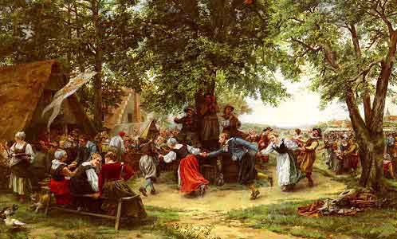

  
[Intangible Textual Heritage](../../index)  [Miscellaneous](../index) 

------------------------------------------------------------------------

<table width="75%">
<colgroup>
<col style="width: 50%" />
<col style="width: 50%" />
</colgroup>
<tbody>
<tr class="odd">
<td width="50%" data-valign="TOP"> 
Jean Charles Meissonier [d. 1917] The Village Festival, (public domain image)</td>
<td width="50%" data-valign="CENTER"><h1 id="festivals-of-western-europe" data-align="center">Festivals of Western Europe</h1>
<h2 id="dorothy-gladys-spicer" data-align="center">Dorothy Gladys Spicer</h2>
<h3 id="section" data-align="center">[1958]</h3></td>
</tr>
</tbody>
</table>

------------------------------------------------------------------------

[Contents](#contents)    [Start Reading](fwe00)    [Text
\[Zipped\]](fwetxt.zip)

------------------------------------------------------------------------

 [Title Page](fwe00)  
[Preface](fwe01)  
[Contents](fwe02)  

### Festivals

[1. Festivals of Belgium](fwe03)  
[2. Festivals of Denmark](fwe04)  
[3. Festivals of France](fwe05)  
[4. Festivals of Germany](fwe06)  
[5. Festivals of Italy](fwe07)  
[6. Festivals of Luxembourg](fwe08)  
[7. Festivals of the Netherlands](fwe09)  
[8. Festivals of Norway](fwe10)  
[9. Festivals of Portugal](fwe11)  
[10. Festivals of Spain](fwe12)  
[11. Festivals of Sweden](fwe13)  
[12. Festivals of Switzerland](fwe14)  
