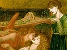

  
[Intangible Textual Heritage](../../index)  [Miscellaneous](../index) 
[Index](index)  [Previous](gd04)  [Next](gd06) 

------------------------------------------------------------------------

[Buy this Book at
Amazon.com](https://www.amazon.com/exec/obidos/ASIN/0252068823/internetsacredte)

------------------------------------------------------------------------

[  
*The Grateful Dead*, by Gordon Hall Gerould, \[1908\], at Intangible
Textual Heritage](index)

------------------------------------------------------------------------

p. 26

### CHAPTER III.

#### TALES WITH THE SIMPLE THEME AND MISCELLANEOUS COMBINATIONS.

OF the tales enumerated in the previous chapter, over one hundred in
number, all but seventeen fall into well-defined categories as having
*The Grateful Dead* combined with one or more of three given themes:
*The Possessed Woman*, *The Ransomed Woman*, and *The Water of Life*. Of
these seventeen variants, moreover, only four can be regarded as having
the simple motive of *The Grateful Dead*; and they are in part doubtful
members of the family.

The first of them is *Simonides*, thus related by Cicero: "Unum de
Simonide: qui cum ignotum quendam proiectum mortuum vidisisset eumque
humavisset haberetque in animo navem conscendere, moneri visus est ne id
faceret ab eo, quem sepultura adfecerat; si navigavisset, eum naufragio
esse periturum; itaque Simonidem redisse, perisse ceteros, qui tum
navigavissent." The source of Cicero's story we do not know, but in all
probability it was Greek. Whether it really belongs to our cycle, being
so simple in form and nearly two centuries earlier in date than any
other version yet unearthed, is a matter for very great doubt. It may
have arisen quite independently of other similar tales in various parts
of the world, and have no essential connection with our tale; but it
deserves special consideration, not only from its antiquity, but also
from its subsequent history in lineal descent through Valerius

p. 27

\[paragraph continues\] Maximus, and
possibly Robert Holkot [1](#fn_36) to Chaucer.
We are at least justified in looking for some influence of so well-known
an anecdote upon better-authenticated members of the cycle.

The three other variants with the simple theme are all folk-tales of
recent gathering. The first of them is *Jewish*, [2](#fn_37) which runs as follows: The son of a rich
merchant of Jerusalem sets off after his father's death to see the
world. At Stamboul he finds hanging in chains the body of a Jew, which
the Sultan has commanded to be left there until his co-religionists
shall have repaid the sum that the man is suspected of having stolen
from his royal master. The hero pays this sum, and has the corpse
buried. Later during a storm at sea he is saved by a stone on which he
is brought to land, whence he is carried by an eagle back to Jerusalem.
There a white-clad man appears to him, explaining that he is the ghost
of the dead, and that he has already appeared as stone and eagle. The
spirit further promises the hero a reward for his good deed in the
present and in the future life.

The second variant is the *Annamite* tale. Two poor students were
friends. One died and was buried by the other, whose fidelity was such
that he remained three years by the tomb. He dreamed that his friend
came to him and said that he should gain the title of *trạng nguyen*. So
he built a chapel by the tomb, where the dead friend often appeared to
him. When the king heard of his loyalty, he was praised and rewarded
with a title. After his

p. 28

death the two friends appeared to their son and daughter, bidding them
marry. [1](#fn_38)

The third story is *Servian VI.* An uncle of Adam, who honoured God and
the "Vile," [2](#fn_39) was so good a man that
God came to him in human form one day. After a battle between the good
and evil in the world, the latter would not bury the slain. The Vile
told Tuegut that this would not do, so he hitched up his wagon and
carried the slain to their graves. Then God came to earth, told him to
put all he possessed in his wagon, and carried him on a cloud to heaven,
where he was made the constellation now called Driver Tuegut's Heavenly
Wagon.

Of these three tales the *Annamite* does not fulfil the usual condition
that the dead man shall be a stranger to the one who does the good
action. Together with *Simonides*, all of them vary widely in the reward
given the hero. In *Simonides* he is warned against embarkation, and
thus saved from shipwreck; in the *Jewish* he is actually rescued from a
storm-tossed vessel by the ghost, which masquerades as a rock and an
eagle, and afterward promises him further rewards here and hereafter; in
the *Annamite* he is provided with earthly glory; and in *Servian VI.*
he becomes a part of the galaxy of heaven. Only the underlying idea is
the same,—that the burial of the dead is a pious act and a sacred duty,
which will meet a fitting reward. [3](#fn_40)
This belief is so widespread and ancient that it is not difficult to
surmise how stories inculcating the duty might have grown up
independently in many lands. At the same time, the very diversity of
reward in these simple tales allies them to one or another of the
compound types, which, though

p. 29

multiform and widespread, are yet unmistakably the offspring of a single
parent form, or better, of a chance union between two motives. [1](#fn_41) Thus *Simonides* and *Jewish* recall the
combination of *The Grateful Dead* with *The Ransomed Woman*, since they
have the hero rescued from drowning by the ghost, and they suggest one
point of union between the two themes. It therefore seems best to
include them in our list, not only for the sake of completeness, but
because they point to the reason which sometime and somewhere gave rise
to a more developed form of the motive,—to the *märchen* as we shall
study it. A consideration of these basal principles can be undertaken,
however, only after the story theme in its various ramifications and
modifications has been thoroughly discussed.

The probability that *The Grateful Dead* once existed in a simple,
uncompounded form, which became the parent on one side of the more
important combined types, is strengthened by the minor compounds in
which it is found. How can the correspondences of detail seen in a
considerable number of different compounds, as far as they run parallel,
he otherwise explained? Surely it is more reasonable to believe in the
existence of such a parent form than to suppose that an originally
complicated form was hacked and hewn asunder to produce new compounds.
This will become clearer, I hope, as we proceed.

In *Greek*, a boy was sold to a pasha, who betrothed him to his
daughter. Because of the mother's objections, however, he was sent away
as a shepherd, while the girl was promised to another pasha's son. The
hero fed his flock under the shelter of the castle, and was summoned by
the maiden, who gave him her betrothal ring in a

p. 30

beaker, though pretending not to know him. The next day she asked her
parents to let the two suitors go into the world with a thousand
piasters apiece, and see which came back with the most money. So they
were sent forth. The pasha's son remained in a city enjoying his money,
while the shepherd went on till he met an old man, to whom he told his
story. The man gave him a thousand piasters more, and told him to buy an
ape in a town hard by. He succeeded in doing this, and brought the ape
back to the old man, who cut it in pieces, much to the youth's disgust,
and made eye-salve of the brain. With this he sent the hero away after
exacting a promise of half of what was obtained. The youth won a
thousand piasters by curing the blind, and later a great sum, besides
thirty ships, by healing a very rich man. With this wealth he returned
to the old man, and with him to the city where the pasha's son had
sojourned. The latter agreed to let the shepherd's seal be burned on his
arm in return for the payment of his debts; but, while the hero and the
old man sailed home, he rode fast by land with the story that his rival
was dead. The shepherd arrived at home just in time for his rival's
wedding, and at the end of it showed the bride her ring. She recognised
her lover, called her parents, and, after the hero had told his story
and proved it by the seal on his rival's arm, married him. That night
the old man knocked on the door of their chamber, and demanded that the
bride be divided. According to his promise, the hero prepared to cut her
in twain, when the intruder said that he wished only to test his
fidelity, explaining that he was God, Who had taken him under His
protection because his father had sold him in order to keep the lamp
burning in honour of his saint.

In this variant the elements of *The Grateful Dead* have been merged
with a story about how a young man of low birth won a princess by
overcoming another suitor in spite of the treachery of the latter. As I
have met with but one

p. 31

example of this, from Lesbos, [1](#fn_42) I will
summarise it briefly. A princess becomes enamoured of the son of her
father's gardener, and refuses to marry the son of the first minister.
So the two suitors are sent out to a far country with the understanding
that the one who returns first shall have the princess. On the way the
gardener's son helps an old beggar-woman, whom his rival has spurned,
and is told by her how to cure a sick king (by boiling him and
sprinkling him with a certain powder). For this service the youth
obtains a ring of bronze, which has the virtue of giving whatever its
possessor desires. By means of this he gets a wonderful ship, and sails
to the city where the minister's son, through extravagance, has fallen
into poverty. He provides him with a wretched ship, in which to return
home, on condition that he may mark him with his ring. The minister's
son reaches home in his crazy vessel, and is about to marry the
princess, when the hero appears on his beautiful ship of gold, exposes
his rival, and weds the lady. The remainder of the story, which tells
how the magical ring was lost and afterward recovered, does not concern
us. It will be seen that *Greek* has preserved only the later part of
*The Grateful Dead* at all clearly, though that combination with a tale
of the type of the Lesbian narrative has actually taken place is evident
from the part which the helper plays. He not only obtains a promise of
division, but calls for its fulfilment. His first appearance is,
however, quite unmotivated, while the old woman of the Lesbian story
serves the purpose, according to a common formula, of showing the hero's
kindness in contrast to his rival's hard heart. The point common to the
two tales, which led to their combination, is without doubt this helping
friend.

In *Servian V.* a youth on a journey pays his all to rescue a debtor
from hanging. By his new-found friend

p. 32

the youth is led to the wondrous Vilaberg, where he is left with the
admonition that he must not speak. He disobeys, and is made dumb and
blind by an enchantress; but he is cured by the man whom he rescued, who
plays on a pipe and gives him a healing draught. So he dwells for some
years in the mountain with one of the ladies as his wife, but afterward
goes home, though every summer he returns to his friends in the
Vilaberg.

Here we have our theme combined with a form of *The Swan-Maiden*, [1](#fn_43) which occurs in only one other case, as
far as I am able to discover. The reason for the combination is not far
to seek. The latter part of the tale represents the reward of the
rescuer by the rescued. That the benefit does not take the form of
actual burial need not disturb us. The man was at least far gone towards
death, and he was a debtor—a trait found in about two-thirds of the
variants known to me. Moreover, the supernatural character of the
comrade is indicated by the adventure into which he leads the youth. The
tale has been partly rationalised, that is all.

*Esthonian I.* [2](#fn_44) shows a different
combination, which is unique as far as I know. In a gorge not far from
the village of Arukäla (near Wesenberg) a howling was heard every night
for years. Finally a bold man went by night to the place and found the
skeleton of a murdered king, which told him that it had howled thus for
a hundred years because it had not been buried with holy rites. The next
day the man took the bones to a priest, and, while burying them,
discovered an enormous treasure.

As Schiefner said, [3](#fn_45) when he first
printed the story, it recalls the Grimms’ *Der singende Knochen*, [4](#fn_46) which in turn is

p. 33

a compound of *The Water of Life*, with the idea of murder discovered by
means of a dead man's bones. The Esthonian tale has, however, only the
latter circumstance, combined with a simple form of *The Grateful Dead*.
The hero's reward is immediate—he finds gold in the earth while digging
the grave; and the ghost does not appear. The variant is thus of no
great significance.

The group of tales that must next be considered furnishes rather more
important evidence as to the development of the theme. It is a compound
of *The Grateful Dead* with the motive which we may call *The
Spendthrift Knight*. As far as I know, the type is purely mediaeval. The
group includes *Richars*, *Lion de Bourges*, *Dianese*, *Old Swedish*,
*Rittertriuwe*, and *Sir Amadas*.

The plot of *Richars*, as far as it concerns us, runs thus: Richars, in
the pursuit of knightly exercises, wastes all his father's property as
lord of Mangorie. When he hears that the King of Montorgueil has
promised the hand of his daughter to the victor in a tourney, he is sad
at the thought of his inability to engage. Through the generosity of a
provost, however, he is enabled to set out with a horse, three
attendants, and a supply of gold. At the city of Osteriche he spends
part of his money in giving a great feast. In the roof of the house
where he stays he is astonished to see a corpse lying on two beams, and
he learns that it is the body of a knight, who died owing the
householder three thousand pounds. Richars gives everything he has, even
to his armour, to secure the release and burial of the dead man. He then
proceeds to the tourney on a poor horse that his host gives him, and
quite alone, since his attendants have deserted him. On the way he is
joined by a White Knight, who offers him help in the tourney and places
at his disposal his noble steed. Richars wins the tourney

p. 34

and obtains the hand of the Princess Rose. He now offers the White
Knight his choice of the lady or the property. The stranger, however,
refuses any division, explains that he is the ghost of the indebted
knight, and disappears. [1](#fn_47)

*Lion de Bourges* runs thus: Lion, son of Duke Harpin de Bourges, was
found by a knight in a lion's den and reared as his son. When he grew
up, he wasted his foster-father's property in chivalry. Finally, he
heard that King Henry of Sicily had promised the hand of his daughter to
the knight who should win a tourney that he had established. So Lion
started for the court, and on the way ransomed the body of a knight,
which he found hanging in the smoke, on account of unpaid debts. At
Montluisant the hero won the favour of the Princess Florentine, and,
before the tourney, obtained from a White Knight the charger which he
still lacked, on condition of sharing his winnings, the princess
excepted. With the help of this knight Lion was victorious and obtained
the princess. He was then asked by his helper to give up either the lady
or the whole kingdom, and did not hesitate to do the latter. At this,
the stranger explained that he was the ghost of the ransomed knight and
disappeared, though he afterwards returned to assist the hero at need.

p. 35

According to *Dianese*, [1](#fn_48) the knight
of that name has wasted his substance. When he hears that the King of
Chornualglia (Cornwall) has promised his daughter and half of his
kingdom to the knight who wins the tourney that he has called, Dianese
gets his friends to fit him out and sets forth. On the way he passes
through a town where the traffic is diverted from the main street
because of a corpse which has long been lying on a bier before a church.
He learns that it is the body of a knight, who cannot be buried till his
creditors have been paid. At the cost of everything he possesses, save
his horse, the hero satisfies the creditors and has the knight buried.
When he has gone on two miles, he is joined by a merchant, who promises
him money, horses, and weapons if he will give in return half of what he
wins in the tourney. Dianese agrees, is fitted out anew, and succeeds in
overcoming all corners in the contest. Thus he obtains the hand of the
princess and half the kingdom. With his bride, the merchant, and his
followers he starts for home; but, when they are only a day's journey
from their destination, he is required by the merchant to fulfil his
promise—to choose between his bride as one half, his possessions as the
other. Dianese takes the lady and rides on. Soon, however, he is joined
by the merchant, who praises his faithfulness, gives up the treasures,
explains that he is the ghost of the debtor knight, and disappears.

In *Old Swedish* [2](#fn_49) the daughter and
heiress of the King of France promises to marry whatever knight is
victor in a tourney which she announces. Pippin, the Duke of Lorraine,
hears of this and sets out for France. At the end of his first day's
journey he finds lodging at the house of a widow, who is lamenting
because her husband, once in good circumstances, has died so poor that
she cannot bury him properly. Pippin takes pity

p. 36

on her, and pays for the man's funeral. On his further journey he falls
in with a man on a noble steed, who gives him the horse on condition of
receiving half of whatever he shall win. Unthinkingly Pippin agrees and
wins the tourney with the help of the horse. After he has married the
princess, he is asked by the helper to fulfil his promise. He offers at
first half, then the whole of his kingdom, in order to keep his bride,
and is finally told by the man that he is the ghost of the dead, while
the horse was an angel of God.

*Rittertriuwe* is of the same romantic character. When Graf Willekin von
Montabour had spent his substance in chivalrous exercises, he learned
that a beautiful and rich maiden had promised her hand to the knight,
who should win a tourney, which she had established. Thereupon he set
forth and came to the place announced for the combats. There he found
lodging in the house of a man, who would only receive him if he would
promise to pay the debts of a dead man, whose body lay unburied in the
dung of a horse-stall. [1](#fn_50) Willekin was
moved by this story and paid seventy marks, almost all his money, to
ransom the corpse and give it suitable burial. He then had to borrow
from his host in order to indulge in his customary generosity. On the
morning of the jousting he obtained from a stranger knight a fine horse
on condition of dividing everything that he won. He succeeded in the
tourney above all the other contestants, and so wedded the maiden. On
the second night after the marriage the stranger entered his room and
demanded a share in his marital rights. After he had offered instead to
give all his possessions, the hero started from the room in tears, when
the stranger called him back and explained that he was the ghost of the
dead, then disappeared.

p. 37

A brief summary of *Sir Amadas*, [1](#fn_51) the
last of the six variants, must now be given. Amadas finds himself
financially embarrassed, and sets forth for seven years of errantry with
only forty pounds in hand. This he pays to release and bury the body of
a merchant who has died in debt. When thus reduced to absolute penury,
Amadas meets a White Knight, who tells him that he will aid him on
condition of receiving half the gains. The hero finds a rich wreck on
the seacoast, and so with new apparel goes to the court, where he wins
wealth in a tourney and the princess's heart at a feast. After he
marries her and has a son born to him, the White Knight reappears and
demands that the accepted conditions be complied with. Hesitatingly
Amadas prepares to divide first his wife and afterwards his son, but he
is stayed by the stranger, who explains that he is the ghost of the dead
merchant. So Amadas is at last released from misfortune and lives in
happiness.

In all six of these stories we have a knight, who sets out to win a
tourney in which the victor's prize is to be the hand of a princess. In
all of them save *Old Swedish* he is represented as being impoverished
by previous extravagance, in *Richars*, *Lion de Bourges*, and
*Rittertriuwe* it being expressly stated that he had wasted his fortune
by over-indulgence in his passion for jousting. On his way to the place
appointed for the contest the hero pays for the burial [2](#fn_52) of a man whose corpse is held for
debt. [3](#fn_53) He goes on and is approached
either before (*Richars*, *Lion de Bourges*, *Dianese*, *Old Swedish*,
and *Sir* 

p. 38

\[paragraph continues\] *Amadas*) or after
(*Rittertriuwe*) he reaches the lists by a man, who provides him with a
horse, by the aid of which he wins the tourney and the princess. In
*Dianese* the hero is a merchant, in *Old Swedish* his estate is not
mentioned, but in the other four variants he appears, as a knight (a
white knight in *Richars*, *Lion de Bourges*, and *Sir Amadas*). In
*Dianese* the hero is also provided with armour; in *Richars* and *Lion
de Bourges* he is assisted in his jousting by the White Knight; and in
*Sir Amadas* he finds a wreck on the coast from which he obtains all
things needful. In *Richars* we find the somewhat inept conclusion that
the hero asks his friendly helper whether he will take the princess or
the property [1](#fn_54) as his share. The
latter responds that he wishes only his horse, explains who he is, and
vanishes. In all the other variants, however, the condition is made that
the hero divide whatever he shall gain. [2](#fn_55)

With reference to *Richars* and *Lion de Bourges*, Wilhelmi's careful
discussions has made it clear that, though they agree in many points as
against all the other related versions, not only in respect to *The
Grateful Dead*, but to the further course of a complicated narrative,
neither one could have been taken from the other. The difference in the
matter of the division between *Richars* and all the other variants he
neglects, though it strengthens his position. Back of *Richars* and
*Lion de Bourges*, earlier than the thirteenth century, there must have
existed a literary work which was their common source. This hypothetical
French romance may be considered as the foundation of the whole group
which we are discussing.

Since *Old Swedish* agrees with most of the other variants with regard
to the division, and furthermore

p. 39

with *Rittertriuwe*, in stating that the hero offered all his property
in order to keep his wife, there seems to be no doubt that it belongs to
this particular group, despite the fact that it says nothing about the
hero's poverty. The connection is not improbable on the score of
chronology, if we suppose that the source of *Richars* and *Lion de
Bourges*, or some similar tale, found its way into the North by
translation in the first half of the thirteenth century, a time when
translations into Icelandic at anyrate were made in great numbers.
Indeed, the names Pippin, Lorraine, etc., immediately suggest a French
source; and the story is not really a legend at all, though it appears
in a legendary, but a narrative quite in the style of the *romans
d’aventure*.

With reference to *Sir Amadas*, two points of special interest appear.
The hero is provided the wherewithal for his successful courtship by
means of a wreck to which he is directed by the White Knight; and he is
required to divide his child as well as his wife with his helper. These
peculiarities, together with the different opening, make it improbable
that *Richars*, as preserved, was the direct source of the romance,
though its author may have known some text either of that romance, or of
*Lion de Bourges*. It seems more likely, however, that the source of
*Sir Amadas* was rather the common original of both those versions. In
the present state of the evidence it is impossible to do more than to
show, as I have attempted to do, that the fourteenth-century *Sir
Amadas* is a member of the little group under discussion.

The proposed division of the son is peculiarly important in that it
connects the group with the stories in which *The Grateful Dead* is
compounded with the theme of *Amis and Amiloun*. Indeed, the general
relationship of *The Spendthrift Knight* to that theme must be
considered in a later chapter [1](#fn_56) after
more important compounds have been

p. 40

discussed. It will be noted that the group just considered is purely
literary and purely mediaeval. Though it has representatives in Italy,
Germany, Sweden, and England, it is to all intents and purposes French
in source and character. Five of its members are the only variants
treated in this chapter where the question of dividing the hero's prize
is brought up. The group thus stands by itself, and may be considered as
an entity when we come to a discussion of the larger matters of
relationship.

A solitary folk-tale now demands attention—my *Breton II.* *The Grateful
Dead* in a simple form is here combined with a story told of Gregory the
Great, [1](#fn_57) as Luzel, to whom the tale
was recounted by a *Breton* peasant, indeed briefly noted. [2](#fn_58) The Breton tale runs as follows: A rich
lord and lady had no children. While the lady was praying to St. Peter
in a chapel that was being repaired, she fell a victim to a young
painter, and had by him a son, who was named after St. Peter. When the
boy was twelve years of age, he carried St. Peter across a stream one
day, while his shepherd companion

p. 41

carried Christ. The companion died soon after. Pierre then set forth to
visit his patron in Paradise. On his way he stopped overnight at the
house of an old woman, whose husband lay unburied because there was no
money to pay the priest. Pierre gave all his money for the interment,
and went on. When he came to the sea, a naked man, who said that he was
the dead, carried him across to a point near the gates of Paradise.
There he found Peter, and was shown the glories of heaven by the
Saviour, as well as Purgatory and Hell. In the last he saw a chair
reserved for his mother, but by his entreaties induced the Lord to grant
her a release on condition of doing penance himself for her. So he was
told to put on a spiked girdle, to throw the key of it into the sea, and
not to take it off till the key should be found. After donning this
instrument Pierre was carried by the ghost back to his own land, where
he lived on alms—first on the public ways, and later, without
discovering himself, in his father's castle. During his father's absence
he was killed at the command of his mother, but was dug up alive by his
father and treated with respect. One day at a feast he found the key in
the head of a fish. When the girdle was opened, he died, and his soul
was borne to heaven by angels.

Two Danish variants present a curious but not inexplicable combination
of *The Grateful Dead* with *Puss in Boots*, as was noted by
Köhler. [1](#fn_59) *Danish I.* relates how a
youth pays three marks, which is his all, to bury the body of a dead
man, for whose interment the priest has demanded payment in advance. He
is then joined by another youth, who is the ghost of the dead, and goes
to a certain city. There, by giving himself out as a prince at the
advice of his companion, who provides him with proper trappings, he wins
the hand of a princess. In *Danish II.* an old soldier pays his last
three marks to

p. 42

prevent three creditors from digging up a corpse. He is joined by a pale
stranger, who takes him in a leaden ship to a land where he marries a
princess, who is fated to marry no one save a man who comes in this way.
The stranger secures, by a lying ruse, a troll's castle for the hero,
and, after explaining that he is the ghost of the buried debtor,
disappears.

The traces of the *Puss in Boots* motive [1](#fn_60) are, I think, sufficiently clear,
especially in the first of the two variants, since the point of that
familiar tale is certainly that the hero marries a woman of high estate
by making himself out as of equal rank, substantiating his statements by
a succession of clever ruses. That the grateful dead enables him to
fulfil the required conditions is an introduction that could easily
replace the ordinary one, especially since a helper of some sort is
necessary to the story. Just what the relation of these two variants is
to other *Puss in Boots* stories does not here concern us. From the side
of *The Grateful Dead*, however, it is possible to see how the
combination—found only in two folk-tales from a single country, it will
be observed—may have arisen. The benefits bestowed on the hero show an
essential likeness to those found in a widespread compound type to be
studied in a later chapter, [2](#fn_61) where
the thankful dead helps his friend to obtain a wife by the performance
of some feat. Since the combination now in consideration seems to be
confined to the region about Denmark, while mediaeval and modern
examples of the other are found in many lands, it may be regarded as a
mere variation on the better-known compound type, produced by the
similarity of the two endings. Yet

p. 43

it has to be treated separately, because it involves an independent
theme.

An echo of the simple theme of *The Grateful Dead* is found in two
English plays—Massinger's *Fair Penitent* and Rowe's *Fair Penitent*. In
the former young Charalois goes to prison to release his father's body
from the clutch of creditors, who wish to keep it unburied for
vengeance. [1](#fn_62) He is rescued by
Rochfort, who pays the debts and gives him his daughter in marriage. The
intrigues of love and vengeance that follow do not concern us. In Rowe's
play, which was based on Massinger's, this part has been curtailed to a
few slight references. Altamont gives himself as ransom for his father's
body to the greedy creditors, who will not allow burial to take place.
He is rewarded by the care and bounty of Sciolto, who becomes a second
father to him.

Stephens was certainly right in connecting [2](#fn_63) the story in The *Fair Penitent* with *The
Grateful Dead*, though it is only a fragment and lacks some of the most
essential features of the complete theme. The ghost, indeed, does not
appear at all, but the part played by Rochfort may be regarded as a
greatly sophisticated reminiscence of that trait, especially since he
not only rescues the hero, but provides him with a wife. The echo of the
theme is too vague for us to distinguish the form in which it was found
by Massinger, though I think that we should not go far wrong in
supposing that he had in mind some narrative, either popular or
literary, nearly approaching the compound type treated in chapter vi.
below. As one of the comparatively few traces that the motive has left
in England this double dramatic use is not without interest. [3](#fn_64)

------------------------------------------------------------------------

### Footnotes

[27:1](gd05.htm#fr_36) Miss Petersen's
conclusion, *Sources of the Nonne Prestes Tale*, p. 109, note, is not
altogether convincing, since the vogue of Valerius Maximus was so great
that other authors than Holkot are likely to have quoted Cicero's
stories from him. The book may yet be found in which the one follows the
other "right in the nexte chapitre."

[27:2](gd05.htm#fr_37) Given by Hippe, pp. 143
f. Wherever Hippe's summaries are adequate and careful, I shall refer
the reader to his monograph for comparison.

[28:1](gd05.htm#fr_38) This story has nothing in
common with the mediaeval tale of the compact between two friends that
the first to die shall appear to the other. See the writer's
*North-English Homily Collection*, 1902, pp. 27-31.

[28:2](gd05.htm#fr_39) Apparently beneficent
spirits, whose nature is half fairy and half angel. See *Servian V.*
below.

[28:3](gd05.htm#fr_40) See chapter viii. and
Sepp, pp. 678-680 for illustrations of the belief.

[29:1](gd05.htm#fr_41) One can conceive of
separate generation of a very simple story under similar conditions, but
not, I think, that a series of events showing combination of themes or
detailed correspondence would so arise.

[31:1](gd05.htm#fr_42) Carnoy and Nicolaides,
*Traditions populaires de l’Asie Mineure*, 1889, pp. 57-74.

[32:1](gd05.htm#fr_43) See Baring-Gould's
*Curious Myths*, 2nd ed. 1869, pp. 561 ff. for a popular account. The
philosophical basis of the tale is discussed by Liebrecht, *Zur
Volkskunde*, 1879, pp. 54 ff. (from *Germania*, xiii. 161 ff.), and by
Hartland, *Science of Fairy Tales*, 1891, pp. 255-332, 337-347.

[32:2](gd05.htm#fr_44) See Hippe, p. 148.

[32:3](gd05.htm#fr_45) *Or. und Occ.* ii. 176.

[32:4](gd05.htm#fr_46) *Kinder- and
Hausmärchen*, no. 28. See notes (ed. 1856), iii. 55, 56; also Köhler,
Kleinere Schriften, 1. 49, 54.

[34:1](gd05.htm#fr_47) See Hippe, p. 155. This
analysis includes only the second of two well-defined parts. The first
section is related to the English *Sir Degarre* (ed. from Auchinleck MS.
for the Abbotsford Club, 1849; from Percy Folio, Hales and Furnivall,
*Percy Folio MS.*, 1868, iii. 16-48; early prints by Wynkyn de Worde,
Copland, and John King; see G. Ellis, Specimens of Early English
*Metrical Romances*, 1811, iii. 458 ff., J. Ashton, *Romances of
Chivalry*, 1887, pp. 103 ff., Paul's *Grundriss*, ii. i. 643). This
connection was pointed out by Foerster, p. xxiii. The same material was
used also in a Dutch chapbook, *Jan wt den vergiere*, of which a copy
printed at Amsterdam is preserved at Göttingen. See the article
"Niederländische Volksbücher," by Karl Meyer, in *Sammlung
bibliothekswissenschaftlicher Arbeiten*, ed. Dziatzko, viii. 17-22,
1895. I am indebted for this last reference to the kindness of Dr. G. L.
Hamilton.

[35:1](gd05.htm#fr_48) See Hippe, pp. 152 f.

[35:2](gd05.htm#fr_49) See Hippe, pp. 158 f.

[36:1](gd05.htm#fr_50) This trait recalls the
first of Chaucer's two stories in the *Nun's Priest's Tale*, *Cant.
Tales*, B. 4174-4252, where the comrade is found buried with dung on a
cart.

[37:1](gd05.htm#fr_51) For a fuller analysis see
Hippe, pp. 160-164.

[37:2](gd05.htm#fr_52) In *Richars*, *Lion de
Bourges*, *Dianese*, and *Sir Amadas* he pays his all, even to his
equipment for war, the most logical and, on the whole, probably the
earlier form of the story.

[37:3](gd05.htm#fr_53) In all except *Old
Swedish* and *Sir Amadas* the man was a knight; in these he was a
merchant, the husband of the woman at whose house the hero lodges.

[38:1](gd05.htm#fr_54) "V le femme u l’auoir
ares," v. 5316.

[38:2](gd05.htm#fr_55) Though in *Lion de
Bourges* he excepts the lady specifically. 'See Über *Lion de Bourges*,
particularly pp. 46-54.

[39:1](gd05.htm#fr_56) See chapter vii.

[40:1](gd05.htm#fr_57) The *Trentall of St.
Gregory*. The Old French text has been edited by P. Meyer, *Romania*,
xv. 281-283. The English versions, of which the first seems to be taken
from this, are found in the following MSS.: (A) Vernon MS. fol. 230, ed.
Horstmann, *Engl. Stud.* viii. 275.277, and *The Minor Poems of the
Vernon MS.* i., E.E.T.S. 98, 1892, pp. 260-268; Vernon MS. fol. 303,
variants given in Horstmann's ed. for E.E.T.S.; MS. Cotton Caligula A
II., ed. Furnivall, *Political, Religious, and Love Poems*, E.E.T.S. 15,
1866, pp. 83-92, reprinted by Horstmann, E.E.T.S. pp. 260-268; MS.
Lambeth 306, variants given by Furnivall; a critical text with variants
of the four was made by A. Kaufmann, *Trentalle Sancti Gregorii,
Erlanger Beiträge*, iii. 29-44, 1889. (B) MS. 19, 3, 1, Advocates’
Libr., Edinburgh, ed. Turnbull, *The Visions of Tundale*, 1843, pp. 77
ff., and Bülbring, *Anglia*, xiii. 301-308; MS. Kk. I, 6, Camb. Univ.
Libr., ed. Kaufmann, pp. 44-49. Kaufmann in his introduction discusses
the relations of the versions. See further Varnhagen, *Anglia*, xiii.
505 f. Another legend of Gregory in popular fiction is treated by Bruce
in his edition of *De Ortu Waluuanii*, *Publications Mod. Lang. Ass.*
xiii. 372-377. The story in the *Gesta Romanorum* to which Luzel, i. 83,
note, refers is this rather than our tale.

[40:2](gd05.htm#fr_58) i. 83 and 90, notes.

[41:1](gd05.htm#fr_59) *Or. und Occ.* iii. 99 f.

[42:1](gd05.htm#fr_60) See *Das Märchen vom
gestiefelten Kater*, Leipzig, 1843; Benfey, *Pantschatantra*, i. 222;
Grimm, *Kinder- and Hausmärchen*, iii. 288; Liebrecht, Dunlop's
Geschichte der Prosadichtungen, 1851, p. 286; Polívka, *Arch. f. slav.
Phil.* xix. 248; etc.

[42:2](gd05.htm#fr_61) Chapter vi.

[43:1](gd05.htm#fr_62) An unnecessarily
nauseating reason is given by one of them (Act i. sc. i.), but this
seems to be of Massinger's invention.

[43:2](gd05.htm#fr_63) P.8.

[43:3](gd05.htm#fr_64) It is interesting also to
note that a Viennese dramatist of our own day has adapted Massinger's
drama, retaining a vague reminiscence of the thankful dead. The curious
may see *Der Graf von Charolais* by Richard Beer-Hofmann, 1905.

------------------------------------------------------------------------

[Next: Chapter IV. The Grateful Dead and the Poison Maiden](gd06)
