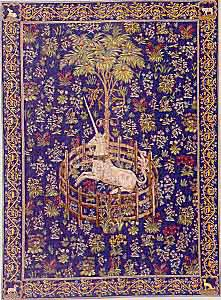

  
[Intangible Textual Heritage](../../index)  [Miscellaneous](../index) 
[Legendary Creatures](../../lcr/index) 

------------------------------------------------------------------------

[Buy this Book at
Amazon.com](https://www.amazon.com/exec/obidos/ASIN/B002FL4WSI/internetsacredte)

------------------------------------------------------------------------

<table width="75%">
<colgroup>
<col style="width: 50%" />
<col style="width: 50%" />
</colgroup>
<tbody>
<tr class="odd">
<td width="50%" data-valign="TOP"></td>
<td width="50%" data-valign="CENTER"><h1 id="lore-of-the-unicorn" data-align="center">Lore of the Unicorn</h1>
<h2 id="by-odell-shepard" data-align="center">by Odell Shepard</h2>
<h4 id="section" data-align="center">[1930]</h4></td>
</tr>
</tbody>
</table>

------------------------------------------------------------------------

[Contents](#contents)    [Start Reading](lou00)    [Text
\[Zipped\]](lou.txt.gz)

------------------------------------------------------------------------

|                                                                                                                           |
|---------------------------------------------------------------------------------------------------------------------------|
|  |

Writer and English Professor Odell Shepard was an instructor of English
at Harvard University and Radcliffe College in 1916-1917. He was Goodwin
Professor of English at Trinity College, Harford, Connecticut, from
1917-1946, and a guest lecturer there from 1946-1966. He was the
Lieutenant Governor of Connecticut from 1940-1943.

Shepard's won the Pulitzer Prize for his academic biography of Bronson
Alcott, Pedlar's Progress: The Life of Bronson Alcott (Little, Brown,
1937). Jenkins' Ear (Macmillan, 1951) was a Book-of-the-Month selection.
Shepard also wrote collections of poetry, textbooks, essays, a fishing
guide, and several histories, and this curious book, The Lore of the
Unicorn.

Odell Shepard died on July 19, 1967, in New London, Connecticut.

------------------------------------------------------------------------

 [Title Page](lou00)  
[Contents](lou01)  
[Introduction](lou02)  
[Chapter I. The Gorgeous East](lou03)  
[Chapter II. The Holy Hunt](lou04)  
[Chapter III. Shaping Fantasies](lou05)  
[Chapter IV. East And West](lou06)  
[Chapter V. The Treasure of His Brow](lou07)  
[Chapter VI. The Battle of Books](lou08)  
[Chapter VII. Rumours](lou09)  
[Chapter VIII. Conjectures](lou10)  
[Chapter IX. Certainties](lou11)  
[Chapter X. Reflections](lou12)  
