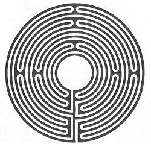

  
[Intangible Textual Heritage](../../index)  [Miscellaneous](../index) 

------------------------------------------------------------------------

[Buy this Book at
Amazon.com](https://www.amazon.com/exec/obidos/ASIN/B002E9ID18/internetsacredte)

------------------------------------------------------------------------

<table width="75%">
<colgroup>
<col style="width: 50%" />
<col style="width: 50%" />
</colgroup>
<tbody>
<tr class="odd">
<td width="50%" data-valign="TOP"> 
Labyrinth (Public Domain Image)</td>
<td width="50%" data-valign="CENTER"><h1 id="mazes-and-labyrinths" data-align="CENTER">Mazes and Labyrinths</h1>
<h2 id="by-w.h.-matthews" data-align="CENTER">by W.H. Matthews</h2>
<h4 id="section" data-align="CENTER">[1922]</h4></td>
</tr>
</tbody>
</table>

------------------------------------------------------------------------

[Contents](#contents)    [Start Reading](ml00)    [Page
Index](pageidx)    [Text \[Zipped\]](ml.txt.gz)

------------------------------------------------------------------------

|                                                                                                                           |
|---------------------------------------------------------------------------------------------------------------------------|
|  |

------------------------------------------------------------------------

 [Title Page](ml00)  
[Preface](ml01)  
[Contents](ml02)  
[List of Illustrations](ml03)  
[Chapter I. Introduction](ml04)  
[Chapter II. The Egyptian Labyrinth](ml05)  
[Chapter III. The Egyptian Labyrinth (*continued*)](ml06)  
[Chapter IV. The Cretan Labyrinth](ml07)  
[Chapter V. The Cretan Labyrinth (*continued*)](ml08)  
[Chapter VI. The Cretan Labyrinth (*continued*)](ml09)  
[Chapter VII. The Etruscan or Italian Labyrinth](ml10)  
[Chapter VIII. The Labyrinth in Ancient Art](ml11)  
[Chapter IX. Church Labyrinths](ml12)  
[Chapter X. Turf Labyrinths](ml13)  
[Chapter XI. Turf Labyrinths (*continued*)](ml14)  
[Chapter XII. The Origin of Turf Mazes](ml15)  
[Chapter XIII. The Floral Labyrinth and the Dwarf-Shrub Maze](ml16)  
[Chapter XIV. The Topiary Labyrinth, or Hedge Maze](ml17)  
[Chapter XV. The Topiary Labyrinth, or Hedge Maze (*continued*)](ml18)  
[Chapter XVI. The Topiary Labyrinth, or Hedge Maze
(*continued*)](ml19)  
[Chapter XVII. Stone Labyrinths and Rock Engravings](ml20)  
[Chapter XVIII. The Dance or Game of Troy](ml21)  
[Chapter XIX. The Bower of ''Fair Rosamond''](ml22)  
[Chapter XX. Maze Etymology](ml23)  
[Chapter XXI. Labyrinth Design and Solution of Mazes](ml24)  
[Chapter XXII. The Labyrinth in Literature](ml25)  
[Chapter XXIII. Miscellanea and Conclusion](ml26)  
[Appendix: Bibliography of Mazes and Labyrinths](ml27)  
