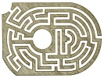

  
[Intangible Textual Heritage](../../index)  [Miscellaneous](../index) 
[Index](index)  [Previous](ml01)  [Next](ml03) 

------------------------------------------------------------------------

[Buy this Book at
Amazon.com](https://www.amazon.com/exec/obidos/ASIN/B002E9ID18/internetsacredte)

------------------------------------------------------------------------

  
*Mazes and Labyriths*, by W. H. Matthews, \[1922\], at Intangible
Textual Heritage

------------------------------------------------------------------------

p. ix

# CONTENTS

<table data-border="0" width="100%">
<colgroup>
<col style="width: 50%" />
<col style="width: 50%" />
</colgroup>
<tbody>
<tr class="odd">
<td data-valign="top" width="708">
 
</td>
<td data-valign="bottom" width="111">
PAGES
</td>
</tr>
<tr class="even">
<td data-valign="top" width="708">
PREFACE
</td>
<td data-valign="bottom" width="111">
<a href="ml01.htm#page_vii">vii</a>-viii
</td>
</tr>
<tr class="odd">
<td data-valign="top" width="708">
CONTENTS
</td>
<td data-valign="bottom" width="111">
<a href="#page_ix">ix</a>-xiv
</td>
</tr>
<tr class="even">
<td data-valign="top" width="708">
LIST OF ILLUSTRATIONS
</td>
<td data-valign="bottom" width="111">
<a href="ml03.htm#page_xv">xv</a>-xviii
</td>
</tr>
<tr class="odd">
<td data-valign="top" width="708">
CHAPTER I

INTRODUCTION

The Lure of the Labyrinth—Difficulties of Definition—The Subject and Object of this Book—The Lore of the Labyrinth—Some Neglected British Monuments—Destructive Dogmatism: a Plea for Caution
</td>
<td data-valign="bottom" width="111">
<a href="ml04.htm#page_1">1</a>-5
</td>
</tr>
<tr class="even">
<td data-valign="top" width="708">
CHAPTER II

THE EGYPTIAN LABYRINTH

(i) <em>Accounts of the Ancient Writers</em>

Enormous Edifices of Egypt—Herodotus: his Account of the Labyrinth, its Vastness and Complexity, and its Lake—Strabo's Description—The Sacred Crocodiles—Accounts of Diodorus, Pomponius Mela, and Pliny
</td>
<td data-valign="bottom" width="111">
<a href="ml05.htm#page_6">6</a>-10
</td>
</tr>
<tr class="odd">
<td data-valign="top" width="708">
CHAPTER III

THE EGYPTIAN LABYRINTH (<em>continued</em>)

(ii) <em>Accounts of Later Explorers</em>

Decay of the Labyrinth—Travels of Lucas and Pococke—French and Prussian Expeditions—Researches of Flinders Petrie—Speculations regarding Original Plan—Purpose and Date of Construction
</td>
<td data-valign="bottom" width="111">
<a href="ml06.htm#page_11">11</a>—16
</td>
</tr>
<tr class="even">
<td data-valign="top" width="708">
p. x

CHAPTER IV

THE CRETAN LABYRINTH

(i) <em>The Story of Theseus and the Minotaur</em>

Plutarch's Life of Theseus; the Cretan Exploit—The Athenian Tribute—The Labyrinth of Daedalus—The Clue of Ariadne—The Fight with the Minotaur—The Crane Dance—Tragedies of the Hero's Return—Other Accounts of the Legend—Speculations concerning Minos and Daedalus
</td>
<td data-valign="bottom" width="111">
<a href="ml07.htm#page_17">17</a>-22
</td>
</tr>
<tr class="odd">
<td data-valign="top" width="708">
CHAPTER V

THE CRETAN LABYRINTH (<em>continued</em>)

(ii) The Caverns of Gortyna—Statements by Later Classic Writers—Tournefort's Voyage—Visits of Pococke and Savary—Cockerell's Diary—Travels of Capt. Spratt—Connection of Gortyna Caverns with Traditional Labyrinth very improbable.
</td>
<td data-valign="bottom" width="111">
<a href="ml08.htm#page_23">23</a>-28
</td>
</tr>
<tr class="even">
<td data-valign="top" width="708">
CHAPTER VI

THE CRETAN LABYRINTH (<em>continued</em>)

(iii) <em>Knossos</em>

Explorations of Sir Arthur Evans—Momentous Discoveries—Unearthing of the Palaces—Their Antiquity—Description of the Great Palace—The Maze on the Wall—The Hall of the Double Axes—The Cult of the Bull—Schliemann's Researches—The Sport of Bull-Leaping—Possible Identity of the Palace with the Labyrinth
</td>
<td data-valign="bottom" width="111">
<a href="ml09.htm#page_29">29</a>-36
</td>
</tr>
<tr class="odd">
<td data-valign="top" width="708">
CHAPTER VII

THE ETRUSCAN OR ITALIAN LABYRINTH

Other Labyrinths mentioned by Pliny—Varro's Description of the Etruscan Labyrinth; the tomb of Lars Porsena—Speculations regarding it—Travels of Dennis—Labyrinthine Caverns in Etruria; Volterra and Toscanella—Extended use of the term "Labyrinth" by Strabo and Pliny—Reference to Mazes formed in Fields for Amusement
</td>
<td data-valign="bottom" width="111">
<a href="ml10.htm#page_37">37</a>-41
</td>
</tr>
<tr class="even">
<td data-valign="top" width="708">
p. xi

CHAPTER VIII

THE LABYRINTH IN ANCIENT ART

The Meander and other Rudimentary Forms—Seal-impressions—Coins of Knossos—"Unicursal" Nature of the Knossian Design—Graffito of Pompeii—The <em>Casa del Labirinto</em>—Roman Mosaic Pavements—The <em>Tholos</em> of Epidaurus—Labyrinthine Structure at Tiryns—Greek Pottery—Etruscan Vase—The Labyrinth on Gems and Robes
</td>
<td data-valign="bottom" width="111">
<a href="ml11.htm#page_42">42</a>-53
</td>
</tr>
<tr class="odd">
<td data-valign="top" width="708">
CHAPTER IX

CHURCH LABYRINTHS

Algeria, Orléansville—Italy: Lucca, Pavia, Piacenza, Cremona, Rome and Ravenna—France: Chartres, St. Quentin, Amiens, Rheims, Bayeux, Sens, Auxerre, Arras, St. Omer, Poitiers, Chalons, Pont l’Abbé, Caen and Aix—Modern examples: Lille, Ely, Bourn and Alkborough—Meaning of Church Labyrinths—Lack of Support for Accepted Theory
</td>
<td data-valign="bottom" width="111">
<a href="ml12.htm#page_54">54</a>-70
</td>
</tr>
<tr class="even">
<td data-valign="top" width="708">
CHAPTER X

TURF LABYRINTHS

Local Names—The Alkborough "Julian's Bower"—Juxtaposition to Ancient Ecclesiastical Site—A Fragment of Folk-lore—De la Pryme's Diary—The Breamore Mizmaze—Romantic Situation—The Wing Maze—The Boughton Green Shepherd's Race—Its Literary References—A Victim of the Great War—Mazes of Ripon and Asenby—The Song of the Fairies—Other Lincolnshire and Yorkshire Mazes—Stukeley on Julian's Bowers—Wide Distribution of British Turf Mazes
</td>
<td data-valign="bottom" width="111">
<a href="ml13.htm#page_71">71</a>-78
</td>
</tr>
<tr class="odd">
<td data-valign="top" width="708">
CHAPTER XI

TURF LABYRINTHS (<em>continued</em>)

The Winchester Mizmaze—The Vanished Mazes of Dorset: Leigh, Pimperne, Dorchester and Bere Regis—Aubrey's Notes on Wiltshire and Cotswold Mazes—The Saffron Walden Maze—The Comberton "Mazles"—The p. xii Hilton Maze and its Obelisk—The Cumberland "Walls of Troy": Burgh and Rockcliffe—The Nottingham Mazes: Sneinton and Clifton—The Somerton "Troy-town"—Records of Old Mazes at Guildford, the Malverns, and in Kent—"Julaber's Barrow"
</td>
<td data-valign="bottom" width="111">
<a href="ml14.htm#page_79">79</a>-91
</td>
</tr>
<tr class="even">
<td data-valign="top" width="708">
CHAPTER XII

THE ORIGIN OF TURF MAZES

An old Welsh Custom—"Troy" or "Turnings"?—Dr. Trollope on the Ecclesiastical Origin of Turf Mazes—The Welsh Figure—Criticism of the Ecclesiastical View—"Treading the Maze" in Tudor Times—Shakespearean References—Alchemy and the Labyrinth of Solomon—Figure in a Greek Monastery—Heraldic Labyrinths—The Question of the Roman Origin of Turf Mazes
</td>
<td data-valign="bottom" width="111">
<a href="ml15.htm#page_92">92</a>-99
</td>
</tr>
<tr class="odd">
<td data-valign="top" width="708">
CHAPTER XIII

THE FLORAL LABYRINTH AND THE DWARF-SHRUB MAZE

The Dwarf Box—Its use by Tudor and Roman Gardeners—Floral Labyrinths by De Vries—Some Quaint Horticultural Books: Parkinson, Estienne, Hill, and Lawson—Designs of Islip and Commelyn—"Queen Mary's Bower"
</td>
<td data-valign="bottom" width="111">
<a href="ml16.htm#page_100">100</a>-109
</td>
</tr>
<tr class="even">
<td data-valign="top" width="708">
CHAPTER XIV

THE TOPIARY LABYRINTH, OR HEDGE MAZE

Topiary work of the Romans—Pliny's "Hippodromus"—Dubious Mediaeval References—Rosamond's Bower—Early French "Daedales"—Mazes painted by Holbein and Tintoretto—Du Cerceau's Sketches—Elizabethan Mazes: Theobalds and Hatfield—Versailles and other Famous Labyrinths of France—Some German Designs—Belgian, Spanish, Italian and Dutch Mazes—William III and his Gardeners
</td>
<td data-valign="bottom" width="111">
<a href="ml17.htm#page_110">110</a>-127
</td>
</tr>
<tr class="odd">
<td data-valign="top" width="708">
CHAPTER XV

THE TOPIARY LABYRINTH, OR HEDGE MAZE (<em>continued</em>)

Hampton Court: the Maze and the Little Maze—Other English Mazes of the Period—Batty Langley and Stephen Switzer—Allegorical Labyrinth of Anhalt—A Wimbledon Maze—The Mazes of Westminster and Southwark
</td>
<td data-valign="bottom" width="111">
<a href="ml18.htm#page_128">128</a>-136
</td>
</tr>
<tr class="even">
<td data-valign="top" width="708">
p. xiii

CHAPTER XVI

THE TOPIARY LABYRINTH, OR HEDGE MAZE (<em>continued</em>)

<em>Latter-day Developments</em>

Decline of the Hedge-Maze Vogue—Mazes in "Pleasure Gardens": North London, Smith London—Modern Mazes in Essex, Suffolk, Cheshire, Lincolnshire, and Gloucestershire—Some Modern Continental Mazes—The Case For and Against the Hedge Maze
</td>
<td data-valign="bottom" width="111">
<a href="ml19.htm#page_137">137</a>-146
</td>
</tr>
<tr class="odd">
<td data-valign="top" width="708">
CHAPTER XVII

STONE LABYRINTHS AND ROCK ENGRAVINGS

The Stone Labyrinths of Finland—Their Local Traditions and Nomenclature—Their Antiquity—Aubrey's Acute Observation—Some Maze-like Rock Engravings in England, Ireland, and Brittany—A Curious Discovery in Arizona and a Spanish Manuscript—American Indians and the Cretan Labyrinth—Another Indian Pictograph—Zulu Mazes—Distribution of Labyrinth Cult
</td>
<td data-valign="bottom" width="111">
<a href="ml20.htm#page_147">147</a>-155
</td>
</tr>
<tr class="even">
<td data-valign="top" width="708">
CHAPTER XVIII

THE DANCE OR GAME OF TROY

"Troy" in Labyrinth Names—An old French Reference—The Vase of Tragliatella—Virgil's Account of the Troy Game—The Delian Crane-Dance—Knossos and Troy—Ariadne's Dance—Spring-Rites—"Sympathetic Magic"—Sword and Morris Dances—Troy-dances in Mediaeval Germany and in Modern Serbia—Preservation of the English Traditions
</td>
<td data-valign="bottom" width="111">
<a href="ml21.htm#page_156">156</a>-163
</td>
</tr>
<tr class="odd">
<td data-valign="top" width="708">
CHAPTER XIX

THE BOWER OF "FAIR ROSAMOND"

"Fair Rosamond," Henry, and Eleanor—The Dagger or the Bowl—History of the Legend—Accounts of Brompton and Higden—Delone's Ballad—Rosamond in Verse and Prose—Her Epitaph—A Question of Taste—Late Remains of the Bower—A Modern Play—Rosamond's Alleged Portrait
</td>
<td data-valign="bottom" width="111">
<a href="ml22.htm#page_164">164</a>-169
</td>
</tr>
<tr class="even">
<td data-valign="top" width="708">
p. xiv

CHAPTER XX

MAZE ETYMOLOGY

The Question of Definition again—Bowers and Julian-Bowers—What was a Bower and who was Julian?—The Labyrinth and the Double Axe—Chaucer and the Maze—Metaphorical Labyrinths—The Labyrinth in Scientific Nomenclature—The Meanings of "Maze"—Troy-towns and the New Troy
</td>
<td data-valign="bottom" width="111">
<a href="ml23.htm#page_170">170</a>-181
</td>
</tr>
<tr class="odd">
<td data-valign="top" width="708">
CHAPTER XXI

LABYRINTH DESIGN AND THE SOLUTION OF MAZES

The Need of a Definition—Practical Limitations—Classification of Mazes and Labyrinths—Unicursal and Multicursal, Compact and Diffuse Types—Modes of Branching—Straight-line Diagrams—Speculations on the Knossian Figure—Hints on Maze Design—Principles of Maze Solution—A Word on Mnemonics—Harris at Hampton Court
</td>
<td data-valign="bottom" width="111">
<a href="ml24.htm#page_182">182</a>-192
</td>
</tr>
<tr class="even">
<td data-valign="top" width="708">
CHAPTER XXII

THE LABYRINTH IN LITERATURE

Romance, Mystery, and Allegory—Labyrinthine Book Titles—Some Literary Monstrosities—Spiritual and Theological Labyrinths—Love, Labyrinths, and Anonymity—The Labyrinth in Modern Book Titles—Emblems—Melancholy Meditations in the Maze
</td>
<td data-valign="bottom" width="111">
<a href="ml25.htm#page_193">193</a>-200
</td>
</tr>
<tr class="odd">
<td data-valign="top" width="708">
CHAPTER XXIII

MISCELLANEA AND CONCLUSION

A Maze Collector—The Labyrinth in Queer Places—The Maze on Paper and on the Sands—Mirror Mazes—A Temporary Hedge Maze—Maze Toys—A Verbal Labyrinth—The Maze in Place-names—A Plea for the Preservation of some Ancient Monuments
</td>
<td data-valign="bottom" width="111">
<a href="ml26.htm#page_201">201</a>-213
</td>
</tr>
<tr class="even">
<td data-valign="top" width="708">
BIBLIOGRAPHICAL APPENDIX
</td>
<td data-valign="bottom" width="111">
<a href="ml27.htm#page_215">215</a>-235
</td>
</tr>
<tr class="odd">
<td data-valign="top" width="708">
INDEX
</td>
<td data-valign="bottom" width="111">
237-254
</td>
</tr>
</tbody>
</table>

 

------------------------------------------------------------------------

[Next: List of Illustrations](ml03)
