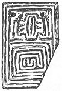

  
[Intangible Textual Heritage](../../index)  [Miscellaneous](../index) 
[Index](index)  [Previous](ml10)  [Next](ml12) 

------------------------------------------------------------------------

[Buy this Book at
Amazon.com](https://www.amazon.com/exec/obidos/ASIN/B002E9ID18/internetsacredte)

------------------------------------------------------------------------

  
*Mazes and Labyriths*, by W. H. Matthews, \[1922\], at Intangible
Textual Heritage

------------------------------------------------------------------------

p. 42

# CHAPTER VIII

### THE LABYRINTH IN ANCIENT ART

THERE has been considerable speculation as to how the typical labyrinth
form first came into existence. It became stereotyped long before the
Christian era and retained its character for many centuries.

The coins of Knossos furnish us with abundant examples of it, and, from
the fact that in certain of the earlier specimens the corresponding
figure is a simple repeated meander, it has been supposed that the
typical labyrinth design arose by elaboration of the meander. The
resemblance between this form and the very wide-spread and primitive
sign known as the *fylfot* or *swastika* has also attracted some
attention. It is a somewhat long step, however, from a loose combination
of meanders like that shown in, say, [Fig. 20](#img_fig020-5), to the
compact conventional labyrinth of [Fig. 30](#img_fig026-31). The
adoption of the former design may possibly have been inspired by the
fresco on one of the walls of the Minoan palace, to which we have made
reference in Chapter VI ([Fig. 8](ml09.htm#img_fig008)), portions of
which may have been visible among the ruins for several generations.
There does not appear to be any evidence that the complex meander
pattern of the fresco was an allusion on the part of the Minoans to an
actual constructional labyrinth; it may quite well have been a purely
ornamental conception, without any symbolical significance. Meander
designs were used by the Minoans at a

p. 43

much earlier date than this, one example, though of simpler charmer,
having been found in the older palace, and others, either snake-like or
of a squarish nature, on ivory seals unearthed at other Minoan sites
(Zakro and Hagia Triada). Similar designs exist on certain Egyptian
"button-seals" of an approximately contemporary period—from the VIth
Dynasty onwards—and Sir Arthur Evans has expressed the opinion that
these will possibly prove to constitute the source of the Labyrinth in
Art. [Figs. 15, 16, 17, 18](ml10.htm#img_fig015-8) show 

<table data-align="RIGHT">
<colgroup>
<col style="width: 100%" />
</colgroup>
<tbody>
<tr class="odd">
<td data-valign="CENTER"> 
FIG. 19.—Early Egyptian Plaque or Amulet. 
(Prof. Petrie's Collection, University College, London.)</td>
</tr>
</tbody>
</table>

specimens of early Egyptian seals and plaques of this character in the
British Museum. Professor Flinders Petrie very kindly drew the writer's
attention to a steatite plaque in his collection at University College,
London, which is somewhat similar to one of those mentioned above, but
of rather more elaborate design ([Fig. 19](#img_fig019)). The
labyrinthine pattern on this is surmounted by a representation, in the
peculiar "linear" fashion often adopted by early Egyptian artists, of
two seated human figures facing one another, the knees being drawn up.
Professor Petrie acquired the plaque at Memphis. He considers that it
dates from a period round about 3000 B.C., and points out that if the
broken lines be completed there would appear to be five false turns to
be avoided before reaching the centre.

In discussing the designs on these seals and plaques, Sir A. Evans
alludes to a possible connection with two of the hieroglyphs of the
period, which are of the nature of simple square meanders of a kind
extensively employed in ancient ornament. One of them (*mer*) is the
sign used for indicating irrigated land. The other (*aha*)

p. 44

is a simplified form of a more elaborate sign representing the plan of a
palace court, a figure to which one of the Minoan signs bears a close
resemblance.

The Knossian coins shown in [Figs. 20](#img_fig020-5) are from the
British Museum collection and are reproduced by the courtesy of the
Keeper of the Coins and Medals Department, who supplied the writer with
plaster casts for the purpose. They date, of course, from times greatly
posterior to those of the Minoan civilisation, from times when the
culture of Greece had long replaced that of the Mycenaeans, or whatever
similar race it was that succeeded the Minoans (see Appendix IV, i.).

[Figs. 20, 21, and 22](#img_fig020-5) show silver coins dating from
about 500 to 430 B.C. They portray on one side the Minotaur and on the
other a symmetrical meander pattern which, it needs very little
imagination to see, has reference to the labyrinth in which the monster
was alleged to dwell.

[Fig. 23](#img_fig020-5) shows a silver coin of a rather later date,
representing on its obverse a female head which is thought to be that of
Demeter or Persephone, and on the reverse a meander-labyrinth containing
a star at its centre.

[Fig. 24](#img_fig020-5) shows a similar obverse, but on the reverse we
see a bull's head surrounded by a simple meander frame.

[Fig. 25](#img_fig020-5), the obverse of which is likewise adorned with
a female head, gives on the reverse the design of a square labyrinth of
the conventional type that thereafter predominates.

[Fig. 26](#img_fig026-31) shows a bronze coin having on one side the
head of Apollo and on the other a labyrinth with a star.

The four coins last described date from a period between 430 and 350
B.C. The next ([Fig. 27](#img_fig026-31)) is rather later in date and
shows on its obverse the head of Hera and on the reverse a square
labyrinth together with an arrow-head and thunderbolts and the Greek
characters ΚΝΩΣΙΩΝ.

The bronze coin of about 220 B.C., shown in [Fig. 28](#img_fig026-31),

 

  [  
Click to enlarge](img/fig020-5.jpg)  
Figs. 20 to 25. Coins of Knossos. (British Museum).  

p. 45

  [  
Click to enlarge](img/fig026-31.jpg)  
Figs. 26 to 31. Coins of Knossos. (British Museum).  

 

bears on its obverse the figure of Europa seated on a bull, with two
dolphins below, and on the reverse a square labyrinth, the Knossian
superscription being again evident.

The remaining three figures represent silver coins of the two succeeding
centuries, but not later than 67 B.C.

[Fig. 29](#img_fig026-31) exhibits on one side the head of Pallas, and
on the reverse a little square labyrinth placed beside an owl standing
upon a prostrate amphora.

In [Fig. 30](#img_fig026-31) the obverse is occupied by the head of
Apollo, the reverse by a labyrinth of circular shape, but conforming to
the conventional plan.

The head on the coin shown in [Fig. 31](#img_fig026-31) may be intended
for that of Minos or Zeus. On the reverse is a square labyrinth.

Labyrinthine designs are also found on certain Lydian, Phrygian, and
Ionian coins.

It will be noticed that when once the labyrinth pattern has been
definitely conventionalised it remains very constant in principle,
whether its general conformation be rectangular or circular. Starting
from the exterior, the "path" runs inwards a short distance, turns so as
to run parallel with the outer wall until nearly a full circuit has been
completed, then doubles back on itself and runs round in the opposite
direction, doubles upon itself again, and so on until it finally comes
to a stop in a blind end, having traversed all of the space within the
outer walls without covering any part twice and without forming any
branches or loops.

Obviously there is no "puzzle" about this kind of labyrinth; one has
simply to follow the one path, either to penetrate to the inner goal or
to escape thence to the exterior.

A labyrinth of precisely this type was discovered traced on the surface
of a crimson-painted pillar in the peristyle of the building known as
the House of Lucretius, in the excavated portion of Pompeii ([Fig.
32](#img_fig032)). It

p. 46

was evidently scratched with a nail or stylus by some idler of 2000
years ago (Pompeii was overwhelmed by Vesuvius in A.D. 79) and is
accompanied by the words "LABYRINTHUS. HIC HABITAT MINOTAURUS," possibly
in waggish reference to the owner or occupier of the premises.

Another house has, in consequence of its mosaic and pictorial references
to the Cretan Labyrinth, received the name of the Casa del Labirinto or
House of the Labyrinth. One mosaic discovered therein depicts Theseus

  [  
Click to enlarge](img/fig032.jpg)  
FIG. 32.—*Graffito* at Pompeii. (Museo Borbonico.)  

and the Minotaur struggling on the ground, watched by a group of
affrighted maidens.

The Romans excelled in the art of designing and executing mosaic
pavements, abundant remains of which have been preserved. These were of
various kinds. There was the *pavimentum sectile*, composed of pieces of
marble of various sizes, shapes, and colours arranged in uniform sets,
so as to form when put together an ornamental pattern; the *pavimentum
tessellatum*, in which the pieces of marble, though variously coloured,
were all of the same size and shape, generally small squares; the
*pavimentum vermiculatum*, composed of very small pieces of coloured

p. 47

marble of irregular shape so arranged as to portray objects in their
natural shapes and colours; and finally the pavimentum scalpturatum, in
which the design was engraved or inlaid. *Opus alexandrinum* is a
variant of *sectile*.

Several Roman pavements embodying labyrinthine devices, and in some
cases commemorating the victory of Theseus over the Minotaur, or other
exploits of

  [  
Click to enlarge](img/fig033.jpg)  
FIG. 33.—Mosaic at Salzburg. (Kreuzer.)  

the hero, have come to light from time to time, not only on the
continent of Europe but also in England; they are usually executed in
*opus alexandrinum*.

[Fig. 33](#img_fig033) shows in outline a beautiful specimen, 18 ft.
long and 15 ft. broad, discovered at Salzburg, in Austria. It bears the
device of a labyrinth, with, at the centre, a representation of Theseus
about to give the fatal blow to the Minotaur.

On the left side we see Theseus and Ariadne joining hands over the
altar. In the upper panel Theseus appears

p. 48

to be putting Ariadne ashore, and to the right we see the disconsolate
maiden deserted by her lover, presumably on the Isle of Naxos.

A labyrinth of the type shown also occurs on a Roman mosaic which was
unearthed in the churchyard at Caerleon-on-Usk. It was in a poor state
of preservation, but sufficient remains to show that the labyrinth, of a
design similar to that of the Salzburg specimen, is surrounded by
scrolls proceeding from two vases ([Fig. 34](#img_fig034)).

A very fine specimen of this type of labyrinth was discovered in 1904
beneath a ploughed field at Harpham, in the East Riding of Yorkshire.
Another, of which details are not to hand, is said to have been found in
Northamptonshire.

In 1790 a pavement, about eighteen feet by twelve, was unearthed at Aix,
near Marseilles. It portrayed the combat between Theseus and the
Minotaur, within a framed square, the remainder of the mosaic consisting
of a complicated interlaced meander representing the labyrinth.

In Fig. 35 is reproduced from A. de Caumont's "Abécédaire d’Archéologie"
a rough sketch of the Roman baths at Verdes (Loir-et-Cher), showing a
pavement with a labyrinth mosaic.

A pavement found in 1830 at Cormerod, in the Canton of Friburg,
Switzerland, is shown in [Fig. 36](#img_fig036). A few years afterwards
another was brought to light in the neighbouring Canton of Vaud, from
beneath the ruins of the ancient town of Orbe.

A splendid mosaic labyrinth of Roman times was found some forty or fifty
years ago on a family tomb in the ancient necropolis of Susa, Tunis
(*Hadrumetum*). It was afterwards destroyed by looters, but a careful
drawing of it was fortunately made on its first discovery ([Fig.
37](#img_fig037)). The whole mosaic measured about seventeen feet by
ten, and contained a very finely executed labyrinth of four paths, like
the Harpham and Caerleon examples

 

  [  
Click to enlarge](img/fig034.jpg)  
Fig. 34. Mosaic at Caerleon, Mon. (O Morgan, in Proc. Mon. and Caerleon
Ant. Ass’n, 1866)  

  [  
Click to enlarge](img/fig036.jpg)  
Fig. 36. Mosaic at Cormerod, Switzerland. (Mitt. Ant: Ges. Zurich,
XVI.)  

 

p. 49

mentioned above, the central space being occupied by the Minotaur, who
is shown in an attitude of defeat.

  [  
Click to enlarge](img/fig035.jpg)  
Fig. 35.—Roman Baths at Verdes, Loir-et-Cher, showing Labyrinth Mosaic.
(From De Caumont's Abécédaire.)  

\[paragraph continues\] Sailing towards
the labyrinth was a boat containing figures which presumably represented
Theseus and his

p. 50

companions. The design was accompanied by the words "HIC INCLUSUS VITAM
PERDIT."

Another well-preserved mosaic of this character was

  [  
Click to enlarge](img/fig037.jpg)  
FIG. 37.—Mosaic at Susa, Tunis. (C.R. Acad. Inscriptions, Paris.)  

discovered in 1884 at Brindisi, and placed in the municipal museum of
that town. It measures 17 ft. by 10 ft. 6 in., and shows within a square
labyrinth Theseus in the act of clubbing the Minotaur, who has fallen on
his

p. 51

knees. Around the labyrinth are various perches with birds thereon,
perhaps in allusion to the automatic birds reputed to have been made by
Daedalus (*cf*. [Fig. 36](#img_fig036)).

We shall examine other mosaic and pavement labyrinths when we come to
consider the question of the use of this symbol by the Church.

Apart from the designs on Knossian coins, Greek art does not appear to
have left us any definite representations of the labyrinths, although
with the Romans, who acquired the idea at a later date, it was a
favourite *motif*.

We cannot, however, ignore the suggestion that has been made that
certain structures discovered in the ruins of Tiryns and Epidaurus, two
cities in that part of ancient Greece known as the Argolid, are
architectural labyrinths, used for ritual purposes. The foundations of
the *tholos*, or rotunda, of the sanctuary of Aesculapius at Epidaurus,
which was excavated by P. Kabbadias, Director of the Greek
Archaeological Society, in the ’eighties, do certainly suggest something
of the kind. They consist of concentric circular walls, the three
innermost being connected by a radial wall, separated by narrow spaces
which intercommunicate by an opening or doorway in each wall, forming in
plan a figure somewhat in the style of the "Pigs in Clover" toy
mentioned in a later chapter. When the peculiar nature of the upper part
of the building is considered, however, it seems very reasonable to
suppose that these walls, with their passages, were designed only with a
view to the requirements of the superstructure which they had to
support.

As for the slightly similar concentric foundations unearthed by German
excavators at Tiryns in 1912, the analogy is too imperfect to afford
reliable grounds for the statement in question.

Greek ceramic art, on the other hand, furnishes us with very many
allusions to the Theseus-Minotaur myth, and also with a profusion of
frets and meanders, which are thought in some cases to be symbolical of
the labyrinth.

p. 52

Consider, for instance, the "*kylix*" or bowl in the British Museum
which is shown in [Fig. 38](#img_fig038-9). (A similar bowl is preserved
in Harrow School Museum.) On it are represented most of the exploits of
the hero up to his Knossian adventure. All who are familiar with the
legend will recognise at a glance Periphetes the Club-bearer, Sinis the
Pine-bender, the Wild Sow of Krommyon, Kerkyon the Wrestler, Procrustes
of the Standard Bed, and other gentlefolk that Theseus successively
encountered and appropriately dealt with on his initial journey to
Athens. In the centre of the bowl is shown the adventure of the
Labyrinth, the hero being seen in the act of despatching the monster at
the very door of his lair. The meander on the door-post has been thought
to symbolise the Labyrinth, but there is more reason to suppose that it
is purely decorative.

The Minotaur exploit is also shown on the smaller bowl shown in [Fig.
39](#img_fig038-9).

In the previous chapter we have already referred to an Etruscan vase
found at Tragliatella. This was very roughly decorated with incised
figures, representing amongst other things a circular labyrinth of the
traditional type and some horsemen who are thought to be engaged either
in the attack on Troy or in the game known as the *Lusus Trojae* or Game
of Troy. That there can be no doubt about the artist's identification of
the labyrinth in some way with the celebrated city in question is clear
from the word *Truia* scratched within it ([Fig.
133](ml21.htm#img_fig133)).

Representations of the labyrinth were sometimes en-graved on ancient
gems, a fine specimen of which is figured in P. A. Maffei's "Gemme
Antiche" ([Fig. 40](#img_fig040)), published in 1707. The Minotaur in
this case is shown as a centaur. A similar representation appears on a
sixteenth-century bronze plaquette of Italian workmanship exhibited in
the Plaquette Room at the British Museum ([Fig.
41](ml12.htm#img_fig041). See plate, [p. 60](ml12.htm#page_60)).

Before leaving the subject of the Labyrinth in ancient

 

  [  
Click to enlarge](img/fig038-9.jpg)  
Figs. 38, 39. Greek Kylices shewing Exploits of Theseus. (British
Museum)  

 

p. 53

art we must take notice of a reference in an ancient manuscript which
tends to show that the symbol figured on the robes of Roman Emperors.
This manuscript was discovered by A. F. Ozanam in the Laurentian Library
at Florence. It is entitled "Graphia Aurea Urbis Romae" and contains,
under the heading "De diarodino imperatoris," the following passage:

*Habeat et in diarodino laberinthum fabrefactum ex auro et margaritis,
in quo sit Minotaurus, digitum ad os tenens ex *

  [  
Click to enlarge](img/fig040.jpg)  
FIG. 40.—Labyrinth engraved on an ancient gem. (Maffei.)  

*smaragdo factus, quia sicut non valet quis laberinthum scrutare, ita
non debet consilium dominatoris propalare*.

"Let there be represented on it (the Emperor's robe) a labyrinth of gold
and pearls, in which is the Minotaur, made of emerald, holding his
finger to his mouth, thus signifying that, just as none may know the
secret of the labyrinth, so none may reveal the monarch's counsels."

It has been pointed out by Mr. A. B. Cook that in the Fitzwilliam Museum
at Cambridge is a painting by Bartolommeo Veneto (1502-1530)
representing an unknown man who wears on his breast a labyrinth
resembling that described above.

------------------------------------------------------------------------

[Next: Chapter IX. Church Labyrinths](ml12)
