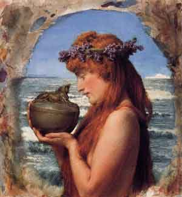

  
[Intangible Textual Heritage](../../index)  [Misc](../index) 

------------------------------------------------------------------------

<table width="75%">
<colgroup>
<col style="width: 50%" />
<col style="width: 50%" />
</colgroup>
<tbody>
<tr class="odd">
<td data-valign="CENTER" width="50%"></td>
<td data-valign="CENTER" width="50%"><h1 id="orpheus" data-align="center">Orpheus</h1>
<h3 id="myths-of-the-world" data-align="center">Myths of the World</h3>
<h2 id="by-padraic-colum" data-align="center">by Padraic Colum</h2>
<h4 id="illustrations-by-boris-artzybasheff" data-align="center">Illustrations by Boris Artzybasheff</h4>
<h4 id="copyright-not-renewed" data-align="center">[1930, copyright not renewed]</h4></td>
</tr>
</tbody>
</table>

------------------------------------------------------------------------

This is a survey of world mythology by Padraic Column. Originally titled
'Orpheus, Myths of the World', later editions were retitled simply
'Myths of the World'. Colum was a prolific writer on this subject, and
although best known for his adaptations of Celtic tales, particularly
for younger readers, he also wrote several books for a wider audience,
including three on the mythology of the Pacific area. This volume can be
enjoyed by readers of all ages. Although all of the material here is
covered elsewhere at this site, the selection and retelling in a
consistent voice allow the reader to spot parallels between diverse
traditions, and recognize outcroppings in particular narratives of
unique features.

------------------------------------------------------------------------

[Title Page](omw00)  

### Introduction

[The Significance of Mythology](omw01)  
[Egyptian Mythology](omw02)  
[Babylonian](omw03)  
[Persian](omw04)  
[Jewish: Post-Christian Period](omw05)  
[Greek](omw06)  
[Latin](omw07)  
[Graeco-Roman](omw08)  
[Celtic](omw09)  
[Finnish](omw10)  
[Icelandic](omw11)  
[Indian](omw12)  
[Chinese](omw13)  
[Japanese](omw14)  
[Polynesian](omw15)  
[Peruvian](omw16)  
[Central American and Mexican](omw17)  
[Zuñi](omw18)  
[Conclusion](omw19)  
[Contents](omw20)  

### Egyptian

[Osiris and Isis](omw21)  
[Rê, His Going-Down and Uprising](omw22)  

### Babylonian

[In the Beginning](omw23)  
[Gilgamish](omw24)  
[The Story of Uta-Napishtim and of the Deluge that Destroyed All that
was on the Earth](omw25)  
[Ishtar's Descent into the World Below](omw26)  

### Persian

[Jamshīd the Resplendent](omw27)  

### Jewish Post-Christian Period

[The Angels and the Creation and Fall of Man](omw28)  
[The Confounding of the Angel of Death](omw29)  

### Greek

[In the Beginning](omw30)  
[Prometheus](omw31)  
[Pandora](omw32)  
[Demeter](omw33)  
[Orpheus](omw34)  
[Dionysos](omw35)  
[Apollo](omw36)  
[Herakles, Part I](omw37)  
[Herakles, Part II](omw38)  

### Roman

[The Children of Mars, Part I](omw39)  
[The Children of Mars, Part II](omw40)  
[Numa the Law-Giver](omw41)  
[The Sibyl](omw42)  
[Pomona and Vertumnus](omw43)  

### Græco-Roman

[Cupid and Psyche. Part I](omw44)  
[Cupid and Psyche, Part II](omw45)  

### Celtic

### Irish

[Midir and Etain](omw46)  
[The Death of Conaire Mór, the King of Ireland, Part I](omw47)  
[The Death of Conaire Mór, the King of Ireland, Part II](omw48)  
[The Voyage of Bran to the Land of the Immortals](omw49)  

### Welsh

[Pwyll, Prince of Dyfed and His Visit to Annwfn, the Realm of
Faërie](omw50)  
[Math, the Son of Mathonwy: Part I. The Treachery of Gwydion and
Gilvaethwy](omw51)  
[Math, the Son of Mathonwy: Part II. The Transformations of Gwydion and
Gilvaethwy](omw52)  
[Math, the Son of Mathonwy: Part III. Gwydion and Arianrhod](omw53)  
[Math, the Son of Mathonwy: Part IV. The Maiden Made of
Flowers](omw54)  

### Finnish

[Lemminkainen, His Destruction and His Restoration to Life](omw55)  

### Icelandic

[In the Beginning](omw56)  
[The Building of the Wall](omw57)  
[Mimir](omw58)  
[Baldr](omw59)  
[Loki's Punishment](omw60)  
[The Children of Loki](omw61)  
[Ragna Rök, the Fate of the Gods](omw62)  

### Indian

### Vedic

[The Heavenly Nymph and her Mortal Husband](omw63)  

### Epic

[The Churning of the Ocean](omw64)  
[The Birth of the Ganges](omw65)  
[Sāvitrī and the Lord of the Dead](omw66)  
[Damayantī's Choice](omw67)  

### Buddhist

[Gotama's Attainment](omw68)  

### Chinese

[In the Beginning](omw69)  
[The Weaver Maiden and the Herdsman](omw70)  

### Japanese

[The Sun Goddess and the Storm God and the Strife there was Between
Them](omw71)  
[The First People](omw72)  

### Polynesian

[In the Beginning](omw73)  
[How Ma-Ui Strove to Win Immortality For All Creatures](omw74)  
[Pe-le, Hawaii's Goddess Of Volcanic Fire, Part I](omw75)  
[Pe-le, Hawaii's Goddess Of Volcanic Fire, Part II](omw76)  
[Pe-le, Hawaii's Goddess Of Volcanic Fire, Part III](omw77)  

### Peruvian

[Viracocha](omw78)  
[The Llama-Herder and the Virgin of the Sun](omw79)  

### Central American and Mexican

[In the Beginning](omw80)  
[The Twin Heroes and the Lords of Xibalba](omw81)  
[Quetzalcoatl](omw82)  
[Quetzalcoatl's Enemy](omw83)  
[The Gods of the Azteca](omw84)  
[The Azteca](omw85)  

### Zuñi

[Paíyatuma and the Maidens of the Corn](omw86)  
