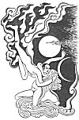

  
[Intangible Textual Heritage](../../index)  [Misc](../index) 
[Index](index)  [Previous](omw68)  [Next](omw70) 

------------------------------------------------------------------------

p. 237

[  
Click to enlarge](img/23700.jpg)  
The Weaver Maiden and the Herdsman  

# CHINESE

## IN THE BEGINNING. THE WEAVER MAIDEN AND THE HERDSMAN

### IN THE BEGINNING

In the beginning there was *Yang-yin* which is light-darkness,
heat-cold, dryness-moisture. Then that which was subtle went upward, and
that which was gross tended downward; the heavens were formed from the
subtle, the earth from the gross. Now there was *Yang* and *Yin*, the
active and the passive, the male and the female. From the operation of
*Yang* upon *Yin* came the seasons in their order, and the seasons
brought into existence all the products of the earth. The warm effluence
of *Yang* produced fire, and the subtlest parts of fire went to form the
sun; the effluence of *Yin* produced water, and the subtlest parts of
water went to form the moon. The sun operating on the moon produced the
stars. The heavens became adorned with sun, moon, and stars, and the
earth received rivers, rain, and dust. And *Yang* combining with *Yin*,
the principle that is above combining with the principle that is below,
produces all creatures, all things. The power that is *Yang*, the
receptivity that is *Yin*, can never be added to, never taken away from:
in these two principles is the All.

So the sages relate in their perspicuous writings. But the people say
that before *Yang* and *Yin* were separated, P’an Ku, a man, came into
existence. He had a chisel and a mallet. He had horns projecting from
his forehead and tusks projecting from his jaws. He grew in stature
every day he lived--for eighteen thousand years he grew six feet every
day in stature. Nothing was in place when P’an Ku came into the
universe, but with his mallet and his chisel he ordered all things; he
hewed out bases for the mountains, he scooped out basins for the seas,
he dug courses for the rivers, and hollowed out the valleys. In this
meritorious work P’an Ku was engaged for eighteen thousand years.

He was attended by the Dragon, the Unicorn, the Tortoise, and the
Phœnix--the four auspicious creatures. The Dragon is the head of all the
beasts because it is the one that is most filled with the principle

p. 238

of *Yang*: it is bigger than big, smaller than small, higher than high,
lower than low; when it breathes its breath changes to a cloud on which
it can ride up to Heaven. The Dragon has five colours in its body, and
it is the possessor of a pearl which is the essence of the moon and a
charm against fire; it can make itself visible and invisible; in the
spring it mounts up to the clouds, and in the autumn it remains supine
in the waters. The Unicorn is strong of body and exceptionally virtuous
of mind, and it combines in itself the principles of *Yang* and *Yin*.
It eats no living vegetation and it never treads upon green grass. The
Tortoise is the most propitious of all created things; it possesses the
secrets of life and death, and it can, with its breath, create clouds
and palaces of enchantment. The Phœnix is at the head of all birds; its
colour is the blending of the five colours and its call is the harmony
of the five notes; it bathes in the pure water that flows down from the
K’un-lun Mountains, and at night it reposes in the Cave of Tan.

But notwithstanding the fact that he was respectfully attended by the
auspicious creatures, P’an Ku put the sun and moon in places that were
not properly theirs. The sun and the moon went into the sea, and the
world was left without luminaries. P’an Ku went out into the deep; he
held out his hands to indicate where they were to go, and he repeated a
powerful incantation three times. Then the sun and the moon went into
the places that were properly theirs and the universe rejoiced at the
ensuing harmony.

But the establishment of the universe was not completed until P’an Ku
himself had perished; he died after eighteen thousand years of labour
with his chisel and mallet; then his breath became the wind and clouds,
and his beard became the streaming signs in the sky; his voice became
the thunder, his limbs the four quarters of the earth; his head became
the mountains, his flesh the soil, and his blood became the rivers of
earth; his skin and hair became the herbs and trees, and his teeth,
bones, and marrow became metals, rocks, and precious stones. Even then
the universe was not adequately compacted: P’an Ku had built up the
world in fifty-one stories, giving thirty-three stories to the heavens
and eighteen stories to the hells beneath the earth. But he had left a
great cavity in the bottom of the world, and, at inauspicious times, men
and women fell down through it. A woman

p. 239

whose name was Nu-Ku found a stone which adequately covered the cavity;
rightly positioning it, she covered up the emptiness, and so completed
the making of the well-ordered world.

------------------------------------------------------------------------

[Next: The Weaver Maiden and the Herdsman](omw70)
