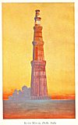
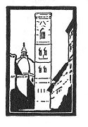
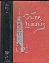
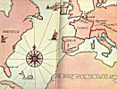
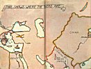
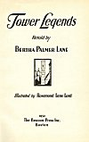
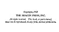

  
[Intangible Textual Heritage](../../index)  [Miscellaneous](../index) 
[Index](index)  [Next](tl01) 

------------------------------------------------------------------------

p. i

|                                                                                                                                                                                                                                                                                                                                                                                                                               |
|-------------------------------------------------------------------------------------------------------------------------------------------------------------------------------------------------------------------------------------------------------------------------------------------------------------------------------------------------------------------------------------------------------------------------------|
| TO THE AUTHORS AND PUBLISHERS OF THE BOOKS WHICH HAVE FURNISHED SOURCES FOR THE LEGENDS, THANKS ARE HEREWITH GIVEN. LISTS OF THESE BOOKS AND ARTICLES ARE INCLUDED WITH THE NOTES AT THE END OF THE BOOK. SPECIAL THANKS SHOULD BE GIVEN TO MR. A. K. CHIU, OF THE WIDENER LIBRARY, FOR HIS SUGGESTIONS IN REGARD TO CHINESE PHRASEOLOGY; AND HEARTY THANKS TO OTHER PERSONS WHOSE COMMENTS ON THE STORIES HAVE BEEN HELPFUL. |

p. ii

[  
Click to enlarge](img/front.jpg)  
KUTB MINAR, Delhi, India  

p. iii

 

# Tower Legends

##### Retold by

## BERTHA PALMER LANE

 

### Illustrated by Rosamond Lane Lord

#### \[1932\]

#### The Beacon Press Inc.

#### Boston

NOTICE OF ATTRIBUTION  
canned at Intangible Textual Heritage, December 2005. Proofed and
formatted by John Bruno Hare. This text is in the public domain in the
United States because its copyright was not renewed in a timely fashion.
These files may be used for any non-commercial purpose, provided this
notice of attribution is left intact in all copies.

[  
Click to enlarge](img/cover.jpg)  
Cover  

[  
Click to enlarge](img/fep.jpg)  
Front Endpaper  

[  
Click to enlarge](img/bep.jpg)  
Back Endpaper  

[  
Click to enlarge](img/title.jpg)  
Title Page  

[  
Click to enlarge](img/verso.jpg)  
Verso  

p. v

To W. C. L.

------------------------------------------------------------------------

[Next: Preface](tl01)
