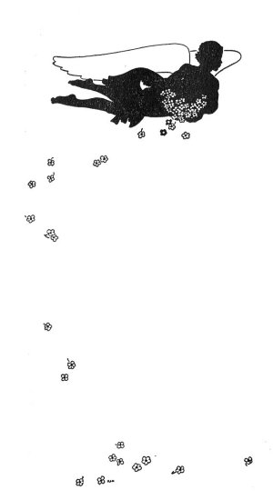
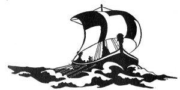

  
[Intangible Textual Heritage](../../index)  [Miscellaneous](../index) 
[Index](index)  [Previous](tl04)  [Next](tl06) 

------------------------------------------------------------------------

p. 15 p. 17

[  
Click to enlarge](img/01700.jpg)  
THE TOWER OF THE WINDS, *Athens, Greece*  

p. 19

### AEOLUS AND THE TOWER OF THE WINDS

THE winds of Greece are blowing, today, in sunny Athens, around the
Tower of the Winds on Aeolus Street. The tower stands in an enclosed,
grassy space, with a few trees and scattered stones--as if left a little
aside by the centuries. This tower had its origin in a daydream of
Andronicus, lover of winds and stars; for, in spite of the belief of the
early Greeks that all dreams live under the earth, Andronicus made his
dream live actually on the earth, in plain sight of the Athenians. It
was in the first part of the century before Christ that Andronicus was
chosen by the people of Athens to plan a tower which should contain a
water clock--this new tower to stand not far from the old market-place,
on the low land lying north of the Acropolis. Now as Andronicus was
something of an astronomer he decided to have sundials, also, on the
water clock. So the tower was built, with a turret on the south side to
contain the cistern which supplied the water for the water clock. The
movement of water wheels caused the gradual rise of a small figure which
pointed a rod to the hours on a dial. The Athenians were much pleased
with their new water clock, or clepsydra. Greeks of earlier centuries
had had to look to the stars for their time at night. "What star is
passing?" they would ask. The clepsydra was evidently better than that
method; in fact, it was the most important part of the tower! But, to
Andronicus, it was of small significance compared with the thought of
his beloved winds; for his cherished

p. 20

daydream was that he would represent on the tower all the winds that
blow across the land of Greece. Not only that! He would show to
passersby in Athens the very wind that was blowing. The people should
have their clepsydra, but the tower should have the winds!

Ever since his youthful days in Cyrrhus, Andronicus had cared for the
winds and all the tales about them. He had an especially friendly
feeling for Aeolus, king of the winds, whose cave, far away in a
mountain on the island of Aeolia, north of Sicily, he knew as well as if
he had seen it. Wasn't that cave the home of the winds who were really
the sons of Aeolus? Weren't they kept imprisoned there to play merrily
or roughly with one another until their royal master at times released
one or more of them? Andronicus knew that winds varied as much as men:
there were weak winds, strong winds, capricious winds, steadfast winds,
winds that did nothing, winds that did everything. When Aeolus sent them
forth, in the great bags that mortals call clouds, and bade them carry
out his commands, what couldn't they accomplish of joy or sorrow?

Many a tale of Aeolus and the winds, Andronicus had known from boyhood.
One of these tales was about Aeolus and Odysseus. In the course of his
long voyaging, Odysseus and his comrades came to the island of Aeolia,
one portion of which floated continually, yet never floated away.
Sur-rounding the steep shore, was a high wall of bronze through which no
man could easily break. Behind this protecting wall, Aeolus and his
large family dwelt happily, singing and feasting. When the ship of
Odysseus neared Aeolia, the gods

p. 21

favored him, for he and his men, by heroic effort, were able to climb
the wall of bronze and to enter the island. The heart of King Aeolus
instantly warmed at sight of Odysseus, for he gave him welcome to his
royal dwelling and bade him and his comrades tarry as long as they
would. Joyous feasts now went on, day after day, and, during the feasts,
Odysseus, in return for the lavish hospitality of Aeolus, told many a
story--stories of Ilium, of the Argive ships, and of the Achaeans.
Aeolus and his family listened spellbound. After a month of idleness and
feasting, Odysseus became restless for new adventures and told King
Aeolus that he was eager to see Ithaca, his home, once more. Aeolus did
not try to keep him longer as his guest, and even made him a parting
gift. This gift was a huge sack of ox-skin in which all the winds,
except the west wind, were tightly bound. When Odysseus boarded his
ship, Aeolus himself tied the sack to the mast with a shining silver
cord and told the west wind to waft the ship along. Then he bade
Odysseus farewell.

Nine days and nine nights, Odysseus and his men sailed on. At dawn, on
the tenth day, their hearts were glad because the fields of Ithaca came
into view, and, on the shore, men could be seen tending the beacon
fires. Odysseus, thankful to be nearing the end of his voyage and
utterly worn out by his constant watching, now allowed one of his men to
guide the ship, though, during the nine days and nights, he himself had
continually held the sheet and carefully watched the course. Sleep
immediately overpowered him.

While he slept, his men began to talk among themselves about the sack.
One said, "I am sure Odysseus is bringing

p. 22

home gold and silver as gifts from generous Aeolus." Another spoke up
angrily, saying, "Why is it all men give high praise to Odysseus, no
matter where he goes? Remember you not, when we came from Ilium, he was
laden with treasures, but we had nothing? Assuredly King Aeolus has
given to him great gifts, but what, now, have we?" And still another
bold sailor said, "Come, let us see what is in the sack!" Quickly--for
fear Odysseus should wake--they cut down the ox-hide bag.

Instantly, all the winds rushed forth, knocking aside the gentle, west
wind, stirring up stormy waves and knocking overboard several sailors.
Odysseus, roused by the commotion, awoke in dismay and was inclined at
first to throw himself overboard, but then decided to endure his fate,
even though he could no longer guide the ship. Covering his head he laid
himself down beside his lamenting companions, while the fierce winds
drove the ship back to Aeolia. When driven ashore there, Odysseus,
taking with him one of his comrades and a herald, climbed again over the
wall of bronze and sought the dwelling of Aeolus. Humbly the three sat
down on the threshold by the doorposts. Aeolus, his wife and their sons
and daughters, looked wonderingly at the suppliants, for some time,
before a word was spoken.

"How came you here, Odysseus?" Aeolus then asked. "We sent you forth
with all care and help."

"Betrayed was I by my crew," answered Odysseus, "and by treacherous
sleep. I pray you help me, for you can." Silence fell upon the hall
until Aeolus spoke again. "Out of my island at once!" he shouted. "Know
that I will not

p. 23

help twice a man whom the gods have spurned! Begone!"

So Odysseus, lamenting, turned away and sailed on through rough seas,
but in his heart he believed the gods were still friendly to him.

Other stories of Aeolus Andronicus could tell, but he preferred the
varying winds themselves to the stories of them. Wind lover that he was,
he decided, then--when asked to build a tower--to have all the winds
seen flying around this tower. For, he said, if all the winds in the
world could dwell in one cave, surely the eight chief winds might have a
resting-place on a tower, and he would have these eight winds carved in
bold relief. He wished--wished, indeed, with all his heart--that Phidias
were still alive, to glorify the tower at the foot of the Acropolis as
he had glorified the Parthenon on the top. However, Andronicus knew
Athenian sculptors who could carve figures of the winds which would be
recognizable, at least, and he knew that he himself was able to take a
hand in the carving. So the tower was built--a marble tower, eight-sided
and on each side, in bas-relief, a flying figure of a wind.

Look, now, at these winds. From the street north of the tower--a street
of gay shops to-day--one sees "sky-born" Boreas with his buskins and his
thick chiton. As he flies he blows through a shell. Andronicus knew, as
did all Greeks, that this Boreas was a powerful fellow, who could come
down from hilltops in gigantic strides, uprooting oak trees in his path,
or overturning ships. For Boreas was the leader of the strong winds,
with wings on his feet as well as on his shoulders, and Homer once said
of him, that he,

p. 24

|                    |
|--------------------|
|  |

\[paragraph continues\] "drove
thistle-heads in autumn along the plain."

On the next side of the tower is Kaikias, the northeast wind--an old
man, but almost as vigorous as Boreas--carrying in his hand a shield out
of which he shakes hailstones, or perhaps ripe olives.

Then comes flying lightly along young Apeliotes, the rainy, east wind,
bringing grain and fruit. In the days when the tower was built,
Apeliotes looked directly at purple Mount Hymettus that seems to embrace
in its wide sweep all Athens. Houses, today, shut out his view of the
mountain.

Next to youthful Apeliotes, comes Eurus, the southeast wind--a scowling,
bearded man, clad in a long garment, the folds of which he holds rather
threateningly before his face. Eurus brings storms. His warm breath
melts snow, but makes rain fall. From his wings, declared the Greeks, a
heavy mist falls upon the slopes of the hills and a blinding fog creeps
over the

p. 25

sea. No wonder sailors despaired when Eurus blew!

Facing the Acropolis is Notus, the showery south wind--a youth lightly
clothed and barefooted, who holds an inverted jar from which rain may
pour. Notus was sometimes a favoring wind, but often, an adverse one.
Andronicus could have told you of the time when Notus, in company with
Eurus, Zephyrus, and Boreas, "forth rushed together" to overwhelm
Odysseus, at Poseidon's command to the waves to raise a storm. Another
time, Odysseus safely passed the rocks of Scylla and Charybdis and
moored his ship for many days in a safe harbor, and "all that month
incessant south winds blew."

Barefooted Lips flies next to Notus. He carries the aplustre, the stern
ornament of a ship, to show that he wafts

 

the ships home in safety. All Greek sailors love Lips, the southwest
wind.

On the west side of the tower, which faces the old market-place with its
stately entrance-gate, floats airily along; Zephyrus, the west wind. He
is a young man and, as he

p. 26

flies, he scatters flowers from the folds of his garment. Zephyrus, both
gentle and "hard-blowing," once aided the voyage of Telemachus, son of
Odysseus, when the goddess Athene sent "a brisk, west wind that sang
along the wine-dark sea"; but after Odysseus, in his journeyings, had
left the Island of the Sun "a shrill west wind arose blowing a heavy
gale."

Between Zephyrus and Boreas, the northwest wind is flying, Skiron, who
dries up the earth with a scorching blast. He is an old man, carrying a
brazier of hot charcoal.

These, then, are the winds of Aeolus, summoned by Andronicus to dwell on
the tower. Day and night, the winged figures fly around the tower. To
show which wind, at any moment, was strongest, Andronicus surmounted the
top with a bronze Triton, turned by the breeze, his rod pointing
downward at the figure of the particular wind then blowing. The Triton
perished long ago, as did also the two porticoes of the tower. But,
under each figure of a wind, are still the lines of a sundial, with a
projecting bar of metal, from which Athenians, even today, can tell the
hour, if they wish.

Three divinities guarded the tower: Apollo, the sun-god, without whose
power mortals could not have known the true sun time; Poseidon, god of
the sea, in whose charge was the water that supplied the clepsydra; and
Aeolus, who held the mastery of the winds. Moreover, Athene, eternal
wisdom, is perpetual guardian, for an inscription on a piece of
architrave dedicates to her the whole tower.

For twenty centuries, the winds of Greece have swept around this small,
plain tower--tempestuous, uncertain winds of winter, or gentle,
persistent winds of summer. For

p. 27

twenty centuries, the sun has told the time upon the dials of the tower.
Andronicus did not think it necessary to build a tower as high as
Olympus to win the protection of the gods, nor one as high as the clouds
to secure the presence of the winds. For he was sure that the mighty
winds who once dwelt in a cavern would be content, also, in keeping
close to even a low tower of their own. Ages before the tower was built,
Aeolus had bidden his winds leave their cave in Aeolia and fare forth
through the world. So Boreas, Zephyrus, and the rest, departing from
Aeolia, had blown across Italy, and across Greece to the Delphi
Mountains, and beyond. The same winds are blowing, today, in Athens,
around the Tower of the Winds, on Aeolus Street.

 

------------------------------------------------------------------------

[Next: The Moon That Shone on the Porcelain Pagoda](tl06)
