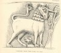
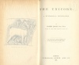

  
[Intangible Textual Heritage](../../index)  [Miscellaneous](../index) 
[Index](index)  [Next](tu01) 

------------------------------------------------------------------------

[Buy this Book at
Amazon.com](https://www.amazon.com/exec/obidos/ASIN/0766185303/internetsacredte)

------------------------------------------------------------------------

*The Unicorn, a Mythological Investigation*, by Robert Brown, \[1881\],
at Intangible Textual Heritage

------------------------------------------------------------------------

THE UNICORN.

LONDON; PRINTED BY  
SPOTTISWOODE AND CO., NEW-STREET SQUARE  
AND PARLIAMENT STREET

[  
Click to enlarge](img/front.jpg)  
FRONTISPIECE: UNICORN FROM THE HORN OF ULF.  

# THE UNICORN

##### A MYTHOLOGICAL INVESTIGATION.

###### BY

## ROBERT BROWN, JUN., F.S.A.

###### AUTHOR OF 'THE GREAT DIONYSIAK MYTH,' ETC.

\_\_\_\_\_\_\_\_\_\_\_\_\_

<table data-border="0">
<colgroup>
<col style="width: 100%" />
</colgroup>
<tbody>
<tr class="odd">
<td data-valign="top">
'<em>Cry to the moon to sink her lingering horn 
In the dim seas, and let the day be born</em>.'
</td>
</tr>
</tbody>
</table>

\_\_\_\_\_\_\_\_\_\_\_\_\_

#### LONDON:

#### LONGMANS, GREEN, AND CO.

#### \[1881\]

[  
Click to enlarge](img/title.jpg)  
Title Page  

Scanned at Intangible Textual Heritage, June 2007. Proofed and formatted
by John Bruno Hare. This text is in the public domain in the United
States because it was published prior to January 1st, 1923. These files
may be used for any non-commercial purpose, provided this notice of
attribution is left intact in all copies.

------------------------------------------------------------------------

[Next: Foreword](tu01)
