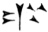
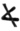

  
[Intangible Textual Heritage](../../index)  [Miscellaneous](../index) 
[Index](index)  [Previous](tu03)  [Next](tu05) 

------------------------------------------------------------------------

[Buy this Book at
Amazon.com](https://www.amazon.com/exec/obidos/ASIN/0766185303/internetsacredte)

------------------------------------------------------------------------

*The Unicorn, a Mythological Investigation*, by Robert Brown, \[1881\],
at Intangible Textual Heritage

------------------------------------------------------------------------

p. 8

### SECTION II.

#### OPINIONS RESPECTING THE TERRESTRIAL EXISTENCE OF THE UNICORN.

As the Unicorn was not found in the flesh near home, and as its
terrestrial existence was firmly believed in, it became necessary to
locate the animal in some distant region. Perhaps the most celebrated of
his supposed haunts is the English Version of the Old Testament, where
the word 'unicorn,' in deference to the Μονοκέρως of the LXX., the
Unicornis of the Vulgate, has unfortunately been introduced in several
passages. The animal really referred to is the Rêm, the Assyrian Rimu or
Wild Bull, respecting which the Rev. W. Houghton observes:—

'The species of wild cattle hunted by the Assyrian monarchs is either
the *Bos primigenius* or some closely allied species; it is apparently
identical with the gigantic *urus*, which Caesar and the Roman legions
saw in the forests of Belgium and Germany.' [1](#fn_30)

Thus we read;—'He hath as it were the towering horns (lit. eminences) of
a wild bull.' [2](#fn_31)

And again;—'Glorious is the firstling of his

p. 9

bullock, and his horns (*i.e.*, two horns) are like the horns of a wild
bull.' [1](#fn_32) Here the LXX. absurdly read
κέρατα μονοκέροωτος τὰ κέρατα αὐτοῦ, and our translators render the
singular by the plural to preserve consistency. The other passages in
the Old Testament where the Unicorn is mentioned are similar.

The cuneiform ideograph for the Rêm is 
 or  ,
each of which forms show the two projecting horns in front. Compare our
letter A, originally the Phoenician and Moabite Stone  , *i.e.*, the rude
representation of a bull's horns.

So the form   (*i.e.*,
  doubled) is the plural,
'cattle,' which, when domesticated, appear 
, *i.e.*, in an enclosure 
.

Pliny observes that the Unicorn 'cannot be taken alive;' [2](#fn_33) and Guillim remarks that 'some have made
doubt whether there be any such beast as this or not. But the great
esteem of his Home (in many places to be seen) may take away that
needlesse scruple.' [3](#fn_34) Horns, no doubt,
can be seen in various places, and the spiral tusk of the Narwhal was
accustomed to be sold as the real horn of the unicorn; and as an
accredited part of that animal, forming \[a supposed\] direct proof of
its existence, it used to fetch a very high price.' [4](#fn_35) 'The heirs of the Chancellor to Christian
Frisius of Denmark valued one at 8,000

p. 10

imperials. In an inventory of the sixteenth century, we have, 'Item, two
unicorns’ bones, garnessyed with gold.' 'An unicorn horn at Somerset
House, valued at 500*l*., occurs in the Inventory of the Plate of King
Charles I.' [1](#fn_36) 'When the whale fishery
was established, the real owner of the horn was discovered, and *the
unicorn left still enveloped in mystery*. The name Monodon
\["One-tooth"\] is not strictly correct, as the Narwhal possesses *two*
of these tusks, one on each side of its head.' [2](#fn_37) These twisted ivory tusks made excellent
unicorns’ horns.

The next animal in this competition is the Oryx (a name used by
Aristotle, who probably refers to the Indian Nylghau), supposed by some
to be the Unicorn of the Old Testament, and having long straight horns,
which when seen in profile exactly cover each other, and so give a
unicornic appearance. 'There is in the Museum at Bristol a stuffed
antelope from Caffraria, presented in 1828. It is of the shape and size
of a horse, with two straight taper horns, so nearly united, that in
profile it shows only a single horn.' [3](#fn_38) The Oryx, however, is no Unicorn.

Next, as to the Rhinoceros. Pausanias describes the African species,
'Aithiopian Bulls, which they call "Nose-horn" (Ῥινόκερως), because each
has a horn at the end of its nose, and another small one above it'—the
Rhinoceros 'gemino cornu' of Martial—

p. 11

\[paragraph continues\] 'but on its head
there are no horns.' [1](#fn_39) The Keitloa, a
kind of black Rhinoceros, is two-horned; as are the Muchocho and
Kobaoba, the two white kinds. The Indian Rhinoceros, however, is one
horned; but 'the so-called "horn" is not a true horn, being nothing but
a process of the skin, and composed of a vast assemblage of
hairs.' [2](#fn_40) The 'Indian Ass' of
Aristotle, which he describes as having but one horn, is probably the
one-horned Rhinoceros, the horn of which, like that supposed to belong
to the Unicorn proper, has always been highly valued, and regarded as a
detectant of poison. But no kind of Rhinoceros at all resembles the
various representations of the Unicorn, is an opponent of the Lion, or
answers generally to the mythical character of the mysterious creature.

Aldrovandus, amongst his other monsters and curiosities, speaks of a
unicornic animal called the Camphurch, which apparently not being one of
the fittest, has not survived. Apropos of the *lusus naturae*, it may be
remembered that Plutarch mentions how 'a ram's head with only one horn'
was brought to Perikles from one of his farms, which occasioned a
prophecy that he would attain to supreme power in the state. [3](#fn_41) Here we trench on the symbolical, and so
are reminded of Daniel's goat with 'a notable horn between his
eyes,' [4](#fn_42) namely that

p. 12

\[paragraph continues\] Alexander, who,
strange to say, adopting the horns of Ammon, reappears in the
*Korân* [1](#fn_43) as Dhoulkarnain, 'the
Two-horned.'

Having noticed the various actually existing animals that have been
named in this connexion, it only remains to add that the Unicorn has
been prudently relegated to those remote regions which are, or rather
were, the special abodes of many wondrous creatures. Amongst these
favoured localities was the great Hercynian Forest, in which, according
to a report repeated by Caesar:—

'Est bos \[a vague term applied to any large and strange animal\] cervi
figura, cujus a media fronte inter aures unum cornu existit, excelsius
majisque directum his, *quae nobis nota sunt*, cornibus.' [2](#fn_44)

The vague description of Pliny, [3](#fn_45)
seems to point to a kind of Rhinoceros. Cardan, following Pliny 'with
advantages,' describes the Unicorn as rare, with the hair of a weasel,
the head of a deer, the body of a horse, thin legs and inane, and one
horn three cubits in length. [4](#fn_46)

Garcias has preserved a very interesting incident, namely, that the
Unicorn 'was endowed with a wonderful horn, which it would sometimes
turn to the left and right, at others raise, and then again
depress.' [5](#fn_47) The progress of the lunar
horn, of course, here supplies the basis of the myth.

p. 13

Oppian, Aelian, and many others refer either to the Unicorn itself, or
to unicornic creatures.

Hesychios defines the Monokerôs vaguely as θηρίον φοβερόν; [1](#fn_48) Souidas prudently, as 'an animal which has
by nature one horn.' [2](#fn_49)

------------------------------------------------------------------------

### Footnotes

[8:1](tu04.htm#fr_30) Gleanings from the
*Natural Hist. of the Ancients*, 172-3.

[8:2](tu04.htm#fr_31) Numbers, xxiii. 22.

[9:1](tu04.htm#fr_32) *Deuteronomy*, xxxiii. 17.

[9:2](tu04.htm#fr_33) *Hist. Nat.* viii. 21;
vide sec. I.

[9:3](tu04.htm#fr_34) *D.H.* 175.

[9:4](tu04.htm#fr_35) Rev. J. G. Wood,
*Illustrated Natural History*, 85-6.

[10:1](tu04.htm#fr_36) Fosbroke, *E.A.* i. 393.

[10:2](tu04.htm#fr_37) Rev. J. G. Wood,
*Illustrated Natural History*, 86.

[10:3](tu04.htm#fr_38) Brunet, *Regal Armorie of
Great Britain*, 218.

[11:1](tu04.htm#fr_39) Paus. IX., xxi. 2.

[11:2](tu04.htm#fr_40) Rev. J. G. Wood,
*Illustrated Natural History*, 153.

[11:3](tu04.htm#fr_41) *Perikles*, vii.

[11:4](tu04.htm#fr_42) *Daniel*, viii. 5.

[12:1](tu04.htm#fr_43) *Sura*, xviii.

[12:2](tu04.htm#fr_44) *De Bello Gallico*, vi.
20.

[12:3](tu04.htm#fr_45) *Hist. Nat.* viii. 21.

[12:4](tu04.htm#fr_46) Vide the Monoceros,
Unicornu, Einhorn, etc., described in Jonston, *Historia Naturalis*,
1657.

[12:5](tu04.htm#fr_47) Apud *Penny Cyclopædia*,
in voc. *Unicorn*.

[13:1](tu04.htm#fr_48) In voc. *Monokeratos*.

[13:2](tu04.htm#fr_49) In voc. *Monokerôs*.

------------------------------------------------------------------------

[Next: III. The Unicorn In Archaic Art](tu05)
