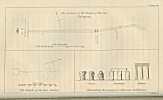

  
[Intangible Textual Heritage](../../index)  [Miscellaneous](../index) 
[Index](index)  [Previous](wos08)  [Next](wos10) 

------------------------------------------------------------------------

p. 359

### CHAPTER VI.

### SERPENT TEMPLES.

I. THE intimate connexion between the solar and serpent worship has
already been ascertained. From which it appears, that, in the confusion
of Pagan idolatry, these superstitions, originally independent, became
so closely interwoven, that from their union sprung up a new kind of
idolatry, and a new god, who, partaking of the attributes of the SUN and
of the SERPENT, united their *names*, and was worshipped as APOLLO [1](#fn_503). The union of the two religions is, not
obscurely, intimated in the legend of Apollo Pythius; in which this
deity is represented as taking possession of a temple which

p. 360

had been originally dedicated to the serpent alone.

The same god, Apollo, was sometimes called OPHEL, which is nearly the
same name, dropping only the syllable ON, which signifies the *sun*; for
by this time the word EL had arrived at the same signification. EL means
god, from the Hebrew אל; and when the sun came to be deified, he was
naturally called EL, whence the Greeks obtained the word Ἥλιος, to
denote "*the sun*."

APOLLO, then, being the SERPENT-SOLAR DEITY, *his* temples will be those
in which we must look for the temples of THE SERPENT; for though in a
few instances we may find the serpent adored alone, yet in no place
shall we find a serpent-temple, in which the rites of the sun were not
also partially celebrated.

1\. Upon the introduction of images to express objects of worship, the
solar deity was not unfrequently represented by *conical stones* in an
upright position. These were called by the Greeks βαιτύλια--derived
probably from the Hebrew, בית־אל, "*the house*," or "*dwelling place of
God*." The earliest mention of such a stone occurs in Gen. xxviii, where
Jacob erects one

p. 361

as a pillar, in remembrance of his celebrated dream, and, consecrating
it to God, calls the name of the place *Bethel*. In process of time the
stone itself was called *Bethel*, and similar pillars were hence named
βαιτύλια, and supposed to be animated with the presence of the
deity [1](#fn_504). The Ophites called them
*Abadir* [2](#fn_505), from the name of the
serpent-solar god: and they were *conical*, as representing *a ray of
the sun*.

These conical pillars gave the first notion of an obelisk, which is a
similar monument on a larger scale. The word *obelisk*, according to
Bryant, is derived from OBEL, the name of the god to whom they were
dedicated. This was hellenized into ὀβελίσκος. OBEL was the Apollo of
Syria; and, probably, HELIOGABALUS was the same deity; for this god was
represented by a black stone of conical form, which was

p. 362

said to have dropped from heaven, and was revered as an image of the
sun, at Emesa.

In the Caaba of Mecca there is also a black stone, said to have fallen
from heaven. The Mahometans generally hold it in great veneration [1](#fn_506). This was, probably, of the same kind as
the Heliogabalus of Emesa--a probability which is strengthened by the
name of the temple--*Caaba*: for this word may be a corruption of
*Ca-ab-ir*, which means "*the temple of* ABIR," *the solar
serpent* [2](#fn_507).

PYRAMIDS were obelisks of the most magnificent order; but it is supposed
by Bryant that the obelisk originally represented the *deity*, of whom
the pyramid, in times of improved architecture, was *the temple* [3](#fn_508). As the obelisk was an improvement upon
the original Baitulia, it preserved the pointed form of these sacred
stones in its apex--every obelisk terminating in a small pyramidal
figure, which, like the Baitulia, was intended to be the representation
of a

p. 363

*sun's ray*. The word *pyramid* itself means "*a ray of the sun* [1](#fn_509)," from the Coptic *Pi-ra-mu-e*.

2\. AN AGGREGATE of BAITULIA formed the first temples which were
erected: and these temples were generally built *in the figures of the
hierograms of their respective gods*. Thus the worshippers of the sun
arranged their Baitulia in a *circle*, to represent the *sun's disk*.
Many such temples are scattered through Europe, especially in Britain.
Stonehenge is of this description; but from the transverse stones which
rest upon the columns, and the evident signs of art and the chisel, this
temple seems to be of a much more recent date than any other Druidical
structure now extant. It is observable however that even in Stonehenge
the upright columns are somewhat of the pyramidal figure--thus
preserving the memory of their original consecration to the sun.

As the worshippers of the sun collected their Baitulia into *circular*,
so the votaries of THE SERPENT formed theirs into a serpentine figure.
Examples of this structure may be seen in several parts of England, but
more especially at Carnac in Britany which is the most extensive and
most remarkable relic of the Celtic religion in

p. 364

the world. Of this kind also was the Ophite temple described in Ovid, as
passed by Medea in her flight from Attica to Colchis--

FACTAQUE DE SAXO LONGI SIMULACHRA DRACONIS.

That the ancient Ophite temples were built of single and separate stones
arranged after the manner of the avenues of Carnac is probable from the
devices which appear on Tyrian coins, where a serpent is seen between
two upright unhewn columns.

3\. In process of time, however, the simple serpentine avenues underwent
a great and elegant change. Instead of the solitary snake, moving in
graceful sinuosities over hill and dale, or lying dormant in an uniform
straight line, the serpent was made to wind his majestic form *through
the centre of a circle or globe*. The sinuosities were still
characteristically preserved, and the circular area as well as the
serpentine avenues was still formed of the sacred Baitulia. The temple
of Abury in Wiltshire was a beautiful specimen of this order of Ophite
sanctuaries. This description of temple may, I conceive, have arisen
from the union of the Solar and Ophite religions, after the suppression
of the latter by

p. 365

the votaries of the former. The constant wars of the sun and serpent,
and the general overthrow of the Ophite worship, have been alluded to in
the course of this volume: but in the next chapter I shall enter into a
more minute account. From the details it will appear that the
worshippers of the Sun, being victorious, every where took possession of
the Ophite temples. It is probable that in so doing, they did not at
once destroy them: but building their own circular temples in the
centre, formed the original serpent into *avenues* and *approaches* to
the Sanctuary of the SUN. This compound temple was called a DRACONTIUM:
from which is derived the *name* and the *idea* of a DRAGON, which is a
fabulous monster frequently mentioned but little understood by the poets
who employed it to decorate a tale of wonder. "DRACONTIUM" has been
ingeniously imagined by my friend the Rev. George Andrews, to be a
derivation from דֶּרֶּך.־איֹן (Derech On)--"*an avenue of On:*" ON being
the title of the SUN in Egypt and Phœnicia. This derivation is the most
expressive that can be assigned, and accounts at once for the origin of
the fabulous *dragon*, which is said to have been *a large serpent
peculiar to* 

p. 366

*temples*. Thus Servius in his Commentary on Virgil, defining the
different kinds of serpents, says, "Angues aquarum, serpentes terrarum,
DRACONES *templorum* sunt:"--not that Servius understood the word
"Draco" in the sense above given, but that he recorded the language of
*tradition*, and *tradition* preserved the memory of the *fact*. The
word "Dracontium" as significant of a solar Ophite temple, would be
readily adopted even by the Ophites themselves. For while the
sun-worshippers understood by it "an avenue of the Sun," the
serpent-worshippers would merge the circle in the avenues, and call the
whole a DRAGON--A LARGE SERPENT. Hence the origin and the superstition
of the DRAGON.

The DRACONTIA of the Solar-Ophites were of various forms, embracing
every figure of the Ophite hierogram [1](#fn_510). Some were straight--others were formed
by *one* serpent passing through the circle; and others again consisted
of a circle and *two* issuing serpents.

The temples of *Merivale* on Dartmoor; *Abury* in Wiltshire; and
*Stanton Drew* in Somersetshire,

p. 367

[  
Click to enlarge](img/36700.jpg)

The left half of this plate (facing p. 367) was torn off in the copy of
the book I scanned. I would appreciate any help locating a complete
image of this plate--JBH.

respectively illustrate the above figures. These I shall describe in
their order. But first it may be proper to consider the more simple,
before we describe the complex dracontium. I will therefore begin with
the temple of

#### CARNAC.

1\. The dracontium of Carnac is one of the most interesting remains of
the Celtic religion. It is situated half a mile from the village of that
name, in the department of the Morbihan in Britany; nine miles from the
beautifully situated town of Auray, and approaches to within a mile of
the Bay of Quiberon.

I visited this temple in the summer of 1831, and again in the spring of
1832. In my first visit I was accompanied by General de Penhouët, an
antiquary highly esteemed in his native Britany, who had inquired deeply
into the nature and figure of the temple. He pronounced it to be a
Dracontium:--an opinion which has been confirmed by my subsequent survey
of it made in company with Mr. Murray Vicars, a landsurveyor of Exeter;
by whose exertions I have been furnished with a beautiful

p. 368

and accurate plan of the whole temple upon the scale of nine inches to a
mile.

The temple known as "The Stones of Carnac," begins at the village of
Erdeven, passes midway by Carnac, and terminates at a narrow part of the
Marine lake of La Trinitè. The whole length of the temple, following its
sinuosities, is *eight miles*. The average width from Erdeven to
Lemaenac, is 200 feet; and from Lemaenac to the end, 350 feet. The
highest stones are at Kerzerho, Lemaenac, Kermario, and Kerlescant; at
which points they average from 15 to 17 feet high, and from 30 to 40
feet in circumference. The vacant spaces, noticed below, have been
cleared to build the adjacent villages of Plouharnel and Carnac, and the
numerous walls which intersect the country:--

From *a* to *b* the stones have been removed; from *b* to *c* they
reappear.

From *c* to *d* there is a vacancy; from *d* to *e* a recovery.

From *e* to *f* no stones are visible; from *f* to *g* a few.

From *g* to *h* is a dreary waste; at *h* there may have been an area
similar to Lemaenac; from *h* to *k* is a continuation of stones.

p. 369

From *k* to *l* is another vacancy; at *l*, *m*, *n*, *o*, are a few
stones; the intermediate spaces void.

From Lemaenac to *p* is a beautiful continuation.

From *p* to *q* are only a few scattered stones. From *q* to *r* the
parallelitha are preserved; from *r* to *s* broken.

From Kerlescant to the end the Dracontium is perfect [1](#fn_511).

The labour of its erection may be imagined from the fact, that it
originally consisted of *eleven rows of stones*, about *ten thousand* in
number, of which, *more than three hundred averaged from fifteen to
seventeen feet in height, and from sixteen to twenty or thirty feet in
girth:--one stone even measuring forty-two feet in circumference*.

From the accompanying plate it will be seen that the course of the
avenues is *sinuous*, describing the figure of an enormous serpent
moving over the ground. But this resemblance is more striking upon an
actual inspection of the original. Then the *alternations* of the high

p. 370

and *low* stones, regularly disposed, mark with sufficient accuracy *the
swelling of the serpent's muscles as he moves along*: and a spectator
standing upon one of the Cromlech hills, round which the serpent sweeps,
cannot but be struck by the evidence of *design* which appears in the
construction of the avenues.

In the course of the Dracontium there are two regularly defined areas;
one, near the village of Carnac, which is of the shape of a *horse
shoe*, or a *bell*; the other towards the eastern extremity, which
approaches the figure of a rude circle, being a parallelogram with
rounded corners. There are appearances also, but too ill-defined to be
noticed, of other areas of a similar description.

The *circle* and the *horse shoe* were both sacred figures in the
Druidical religion, as may be seen in Stonehenge where they are united;
the outer circles inclosing inner horse shoes. I cannot find any
connection between the latter symbol and the tenets of the Celtic
religion, unless it be intended as a representation of the moon. The
torques (of which a splendid collection, twelve in number, and £1000
sterling in value in pure

p. 371

gold, was found in Britany in 1832,) were of the lunar form. And,
perhaps, from this symbol (whatever it may have expressed) was derived
the superstition so prevalent in Britain, of nailing a horse shoe over a
door to scare away evil spirits, in the same manner as the sign of the
cross is supposed to be efficacious by superstitious Roman Catholics.
The worshippers of Carnac may, on this supposition, have been lunar
Ophites; but this is mere conjecture.

It is curious, however, that at Erdeven, where the temple commences, an
annual dance, describing the Ophite hierogram of the *circle and
serpent*, is still kept up by the peasants at the Carnival. But the only
tradition which I could find respecting the stones, was the universal
superstition that *they once possessed life*, and were petrified as they
stand. Some of the peasants believe that they were the Roman army who,
pursued the centurion Cornelius on account of his conversion to
Christianity; and were petrified through his prayers. Others imagine
that certain supernatural dwarfs erected them in one night, and *still
inhabit*, each the stone which he erected. Both these opinions have
their remote origin

p. 372

in the *animated Baitulia*; and are paralleled by similar traditions in
England, &c. respecting the Solar and Ophite temples.

Near that part of the dracontium which approaches Carnac is a singular
mound of great elevation, which was once evidently conical--the upper
portion of it being artificial. It is analogous to the remarkable hill
of Silbury, which is similarly connected with the dracontium of Abury.
These mounds were probably raised for the purpose of altars, upon which
the perpetual fire kindled by the sun, was kept burning, in conformity
with the rites of the Solar religion. They are very common in Persia,
and may be alluded to in Scripture under the name of "the high places,"
upon which idolatry performed her rites. The conical mound near Carnac,
which is so situated as to be seen for many miles, and from every part
of the temple, has been consecrated by the Christians to the Archangel
Michael: to whom also is sacred almost every natural or artificial cone
in Britany. The reason of this dedication may be readily assigned. St.
Michael is the destroyer of the spiritual dragon of the Apocalypse;
whose

p. 373

mutilated image lies prostrate below the mound, and whose worshippers
were converted to the faith of the triumphant religion, which, in token
of its victory, erected upon the solar mount a chapel dedicated to the
destroyer of "the apostate serpent." By this consecration then is
indicated the triumph of Christianity over Ophiolatreia: and it is but
consistent that the people who allegorized the conversion of the Ophites
by the metaphor of a victory over *serpents* should, in token of this
victory, erect upon the high places of idolatry, chapels to the
Archangel, the enemy and the victor of the SERPENT-TEMPTER.

This mound may possibly have given name to the adjacent village which
may be called Carn-ac, from "*Cairn*," a hill, and "*hac*," a snake. The
"serpent's hill" would be an appropriate title for Mont St. Michel. In
the same manner the collection of columns called *Lemaenac*, may have
been named from maen, "stones," and "*hac*," a snake.

In illustration of the dracontium of Carnac may be adduced a small but
interesting Ophite temple in the Ile aux Moines, in the Morbihan. The
only part of this temple now

p. 374

perfect is the lunar or campanular area, corresponding to that in the
dracontium of Carnac, which seems to have occupied the centre of the
sanctuary. Some few of the stones which composed the avenues are
standing, but very scattered. Many have been removed within the last
twenty years to build walls and houses. At the southern extremity of the
avenues the dracontium terminated in an oblong tumulus of considerable
dimensions: one end of which being opened, has exposed to view a very
beautiful Kistväen. There was also an obelisk at the head of the
tumulus. But the most remarkable circumstance attending this tumulus is
its name--it is called *Pen-Ab*--that is, "the head of AB," the sacred
serpent Now, although this coincidence, without the knowledge of the
temple's course, would prove little or nothing; yet combined with the
fact, that parallel and sinuous avenues have once existed, running from
Penab towards the middle of the island, and calling to mind the general
custom of the ancient world which involved the name of the deity in that
of the temple--we may fairly infer that this temple of the Ile aux
Moines was a dracontium sacred to the Ophite deity AB.

[  
Click to enlarge](img/37400.jpg)

p. 375

The name of the island itself--"the *Isle of the Monks*," records
probably some early establishment of Druids, the recollection of whom
has been thus preserved.

There are, I believe, other dracontia in Britany and Gaul; but not
having examined them personally, I pass on to those in our own country,
which bear the most evident marks of their Ophite dedication.

2\. The most remarkable dracontium in England is that of ABURY in
Wiltshire, about five miles west of Marlborough, on the Bath road; over
which thousands of travellers pass without dreaming that the ground upon
which they tread was once esteemed the most holy in Britain. Of the
temple of Abury an invaluable account has been left by the learned and
ingenious Dr. Stukeley, in a volume replete with deep research and
interesting facts. Having perused this volume with the attention which
it demands, the reader should next have recourse to the splendid work of
Sir Richard Colt Hoare on "*the History of Ancient Wiltshire*," in which
he will discover ABURY AS IT IS, in the ruins of its magnificence. The
theory of Stukeley is here sanctioned by an indisputable authority,

p. 376

and his errors corrected with a judicious hand.

The temple of Abury may be thus succinctly described:--From a circle of
upright stones, (without imposts,) erected at equal distances, proceeded
two avenues in a wavy course, in opposite directions. These were the
*fore* and *hinder* parts of the serpent's body, and they emerged from
the lower segment of the circle, through which the serpent appeared to
be passing from west to east. Within this great circle were four others,
considerably smaller, two and two, described about *two* centres, but
neither of them coincident with the centre of the great circle. They lay
in the line drawn from the north-west to the south-east points, passing
through the centre of the great circle. The great outer circle
surrounded the chief part of the village of Abury or Avebury; and was
itself encompassed by a mound and moat. The head of the serpent was
formed of two concentric ovals, and rested on an eminence called Overton
Hill. This part of the temple, as long as it stood, was traditionally
named in the neighbourhood, *the sanctuary*. It was destroyed [1](#fn_512) in

p. 377

the seventeenth century, through the rapacity of the farmers, who
converted the stones into materials for building, and repairing the
roads. Overton Hill, upon which the head of the serpent rested, is the
southern promontory of the

p. 378

\[paragraph continues\] Hakpen hills; and Dr. Stukeley supposes, that
from the *serpent's head* the range was so named; for *Hakpen* is a
compound word, which, in the British language, bore that
signification--*Hak*, a snake; and *Pen*, the head. This conjecture he
illustrates by the pertinent remark, that to this day, in Yorkshire, the
peasants call snakes, *hags* and *hagworms* [1](#fn_513)."

The tail of the serpent terminated in a valley towards Beckhampton; and
the whole figure was so contrived, as to have the appearance of a vast
snake creeping over hill and dale. From the circle to the head, the
avenue consisted of one hundred stones on each side. The head was
composed of a double oval, the outer containing forty, and the inner
eighteen, stones. The tail consisted likewise of one hundred stones on
each side, and was, as well as the avenue to the head, *a mile in
length*. The area enclosed by the circular rampart, which surrounds the
great circle, is twenty-eight acres, seventeen perches, as measured by
Sir R. C. Hoare.

Midway between the extremities of the two serpentine avenues, where a
horizontal line, con-

p. 379

netting them, would meet a perpendicular let fall from the centre of the
great circle, is a remarkable, artificial, *conical mound*, called
SILBURY HILL, of very great elevation. This is supposed, by Stukeley, to
be a sepulchral monument; but Sir R. C. Hoare, with more probability,
considers it to be a part of the temple. It is, doubtless, a mound
dedicated to the solar deity, like the pyramids of ancient Greece and
Egypt; and corresponds with the OPHELTIN of classical mythology, and the
Mont St. Michel of Curiae. In connexion with the serpent-temple, it
identifies the whole structure as sacred to the deity known by the
Greeks as APOLLO. Its very name imports "the hill of the sun."

A more stupendous monument of heathen idolatry, than Abury, is not to be
found in England. Many of the stones were remaining in their positions,
when Stukeley surveyed the temple in 1723; but a great number were
destroyed by the farmers in his time, and many more have been broken up,
and carried away since. The work of devastation, it is to be feared, is
not yet finished; such is the ignorance and barbarism of cupidity.

p. 380

There are now remaining, of the serpentine figure, only *eleven* stones
of the avenue between Abury and Kennet: that is, of the avenue which
passing through West Kennet terminated in the serpent's head on Overton
Hill. Marks in the ground contiguous to *eight* of these *eleven*
stones, show the original position of *four others*, which have been
taken away. So that from the turnpike gate at Avebury, to that point of
the Bath road which passes through Kennet, the avenue may be traced
without much difficulty. *One* very large stone stands near the entrance
of the circle; and between *two* others the road passes as it approaches
Kennet; the remaining *eight*, and the *four* vacant loci, are found
together in a field on the right. The large stone by the circle, and the
two which are nearest to the Bath road, are accurate guides to the eye
in tracing the whole avenue.

Besides these, I observed (Sept. 3, 1829), *four* subverted stones in
the descent and bottom of the hill beyond Kennet, to the south of the
Bath road, at the point where the neck of the serpent is supposed to
have risen on Overton Hill. These are, evidently, the remains of the

p. 381

avenue from Kennet to "the sanctuary." Of "the sanctuary" itself, not a
single stone remains.

Of the Beckhampton avenue, only two stones retain their original
position; and these are in the middle of the avenue [1](#fn_514). I had not time to look for the *loci*
of the others; and I therefore refer the reader to the elaborate
descriptions of Dr. Stukeley and Sir R. C. Hoare, with them lamenting,
that in a country like this such barbarism should have been permitted as
would disgrace the most uncivilized of the hordes of Tartary--destroying
piecemeal, for the sake of a few tons of stone or a few yards of barren
ground, one of the most interesting and venerable monuments of antiquity
in the world.

Some of these stones, however, resisted the utmost efforts of the
destroyers, who, unable to break, sunk them in the ground by digging
pits about them. Two of these stones lie six feet under ground in the
premises of Mr. Butler, the landlord of the Kennet Inn, and over another
the Bath road passes.

In the time of Dr. Stukeley, the peasants of

p. 382

the neighbourhood had a tradition that "*no snakes could live* within
the circle of Abury." This notion may have descended from the times of
the Druids, through a very natural superstition that the unhallowed
reptile was divinely restrained from entering the sanctuary, through
which the mystic serpent passed.

There have been found at Abury the usual Druidical relics of Celts,
Anguina, &c.: and a proof that this was once a temple of very great
resort, is afforded by the immense quantities of burnt bones, horns of
oxen, and charcoal which have been discovered in the agger of the
vallum. These are indications of great sacrifices. Dr. Stukeley was
doubtful of the derivation of the word ABURY; but I think that a
probable solution may be found in the compound titleאוב־אור *serpens
solis*, for here are all the data required. The temple was the Ophite
hierogram; the officiating priests were Druids, whose religion
recognised the sun as a deity, and the serpent as a sacred emblem; the
name of that mystic serpent was *Aub*, and a title of the solar deity,
*Aur* or Ur: the whole temple represented the union of the serpentine
with the circular sanctuaries, that is, of the temples of the Ophite and

[  
Click to enlarge](img/38200.jpg)  
British Dracontia  

p. 383

\[paragraph continues\] Solar superstition. What name then could be more
expressive than AUBUR, or ABUR, "*the serpent of the sun?*" The present
name of the village is Avebury, which the first describer of the temple
(Mr. Aubrey, who lived in the seventeenth century) says, should have
been written *Aubury*; and this reading he found in the legierbook of
Malmesbury Abbey [1](#fn_515).

 

3\. STANTON DREW. The second British dracontium in order of beauty, is
that of Stanton Drew, in Somersetshire. It is situated near the village
of Pensford, about five miles west of Bristol.

This temple, which is much dilapidated, originally consisted of one
large circle connected by avenues with two smaller; and thus described
the second order of the Ophite hierogram--the circle and *two* serpents.
In Egyptian hieroglyphics, when two serpents are seen in connection, one
typifies the Good and the other the Evil Principle. For the first
knowledge of this temple as a *dracontium*, we are indebted to Sir
Richard Colt Hoare. I

p. 384

visited it in 1831, and made the following observations.

The great circle is at present contained by only thirteen stones, and
these are generally small, and much worn by the weather. It is probable
that the original number was thirty. The dimensions of this circle or
rather oval, are 126 yards by 115.

A small circle of eight stones, 32 feet in diameter, was connected with
its eastern limb by an avenue of, perhaps, twenty stones. The length of
this avenue is about 100 yards, and it is remarkable for its very great
curvature, returning at a sharp angle towards the large circle, as if to
represent a snake throwing back his head. Only ten stones of this avenue
remain. The western circle is at the distance of 150 yards; and
consisted of ten or twelve stones. Its diameter is forty-three yards,
but I could trace no avenue between it and the oval. The ground is much
broken in this part. A wall intersects it, and a road to a farm-yard
passes through it. So that the removal of the stones may be accounted
for without difficulty. I have no doubt whatever that an avenue
connecting this smaller circle with the great one, once existed

p. 385

for analogy is in favour of the hypothesis, although no traces of the
avenue remain.

I am confirmed in my opinion by a tradition of the neighbourhood, which
almost universally accompanies Ophite temples. By this it appears that
Keyna, the daughter of a Welsh prince, who lived in the fifth century,
having left her country and crossed the Severn for the purpose of
finding some secluded spot, where she might devote herself, without
interruption, to religious contemplations, arrived in the neighbourhood
of Stanton Drew. She requested permission from the prince of the
country, to fix her residence at Keynsham, which was then an uncleared
wood. The prince replied, that he would readily give the permission
required; but it was impossible for any one to live in that place on
account of *the serpents*, of the most venomous species, which infested
it. Keyna, however, confident in her saintly gifts, accepted the
permission, notwithstanding the warning: and taking possession of the
wood, "converted by her prayers all the snakes and vipers of the place
into stones. And to this day," remarks Capgrave, the recorder of the
legend, "the stones in that country resemble the windings of serpents,

p. 386

through all the fields and villages, as if they had been so formed by
the hand of the engraver."

The transformation of the *serpents* into *stone* is the fable which
almost always denotes the neighbourhood of a Dracontium, as we may see
in the legend of Cadmus and Harmonia, Python, and others. The remark of
Capgrave may allude to the *anguina*, or serpent-stones, so often found
in the vicinity of Druidical temples: or even to the specimens of the
Cornua Ammonis, which I believe are sometimes found in the
neighbourhood.

 

4\. DARTMOOR. At Merivale bridge on Dartmoor, four miles from Tavistock,
is an interesting group of temples, *two* of the dracontian, and *two*
of the circular kind. The temples on Dartmoor are usually in pairs.
Whenever these are *circles* we may suppose that one of them was sacred
to the sun, and the other to the moon, like the double circles within
the great circular area of Abury. At Merivale, the four temples are
within a few yards of each other; and though small, are tolerably
perfect--one of the circles only being destroyed.

p. 387

The avenues, *which are straight*, run parallel to each other, east and
west. They are 105 feet apart, the longer is 1143 feet in length: the
shorter 792. The larger of these temples is of the same order as that of
Stanton Drew, having a central circle, and two avenues, each terminated
by a circle. These avenues are straight: but this makes no difference of
moment from the theory of serpent temples; for they are equally
*Dracontia*, i.e. "*Avenues of the sun*." The second temple has but one
circle, which is at the head, and corresponds to the Celtic temple of
Callernish, in the island of Lewis; but the latter is far more
magnificent. Dr. Stukeley pronounced Callernish to be a Dracontium; but
from the descriptions of it by Dr. Borlase and others, it can only be
considered such, if that title be extended to straight *avenues*, as
well as those which are sinuous.

Of this rectilinear order there are other Dracontia on Dartmoor,
although not so extensive as those of Merivale. On the brook side below
Black Tor, are two avenues parallel to each other, and running east and
west; one of which may be traced for 300 feet, and the other for 180
feet. They are forty feet apart,

p. 388

and each is terminated by a circle thirty feet in diameter enclosing a
cairn. The stones average the same height as those at Merivale, being
from three to four feet in elevation.

Similar avenues, but running north and south, occur on Gidleigh common,
of which the stones are three feet and a half high and triangular. They
may be traced for 432 and 120 feet respectively.

Other monuments of the same nature are scattered over Dartmoor, which
from the multitude of such and similar British remains must at one time
have been very thickly inhabited. Vestiges of circular huts are not
unfrequently seen on the sides of hills, now seldom pressed by the foot
of man, and are melancholy memorials of unknown ages, nameless tribes,
and generations long since mingled with the dust. It is probable that
the early inhabitants of Dartmoor, were driven into these bleak and
barren regions from pleasanter and more fertile lands by the pressure of
the Romans, Saxons and Danes: and that the parallelitha and circles
above described were built in humble imitation of more splendid temples
in the lower country. All the works on Dartmoor are those of a

p. 389

feeble and impoverished people, but amply illustrative of the religion
which they exercised in happier times.

 

5\. SHAP. The longest dracontium in Britain, and the only one that in
extent could compete with Carnac, was at Shap in Westmorland. The stones
were, however, small as compared with those of Abury; the largest now
remaining, measures only eight feet in height. The temple of Shap begins
at about half a mile south of the village of that name, in a field
adjoining the Kendal road; and from this point proceeds in a northerly
course, crossing the road near Shap in two rows. The greatest width of
the avenue is at the head in the field above mentioned, and measures
eighty-eight feet. At this extremity it is bounded by a slightly curved
line of six stones placed at irregular intervals; but they appear to
have been never erected. Near Shap the two rows converge to the width of
fifty-nine feet, and again separating, but not so much as to destroy the
appearance of parallelism, proceed in a northerly direction, in which
course they may be traced at intervals for a mile and a half. The avenue
throughout preserves the sinuosities of the serpent-temple.

p. 390

Although scarcely two miles of the temple are now recoverable, yet
tradition states it once extended to Moor Dovey, a distance of *seven
miles from Shap!* In this respect it almost rivals the celebrated
Carnac, which can only be traced for eight miles; but in the number and
magnitude of its columns, it must have fallen very short of the grandeur
of that magnificent dracontium. Indeed nothing in Britain can compete
with this pride of Britany. All our parallelitha contain but *two* rows
of stones, whereas the temple of Carnac has eleven!

About a mile to the N. E. of Shap is a circle composed of large stones,
in tolerable preservation; but whether it was connected with the
parallelithon or not, I am unable to determine. The probability of the
connection is however great; but I fear the temple is in too dilapidated
a state to solve this question.

Dr. Stukeley, who also saw, but did not survey the temple of Shap,
pronounced it at once to be a dracontium. The indications must, at that
time, (one hundred years since,) have been much stronger than they are
now. A traveller in these days would hardly notice the few stones which
lie by the side of the Kendal road. Dr. Stukeley, in a letter to an
eminent antiquary of

p. 391

his day, mentions with approbation a plan of the temple of Shap as drawn
by a gentleman of Carlisle; but I have not been able to find this
document, which now that the dracontium is nearly destroyed, would be
almost invaluable.

 

II\. The above are the principal known dracontia in Europe. Many more
may be perhaps discovered upon diligent inquiry. Parallelitha, as
*such*, have been seen by thousands of travellers. The majority have
looked, and passed on with indifference: better informed persons have
considered them as merely relics of the Druidical superstition; and the
covetous farmer has converted, with a ruthless hand, their venerable
columns into materials for building walls or repairing houses! But a
more enlightened age may even yet rescue from annihilation monuments
which have been at once the work and the admiration of ages. The light
which has been thrown upon remote antiquity by these venerable ruins is
too strong to be extinguished. It is like their own perpetual fire,
which, though quenched upon Silbury and Mount St. Michael, still burns
in the rites of the ceremonial religion which, at the ashes of Baal, has
kindled the tapers of the Church of Rome.

p. 392

Among the interesting discoveries which result from the theory of
dracontia, is the view which it developes of the origin of *columnar
architecture*. We admire the beauties and the grandeur of the Parthenon:
we gaze with rapture on the isolated pillars of exquisite workmanship,
which standing upon the barren and desolated plains of Greece or Asia
Minor, fill us alternately with admiration of the art which executed,
and indignation at the barbarism which defaced them. But we little think
that in the rude and rugged columns of Abury, or Carnac, we see a
prototype of the most admired pillars of the most splendid temples of
ancient Greece or Asia! And yet there can be little doubt but that such
is the fact.

The temples of the sun at Palmyra and Geraza, both in the country
formerly devoted to the worship of OUB, the serpent god of Canaan, are
illustrations in point. An examination of their columns, *which
supported no roof* will justify the inference that they were substituted
for those of some ancient dracontia occupying the same sites. The
avenues of Palmyra particularly illustrate this theory by their sinuous
course, although sinuosity as we have before observed, is not
*indispensably* necessary to a dracontium,

[  
Click to enlarge](img/39200.jpg)

p. 393

several (such as Callernish and the temples on Dartmoor) being straight.
The majority of serpent temples were however sinuous; and such was the
temple of the sun at Palmyra. A long avenue of two double rows of
columns connected the portal with the sanctuary, which was in the shape
of a parallelogram.

The sanctuary of Geraza was formed by a circle of columns, connected
like those of Stonehenge by transverse stones resting upon their
summits. A straight avenue of two rows led to this circle, and threw out
near it two arms of a cross. The plan of the temple is almost a
facsimile of the dracontium of Callernish; while the resemblance of its
circle to the outer one of Stonehenge would almost persuade us that the
architects of the one had either had communication with those of the
other, or had copied their design.

Nothing is more probable than that the *first* step in templar
architecture being to group together the isolated baitulia, the *second*
would be to polish and carve the columns already existing in a rude
state; or to substitute for them others of a more finished kind. Thus,
by degrees, the rough "*petræ ambrosiæ*" of Greece or Canaan would be
fashioned into the elegance

p. 394

of the Parthenon, or of the temple of the sun at Palmyra. And although
the one had no avenues, and the other no circle, yet both being
*columnar*, may be referred for their origin to the same standard of
early architecture, *the dracontium*: for the varieties of the
dracontium include every figure of the classical temple. The dracontium
had its avenues, straight and sinuous; its circles; its lunes; its
ovals, and its parallelograms. Merivale, Abury, and Carnac, exemplify
them all.

Many may deem these notions crude and extravagant; but I confess that
the impression which they leave upon my mind is great; neither can I
consent to efface it until other explanations, more satisfactory than
any hitherto advanced, supply me with a better theory [1](#fn_516).

 

III\. Another discovery still more interesting and useful arises from
the doctrine of dracontia. By this may be obtained a key to the many
absurd and incredible histories of Pagan mythology respecting *enormous
serpents* and *dragons* 

p. 395

*covering acres of ground*; which could have been nothing but vast
dracontia. Dr. Stukeley, the inventor of the theory, has himself applied
it to this purpose; and as a few more cases may be adduced in
corroboration of his opinion, I will add them. The facts are curious;
but the principle upon which this treatise was undertaken, is altogether
independent of their probability, although it may be greatly illustrated
by it. For *the universal prevalence of the worship of the serpent*,
which it was my object to prove, has, I trust, been satisfactorily
shown.

It is remarked by Stukeley, that the celebrated PYTHON was, originally,
nothing more nor less than a serpentine temple, like that of Abury.
Python is described by Ovid (Met. i. 459,) as covering several
acres,--"tot jugera ventre prementem." Of the same kind, Dr. Stukeley
thinks, was the TITYUS of Virgil, who covered nine acres of ground.

----------"Per tota novem cui jugera corpus  
   Porrigitur."  
                       *Æneid*, vi. 596.

\[paragraph continues\] In corroboration of the first of these opinions

p. 396

we may observe that Homer describes Apollo as building a temple [1](#fn_517) *on the spot where he had slain Python*.
The stones of which it was composed were "*broad and very long*." He was
assisted by *Trophonius*, who laid "the threshold-stone;" and a
multitude of labourers built the temple . Its figure was *circular* in
this part; for such I take to be the meaning of the word Ἀμφὶ, in the
line which describes the labour [2](#fn_518).
For it can hardly mean that they built the temple "*round*" the
"*threshold*." This, then, was the *sanctum*, and may have corresponded
with *the great circle* of Abury.

The description of the building here ceases; and the confused legend
makes a transition from the temple to the *serpent* who was slain there
by Apollo, and at his command putrefied *upon the spot* by the sun. But
in a few lines afterwards Apollo is described as meditating what sort of
men he shall put as priests into his "STONY PYTHO [3](#fn_519)." By the same epithet he describes Pytho
in other parts of his works; and Pinder [4](#fn_520) makes use of the same designation. It is
true

p. 397

that this epithet may allude only to the rocky nature of the soil; but
it may allude also to the stones of the temple, and *would* be employed
probably for that purpose, on the supposition that the temple was of the
serpentine kind. There is something remarkable in the circumstance that
*Trophonius* should be concerned in laying the chief stone; and though
Agamedes is joined with him in the office, yet Trophonius is, assuredly,
not a builder of the temple, but *the temple itself*. For we have
already seen that TROPHONIUS is no other than TOR-OPH-ON, "*the temple
of the solar serpent*." Here then we have the serpent again! and putting
all these detached facts together, making also due allowance for
poetical imagery and mythological exaggeration, we may, not
unreasonably, conclude, that the whole history relates to the erection
of a SERPENT-TEMPLE, like that of Abury.

If Ovid, in describing Python, alludes to the serpentine figure of the
temple, he comes nearer to facts when he represents serpents *changed
into stone*. (Met. xi. 56: xii. 23.)

In these instances of metamorphosis, the coincident features of the
story indicate Ophiolatreia. Thus *Apollo* is the person who petrifies
the Lesbian

p. 398

dragon (Met. xi.); and the scene of the second story is *Bœotia*, a
country where serpent-worship was peculiarly prevalent.

But the poet comes still more closely to the mark, when he describes the
flight of Medea from Attica to Colchis. Her chariot was drawn by
*dragons*, and she was passing from one Ophite colony to another. In her
passage,

"Æoliam Pitanem lævâ de parte reliquit,  
FACTAQUE DE SAXO LONGI SIMULACHRA DRACONIS [1](#fn_521)."

When we consider that the word *Pitane* may be immediately derived from
פתן, serpens, we have a presumptive evidence that the serpent was
worshipped there: and the above lines from Ovid, corroborating the
conjecture, describe the temple; which was, in truth, LONGI SIMULACHRA
DRACONIS. Had the poet intended to describe Abury or Carnac, he could
not have represented them more accurately.

Dr. Stukeley thinks that the fable of Cadmus, "sowing serpents' teeth,"
alluded to "his building a serpentine temple:" which is not unlikely:
for under such an imagery might the

p. 399

stones of the temple be poetically described, *the order of teeth* being
that in which such stones were erected, single and upright, at equal
distances.

Cadmus and Harmonia were changed into serpents at Enchelia, in Illyria,
where "*stones* and a *temple*" were erected to their memory. Scylax
Caryandensis, cited by Bryant [1](#fn_522),
says,

Κάδμου καὶ Ἁρμονίας οἱ λίθοι εἰσὶν ἐνταῦθα, καὶ ἱερόν

The situation of this temple is "half a day's sail from the river
Arion [2](#fn_523)." No such river occurs in
the maps of the country; and Vossius corrects it into "Drylo:" but
Scylax, who notices so few things, and only the most remarkable, in his
brief memoranda, could hardly have been mistaken in so important a
matter as the name of a river. The temple was Ophite; and it is very
probable that the nearest river would be sacred to the solar deity. For
"Arion" compounds the two titles of the sun, Ault and ON.

"The temple," observes Bryant, "was an Ophite Petra, which induced
people to believe

p. 400

that there were in these temples *serpents petrified* [1](#fn_524). It is possible that in later times the
deity may have been worshipped under this form; whence it might be truly
said of Cadmus and Harmonia, that they would one day be exhibited in
stone." Bryant here refers to Nonnus *Dionusiac*. l. xliv. p. 1144, who
says of Cadmus and Harmonia,

Λαϊνέην ἤμελλον ἔχειν ὀφιώδεα μορφήν.

This line, however, I cannot find in Nonnus: but one not much unlike it
occurs in lib. xliv. line 367, of that writer:

                        --------οἷς Χρόνος ἕρπων  
Ὤπασε πετρήεσσαν ἔχειν ὀφιώδεα μορφήν

In which the allusion to the serpentine form of the *temple* appears
evident. The conversion of *temples* into *gods* is of common occurrence
in mythology; and I have no doubt but that the line from Nonnus, above
cited, describes the figure of the λίθοι καὶ ἱερὸν, remarked by Scylax.
Bryant seems to think that "*the stone*s" sacred to Cadmus and Harmonia
were merely *stylæ*--

p. 401

commemorative pillars; and consequently introduces the word "*two*" into
his translation, *which is not in the original*. The words of Scylax
are, "*Here are the stones and temple of Cadmus and Harmonia*." From
which it does not necessarily appear that "*the stones*" and "*the
temple*" were not identical. I believe they were; and that they
constituted a serpent-temple like Abury: or, as Bryant elsewhere employs
the word, A DRACONTIUM.

For the origin of this word, "*dracontium*," he adduces a derivation by
no means indicative of his usual penetration. Thus he tells us, that
"toward each extremity of the oval temples of the Phœnicians were
erected mounds, on which were towers. These towers were generally royal
edifices, and at the same time held sacred. They were termed *Tarchon*,
like Tarchonium in Hetruria, which, by a corruption, was in latter times
rendered *Trachon* . . . . . . . The term *Trachon* seems to have been
still further sophisticated by the Greeks, and expressed Δράκων [1](#fn_525)." . . . . . . . . "When the Greeks
understood that in these temples the people worshipped a serpent deity,
they concluded that

p. 402

\[paragraph continues\] *Trachon* was *a serpent*; and hence came the
name of DRACO to be appropriated to such an animal [1](#fn_526)."

How much more simple and probable is the inference of Dr. Stukeley, who
reasons from a *fact?* Verbal coincidences can never be put in
competition with historical facts; but in the case before us, these
coincidences are strained, and the fact of the existence of a serpentine
temple at Abury placed beyond all doubt [2](#fn_527). This error of Bryant leads him into
another, when he talks about the "*windows* [3](#fn_528)" of a dracontium. We should be startled
at a theory founded upon the *windows* of Abury, or Stonehenge.

That the conjecture of Bryant, in deriving the legends of the
mythological *dragons* from the word *Tarchon*, is inadmissible, appears
again by an extract from Pausanias, which (curiously enough) he himself
quotes to corroborate his position, whereas it tends directly to confirm
that of Stukeley. In the road between

p. 403

\[paragraph continues\] Thebes and Glisas, you may see a place
*encircled by select stones*, which the Thebans call THE SERPENT'S
HEAD [1](#fn_529)."

Dr. Stukeley also cites this remarkable passage, to illustrate his
observations upon the. HEAD of the Abury serpent, which rested upon a
promontory, called, in like manner, SNAKES-HEAD. (*Hakpen*.) This was
also "*a place encircled by select stones*." And to complete the
resemblance, there is near this Theban temple, a lofty hill
corresponding to *Silbury*, upon which a temple was erected to
Jupiter [2](#fn_530).

But, though the premises of Bryant were conjectural, his conclusions
were for the most part correct, and his illustrations ingenious. I
proceed to subjoin some of them as equally applicable to our theory.

"Iphicrates related that in Mauritania there were dragons of such extent
that grass grew upon their backs. What can be meant under this
representation but a dracontium, within whose precincts they encouraged
verdure [3](#fn_531)?"

Again: "It is said (by Maximus Tyrius, Dissert. 8, c. vi. p. 85,) that
Taxiles, a mighty prince of India, carried Alexander the Great to

p. 404

see a *dragon*, which was sacred to Dionusus, and itself esteemed a god.
It was of a stupendous size, being in extent equal to *five acres*, and
resided in a low, deep place, walled round to a great height. The
Indians offered sacrifices to it, and it was daily fed by them from
their flocks and herds." . . . . "Two *dragons* of the like nature are
mentioned by Strabo, (lib. xv. p. 1022) which are said to have resided
in the mountains of Abisares, in India; the one was eighty cubits in
length, the other one hundred and forty. Similar to the above, is the
account given by Posidonius of a serpent which he saw in the plains of
Macra in Syria . . . . He says that it was about an acre in length, and
of a thickness so remarkable, that two persons on horseback, when they
rode on opposite sides, could not see one another. Each scale was as big
as a shield, and a man might ride in at its mouth. What can this
description allude to," says Bryant, "but the ruins of an Ophite temple,
which is represented in this enigmatical mariner to raise admiration?
The plains of Macra were not far from Lebanon and Hermon, where the
Hivites resided, and where serpent-worship particularly prevailed. The
Indian

p. 405

dragon above mentioned seems to have been of the same nature. It was,
probably, a temple and its environs, where a society of priests resided,
who were maintained by the public, and who worshipped the deity under
the semblance of a serpent [1](#fn_532)."

Besides these Ophite temples, Bryant discovered a legend of two others
in the neighbourhood of Damascus [2](#fn_533).
These *dragons*, according to Nonnus, were overcome by the hero
Damascenus, an earthborn giant. "One of the monsters with which he
fought is described of an enormous size--a serpent, *in extent of fifty
acres*: which certainly must have a reference to the grove and garden,
wherein such Ophite temple stood, at Damascus. For the general
measurement of these wonderful beings by *acres*, proves that such an
estimate could not relate to any thing of solid contents, but to an
inclosure of that superficies."

The dragon of Colchos, which guarded the golden fleece, is also
considered by Bryant to have been a dracontic temple. There was a
settlement of Ophites in Colchis, which is indicated by the name of the
river *Ophis*. This

p. 406

river was so named from a body of people, who settled upon its banks,
and were said to be con-ducted by a serpent [1](#fn_534).

An attentive perusal of Diodorus Siculus, lib. iv. s. 47, will perhaps
incline the reader to acquiesce in the conclusion of Bryant respecting
the Colchian dragon. Diodorus himself resolves the legend into a story
about a *temple*, where the treasure, the golden fleece, was kept under
the guardianship of *Tauric* soldiers. These, he contends, were the
*bulls*, who were associated with the *dragon* in guarding the treasure.
The *dragon* was their commander, an officer named *Draco*. The legend
is, that the golden fleece deposited there by Phryxus, was guarded by a
sleepless dragon; and bulls, breathing fire from their nostrils, lay by
the altar of the temple. Jason, having first subdued the bulls,
compelled them to the yoke, and ploughed up the ground; in which, like
Cadmus, *he sowed serpents' teeth*. These teeth, becoming animated in
the form of armed men, fought together and destroyed one another. He
then lulled the dragon, and bore away the fleece [2](#fn_535).

The explanation of Diodorus is simple, and

p. 407

in default of a better, not unreasonable. But the word "*Tor*," which he
supposes to have been misunderstood for "*bulls*," when in reality it
alluded to men who came from *Taurica*, is much more likely to have been
the Chaldee טור, a tower, mistaken by Greeks, who were ignorant of the
language of the country, for תור, *a bull*. Hence the whole error. The
"bulls" were *towers*--perhaps fortified lighthouses; and the light
which burned in them gave occasion to the fable of "*fire breathing
bulls* [1](#fn_536)."

Having resolved the "bulls" into "towers," we may reasonably conjecture
that the "dragon" was *stone*. The temple will thus become a dracontium.
This dracontium was stormed by Jason, who, having first taken the towers
which protected the temple, moved against the latter, compelling the
garrisons of the former into his service: and having by some
stratagem--perhaps a nocturnal assault--set the defenders of the
dracontium against each other, succeeded in his enterprise of plundering
it of the treasure. The *sowing of the serpents' teeth*, I conceive to
be an expression which has crept into the fable, from a confused
recollection of the *figure* 

p. 408

of the temple, and the *manner of its formation*, by upright,
equidistant stones. This incident, so violently and uselessly
introduced, seems an index to the whole fable, and identifies it as
relating to the plundering of a dracontium.

In turning over the pages of Pausanias and Strabo, we frequently meet
with passages which may naturally be interpreted into descriptions of
Ophite temples. Thus near the river Chimarrus in Argolis was a circular
inclosure "*marking the spot where Pluto descended into Tartarus with
Proserpine*." This legend indicates the temple to be a dracontium of
which the central circle only remained. Other temples occur which might
admit the same inference; but they are for the most part too obscurely
described to adduce as illustrations. I cannot, however, pass by,
without a remark, "*the stones of Amphion*," mentioned by Pausanias,
(568,) because the legend attached to them corresponds with a tradition
very common in England, respecting the circular, druidical
temples:--"The stones which lie near the tomb of Amphion (in *Bœotia*)
are *rude and not laboured by art*. They say that they were the stones
*which followed the music of Amphion*."

p. 409

A similar fable is related of Orpheus, who, it will be remembered, was
the high priest of Ophiolatreia in Thrace.

Respecting the druidical circles, it was a common tradition that the
stones which composed them were once animated beings, and petrified in
the mazes of a dance. Thus Stonehenge was called "*the dance of the
giants*;" and Rowldrich, a Druids' temple, near Chipping Norton in
Oxfordshire, is supposed to have been a king and his nobles similarly
metamorphosed. The same is reported of Stanton Drew, in Somersetshire,
which is vulgarly called "*the weddings*;" being supposed to have been a
company of friends at a nuptial festival, who were petrified in the
midst of a dance.

Another Druids' temple, in Cumberland, is called "*Long Meg and her
daughters*" from a similar tradition [1](#fn_537).

if these coincidences prove nothing else, they prove that "*the stones
of Amphion*," and "*Orpheus*," were circular temples of the druidical
structure. The stones of *Amphion* were probably a temple of the sun;
"AMPHION" being

p. 410

nothing more than AM-PHI-ON [1](#fn_538), "*the
oracle of Ham the sun:*" and ORPHEUS itself may be resolved into a
similar meaning--OR-PHI, "*solis oraculum*."

The frequent mention of the serpent-deity Ops, in connexion with STONES,
is a remarkable feature in remote mythology. It was OPS who deceived
Saturn with the stone *Abadir*; and "the heathen philosophers explained
OPS as the divine power pervading mountains and *stony places* [2](#fn_539)." Might not this connexion have arisen
from the peculiar construction of the Ophite temples?

These circumstances may appear trivial; but trifles not unfrequently
lead to important results. In every walk of science, a trifle,
disregarded by incurious thousands, has repaid the inquisitiveness of a
single observer with unhoped-for knowledge. And what has been in
science, may be in history. Little events, and accidental allusions, in
themselves insignificant, may form a link in the chain of obscure
mythology, which shall act as a conductor to scriptural truth.

------------------------------------------------------------------------

### Footnotes

[359:1](wos09.htm#fr_504) Ἀπόλλων may be
decomposed into AP, or AB, *serpent*; EL, *deus*; and ON, *sol*: so that
*serpens-deus-sol* is the name of the deity, whose other title, PHŒBUS,
(*Phi-oub*) denotes the *oracular* serpent.

[361:1](wos09.htm#fr_505) See Bochart. Geog.
Sacr. 1. i. p. 38; also Maurice, Ind. Antiq. ii. 347. Sanchoniathon in
his Cosmogony has the following passage: "Moreover they say that the god
Ouranus invented the Baitulia, having made stones which were
*animated*." It is possible that the *rocking stones* of the Druids may
have been erected to perpetuate the same superstition.

[361:2](wos09.htm#fr_506) Bryant, Anal. i. 60,
and ii. 201.

[362:1](wos09.htm#fr_507) Sale's Prelim. Disc.
to the Koran, p. 156.

[362:2](wos09.htm#fr_508) See Ch. iii. s. 2,
"Ophiolatreia in Samothrace."

[362:3](wos09.htm#fr_509) Pyramids were
however, frequently used as sepulchres. The Mexican temples which were
pyramidal, united both the templar and sepulchral character.

[363:1](wos09.htm#fr_510) Jablonski Panth.
Ægyp. Prolegom. 82.

[366:1](wos09.htm#fr_511) See plate 1.

[369:1](wos09.htm#fr_512) For a more detailed
description, see Archæol. vol. xxv.

[376:1](wos09.htm#fr_513) The following extract
from Pepys's Diary, proves that the p. 377
*sanctuary* was perfect in 1688. "In the afternoon came to Abury, where
*seeing great stones* like those of Stonehenge standing up, I stopped,
and took a countryman of that town, and he carried me and showed me a
place trenched in like Old Sarum almost, with great stones pitched in
it, some bigger than those at Stonehenge in figure, to my great
admiration: and he told me that most people of learning coming by do
come and view them, and that the king (Charles II.) did so: . . . . . I
gave this man one shilling. So took coach again, *seeing one place with
great high stones pitched round*, which I believe was once a particular
building in some measure *like that of Stonehenge*. But *about a mile*
off, it was prodigious to see how full the downes are of great stones;
and all along the valley stones of considerable bigness, most of them
growing certainly out of the ground: which makes me think the less of
the wonder of Stonehenge, for hence they might undoubtedly supply
themselves with stones as well as those of Abury." Vol. iv. p. 131.

To a person acquainted with the localities of Abury, Kennet, and the
Grey Wethers, it is needless to remark, that the "*place with great high
stones pitched round--like that of Stonehenge*," which the traveller saw
*very soon after* getting into his carriage, and about a mile before he
reached "the stones in the valley," was the *sanctuary* upon Overton
hill.

[378:1](wos09.htm#fr_514) Stukeley, Abury, 32.

[381:1](wos09.htm#fr_515) Sir. R. C. Hoare,
Ancient North Wilts, p. 78.

[383:1](wos09.htm#fr_516) See Mr. Aubrey's
interesting account in Sir R. C. Hoare's "Ancient Wiltshire."

[394:1](wos09.htm#fr_517) This theory was first
suggested to me by my friend P. C. Delagarde, Esq. of Exeter: to whose
kindness and ingenuity I am indebted for many improvements in this
edition.

[396:1](wos09.htm#fr_518) Hymn to Apollo, 294.

[396:2](wos09.htm#fr_519) Ἀμφὶ δὲ νηὸν ἔνασσαν.

[396:3](wos09.htm#fr_520) Πυθοῖ ἐνὶ πετρηέσσῃ.
l. 390.

[396:4](wos09.htm#fr_521) Olymp. Ode 6.

[398:1](wos09.htm#fr_522) Ovid. Met. vii. 357.

[399:1](wos09.htm#fr_523) Anal. ii. 471.

[399:2](wos09.htm#fr_524) Scylax, Periplus. p.
9. cum notis Vossii.

[400:1](wos09.htm#fr_525) This notion was
derived from the *serpentine figures* of the temples themselves.

[401:1](wos09.htm#fr_526) Anal. ii. 132.

[402:1](wos09.htm#fr_527) Anal. ii. 141.

[402:2](wos09.htm#fr_528) The real meaning of
the word *dracontium* is, probably, "*an avenue of the sun*," as I have
before stated.

[402:3](wos09.htm#fr_529) Anal. ii. 148.

[403:1](wos09.htm#fr_530) Paus. 570.

[403:2](wos09.htm#fr_531) 570.

[403:3](wos09.htm#fr_532) Anal. ii. 135.

[405:1](wos09.htm#fr_533) Bryant. Anal. ii.
105, &c.

[405:2](wos09.htm#fr_534) Ibid. 142.

[406:1](wos09.htm#fr_535) Bryant, Anal. ii,
208.

[406:2](wos09.htm#fr_536) Ovid Met. 7.

[407:1](wos09.htm#fr_537) Bryant, Anal. ii.
106.

[409:1](wos09.htm#fr_538) Stukeley, Abury, 83.

[410:1](wos09.htm#fr_539) See Bryant on the
word "*Amphi*." Anal. i. 316.

[410:2](wos09.htm#fr_540) Euseb. Præp. Evang.
109.

------------------------------------------------------------------------

[Next: Chapter VII. The Decline of Serpent Worship](wos10)
