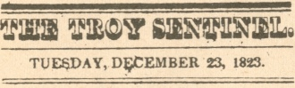

  
[Intangible Textual Heritage](../../../index) 
[Miscellaneous](../../index)  [Christmas](../index)  [Index](index) 
[Previous](vsn00)  [Next](vsn02) 

------------------------------------------------------------------------

[Buy this Book at
Amazon.com](https://www.amazon.com/exec/obidos/ASIN/0811817121/internetsacredte)

------------------------------------------------------------------------

*A Visit from St. Nick*, by Clement C. Moore, \[1823\], at Intangible
Textual Heritage

------------------------------------------------------------------------

  [  
Click to enlarge](img/vsn00.jpg)  
Image of first newspaper publication of A Visit from St. Nicholas  

### ACCOUNT OF A VISIT FROM ST. NICHOLAS

*From the Troy (N.Y.) Sentinel, Dec. 23, 1823, p. 3*.

This introduction was probably written by the editor of the Troy
Sentinel, Orville L. Holley, according to Clifton Fadiman.—JBH

We know not to whom we are indebted for the following description of
that unwearied patron of children—that homely, but delightful it
personification of parental kindness—Sante
Claus, his costume and his equipage, as he goes about visiting
the fire-sides of this happy land, laden with Christmas bounties; but,
from whomsoever it may have come, we give thanks for it. There is, to
our apprehension, a spirit of cordial goodness in it, a playfulness of
fancy, and a benevolent alacrity to enter into the feelings and promote
the simple pleasures of children, which are altogether charming. We hope
our little patrons, both lads and lasses, will accept it as proof of our
unfeigned good will toward them —as a token of our warmest wish that
they may have many a merry Christmas; that they may long retain their
beautiful relish for those unbought, homebred joys, which derive their
flavor from filial piety and fraternal love, and which they may be
assured are the least alloyed that time can furnish them; and that they
may never part with that simplicity of character, which is their own
fairest ornament, and for the sake of which they have been pronounced,
by authority which none can gainsay, the types of such as shall inherit
the kingdom of heaven.

 

*For the Sentinel*.

ACCOUNT OF A VISIT FROM ST. NICHOLAS.

’Twas the night before Christmas, when all thro’ the house,  
Not a creature was stirring, not even a mouse;  
The stockings were hung by the chimney with care,  
In hopes that St. Nicholas soon would be there;  
The children were nestled all snug in their beds,  
While visions of sugar plums danc’d in their heads,  
And Mama in her ’kerchief, and I in my cap,  
Had just settled our brains for a long winter's nap—  
When out on the lawn there arose such a clatter,  
I sprung from the bed to see what was the matter,  
Away to the window I flew like a flash,  
Tore open the shutters, and threw up the sash.  
The moon on the breast of the new fallen snow,  
Gave the lustre of mid-day to objects below;  
When, what to my wondering eyes should appear,  
But a miniature sleigh, and eight tiny rein-deer,  
With a little old driver, so lively and quick,  
I knew in a moment it must be St. Nick.  
More rapid than eagles his coursers they came,  
And he whistled, and shouted, and call’d them by name:  
"Now! Dasher, now! Dancer, now! Prancer, and Vixen,  
"On! Comet, on! Cupid, on! Dunder and Blixem; \[sic\]  
"To the top of the porch! to the top of the wall!  
"Now dash away! dash away! dash away all!"  
As dry leaves before the wild hurricane fly,  
When they-meet with an obstacle, mount to the sky;  
So up to the house-top the coursers they flew,  
With the sleigh full of Toys—and St. Nicholas too:  
And then in a twinkling, I heard on the roof  
The prancing and pawing of each little hoof.  
As I drew in my head, and was turning around,  
Down the chimney St. Nicholas came with a bound:  
He was dress’d all in fur, from his head to his foot,  
And his clothes were all tarnish’d with ashes and soot;  
A bundle of toys was flung on his back,  
And he look’d like a peddler just opening his pack:  
His eyes—how they twinkled! his dimples how merry,  
His cheeks were like roses, his nose like a cherry;  
His droll little mouth was drawn up like a bow,  
And the beard of his chin was as white as the snow;  
The stump of a pipe he held tight in his teeth,  
And the smoke it encircled his head like a wreath.  
He had a broad face, and a little round belly  
That shook when he laugh’d, like a bowl full of jelly:  
He was chubby and plump, a right jolly old elf,  
And I laugh’d when I saw him in spite of myself;  
A wink of his eye and a twist of his head,  
Soon gave me to know I had nothing to dread.  
He spoke not a word, but went straight to his work,  
And fill’d all the stockings; then turn’d with a jirk,  
And laying his finger aside of his nose  
And giving a nod, up the chimney he rose.  
He sprung to his sleigh, to his team gave a whistle,  
And away they all flew like the down of a thistle:  
But I heard him exclaim, ere he drove out of sight  
Happy Christmas to all, and to all a good night.—

------------------------------------------------------------------------

[Next: First Book Publication](vsn02)
