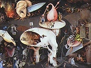

  
[Intangible Textual Heritage](../../index)  [Evil](../index) 
[Index](index)  [Next](dol01) 

------------------------------------------------------------------------

[Buy this Book at
Amazon.com](https://www.amazon.com/exec/obidos/ASIN/B0027P883W/internetsacredte)

------------------------------------------------------------------------

  
*The Devils of Loudun*, by Edmund Goldsmid, \[1887\], at Intangible
Textual Heritage

------------------------------------------------------------------------

\[COLLECTANEA ADAMANTÆA.—XXI.\]

THE HISTORY OF THE

Devils of Loudun,

The Alleged Possession of the Ursuline Nuns, and the Trial and Execution
Urbain Grandier,

TOLD BY AN EYE-WITNESS.

TRANSLATED FROM THE ORIGINAL FRENCH,

AND

Edited by

EDMUND GOLDSMID, F.R.H.S.,

F.S.A. (Scot.)

VOL. I.

PRIVATELY PRINTED.

EDINBURGH.

1887\.

Scanned, proofed and formatted at Intangible Textual Heritage, April
2009, by John Bruno Hare. This text is in the public domain because it
was published prior to 1923.

\[Fac-simile of Title-Page.\]

LA VERITABLE HISTOIRE

DES

Diables de Loudun,

De la possession des Religieuses

Ursulines

et

de la Condamnation

D’URBAIN GRANDIER,

PAR UN TEMOIN,

A. POITIERS,

Chez J. Thoreau et la veuve Ménier,

Imprimeurs ordinaires du Roi

et de l’Universitié.

M.DC.XXXIV.

------------------------------------------------------------------------

[Next: Introduction](dol01)
