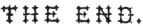

  
[Intangible Textual Heritage](../../index)  [Evil](../index) 
[Index](index)  [Previous](dol05) 

------------------------------------------------------------------------

[Buy this Book at
Amazon.com](https://www.amazon.com/exec/obidos/ASIN/B0027P883W/internetsacredte)

------------------------------------------------------------------------

  
*The Devils of Loudun*, by Edmund Goldsmid, \[1887\], at Intangible
Textual Heritage

------------------------------------------------------------------------

p. 39 p. 40

### APPENDIX II.

\[The following Notes are taken from Arnot's Collection of Criminal
Trials in Scotland\]:—

1588\.

*Alison Pearson*.

Alison Pearson in Byre-hills, Fifeshire, [\*](#fn_27) was convicted of practising sorcery, and
of invoking the Devil. She confessed that she had associated with the
Queen of the Fairies for many years, [†](#fn_28)
and that she had friends in the Court of Elfland, who were of her own
blood. She said that William Simpson, late the King's smith, was, in the
eighth year of his age, carried off by an Egyptian to Egypt, where he
remained twelve years; and that this Egyptian was a giant: That the
Devil appeared to her in the form of this William Simpson, who was a
great scholar, and a doctor of medicine, who cured her diseases: That he
has appeared to her, accompanied with many men and women, who made merry
with bag-pipes, good cheer, and wine: That

p. 41

the good neighbours [\*](#fn_29) attended, and
prepared their charms in pans over the fire; that the herbs of which
they composed their charms, were gathered before sunrise; and that with
these they cured the Bishop of St. Andrews of a fever and flux.—She
underwent all the legal forms customary in cases of witchcraft, *i.e.*
she was convicted and condemned, strangled and burned.

1590\.

*Janet Grant and Janet Clerk*.

Janet Grant and Janet Clerk [†](#fn_30) were
convicted of bewitching several persons to death, of taking away the
privy members of some folks, and bestowing them on others; and of
raising the devil.

*John Cunninghame*.

It was proved against John Cunninghame, that the Devil appeared to him
in white raiment, [‡](#fn_31) and promised,
that, if he would become his servant, he should never want, and should
be revenged of all his enemies: That he was carried in an ecstacy to the
kirk of North Berwick, where the Devil preached to him,

p. 42

and many others, bidding them not spare to do evil, but to eat, drink,
and be merry; for he should raise them all up gloriously at the Last
Day: That the Devil made him do homage, by kissing his . . . . That he
(the prisoner) raised the wind on the King's passage to Denmark: That he
met with Satan on the King's return from Denmark; and Satan promised to
raise a mist by which his Majesty should be thrown upon the coast of
England; and thereupon threw something like a football into the sea,
which raised a vapour.

*Agnes Sampson*.

Agnes Sampson in Keith, [\*](#fn_32) a grave
matron-like woman, of a rank and comprehension above the vulgar, was
accused of having renounced her baptism, and of having received the
devil's mark; of raising storms to prevent the Queen's coming from
Denmark; of being at the famous meeting at North Berwick, where six men
and ninety women, witches, were present, dancing to one of their number,
who played to them on a Jew's-harp. It was charged in the indictment
that the Devil was present at this

p. 43

meeting; and started up in the pulpit, which was hung round with black
candles: That he called them all by their names, asked them, If they had
kept their promises, and been good servants, and what they had done
since the last meeting: That they opened up three graves, and cut off
the joints from the dead bodies fingers, and that the prisoner got for
her share two joints and a winding sheet, to make powder of to do
mischief: That the Devil was dressed in a black gown and hat; and that
he ordered them to keep his commandments, which were to do all the ill
they could, and to kiss his . . . .

1591\.

*Euphan M’Calzeane*.

Euphan M’Calzeane was a lady possessed of a considerable estate in her
own right. She was the daughter of Thomas M’Calzeane Lord Cliftonhall,
one of the Senators of the College of Justice, whose death in the year
1581, spared him the disgrace and misery of seeing his daughter fall by
the hands of the executioner. She was married to a gentleman of her own
name, by whom she had three children. She was accused of treasonably
conspiring the King's death by enchantments; [\*](#fn_33) particularly by training a

p. 44

waxen picture of the King; of raising storms to hinder his return from
Denmark; and of various other articles of witchcraft. She was heard by
counsel in her defence; was found guilty by the jury, which consisted of
landed gentlemen of note; and her punishment was still severer than that
commonly inflicted on the Weyward Sisters,—She was burned alive, and her
estate confiscated. Her children, however, after being thus barbarously
robbed of their mother, were [\*](#fn_34)
restored by act of Parliament against the forfeiture. The act does not
say that the sentence was unjust; but that the King was touched in
honour and conscience to restore the children. But to move the wheels of
his Majesty's conscience, the children had to grease them, by a payment
of five thousand merks to the donator of escheat, [†](#fn_35) and by relinquishing the estate of
Clifton-hall, which the King gave to Sir James Sandilands of Slamanno.

As a striking picture of the state of justice, humanity, and science in
those times, [‡](#fn_36) it may be remarked that
this Sir James Sandilands, a favourite of the King's, ("ex interiore
principis familiaritate,") who got this estate, which the daughter of
one Lord of Session forfeited, on account of being a witch, did

p. 45

that very year murder another Lord of Session in the suburbs of
Edinburgh, in the public street, without undergoing either trial or
punishment.

1620\.

*Margaret Wallace*.

Margaret Wallace [\*](#fn_37) was tried before
the Court of Justiciary. The Duke of Lennox, the Archbishop of Glasgow,
and Sir George Erskine of Innerteil, sat as assessors to the judges, and
an eminent counsel was heard in behalf of the prisoner. She was accused
of inflicting and of curing diseases by inchantment; but it was not
specified what spells she employed. It was libelled against her, that on
being taken suddenly ill she sent for one Christian Graham, a notorious
witch, who afterwards suffered a capital punishment, and that this witch
transferred the disease from the prisoner to a young girl: That the girl
being thus taken ill, her mother was advised by the prisoner to send for
Christian Graham, who answered, that her confidence was in God, and she
would have nothing to do with the Devil or his instruments: The prisoner
replied, "That in a case of this sort Christian Graham could do as much
as God himself; and that without her aid there was no remedy for the
child:" But the mother not consenting, the prisoner

p. 46

without her knowledge sent for Christian, who muttered words, and
expressed signs, by which she restored the child to health, &c. Her
counsel urged, that the indictment was much too general: That it ought
to have been specified, not simply that she did enchant, but also by
what kind of spells she performed her incantations: That supposing
Christian Graham to have been a witch, and that the prisoner when taken
ill consulted her, still he was entitled to plead that the prisoner
consulted her on account of her medical knowledge, and not for her skill
in sorcery: That as to blasphemous expressions however well they might
found a trial for blasphemy, they by no means inferred the crime of
witchcraft; and he quoted many authorities from the Civil and Canon
laws. He farther challenged one of the assizers, because one of the
articles charged against the prisoner was her having done an injury to
his brother-in-law.—The whole defences were repelled by the judges; and
the jury found the prisoner guilty.

1629\.

*Isobel Young*.

Isobel Young in East Barns was accused of having stopped by enchantment
George Sandie's mill twenty-nine years before; of having prevented his
boat from catching fish while all the other boats at the herring, drave,
or herring fishery, were successful; and that

p. 47

she was the cause of his failing in his circumstances, and of nothing
prospering with him in the world: That she threatened mischief against
one Kerse, who thereupon lost the power of his leg and arm: That she
entertained several witches in her house, one of whom went out at the
roof in likeness of a cat, and then resumed her own shape: That she took
a disease off her husband, laid it under the barn floor, and transferred
it to his nephew, who when he came into the barn saw the firlot hopping
up and down the floor: That she used the following charm to preserve
herself and her cattle from an infectious distemper, viz. to bury a
white ox and a cat alive throwing in a quantity of salt along with them:
That she had the Devil's mark, &c.

Mr Laurence Macgill and Mr David Primrose appeared as counsel for the
prisoner. They pleaded, that the mill might have stopped, the boat
catched no fish, and the man not prospered in the world, from—natural
causes; and it was not libelled by what spells she had accomplished
them: That as to the man who had lost the power of his leg and arm,
first, she never had the least acquaintance with him; secondly, she
offered to prove that he was lame previous to the threatening
expressions which she was said to have used: That the charge of laying a
disease under a barn floor was a ridiculous fable, taken probably from a
similar story in Ariosto; and that two years had elapsed between her
husband's illness and

p. 48

his nephew's: That what the prosecutor called the Devil's mark was
nothing else than the scar of an old ulcer; and that the charge of her
burying the white ox and the cat was false.

The celebrated Sir Thomas Hope, who was counsel for the prosecution,
replied, that these defences ought to be repelled, and no proof allowed
of them, because contrary to the libel; that is to say, in other words,
because what was urged by the prisoner in her defences contradicted what
was charged by the public prosecutor in his indictment.—The defences for
the prisoner were overruled.—Is it needful for me to add that she was
convicted, strangled, and burned?

 

 

 

 

 

------------------------------------------------------------------------

### Footnotes

[v3\_40:\*](dol06.htm#fr_27) Rec. of Just. 18th
May 1588.

[v3\_40:†](dol06.htm#fr_28) In the original it
is Queen of Elfland.

[v3\_41:\*](dol06.htm#fr_29) Good Neighbours was
a term for witches. People were afraid to speak of them opprobriously,
lest they should provoke their resentment.

[v3\_41:†](dol06.htm#fr_30) Records of
Justiciary, 7th August 1590.

[v3\_41:‡](dol06.htm#fr_31) Ibid, 26th December
1590.

[v3\_42:\*](dol06.htm#fr_32) Rec. of Just. Jan.
27. 1590. A story is told of this woman in Spottiswood's Hist. p. 383.
which is nowise confirmed by the record. His fable is absurd; and seems
to have been invented by some zealous believer in the divine right of
Kings.

[v3\_43:\*](dol06.htm#fr_33) Rec. of Just., 8th
May 1591

[v3\_44:\*](dol06.htm#fr_34) Unprinted Acts,
A.D. 1592. No. 70.

[v3\_44:†](dol06.htm#fr_35) He who obtains a
gift of the forfeiture.

[v3\_44:‡](dol06.htm#fr_36) "Johnstoni Historia
Rerum Britannicarum," p. 172.

[v3\_45:\*](dol06.htm#fr_37) Records of
Justiciary, March 20. 1620.

 
